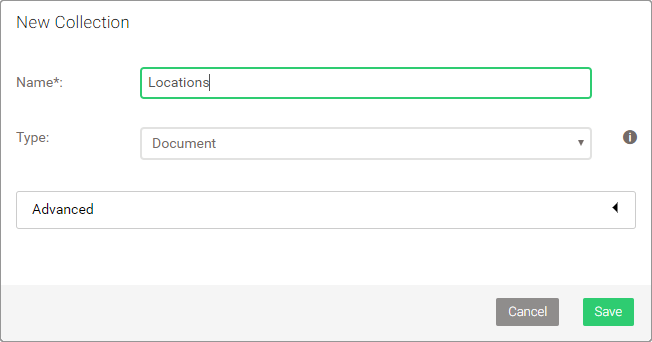
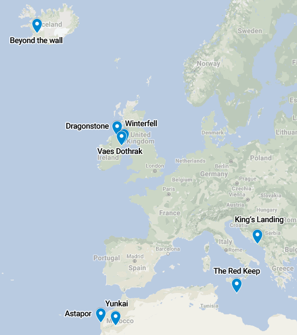
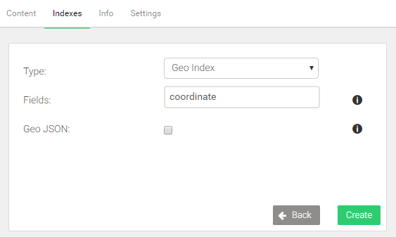
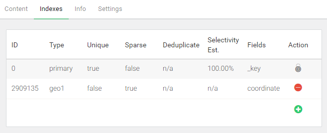

Geospatial queries
==================

Geospatial coordinates consisting of a latitude and longitude value
can be stored either as two separate attributes, or as a single
attribute in the form of an array with both numeric values.
ArangoDB can [index such coordinates](../indexing-geo.html)
for fast geospatial queries.

Locations data
--------------

Let us insert some filming locations into a new collection *Locations*,
which you need to create first, then run below AQL query:



```js
LET places = [
    { "name": "Dragonstone", "coordinate": [ 55.167801, -6.815096 ] },
    { "name": "King's Landing", "coordinate": [ 42.639752, 18.110189 ] },
    { "name": "The Red Keep", "coordinate": [ 35.896447, 14.446442 ] },
    { "name": "Yunkai", "coordinate": [ 31.046642, -7.129532 ] },
    { "name": "Astapor", "coordinate": [ 31.50974, -9.774249 ] },
    { "name": "Winterfell", "coordinate": [ 54.368321, -5.581312 ] },
    { "name": "Vaes Dothrak", "coordinate": [ 54.16776, -6.096125 ] },
    { "name": "Beyond the wall", "coordinate": [ 64.265473, -21.094093 ] }
]

FOR place IN places
    INSERT place INTO Locations
```

Visualization of the coordinates on a map with their labels:



Geospatial index
----------------

To query based on coordinates, a [geo index](../indexing-geo.html)
is required. It determines which fields contain the latitude and longitude
values.

- Go to *COLLECTIONS*
- Click on the *Locations* collection
- Switch to the *Indexes* tab at top
- Click the green button with a plus on the right-hand side
- Change the type to *Geo Index*
- Enter `coordinate` into the *Fields* field
- Click *Create* to confirm





Find nearby locations
---------------------

A `FOR` loop is used again, with a subsequent `SORT` operation based on the
`DISTANCE()` between a stored coordinate and a coordinate given in a query.
This pattern is recognized by the query optimizer. A geo index will be used to
accelerate such queries if one is available.

The default sorting direction is ascending, so a query finds the coordinates
closest to the reference point first (lowest distance). `LIMIT` can be used
to restrict the number of results to at most *n* matches.

In below example, the limit is set to 3. The origin (the reference point) is
a coordinate somewhere downtown in Dublin, Ireland:

```js
FOR loc IN Locations
  LET distance = DISTANCE(loc.coordinate[0], loc.coordinate[1], 53.35, -6.25)
  SORT distance
  LIMIT 3
  RETURN {
    name: loc.name,
    latitude: loc.coordinate[0],
    longitude: loc.coordinate[1],
    distance
  }
```

```json
[
  {
    "name": "Vaes Dothrak",
    "latitude": 54.16776,
    "longitude": -6.096125,
    "distance": 91491.58596795711
  },
  {
    "name": "Winterfell",
    "latitude": 54.368321,
    "longitude": -5.581312,
    "distance": 121425.66829502625
  },
  {
    "name": "Dragonstone",
    "latitude": 55.167801,
    "longitude": -6.815096,
    "distance": 205433.7784182078
  }
]
```

The query returns the location name, as well as the coordinate and the
calculated distance in meters. The coordinate is returned as two separate
attributes. You may return just the document with a simple `RETURN loc` instead
if you want. Or return the whole document with an added distance attribute using
`RETURN MERGE(loc, { distance })`.

Find locations within radius
----------------------------

`LIMIT` can be swapped out with a `FILTER` that checks the distance, to find
locations within a given radius from a reference point. Remember that the unit
is meters. The example uses a radius of 200,000 meters (200 kilometers):

```js
FOR loc IN Locations
  LET distance = DISTANCE(loc.coordinate[0], loc.coordinate[1], 53.35, -6.25)
  SORT distance
  FILTER distance < 200 * 1000
  RETURN {
    name: loc.name,
    latitude: loc.coordinate[0],
    longitude: loc.coordinate[1],
    distance: ROUND(distance / 1000)
  }
```

```json
[
  {
    "name": "Vaes Dothrak",
    "latitude": 54.16776,
    "longitude": -6.096125,
    "distance": 91
  },
  {
    "name": "Winterfell",
    "latitude": 54.368321,
    "longitude": -5.581312,
    "distance": 121
  }
]
```

The distances are converted to kilometers and rounded for readability.
