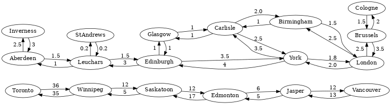

# All Shortest Paths in AQL

{{ page.description }}
{:class="lead"}

## General query idea

This type of query finds all paths of shortest length between two given
documents (*startVertex* and *targetVertex*) in your graph.

Every such path will be returned as a JSON object with three components:
<!-- TODO: edge weights? -->
- an array containing the `vertices` on the path
- an array containing the `edges` on the path

**Example**

Let us take a look at a simple example to explain how it works.
This is the graph that we are going to find some shortest path on:


Each ellipse stands for a train station with the name of the city written inside
of it. They are the vertices of the graph. Arrows represent train connections
between cities and are the edges of the graph.

Let us assume that we want to go from **Carlisle** to **London** by train.

We expect to see the following two shortest paths:

1. Carlisle – Birmingham – London
2. Carlisle – York – London

Another path that connects Carlisle and London is
Carlisle – Glasgow – Edinburgh – York – London but it is has two more stops and
is therefore not a path of shortest length.

## Syntax

The syntax for All Shortest Paths queries is similar to the one for
[Shortest Path](graphs-shortest-path.html) and there are also two options to
either use a named graph or a set of edge collections. It only emits a path
variable however, whereas `SHORTEST_PATH` emits a vertex and an edge variable.

### Working with named graphs

```aql
FOR path
  IN OUTBOUND|INBOUND|ANY ALL_SHORTEST_PATHS
  startVertex TO targetVertex
  GRAPH graphName
  [OPTIONS options]
```

- `FOR`: emits the variable **path** which contains one path as an object containing 
   `vertices`, `edges`, and the `weight` of the path.
- `IN` `OUTBOUND|INBOUND|ANY`: defines in which direction
  edges are followed (outgoing, incoming, or both)
- `ALL_SHORTEST_PATHS`: the keyword to compute All Shortest Paths
- **startVertex** `TO` **targetVertex** (both string\|object): the two vertices between
  which the paths will be computed. This can be specified in the form of
  a ID string or in the form of a document with the attribute `_id`. All other
  values will lead to a warning and an empty result. If one of the specified
  documents does not exist, the result is empty as well and there is no warning.
- `GRAPH` **graphName** (string): the name identifying the named graph. Its vertex and
  edge collections will be looked up.
- `OPTIONS` **options** (object, *optional*): used to modify the execution of the
  traversal. Only the following attributes have an effect, all others are ignored:
  - **weightAttribute** (string): a top-level edge attribute that should be used
  to read the edge weight. If the attribute does not exist or is not numeric, the
  *defaultWeight* will be used instead. The attribute value must not be negative.
  - **defaultWeight** (number): this value will be used as fallback if there is
  no *weightAttribute* in the edge document, or if it's not a number. The value
  must not be negative. The default is `1`.


All Shortest Paths traversals do not support negative weights. If a document
attribute (as specified by `weightAttribute`) with a negative value is
encountered during traversal, or if `defaultWeight` is set to a negative
number, then the query is aborted with an error.


### Working with collection sets

```aql
FOR path
  IN OUTBOUND|INBOUND|ANY ALL_SHORTEST_PATHS
  startVertex TO targetVertex
  edgeCollection1, ..., edgeCollectionN
  [OPTIONS options]
```

Instead of `GRAPH graphName` you can specify a list of edge collections.
The involved vertex collections are determined by the edges of the given
edge collections. 

### Traversing in mixed directions

For All Shortest Paths with a list of edge collections you can optionally specify the
direction for some of the edge collections. Say, for example, you have three edge
collections *edges1*, *edges2* and *edges3*, where in *edges2* the direction
has no relevance, but in *edges1* and *edges3* the direction should be taken into
account. In this case you can use `OUTBOUND` as general search direction and `ANY`
specifically for *edges2* as follows:

```aql
FOR vertex IN OUTBOUND ALL_SHORTEST_PATHS
  startVertex TO targetVertex
  edges1, ANY edges2, edges3
```

All collections in the list that do not specify their own direction will use the
direction defined after `IN` (here: `OUTBOUND`). This allows to use a different
direction for each collection in your path search.

## Examples

We load an example graph to get a named graph that reflects some possible
train connections in Europe and North America.



    @startDocuBlockInline GRAPHASP_01_create_graph
    @EXAMPLE_ARANGOSH_OUTPUT{GRAPHASP_01_create_graph}
    ~addIgnoreCollection("places");
    ~addIgnoreCollection("connections");
    var examples = require("@arangodb/graph-examples/example-graph.js");
    var graph = examples.loadGraph("kShortestPathsGraph");
    db.places.toArray();
    db.connections.toArray();
    @END_EXAMPLE_ARANGOSH_OUTPUT
    @endDocuBlock GRAPHASP_01_create_graph



Suppose we want to query a route from **Carlisle** to **London**, and
compare the outputs of `SHORTEST_PATH` and `ALL_SHORTEST_PATHS`.
Note that `SHORTEST_PATH` returns any of the shortest paths whereas
`ALL_SHORTEST_PATHS` returns all of them.

Using `SHORTEST_PATH`:


    @startDocuBlockInline GRAPHASP_01_Carlisle_to_London
    @EXAMPLE_AQL{GRAPHASP_01_Carlisle_to_London}
    @DATASET{kShortestPathsGraph}
    FOR v, e IN OUTBOUND SHORTEST_PATH 'Carlisle/Aberdeen' TO 'places/London'
    GRAPH 'kShortestPathsGraph'
      RETURN { place: v.label }
    @END_EXAMPLE_AQL
    @endDocuBlock GRAPHASP_01_Carlisle_to_London



Using `ALL_SHORTEST_PATHS`:


    @startDocuBlockInline GRAPHASP_02_Carlisle_to_London
    @EXAMPLE_AQL{GRAPHASP_02_Carlisle_to_London}
    @DATASET{kShortestPathsGraph}
    FOR p IN OUTBOUND ALL_SHORTEST_PATHS 'Carlisle/Aberdeen' TO 'places/London'
    GRAPH 'kShortestPathsGraph'
      RETURN { places: p.vertices[*].label }
    @END_EXAMPLE_AQL
    @endDocuBlock GRAPHASP_02_Carlisle_to_London



If we ask for routes that don't exist, we get an empty result
(from **Carlisle** to **Toronto**):


    @startDocuBlockInline GRAPHASP_03_Carlisle_to_Toronto
    @EXAMPLE_AQL{GRAPHASP_03_Carlisle_to_Toronto}
    @DATASET{kShortestPathsGraph}
    FOR p IN OUTBOUND ALL_SHORTEST_PATHS 'Carlisle/Aberdeen' TO 'places/Toronto'
    GRAPH 'kShortestPathsGraph'
      RETURN {
        places: p.vertices[*].label
      }
    @END_EXAMPLE_AQL
    @endDocuBlock GRAPHASP_03_Carlisle_to_Toronto



And finally clean up by removing the named graph:


    @startDocuBlockInline GRAPHASP_99_drop_graph
    @EXAMPLE_ARANGOSH_OUTPUT{GRAPHASP_99_drop_graph}
    var examples = require("@arangodb/graph-examples/example-graph.js");
    examples.dropGraph("kShortestPathsGraph");
    ~removeIgnoreCollection("places");
    ~removeIgnoreCollection("connections");
    @END_EXAMPLE_ARANGOSH_OUTPUT
    @endDocuBlock GRAPHASP_99_drop_graph


