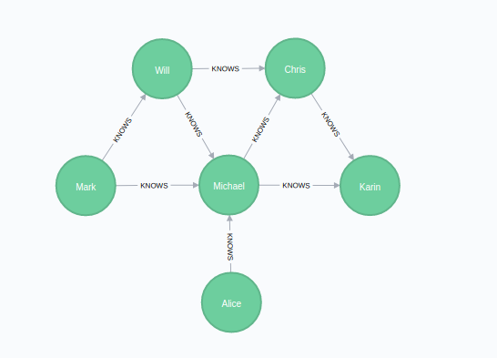

All Shortest Paths in AQL
=======================

General query idea
------------------

This type of query finds *all* shortest paths between two given documents, *startVertex* and *targetVertex* in your graph.

Every such path will be returned as a JSON object with two components:

- an array containing the `vertices` on the path
- an array containing the `edges` on the path

Currently, there is no support yet for a `weightAttribute` in All Shortest Paths `OPTIONS`.

<!--  -->

**Example**

Let us take a look at a simple example to explain how it works.
We will using the following social networkx graph to demonstrate all shortest paths:
This is the graph that we are going to find all shortest paths on:



Let us assume that we want to find all shortest paths between **Mark** and **Chris**.

We would expect to see the following shortest paths:

Path 1:
1. Mark
2. Will
3. Chris

Path 2:
1. Mark
2. Michael 
3. Chris

To clarify, the paths returned from all shortest paths are all of identical length.


Syntax
------

The syntax for All Shortest Paths queries is similar to the one for
[K Shortest Paths](graphs-kshortest-paths.html). There are also two options to
either use a named graph, or a set of edge collections. Just like `K_SHORTEST_PATHS`, it only emits a path variable.


Please note that unlike `K_SHORTEST_PATHS`, All Shortest Paths does not yet support the `weightAttribute` & `defaultWeight` options.


### Working with named graphs

```aql
FOR path
  IN OUTBOUND|INBOUND|ANY ALL_SHORTEST_PATHS
  startVertex TO targetVertex
  GRAPH graphName
  [LIMIT offset, count]
```

- `FOR`: emits the variable **path** which contains one path as an object containing 
   `vertices`, `edges`, and the `weight` of the path.
- `IN` `OUTBOUND|INBOUND|ANY`: defines in which direction
  edges are followed (outgoing, incoming, or both)
- `ALL_SHORTEST_PATHS`: the keyword to compute All Shortest Paths
- **startVertex** `TO` **targetVertex** (both string\|object): the two vertices between
  which the paths will be computed. This can be specified in the form of
  a ID string or in the form of a document with the attribute `_id`. All other
  values will lead to a warning and an empty result. If one of the specified
  documents does not exist, the result is empty as well and there is no warning.
- `GRAPH` **graphName** (string): the name identifying the named graph. Its vertex and
  edge collections will be looked up.
- `LIMIT` (see [LIMIT operation](operations-limit.html), *optional*):
  the maximum number of paths to return.

### Working with collection sets

```aql
FOR path
  IN OUTBOUND|INBOUND|ANY ALL_SHORTEST_PATHS
  startVertex TO targetVertex
  edgeCollection1, ..., edgeCollectionN
  [LIMIT offset, count]
```

Instead of `GRAPH graphName` you can specify a list of edge collections.
The involved vertex collections are determined by the edges of the given
edge collections. 

### Traversing in mixed directions

For all shortest paths with a list of edge collections you can optionally specify the
direction for some of the edge collections. Say for example you have three edge
collections *edges1*, *edges2* and *edges3*, where in *edges2* the direction
has no relevance, but in *edges1* and *edges3* the direction should be taken into
account. In this case you can use `OUTBOUND` as general search direction and `ANY`
specifically for *edges2* as follows:

```aql
FOR vertex IN OUTBOUND ALL_SHORTEST_PATHS
  startVertex TO targetVertex
  edges1, ANY edges2, edges3
```

All collections in the list that do not specify their own direction will use the
direction defined after `IN` (here: `OUTBOUND`). This allows to use a different
direction for each collection in your path search.

Examples
--------

We load an example graph to get a named graph that reflects a social network.



    @startDocuBlockInline GRAPHKSP_01_create_graph
    @EXAMPLE_ARANGOSH_OUTPUT{GRAPHKSP_01_create_graph}
    ~addIgnoreCollection("places");
    ~addIgnoreCollection("connections");
    var examples = require("@arangodb/graph-examples/example-graph.js");
    var graph = examples.loadGraph("allShortestPathsGraph");
    db.places.toArray();
    db.connections.toArray();
    @END_EXAMPLE_ARANGOSH_OUTPUT
    @endDocuBlock GRAPHKSP_01_create_graph



Suppose we want to find all shortest paths between **Mark** and **Chris**:


    @startDocuBlockInline GRAPHASP_02_Mark_to_Chris
    @EXAMPLE_AQL{GRAPHASP_02_Mark_to_Chris}
    @DATASET{kShortestPathsGraph}
    FOR p IN ANY ALL_SHORTEST_PATHS
      'person/Mark' TO 'person/Chris'
      GRAPH 'allShortestPathsGraph'
      RETURN p
    @END_EXAMPLE_AQL
    @endDocuBlock GRAPHASP_02_Mark_to_Chris

