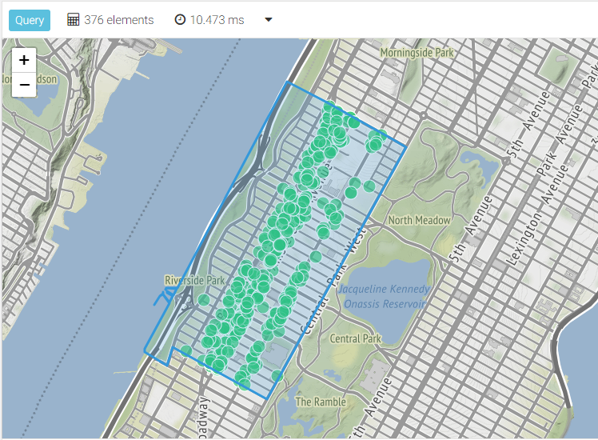
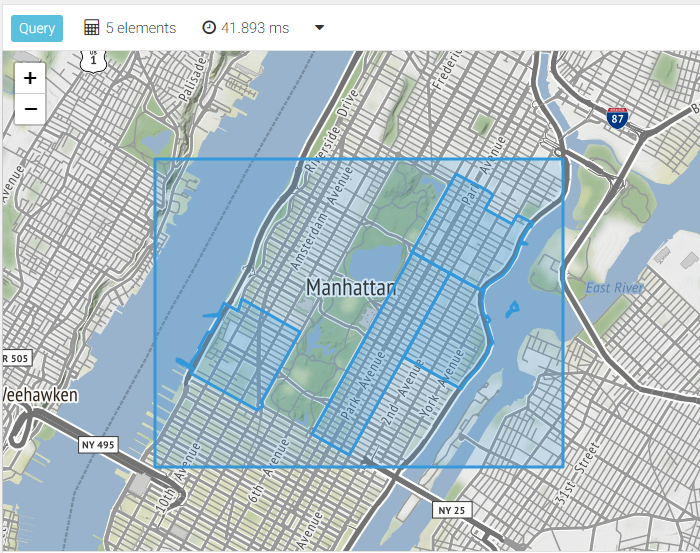
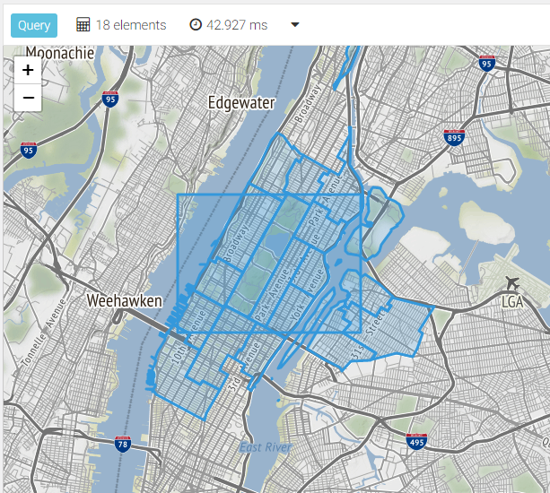

# Geospatial Search with ArangoSearch

{{ page.description }}
{:class="lead"}

ArangoSearch can accelerate various types of geospatial queries for data that
is indexed by a View. The regular [geospatial index](indexing-geo.html) can do
most of this too, but ArangoSearch allows you to combine geospatial requests
with other kinds of searches, like full-text search.

## Creating geospatial Analyzers

Geospatial data that can be indexed:
- GeoJSON features such as Points and Polygons
  (with coordinates in `[longitude, latitude]` order)
- Raw coordinates (`[latitude, longitude]` arrays or two separate attributes)

The data needs to be pre-processed with a `geojson` Analyzer in case of GeoJSON
and with a `geopoint` Analyzer in case of raw coordinates. These Analyzers need
to be created manually.

**Custom Analyzers:**

Create a `geojson` Analyzer in arangosh to pre-process arbitrary GeoJSON shapes.
The default properties are usually what you want, therefore an empty object
is passed:

```js
//db._useDatabase("your_database"); // Analyzer will be created in current database
var analyzers = require("@arangodb/analyzers");
analyzers.save("geojson", "geojson", {}, ["frequency", "norm", "position"]);
```

See [`geojson` Analyzer](analyzers.html#geojson) for details.

Create a `geopoint` Analyzer in arangosh to pre-process raw coordinate arrays
using the default properties, hence passing an empty object:

```js
//db._useDatabase("your_database"); // Analyzer will be created in current database
var analyzers = require("@arangodb/analyzers");
analyzers.save("geo_pair", "geopoint", {}, ["frequency", "norm", "position"]);
```

Create a `geopoint` Analyzer in arangosh to pre-process raw coordinates with
latitude and longitude stored in two different attributes. These attributes
cannot be at the top-level of the document, but must be nested in an object,
e.g. `{ location: { lat: 40.78, lon: -73.97 } }`. The path relative to the
parent attribute (here: `location`) needs to be described in the Analyzer
properties for each of the coordinate attributes:

```js
//db._useDatabase("your_database"); // Analyzer will be created in current database
var analyzers = require("@arangodb/analyzers");
analyzers.save("geo_latlng", "geopoint", { latitude: ["lat"], longitude: ["lng"] }, ["frequency", "norm", "position"]);
```

## Using the example dataset

Load the dataset into an ArangoDB instance and create a View `restaurantsViews`
as described below:

**Dataset:** [Demo Geo S2 dataset](arangosearch-example-datasets.html#demo-geo-s2-dataset)

### View definition

#### `search-alias` View

```js
db.restaurants.ensureIndex({ name: "inv-rest", type: "inverted", fields: [ { name: "location", analyzer: "geojson" } ] });
db.neighborhoods.ensureIndex({ name: "inv-hood", type: "inverted", fields: [ "name", { name: "geometry", analyzer: "geojson" } ] });
db._createView("restaurantsViewAlias", "search-alias", { indexes: [
  { collection: "restaurants", index: "inv-rest" },
  { collection: "neighborhoods", index: "inv-hood" }
] });
```

#### `arangosearch` View

```json
{
  "links": {
    "restaurants": {
      "fields": {
        "location": {
          "analyzers": [
            "geojson"
          ]
        }
      }
    }
  },
  "neighborhoods": {
    "fields": {
      "name": {
        "analyzers": [
          "identity"
        ]
      },
      "geometry": {
        "analyzers": [
          "geojson"
        ]
      }
    }
  }
}
```

## Search for points within a radius

Using the Museum of Modern Arts as reference location, find restaurants within
a 100 meter radius. Return the matches sorted by distance and include how far
away they are from the reference point in the result.

_`search-alias` View_:

```aql
LET moma = GEO_POINT(-73.983, 40.764)
FOR doc IN restaurantsViewAlias
  SEARCH GEO_DISTANCE(doc.location, moma) < 100
  LET distance = GEO_DISTANCE(doc.location, moma)
  SORT distance
  RETURN {
    geometry: doc.location,
    distance
  }
```

_`arangosearch` View_:

```aql
LET moma = GEO_POINT(-73.983, 40.764)
FOR doc IN restaurantsView
  SEARCH ANALYZER(GEO_DISTANCE(doc.location, moma) < 100, "geojson")
  LET distance = GEO_DISTANCE(doc.location, moma)
  SORT distance
  RETURN {
    geometry: doc.location,
    distance
  }
```

Search for restaurants with `Cafe` in their name within a radius of 1000 meters
and return the ten closest matches:

_`search-alias` View_:

```aql
LET moma = GEO_POINT(-73.983, 40.764)
FOR doc IN restaurantsViewAlias
  SEARCH LIKE(doc.name, "%Cafe%")
     AND GEO_DISTANCE(doc.location, moma) < 1000
  LET distance = GEO_DISTANCE(doc.location, moma)
  SORT distance
  LIMIT 10
  RETURN {
    geometry: doc.location,
    name: doc.name,
    distance
  }
```

_`arangosearch` View_:

```aql
LET moma = GEO_POINT(-73.983, 40.764)
FOR doc IN restaurantsView
  SEARCH LIKE(doc.name, "%Cafe%")
     AND ANALYZER(GEO_DISTANCE(doc.location, moma) < 1000, "geojson")
  LET distance = GEO_DISTANCE(doc.location, moma)
  SORT distance
  LIMIT 10
  RETURN {
    geometry: doc.location,
    name: doc.name,
    distance
  }
```

## Search for points within a polygon

First off, search for the neighborhood `Upper West Side` in a subquery and
return its GeoJSON Polygon. Then search for restaurants that are contained
in this polygon and return them together with the polygon itself:

_`search-alias` View_:

```aql
LET upperWestSide = FIRST(
  FOR doc IN restaurantsViewAlias
    SEARCH doc.name == "Upper West Side"
    RETURN doc.geometry
)
FOR result IN PUSH(
  FOR doc IN restaurantsViewAlias
    SEARCH GEO_CONTAINS(upperWestSide, doc.location)
    RETURN doc.location,
  upperWestSide
)
  RETURN result
```

_`arangosearch` View_:

```aql
LET upperWestSide = FIRST(
  FOR doc IN restaurantsView
    SEARCH doc.name == "Upper West Side"
    RETURN doc.geometry
)
FOR result IN PUSH(
  FOR doc IN restaurantsView
    SEARCH ANALYZER(GEO_CONTAINS(upperWestSide, doc.location), "geojson")
    RETURN doc.location,
  upperWestSide
)
  RETURN result
```



You do not have to look up the polygon, you can also provide one inline.
It is also not necessary to return the polygon, you can return the matches only:

```aql
LET upperWestSide = {
  "coordinates": [
    [
      [-73.9600301843709, 40.79803810789689], [-73.96052271669541, 40.797368469462334],
      [-73.96097971807933, 40.79673864404529], [-73.96144060655736, 40.79611082718394],
      [-73.96189985460951, 40.79547927006112], [-73.96235980150668, 40.79485206056065],
      [-73.96280590635729, 40.79423581323211], [-73.96371096541819, 40.79301293488322],
      [-73.9641759852132, 40.79236204502772], [-73.96468540739478, 40.79166402679883],
      [-73.96517705499011, 40.79099034109932], [-73.96562799538655, 40.790366117129004],
      [-73.96609500572444, 40.78973438976665], [-73.96655226678917, 40.78910715282553],
      [-73.96700977073398, 40.78847679074218], [-73.96744908373155, 40.78786072059045],
      [-73.96792696354466, 40.78722157112602], [-73.96838479313664, 40.78659569652393],
      [-73.96884378957469, 40.78596738856434], [-73.96933573318945, 40.78529327955705],
      [-73.96983225556819, 40.7846109105862], [-73.97030068162124, 40.78397541394847],
      [-73.97076013116715, 40.783340137553594], [-73.97122292220932, 40.782706256089995],
      [-73.9717230555586, 40.78202147595964], [-73.97357117423289, 40.7794778616211],
      [-73.97406668257638, 40.77880541672153], [-73.97453231422314, 40.77816778452296],
      [-73.97499744020544, 40.777532546222], [-73.97783054404911, 40.77872973181589],
      [-73.98067365344895, 40.7799251824873], [-73.98140948736065, 40.780235418619405],
      [-73.98151911347311, 40.78028175751621], [-73.9816278736105, 40.780328934969766],
      [-73.98232616371553, 40.78062377270337], [-73.9835260146705, 40.781130011022704],
      [-73.98507184345014, 40.781779680969194], [-73.98536952677372, 40.781078372362586],
      [-73.98567936117642, 40.78031263333493], [-73.98654378951805, 40.780657980791055],
      [-73.98707137465644, 40.78090638159226], [-73.98730772854313, 40.781041303287786],
      [-73.98736363983177, 40.78106280511045], [-73.98741432690473, 40.7810875110951],
      [-73.98746219857024, 40.7811086095956], [-73.98799363156404, 40.78134281734761],
      [-73.98812746102577, 40.78140179644223], [-73.98804128806725, 40.78158596085119],
      [-73.9881002938246, 40.78160287830527], [-73.98807644914505, 40.78165093500162],
      [-73.98801805997222, 40.78163418881042], [-73.98796079284213, 40.781770987031514],
      [-73.98791968459247, 40.78183347771321], [-73.98787728725019, 40.78189205083216],
      [-73.98647480368592, 40.783916573718706], [-73.98625187003543, 40.78423876424543],
      [-73.98611372725294, 40.78443891187735], [-73.98561580396368, 40.78514186259503],
      [-73.98546581197026, 40.78536070057543], [-73.98617270496544, 40.786068452258675],
      [-73.98645586240198, 40.7859192190814], [-73.98707234561569, 40.78518963831753],
      [-73.98711901394266, 40.78521031850151], [-73.98649778102359, 40.78595120288725],
      [-73.98616462880626, 40.786121882448306], [-73.98612842248588, 40.78623900133112],
      [-73.98607113521973, 40.78624070602659], [-73.98602727478911, 40.78622896423671],
      [-73.98609763784941, 40.786058225697936], [-73.98542932126942, 40.78541394218462],
      [-73.98508113773205, 40.785921935110444], [-73.98519883325449, 40.785966552197756],
      [-73.98517050238989, 40.786013334158156], [-73.98521621867376, 40.786030501313824],
      [-73.98525509797992, 40.78597620551157], [-73.98524273937655, 40.78597257215073],
      [-73.98524962933016, 40.78596313985583], [-73.98528177918672, 40.785978620950054],
      [-73.9852400328845, 40.786035858136785], [-73.98568388524215, 40.78622212391968],
      [-73.98571752900456, 40.78617599466878], [-73.98576566029752, 40.786196274858625],
      [-73.9856828719225, 40.78630978621313], [-73.98563627093053, 40.786290150146684],
      [-73.98567072256468, 40.786242911993796], [-73.98561523764435, 40.78621964571528],
      [-73.98520511880037, 40.78604766921276], [-73.98521103560748, 40.78603955488367],
      [-73.98516263994709, 40.78602099926717], [-73.98513163631205, 40.786060297019965],
      [-73.98501696406497, 40.78601423719563], [-73.98493597820354, 40.786130720650974],
      [-73.98465507883022, 40.78653474180794], [-73.98574378790113, 40.78657008235215],
      [-73.98589227228327, 40.78642652901958], [-73.98594285499497, 40.78645284788032],
      [-73.98594956155667, 40.786487113463934], [-73.98581237352651, 40.78661686535709],
      [-73.98513520970327, 40.7865876183929], [-73.98461942858408, 40.78658601634982],
      [-73.98369521623664, 40.7879152813127], [-73.98234664147564, 40.789854780772636],
      [-73.98188645946546, 40.79051658043251], [-73.98139174468567, 40.79122824550256],
      [-73.9812893737095, 40.79137550943302], [-73.9809470835408, 40.79186789327993],
      [-73.980537679464, 40.79245681262498], [-73.98043434256003, 40.79259428309673],
      [-73.98013222578662, 40.79299376538315], [-73.98004684398002, 40.79311352516391],
      [-73.9792882208298, 40.79417763216331], [-73.97828949152755, 40.79558676046088],
      [-73.97779475503205, 40.79628462977189], [-73.97685207845194, 40.79763134839318],
      [-73.97639951930574, 40.79827321018994], [-73.97628527884252, 40.798435235410054],
      [-73.97583055785255, 40.799092280410655], [-73.97578169321191, 40.799156256780286],
      [-73.97579140130195, 40.799209627886206], [-73.97576219486481, 40.79926017354928],
      [-73.97554385822018, 40.79952825063732], [-73.97526783234453, 40.79993284953172],
      [-73.97508668067891, 40.800189533632995], [-73.97496436808184, 40.80036963419388],
      [-73.97483924436003, 40.800558243262664], [-73.97466556722725, 40.80081351473415],
      [-73.97448722520987, 40.801057428896804], [-73.97414361823468, 40.80151689534114],
      [-73.97394098366709, 40.801809025361415], [-73.97389989052462, 40.80188986353119],
      [-73.97377477246009, 40.802045845948555], [-73.97372060455763, 40.80216781528022],
      [-73.97361322463904, 40.80229685988716], [-73.9735422772157, 40.802356411250294],
      [-73.97336671067801, 40.80263011334645], [-73.97320518045738, 40.802830058276285],
      [-73.97312859120993, 40.80297471550862], [-73.97307070537943, 40.8030555484474],
      [-73.97303522902072, 40.803073973741895], [-73.97292317001968, 40.80324982284384],
      [-73.97286807262155, 40.80332073417601], [-73.97287179081519, 40.80335618764528],
      [-73.9727990775659, 40.803329159656634], [-73.9726574474597, 40.803276514162725],
      [-73.97257779806121, 40.803247183771205], [-73.97250022180596, 40.80321661262814],
      [-73.97150381003809, 40.80283773617443], [-73.97032589767365, 40.802384560870536],
      [-73.9702740046587, 40.80235903699402], [-73.97021594793262, 40.80233585148787],
      [-73.9700474216526, 40.8022650103398], [-73.9685836074654, 40.80163547026629],
      [-73.96798415954912, 40.80139826627661], [-73.967873797219, 40.801351698184384],
      [-73.96775900356977, 40.80130351598543], [-73.96571144280439, 40.80043806998765],
      [-73.96286980146162, 40.79923967661966], [-73.96147779901374, 40.79865415643638],
      [-73.9600301843709, 40.79803810789689]
    ]
  ],
  "type": "Polygon"
}
FOR doc IN restaurantsView
  SEARCH ANALYZER(GEO_CONTAINS(upperWestSide, doc.location), "geojson")
  RETURN doc.location

/* `search-alias` View:
FOR doc IN restaurantsViewAlias
  SEARCH GEO_CONTAINS(upperWestSide, doc.location)
  RETURN doc.location
*/
```

## Search for polygons within polygons

Define a GeoJSON polygon that is a rectangle, then search for neighborhoods
that are fully contained in this area:

```aql
LET sides = {
  left: -74,
  top: 40.8,
  right: -73.93,
  bottom: 40.76
}

LET rect = GEO_POLYGON([
  [sides.left, sides.bottom],
  [sides.left, sides.top],
  [sides.right, sides.top],
  [sides.right, sides.bottom],
  [sides.left, sides.bottom]
])

FOR result IN PUSH(
  FOR doc IN restaurantsView
    SEARCH ANALYZER(GEO_CONTAINS(rect, doc.geometry), "geojson")
  /* `search-alias` View:
  FOR doc IN restaurantsViewAlias
    SEARCH GEO_CONTAINS(rect, doc.geometry)
  */
    RETURN doc.geometry,
  rect
)
  RETURN result
```



Searching for geo features in a rectangle is something you can use together
with an interactive map that the user can select the area of interest with.
Take a look at the lunch break video about the
[ArangoBnB demo project](https://www.youtube.com/watch?v=ec-X9PA3DJc){:target="_blank"} to learn more.

## Search for polygons intersecting polygons

Define a GeoJSON polygon that is a rectangle, then search for neighborhoods
that intersect with this area:

```aql
LET sides = {
  left: -74,
  top: 40.8,
  right: -73.93,
  bottom: 40.76
}

LET rect = GEO_POLYGON([
  [sides.left, sides.bottom],
  [sides.left, sides.top],
  [sides.right, sides.top],
  [sides.right, sides.bottom],
  [sides.left, sides.bottom]
])

FOR result IN PUSH(
  FOR doc IN restaurantsView
    SEARCH ANALYZER(GEO_INTERSECTS(rect, doc.geometry), "geojson")
  /* `search-alias` View:
  FOR doc IN restaurantsViewAlias
    SEARCH GEO_INTERSECTS(rect, doc.geometry)
  */
    RETURN doc.geometry,
  rect
)
  RETURN result
```


