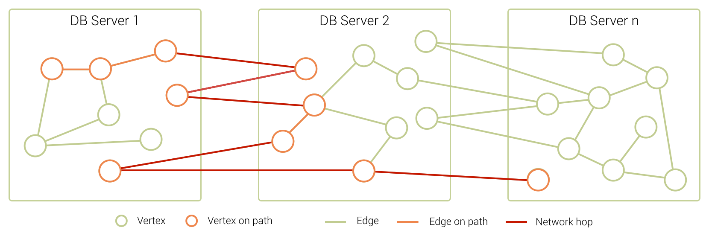
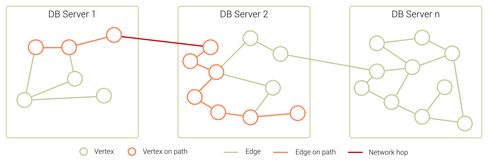
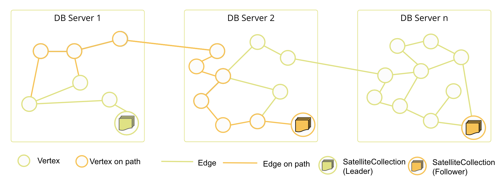
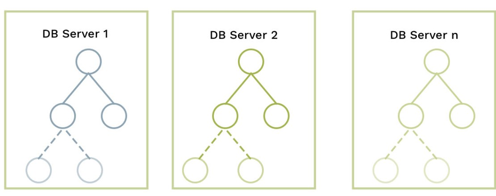

SmartGraphs
===========



SmartGraphs are specifically targeted at graphs that need scalability and high performance. The way SmartGraphs use the ArangoDB cluster sharding makes it extremely useful for distributing data across multiple servers with minimal network latency.

Most graphs have one feature - a value that is stored in every vertex - that divides the entire graph into several smaller subgraphs. These subgraphs have a large amount of edges that only connect vertices in the same subgraph and only have few edges connecting vertices from other subgraphs. If this feature is known, SmartGraphs can make use if it.

Examples for such graphs are:

- **Social Networks** 
  Typically the feature here is the region/country users live in. Every user has more contacts in the same
  region/country than in other regions/countries.

- **Transport Systems** 
  For transport systems, the common feature is the region/country. There are many local connections, but only a
  few go across countries.

- **E-Commerce** 
  In this case, the category of products is a good feature. Products of the same category are often bought together.

In terms of querying there is no difference between SmartGraphs and General Graphs.
For graph querying please refer to [AQL Graph Operations](aql/graphs.html)
and [General Graph Functions](graphs-general-graphs-functions.html) sections.
The optimizer is clever enough to identify
whether it is a SmartGraph or not.

Do the hands-on
[ArangoDB SmartGraphs Tutorial](https://www.arangodb.com/using-smartgraphs-arangodb/){:target="_blank"}
to learn more.

## How SmartGraphs work?

Typically, when you shard your data with ArangoDB the goal is to have an even distribution of data across multiple servers. This approach allows you to scale out your data at a rather high speed in most cases. However, since one of the best features of ArangoDB is fast graph traversals, this sort of distribution can start causing problems if your data grows exponentially.

Instead of traveling across every server before returning data, SmartGraphs use a clever and optimized way of moving data through the cluster so that you retain the scalability as well as the performance of graph traversals in ArangoDB. 

The examples below illustrate the difference in how data is sharded in the cluster for both scenarios. Let's take a closer look at it.

### Random data distribution

The natural distribution of data for graphs that handle large datasets involves a series of highly interconnected nodes with many edges running between them.

_The orange line indicates an example graph traversal. Notice how it touches nodes on every server._

Once you start connecting the nodes to each other, it becomes clear that the graph traversal might need to travel across every server before returning results. This sort of distribution results in many network hops between DB-Servers and Coordinators.

### Smart data distribution

By optimizing the distribution of data, SmartGraphs reduce the number of network hops traversals require. 

SmartGraphs come with a concept of a `smartGraphAttribute` that is used to inform the database how exactly to shard data. When defining this attribute, think of it as a value that is stored in every vertex. For instance, in social network datasets, this attribute can be the ID or the region/country of the users. 

The graph will than be automatically sharded in such a way that all vertices with the same value are stored on the same physical machine, all edges connecting vertices with identical `smartGraphAttribute` values are stored on this machine as well. Sharding with this attribute means that the relevant data is now co-located on servers, whenever possible.

_The outcome of moving the data like this is that you retain the scalability as well as the performance of graph traversals in ArangoDB._

## SmartGraphs using SatelliteCollections

These SmartGraphs are capable of using [SatelliteCollections](satellites.html) within their graph definition. Therefore, edge definitions defined between SmartCollections and
SatelliteCollections can be created. As SatelliteCollections (and the edge
collections between SmartGraph collections and SatelliteCollections) are
globally replicated to each participating DB-Server,
(weighted) graph traversal and (k-)shortest path(s) query can partially be executed locally on each DB-Server.
This means a larger part of the query can be executed fully local
whenever data from the SatelliteCollections is required.

## Disjoint SmartGraphs

Disjoint SmartGraphs are are useful for use cases which have to deal with a large forest of graphs,
when you have clearly separated subgraphs in your graph dataset.
Disjoint SmartGraphs enable the automatic sharding of these subgraphs and prohibit edges connecting them.

_This ensures that graph traversals, shortest path, and k-shortest-paths queries
can be executed locally on a DB-Server, achieving improved performance for
these type of queries._

## Disjoint SmartGraphs using SatelliteCollections

Disjoint SmartGraphs using SatelliteCollections prohibit
edges between vertices with different `smartGraphAttribute` values.
All SmartVertices can be connected to SatelliteVertices.