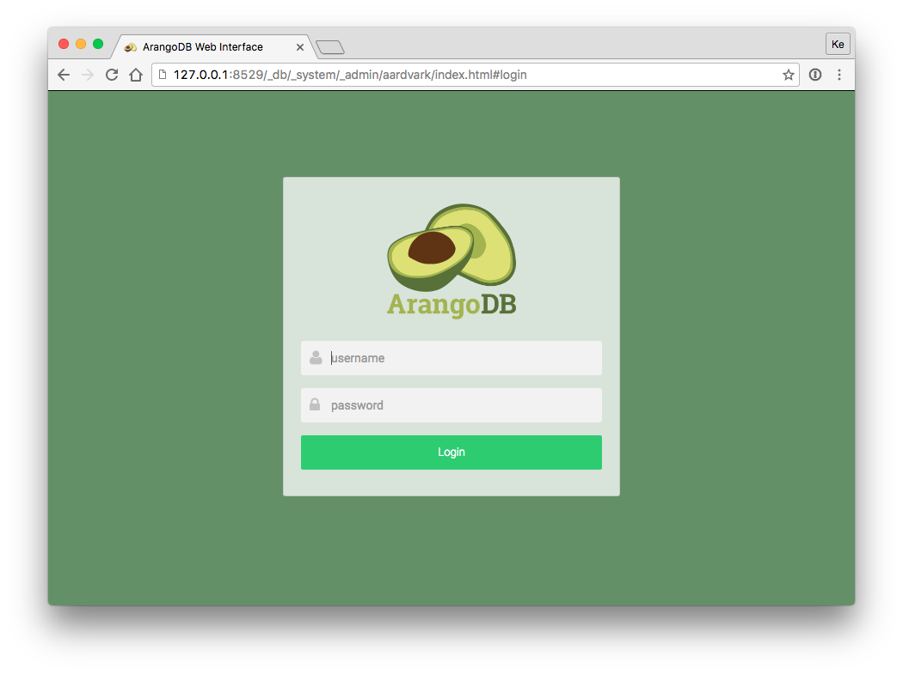
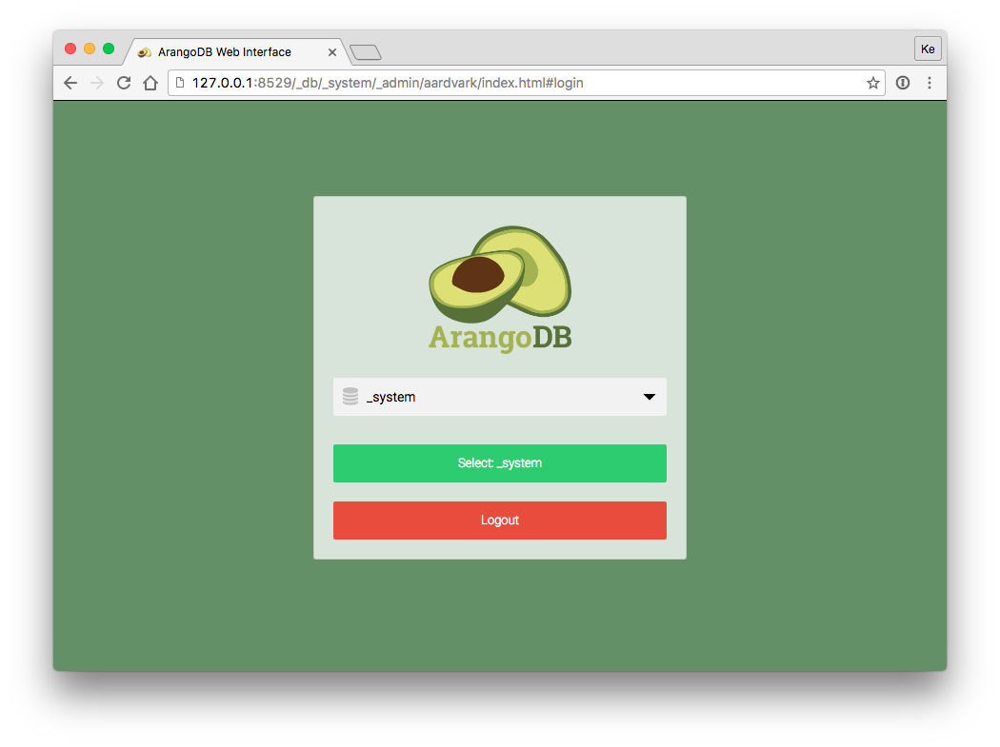

# How to Interact With ArangoDB

ArangoDB is a database that serves documents to clients. These documents are
transported using [JSON](https://en.wikipedia.org/wiki/JSON){:target="_blank"} via a TCP connection,
using the HTTP protocol. A [REST API](https://en.wikipedia.org/wiki/Representational_state_transfer){:target="_blank"}
is provided to interact with the database system.

The [web interface](programs-web-interface.html) that comes with
ArangoDB, called *Aardvark*, provides graphical user interface that is easy to use.
An [interactive shell](programs-arangosh.html), called *arangosh*, is also
shipped. In addition, there are so called [drivers](drivers/index.html)
that make it easy to use the database system in various environments and
programming languages. All these tools use the HTTP interface of the server and
remove the necessity to roll own low-level code for basic communication in most
cases.

## Web Interface

The server itself (_arangod_) speaks HTTP / REST, but you can use the
graphical web interface to keep it simple. There is also
[arangosh](programs-arangosh.html), a synchronous shell
for interaction with the server. If you are a developer, you might
prefer the shell over the GUI. It does not provide features like
syntax highlighting however.

When you start using ArangoDB in your project, you will likely use an official
or community-made driver written in the same language as your project. Drivers
implement a programming interface that should feel natural for that programming
language, and do all the talking to the server. Therefore, you can most certainly
ignore the HTTP API unless you want to write a driver yourself or explicitly
want to use the raw interface.

To get familiar with the database system you can even put drivers aside and
use the web interface (code name *Aardvark*) for basic interaction.
The web interface will become available shortly after you started `arangod`.
You can access it in your browser at
[http://localhost:8529](http://localhost:8529){:target="_blank"} - if not, please
see [Troubleshooting](troubleshooting.html).

By default, authentication is enabled. The default user is `root`.
Depending on the installation method used, the installation process either
prompted for the root password or the default root password is empty
(see [Securing the installation](getting-started-installation.html#securing-the-installation)).

Next you will be asked which database to use. Every server instance comes with
a `_system` database. Select this database to continue.

You should then be presented the dashboard with server statistics like this:

For a more detailed description of the interface, see [Web Interface](programs-web-interface.html).

## Command-line Interface

<!-- TODO: arangosh -->

## API and Drivers 

<!-- TODO REST/HTTP API and Drivers -->
