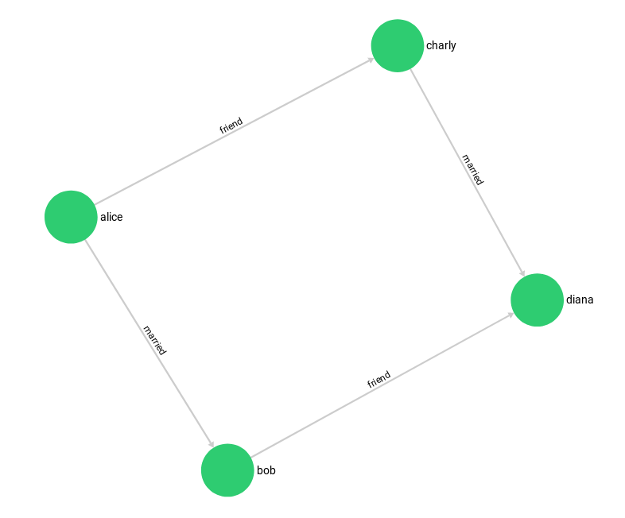

# HTTP interface for named graphs

The HTTP API for [named graphs](../graphs.html#named-graphs) is called _Gharial_.

You can manage all types of ArangoDB's named graphs with Gharial:
- [General Graphs](../graphs-general-graphs.html)
- [SmartGraphs](../graphs-smart-graphs.html)
- [EnterpriseGraphs](../graphs-enterprise-graphs.html)
- [SatelliteGraphs](../graphs-satellite-graphs.html)

The examples use the following example graphs:

[_Social Graph_](../graphs-traversals-example-data.html#social-graph):

[_Knows Graph_](../graphs-traversals-example-data.html#knows-graph):

## Management













## Vertices







## Edges






