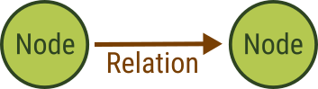
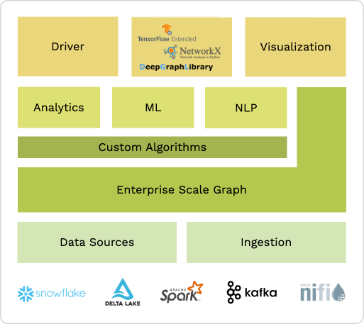

# ArangoDB {{ site.data.versions[page.version.name] }} Documentation

## What is ArangoDB

ArangoDB is an open-source database management system for graphs.
Graphs are information networks comprised of nodes and relations.



A social network is a common example of a graph. People are represented by nodes
and their friendships by relations.


Nodes are also called vertices, and relations are edges that connect vertices.
A vertex typically represents a specific entity (a person, a book, a sensor
reading etc.) and an edge defines how one entity relates to another.


This paradigm of storing data feels natural because it closely matches the
cognitive model of humans. It is an expressive data model that allows you to
represent many problem domains and solve them with semantic queries and graph
analytics.

Not everything is a graph use case, however. ArangoDB qualifies as a multi-model
database system that lets you equally work with (semi-)structured data in the
form of schema-free JSON objects without connecting these objects to form a graph.


It is designed from the ground up to support multiple data models with a single,
composable query language.

```js
FOR book IN Books
  FILTER book.title == "ArangoDB"
  FOR person IN 1..2 INBOUND book Sales, OUTBOUND People
    RETURN person.name
```

ArangoDB also comes with an integrated search engine for information retrieval,
such as full-text search with relevance ranking.

ArangoDB is written in C++ for high performance and built to work at scale, in
the cloud or on-premise.

### ArangoDB as a Document Database

ArangoDB lets you store documents in the sense of JSON objects. JSON supports
the following data types:

- `null`, to represent the absence of a value, also known as _nil_ or _none_ type.
- `true` and `false`, the Boolean values, that can be used represent _yes_ and
  _no_, _on_ and _off_, etc.
- **numbers**, for storing integer and floating-point values.
- **strings**, which are character sequences for text, encoded as UTF-8.
- **arrays**, which are lists that can contain any of the supported data types
  as elements, including nested arrays.
- **objects**, that map keys to values like a dictionary, also known as
  associative arrays or hash maps. The keys are strings and the values can be
  any of the supported data types, including nested objects.

Each record that you store is a JSON object at the top-level, also referred to
as **document**. Each pair key-value pair is called an **attribute**, comprised
of the attribute name and the attribute value. Attributes can also be called
properties or fields. You can freely model your data
using the available data types. Each document is self-contained and can thus
have a unique structure. You do not need to define a schema upfront.
However, sets of documents will typically have some common attributes. If you
want to enforce a specific structure, then you can do so with schema validation.

Documents are stored in **collections**, similar to how files are stored in
folders. You can group related documents together using collections, such as by
entity type (every _book_ document in a `books` collections, for instance).
Each collection is part of a **database**. Databases allow you to isolate sets
of collections from one another, usually for multi-tenant applications, where
each of your clients has their own database to work with.

Joins? Indexes?

### ArangoDB as a Graph Database

You can store vertices and edges with as many properties as you need, as both
are fully-fledged documents (JSON objects). Edges have two special attributes,
a `_from` and a `_to` attribute, that reference the vertex that the edge comes
from and points to via their document identifiers.

You can organize edges in sets using
collections, with vertices in **document collections** and edges in
**edge collections**. This makes ArangoDB classify as a **Labeled Property Graph**
store.

The design with edges stored in edge collections enables true graph scalability,
while keeping the promise of performant graph queries regardless of the number
of vertices and edges.

Edges are always **directed** in ArangoDB, which means they point from one
vertex to another. They cannot point both ways. However, you can create multiple
edges between a pair of vertices in both directions. When you **traverse** a
graph - a basic graph query algorithm that starts at a given vertex and then
walks along the connected edges to discover neighboring vertices - you can
specify whether you want to follow edges in the direction they are defined in
(**outbound**), the opposite direction (**inbound**), or regardless of the
direction (**any**). This means that you do not need to create an opposing edge
for every edge that you want to be able to follow in both directions.

Aside from basic graph traversal, ArangoDB offers graph algorithms to find one
or multiple shortest paths between two vertices, can return a specified amount
of paths between two vertices in order of increasing length, and supports
distributed graph processing based on the Pregel framework.

### ArangoDB as a Key-Value Database

A key-value database is a database system that lets you 

_key, not BLOB

### ArangoDB as a Search Engine

Federated search, 

### ArangoDB for Machine Learning

ArangoDB as the foundation for Graph ML

Scalable
Designed from ground up to scale Enterprise use cases

Simple Ingestion
Easy integration in existing data infrastructure + connectors to all leading data processing and data ecosystems

Open Source
Extensibility, Community, especially large community maintained library

NLP Support
Built-In Text Processing, Search, and Similarity Ranking



## How to Use the Documentation

The documentation is split into five parts:

- This manual describes ArangoDB and its features in detail for you as a user,
  developer, administrator, and data scientist.
- The [AQL handbook](aql/) explains ArangoDB's query language AQL.
- The [HTTP handbook](http/) describes the public REST API of ArangoDB
  that is used to communicate with clients. In general, the HTTP handbook will be
  of interest to driver developers. If you use any of the existing drivers for
  the language of your choice, you can skip this part.
- The [Driver handbook](drivers/) includes the documentation of the
  available official ArangoDB drivers and integrations, and an overview of the community
  drivers.
- The [ArangoDB Oasis handbook](oasis/) guides you through the user interface
  of our cloud service to set up organizations, projects and deployments.

Features are illustrated with interactive usage examples; you can cut'n'paste them
into [arangosh](programs-arangosh.html) to try them out. The HTTP
[REST-API](http/) for driver developers is demonstrated with cut'n'paste
recipes intended to be used with the [cURL](http://curl.haxx.se){:target="_blank"}. Drivers may provide
their own examples based on these .js based examples to improve understandability
for their respective users, i.e. for the [java driver](https://github.com/arangodb/arangodb-java-driver#learn-more){:target="_blank"}
some of the samples are re-implemented.
