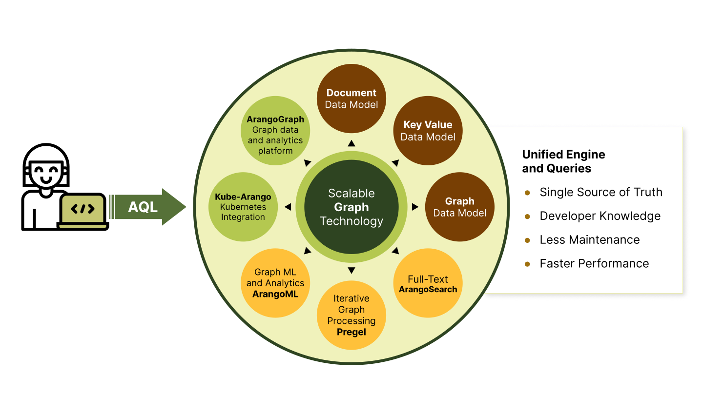

# ArangoDB Use Cases



## ArangoDB as a Graph Database

You can store vertices and edges with as many properties as you need, as both
are fully-fledged documents (JSON objects). Edges have two special attributes,
a `_from` and a `_to` attribute, that reference the vertex that the edge comes
from and points to by their document identifiers.

You can organize vertices and edges in sets using
collections, with vertices in **document collections** and edges in
**edge collections**. This makes ArangoDB classify as a **Labeled Property Graph**
store.

The design with edges stored in edge collections enables true graph scalability,
while keeping the promise of performant graph queries regardless of the number
of vertices and edges.

Edges are always **directed** in ArangoDB, which means they point from one
vertex to another. They cannot point both ways. However, you can create multiple
edges between a pair of vertices in both directions. When you **traverse** a
graph - a basic graph query algorithm that starts at a given vertex and then
walks along the connected edges to discover neighboring vertices - you can
specify whether you want to follow edges in the direction they are defined in
(**outbound**), the opposite direction (**inbound**), or regardless of the
direction (**any**). This means that you do not need to create an opposing edge
for every edge that you want to be able to follow in both directions.

Aside from basic graph traversal, ArangoDB offers graph algorithms to find one
or multiple shortest paths between two vertices, can return a specified amount
of paths between two vertices in order of increasing length, and supports
distributed graph processing based on the Pregel framework.

## ArangoDB as a Document Database

ArangoDB lets you store documents in the sense of JSON objects.

```json
{
  "name": "ArangoDB",
  "tags": ["graph", "database", "NoSQL"],
  "openSource": true,
  "company": {
    "name": "ArangoDB Inc.",
    "founded": 2015
  }
}
```

JSON supports the following data types:

- `null`, to represent the absence of a value, also known as _nil_ or _none_ type.
- `true` and `false`, the Boolean values, that can be used represent _yes_ and
  _no_, _on_ and _off_, etc.
- **numbers**, for storing integer and floating-point values.
- **strings**, which are character sequences for text, encoded as UTF-8.
- **arrays**, which are lists that can contain any of the supported data types
  as elements, including nested arrays.
- **objects**, that map keys to values like a dictionary, also known as
  associative arrays or hash maps. The keys are strings and the values can be
  any of the supported data types, including nested objects.

Each record that you store is a JSON object at the top-level, also referred to
as **document**. Each key-value pair is called an **attribute**, comprised
of the attribute name and the attribute value. Attributes can also be called
properties or fields. You can freely model your data
using the available data types. Each document is self-contained and can thus
have a unique structure. You do not need to define a schema upfront.
However, sets of documents will typically have some common attributes. If you
want to enforce a specific structure, then you can do so with schema validation.

Documents are stored in **collections**, similar to how files are stored in
folders. You can group related documents together using collections, such as by
entity type (every _book_ document in a `books` collections, for instance).
Each collection is part of a **database**. Databases allow you to isolate sets
of collections from one another, usually for multi-tenant applications, where
each of your clients has their own database to work with.

<!-- Joins? Indexes? -->

## ArangoDB as a Key-Value Database

Key-value stores are the simplest kind of database systems. Each record is
stored as a block of data under a key that uniquely identifies the record.
The data is opaque, which means the system doesn't know anything about the
contained information, it simply stores it and can retrieve it for you via
the identifiers.

This paradigm is used at the heart of ArangoDB and allows it to scale well,
but without the limitations of a pure key-value store. Every document has a
`_key` attribute, which is either user-provided or automatically generated.
You can create additional indexes and work with subsets of attributes as
needed, requiring the system to be aware of the stored data structures.

While ArangoDB can store binary data, it is not designed for
binary large objects (BLOBs) and works best with small to medium-sized
JSON objects.

## ArangoDB as a Search Engine

ArangoDB has a natively integrated search engine for a broad range of
information retrieval needs. It is powered by inverted indexes and can index
full-text, GeoJSON, as well as arbitrary JSON data. It supports various
kinds of search patterns (tokens, phrases, wildcard, fuzzy, geo-spatial, etc.)
and it can rank results by relevance and similarity using popular
scoring algorithms.

It also features natural language processing (NLP) capabilities and can
classify or find similar terms using word embedding models.

## ArangoDB for Machine Learning

You can use ArangoDB as the foundation for machine learning based on graphs
at enterprise scale. You can use it as a metadata store for model training
parameters, run analytical algorithms in the database, or serve operative
queries using data that you computed.

ArangoDB integrates well into existing data infrastructures and provides
connectors for popular machine learning frameworks and data processing
ecosystems.


