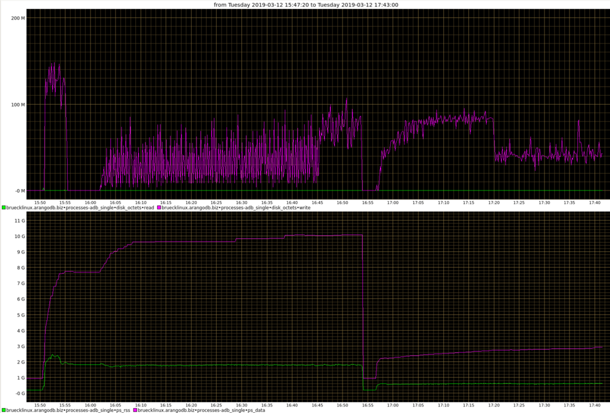

Reducing the Memory Footprint of ArangoDB servers
=================================================


The changes suggested here can be useful to reduce the memory usage of 
ArangoDB servers, but they can cause side-effects on performance and other 
aspects.
Do not apply any of the changes suggested here before you have tested them in
in a development or staging environment.


Usually, a database server will try to use all the memory it can get to
improve performance by caching or buffering. Therefore it is important
to tell an ArangoDB process how much memory it is allowed to use.
ArangoDB detects the available RAM on the server and divides this up
amongst its subsystems in some default way, which is suitable for a wide
range of applications. However, there will be situations in which there
are good reasons why these defaults are not suitable and the
administrator will therefore want to fine tune memory usage. The two
major reasons for this are:

 - something else (potentially another `arangod` server) is running on
   the same machine so that our `arangod` is supposed to use less than
   the available RAM, and/or
 - the actual usage scenario makes it necessary to increase the memory
   allotted to some subsystem at the cost of another to achieve higher
   performance for specific tasks.

To a lesser extent, the same holds true for CPU usage, but operating
systems are generally better in automatically distributing available CPU
capacity amongst different processes and different subsystems.

There are settings to make ArangoDB run on systems with very
limited resources, but they may also be interesting for your
development machine if you want to make it less taxing for
the hardware and do not work with much data. For production
environments, we recommend to use less restrictive settings, to
[benchmark](https://www.arangodb.com/performance/) your setup and
fine-tune the settings for maximal performance.

Before we get into the nitty-gritty details, we provide an overview over
the different subsystems of ArangoDB that are using significant amounts of RAM.


Overview over RAM usage in ArangoDB
-----------------------------------

This section explains the various areas which use RAM and what they are
for.

Broadly, ArangoDB uses significant amounts of RAM for the following subsystems:

- storage engine including the block cache
- HTTP server and queues
- edge caches and other caches
- AQL queries
- V8 (JavaScript features)
- ArangoSearch
- AgencyCache/ClusterInfo (cluster meta data)
- cluster-internal replication

Of these, the storage engine itself has some subsystems which contribute
towards its memory usage:

- RocksDB block cache
- data structures to read data (Bloom filters, index blocks, table readers)
- data structures to write data (write buffers, transaction data)
- RocksDB background compaction

It is important to understand that all these have a high impact on
performance. For example, the block cache is there such that already
used blocks can be retained in RAM for later access. The larger the
cache, the more blocks can be retained and so the higher the probability
that a subsequent access does not need to reach out to disk and thus
incurs no additional costs on performance and IO capacity.

RocksDB caches bloom filters and index blocks of its SST files in RAM.
It usually needs approx. 1% of the total size of all SST files in RAM
just for caching these. As a result, most random accesses need only a
single actual disk read to find the data stored under a single RocksDB
key! If not all Bloom filters and block indexes can be held in RAM, then
this can easily slow down random accesses by a factor of 10 to 100,
since suddenly many disk reads are needed to find a single
RocksDB key!

Other data structures for reading (table readers) and writing (write
batches and write buffers) are also needed for smooth operation. If one
cuts down on these too harshly, reads can be slowed down considerably
and writes can be delayed. The latter can lead to overall slowdowns and
could even end up in total write stalls and stops until enough write
buffers have been written out to disk.

Since RocksDB is a log structured merge tree (LSM), there must be
background threads to perform compactions. They merge different SST
files and throw out old, no-longer used data. These compaction
operations also need considerable amounts of RAM. If this is limited too
much (by reducing the number of concurrent compaction operations), then
a compaction debt can occur, which also results in write stalls or
stops.

The other subsystems outside the storage engine also need RAM. If an
ArangoDB server queues up too many requests (for example, if more
requests arrive per time than can be executed), then the bodies of these
requests are cached in RAM.

Furthermore, there are multiple different caches which are sitting in
front of the storage engine, the most prominent one being the edge cache
which helps to speed up graph traversals. The larger these caches,
the more data can be cached and the higher the likelyhood that data
which is needed repeatedly is found to be available in cache.

Essentially, all AQL queries are executed in RAM. That means that every
single AQL query needs some RAM - both on coordinators and on dbservers.
It is possible to limit the memory usage of a single AQL query as well
as the global usage for all AQL queries running concurrently. Obviously,
if either of these limits is reached, an AQL query can fail due to a lack
of RAM, which is then reported back to the user.

Everything which executes JavaScript (only on coordinators, user defined
AQL functions and Foxx services), needs RAM, too. If JavaScript is not
to be used, memory can be saved by reducing the number of V8 contexts.

ArangoSearch uses memory in different ways:

- writes which are committed in RocksDB but have not yet been **committed** to
  the search index are buffered in RAM,
- the search indexes use memory for **consolidation** of multiple smaller
  search index segments into fewer larger ones,
- the actual indexed search data resides in memory mapped files, which
  also need RAM to be cached.

Finally, the cluster internal management uses RAM in each `arangod`
instance. The whole meta data of the cluster is kept in the AgencyCache
and in the ClusterInfo cache. There is very little one can change about
this memory usage.

Furthermore, the cluster-internal replication needs memory to perform
its synchronization and replication work. Again, there is not a lot one
can do about that.

In the following sections we go through the various subsystems which the
administrator can influence and explain how this can be done.

Write ahead log (WAL)
---------------------

RocksDB writes all changes first to the write ahead log (WAL). This is
for crash recovery, the data will then later be written in an orderly
fashion to disk. The WAL itself does not need a lot of RAM, but limiting
its total size can lead to the fact that write buffers are flushed
earlier to make older WAL files obsolete. Therefore, adjusting the
option

```
--rocksdb.max-total-wal-size
```

to some value smaller than its default of 80MB can potentially help
to reduce RAM usage. However, the effect is rather indirect.


Write Buffers
-------------

RocksDB writes into
[memory buffers mapped to on-disk blocks](https://github.com/facebook/rocksdb/wiki/Write-Buffer-Manager)
first. At some point, the memory buffers will be full and have to be
flushed to disk. In order to support high write loads, RocksDB might
open a lot of these memory buffers.

By default, the system may use up to 10 write buffers per column family
and the default write buffer size is 64MB. Since normal write loads will
only hit the documents, edge, primary index and vpack index column
families, this effectively limits the RAM usage to something like 2.5GB.
However, there is a global limit which works across column families,
which can be used to limit the total amount of memory for write buffers
(set to unlimited by default!):

```
--rocksdb.total-write-buffer-size
```

Note that it does not make sense to set to set this limit smaller than
10 times the size of a write buffer, since there are currently 10 column
families and each will need at least one write buffer.

Additionally, RocksDB might keep some write buffers in RAM, which are
already flushed to disk. This is to speed up transaction conflict
detection. This only happens, if the option

```
--rocksdb.max-write-buffer-size-to-maintain
```

is set to a non-zero value. By default, this is set to 0.

The other options to configure write buffer usage are:

```
--rocksdb.write-buffer-size
--rocksdb.max-write-buffer-number
--rocksdb.max-write-buffer-number-definitions
--rocksdb.max-write-buffer-number-documents
--rocksdb.max-write-buffer-number-edge
--rocksdb.max-write-buffer-number-fulltext
--rocksdb.max-write-buffer-number-geo
--rocksdb.max-write-buffer-number-primary
--rocksdb.max-write-buffer-number-replicated-logs
--rocksdb.max-write-buffer-number-vpack
```

but adjusting these will usually not help with RAM usage.


RocksDB Block Cache
-------------------

The RocksDB block cache has a number of options for configuration. First
of all, its maximal size can be adjusted with the following option:

```
--rocksdb.block-cache-size
```

The default is 30% of (R - 2GB) where R is the total detected RAM. This
is a sensible default for many cases, but in particular if other
services are running on the same system, this can be too large. On the
other hand, if lots of other things are accounted with the block cache
(see options below), the value can also be too small.

Sometimes, the system can temporarily use a bit more than the configured
upper limit. If you want to strictly enforce the block cache size limit,
you can set the option

```
--rocksdb.enforce-block-cache-size-limit
```

to `true`, but we do not recommend this, since it might lead to failed
operations if the cache is full and we have observed that RocksDB
instances can get stuck in this case. You have been warned.

There are a number of things for which RocksDB needs RAM. It is possible
to make it so that all of these RAM usages count towards the block cache
usage. This is usually sensible, since it effectively allows to keep
RocksDB RAM usage under a certain configured limit (namely the block
cache size limit). If these things are not accounted in the block cache
usage, they are allocated anyway and this can lead to too much memory
usage. On the other hand, if they are accounted in the block cache
usage, then the block cache has less capacity for its core operations,
the caching of data blocks.

The following options control accounting for RocksDB RAM usage:

```
--rocksdb.cache-index-and-filter-blocks
--rocksdb.cache-index-and-filter-blocks-with-high-priority
--rocksdb.reserve-file-metadata-memory (>= 3.11)
--rocksdb.reserve-table-builder-memory
--rocksdb.reserve-table-reader-memory
```

They are for Bloom filter and block indexes, file metadata, table
building (RAM usage for uncommitted transactions) and table reading (RAM
usage for read operations) respectively.

There are additional options you can enable to avoid that the index and filter
blocks get evicted from cache:

```
--rocksdb.pin-l0-filter-and-index-blocks-in-cache
--rocksdb.pin-top-level-index-and-filter
```

The first does level 0 Bloom filters and index blocks and its default is
`false`. The second does top level of partitioned index blocks and Bloom
filters into the cache, its default is `true`.

The block cache basically trades increased RAM usage for less disk I/O, so its
size does not only affect memory usage, but can also affect read performance.

See also:
- [RocksDB Server Options](programs-arangod-options.html#rocksdb)
- [Write Buffer Manager](https://github.com/facebook/rocksdb/wiki/Write-Buffer-Manager){:target="_blank"}


Transactions
------------

Before commit, RocksDB builds up transaction data in RAM. This happens
in so-called "table builders". When there are many or large open
transactions, this can sum up to a large amount of RAM usage.

As mentioned above in the block cache section, RAM usage for table
builders can be accounted for with the block cache, if
`--rocksdb.reserve-table-builder-memory` is set to `true`.

A further limit on RAM usage can be imposed by setting the option

```
--rocksdb.max-transaction-size
```

which is by default unlimited. This setting limits the total size of
a single RocksDB transaction. If the table builder exceeds this size,
the transaction is automatically aborted. Note that this cannot guard
against **many** simultaneously uncommitted transactions.

Another way to limit actual transaction size is "intermediate commits".
This is a setting which leads to the behaviour that ArangoDB will
automatically commit large transactions during their execution. This of
course goes against the whole concept of a transaction, since parts of a
transaction which have already been committed cannot be rolled back any
more. Therefore, this is a rather desperate measure to prevent RAM
overusage. You can control this with the options

```
--rocksdb.intermediate-commit-count
--rocksdb.intermediate-commit-size
```

The first configures automatic intermediate commits based on the number
of documents touched in the transaction (default is 1000000). The second
configures intermediate commits based on the total size of the documents
touched in the transaction (default is 512MB).


RocksDB compactions
-------------------

RocksDB compactions are necessary, but use RAM. You can control how many
concurrent compactions can happen by configuring the number of
background threads RocksDB can use. This can either be done with the

```
--rocksdb.max-background-jobs
```

option whose default is the number of detected cores. Half
of that number will be the default value for the option

```
--rocksdb.num-threads-priority-low
```

and that many compactions can happen concurrently. You can also leave
the total number of background jobs and just adjust the latter option.
Fewer concurrent compaction jobs will use less RAM, but will also lead
to slower compaction overall, which can lead to write stalls and even
stops, if a compaction debt builds up under a high write load.


Scheduler queues
----------------

If too much memory is used to queue requests in the scheduler queues,
one can simply limit the queue length with this option:

```
--server.scheduler-queue-size
```

The default is 4096, which is quite a lot. For small requests, the
memory usage for a full queue will not be significant, but since
individual requests can be large, it will sometimes be necessary to
limit the queue size a lot more to avoid RAM over usage on the queue.


Index Caches
------------

There are in-RAM caches for edge indexes and other indexes. The total
RAM limit for them can be configured with this option:

```
--cache.size
```

By default, this is set to 25% of (R - 2GB) where R is the total
detected available RAM (or 256MB if that total is at most 4GB).
You can disable the in-memory index
[caches](programs-arangod-options.html#cache), by setting the limit to 0.

If you do not have a graph use case and do not use edge collections,
nor the optional hash cache for persistent indexes, it is possible to
use no cache (or a minimal cache size) without a performance impact. In
general, this should correspond to the size of the hot-set of edges and
cached lookups from persistent indexes.

Another way to save memory in the caches is to use compression by
setting the option

```
--cache.min-value-size-for-edge-compression
```

The default is 1GB which essentially switches the compression off.
If you set this to something like 100, values with at least 100 bytes
will be compressed.

This will cost a little CPU power but the system can then cache more
data in the same amount of memory.

The behaviour of the hash tables used in the caches can be adjusted with
the following two options:

```
--cache.ideal-lower-fill-ratio
--cache.ideal-upper-fill-ratio
```

The defaults are 0.04 and 0.25 respectively. If you increase these
limits, the hash tables will have a higher utilization, which uses
less memory but can potentially harm performance.

There are a number of options to pre-fill the caches under certain
circumstances:

```
--rocksdb.auto-fill-index-caches-on-startup
--rocksdb.auto-refill-index-caches-on-modify
--rocksdb.auto-refill-index-caches-on-followers
--rocksdb.auto-refill-index-caches-queue-capacity
```

The first leads to the caches being automatically filled on startup, the
second on any modifications. Both are set to `false` by default, so
setting these to `true` will - in general - use more RAM rather than
less. However, it will not lead to usage of more RAM than the configured
limits for all caches.

The third option above is by default `true`, so that caches on
followers will automatically be refilled if any of the first two options
is set to `true`. Setting this to `false` can save RAM usage on
followers.

Finally, the amount of write operations being queued for index refill
can be limited with `--rocksdb.auto-refill-index-caches-queue-capacity`
to avoid over-allocation if the indexing cannot keep up with the writes.
The default for this value is 131072.


AQL Query Memory Usage
----------------------

In addition to all the buffers and caches above, AQL queries will use additional 
memory during their execution to process your data and build up result sets. 
This memory is used during the query execution only and will be released afterwards, 
in contrast to the held memory for buffers and caches.

By default, queries will build up their full results in memory. While you can
fetch the results batch by batch by using a cursor, every query needs to compute
the entire result first before you can retrieve the first batch. The server
also needs to hold the results in memory until the corresponding cursor is fully
consumed or times out. Building up the full results reduces the time the server
has to work with collections at the cost of main memory.

In ArangoDB version 3.4 we introduced
[streaming cursors](release-notes-new-features34.html#streaming-aql-cursors) with
somewhat inverted properties: less peak memory usage, longer access to the
collections. Streaming is possible on document level, which means that it cannot
be applied to all query parts. For example, a *MERGE()* of all results of a
subquery cannot be streamed (the result of the operation has to be built up fully).
Nonetheless, the surrounding query may be eligible for streaming.

Aside from streaming cursors, ArangoDB offers the possibility to specify a
memory limit which a query should not exceed. If it does, the query will be
aborted. Memory statistics are checked between execution blocks, which
correspond to lines in the *explain* output. That means queries which require
functions may require more memory for intermediate processing, but this will not
kill the query because the memory.
The startup option to restrict the peak memory usage for each AQL query is
`--query.memory-limit`. This is a per-query limit, i.e. at maximum each AQL query is allowed
to use the configured amount of memory. To set a global memory limit for 
all queries together, use the `--query.global-memory-limit` setting.

You can also use *LIMIT* operations in AQL queries to reduce the number of documents
that need to be inspected and processed. This is not always what happens under
the hood, as some operations may lead to an intermediate result being computed before 
any limit is applied.

Statistics
----------

The server collects
[statistics](programs-arangod-options.html#--serverstatistics) regularly,
which is displayed in the web interface. You will have a light query load every
few seconds, even if your application is idle, because of the statistics. If required, you can 
turn it off via:

```
--server.statistics false
```
This setting will disable both the background statistics gathering and the statistics
APIs. To only turn off the statistics gathering, you can use
```
--server.statistics-history false
```
That leaves all statistics APIs enabled but still disables all background work
done by the statistics gathering.

JavaScript & Foxx
-----------------

[JavaScript](programs-arangod-options.html#javascript) is executed in the ArangoDB
process using the embedded V8 engine:

- Backend parts of the web interface
- Foxx Apps
- Foxx Queues
- GraphQL
- JavaScript-based transactions
- User-defined AQL functions

There are several *V8 contexts* for parallel execution. You can think of them as
a thread pool. They are also called *isolates*. Each isolate has a heap of a few
gigabytes by default. You can restrict V8 if you use no or very little
JavaScript:

``` 
--javascript.v8-contexts 2
--javascript.v8-max-heap 512
```

This will limit the number of V8 isolates to two. All JavaScript related
requests will be queued up until one of the isolates becomes available for the
new task. It also restricts the heap size to 512 MByte, so that both V8 contexts
combined cannot use more than 1 GByte of memory in the worst case.

### V8 for the Desperate

You should not use the following settings unless there are very good reasons,
like a local development system on which performance is not critical or an
embedded system with very limited hardware resources!

``` 
--javascript.v8-contexts 1
--javascript.v8-max-heap 256
```

Using the settings above, you can reduce the memory usage of V8 to 256 MB and just 
one thread. There is a chance that some operations will be aborted because they run 
out of memory in the web interface for instance. Also, JavaScript requests will be 
executed one by one.

If you are very tight on memory, and you are sure that you do not need V8, you
can disable it completely:

``` 
--javascript.enabled false
--foxx.queues false
```

In consequence, the following features will not be available:

- Backend parts of the web interface
- Foxx Apps
- Foxx Queues
- GraphQL
- JavaScript-based transactions
- User-defined AQL functions

Note that JavaScript / V8 is automatically disabled for DB-Server and Agency 
nodes in a cluster without these limitations. They apply only to single server 
instances and Coordinator nodes. You should not disable V8 on Coordinators
because certain cluster operations depend on it.


Concurrent operations
---------------------

Starting with ArangoDB 3.8 one can limit the number of concurrent
operations being executed on each Coordinator. Reducing the amount of
concurrent operations can lower the RAM usage on Coordinators. The
startup option for this is:

```
--server.ongoing-low-priority-multiplier
```

The default for this option is 4, which means that a Coordinator with `t`
scheduler threads can execute up to `4 * t` requests concurrently. The
minimal value for this option is 1.

Also see the [_arangod_ startup options](programs-arangod-options.html#--serverongoing-low-priority-multiplier).

CPU usage
---------

We cannot really reduce CPU usage, but the number of threads running in parallel.
Again, you should not do this unless there are very good reasons, like an
embedded system. Note that this will limit the performance for concurrent
requests, which may be okay for a local development system with you as only 
user.

The number of background threads can be limited in the following way:

``` 
--arangosearch.threads-limit 1
--rocksdb.max-background-jobs 4
--server.maintenance-threads 3
--server.maximal-threads 5
--server.minimal-threads 1
```

This will usually not be good for performance, though.

In general, the number of threads is determined automatically to match the 
capabilities of the target machine. However, each thread requires at most 8 MB 
of stack memory when running ArangoDB on Linux (most of the time a lot less),
so having a lot of concurrent
threads around will need a lot of memory, too.
Reducing the number of server threads as in the example above can help reduce the
memory usage by thread, but will sacrifice throughput.

In addition, the following option will make logging synchronous, saving one 
dedicated background thread for the logging:

```
--log.force-direct true
```

This is not recommended unless you only log errors and warnings.

Examples
--------

If you don't want to go with the default settings, you should first adjust the 
size of the block cache and the edge cache. If you have a graph use case, you 
should go for a larger edge cache. For example, split the memory 50:50 between 
the block cache and the edge cache. If you have no edges, then go for a minimal 
edge cache and use most of the memory for the block cache.

For example, if you have a machine with 40 GByte of memory and you want to
restrict ArangoDB to 20 GB of that, use 10 GB for the edge cache and 10 GB for
the block cache if you use graph features.

Please keep in mind that during query execution additional memory will be used
for query results temporarily. If you are tight on memory, you may want to go
for 7 GB each instead.

If you have an embedded system or your development laptop, you can use all of
the above settings to lower the memory footprint further. For normal operation,
especially production, these settings are not recommended.

Linux System Configuration
--------------------------

The main deployment target for ArangoDB is Linux. As you have learned above
ArangoDB and its innards work a lot with memory. Thus its vital to know how
ArangoDB and the Linux kernel interact on that matter. The linux kernel offers
several modes of how it will manage memory. You can influence this via the proc
filesystem, the file `/etc/sysctl.conf` or a file in `/etc/sysctl.conf.d/` which
your system will apply to the kernel settings at boot time. The settings as
named below are intended for the sysctl infrastructure, meaning that they map
to the `proc` filesystem as `/proc/sys/vm/overcommit_memory`.

A `vm.overcommit_memory` setting of **2** can cause issues in some environments
in combination with the bundled memory allocator ArangoDB ships with (jemalloc).

The allocator demands consecutive blocks of memory from the kernel, which are
also mapped to on-disk blocks. This is done on behalf of the server process
(*arangod*). The process may use some chunks of a block for a long time span, but
others only for a short while and therefore release the memory. It is then up to
the allocator to return the freed parts back to the kernel. Because it can only
give back consecutive blocks of memory, it has to split the large block into
multiple small blocks and can then return the unused ones.

With an `vm.overcommit_memory` kernel settings value of **2**, the allocator may
have trouble with splitting existing memory mappings, which makes the *number*
of memory mappings of an arangod server process grow over time. This can lead to
the kernel refusing to hand out more memory to the arangod process, even if more
physical memory is available. The kernel will only grant up to `vm.max_map_count`
memory mappings to each process, which defaults to 65530 on many Linux
environments.

Another issue when running jemalloc with `vm.overcommit_memory` set to **2** is
that for some workloads the amount of memory that the Linux kernel tracks as
*committed memory* also grows over time and never decreases. Eventually,
*arangod* may not get any more memory simply because it reaches the configured
overcommit limit (physical RAM * `overcommit_ratio` + swap space).

The solution is to
[modify the value of `vm.overcommit_memory`](installation-linux-osconfiguration.html#overcommit-memory)
from **2** to either **0** or **1**. This will fix both of these problems.
We still observe ever-increasing *virtual memory* consumption when using
jemalloc regardless of the overcommit setting, but in practice this should not
cause any issues. **0** is the Linux kernel default and also the setting we recommend.

For the sake of completeness, let us also mention another way to address the
problem: use a different memory allocator. This requires to compile ArangoDB
from the source code without jemalloc (`-DUSE_JEMALLOC=Off` in the call to cmake).
With the system's libc allocator you should see quite stable memory usage. We
also tried another allocator, precisely the one from `libmusl`, and this also
shows quite stable memory usage over time. What holds us back to change the
bundled allocator are that it is a non-trivial change and because jemalloc has
very nice performance characteristics for massively multi-threaded processes
otherwise.

Testing the Effects of Reduced I/O Buffers
------------------------------------------



- 15:50 – Start bigger import
- 16:00 – Start writing documents of ~60 KB size one at a time
- 16:45 – Add similar second writer
- 16:55 – Restart ArangoDB with the RocksDB write buffer configuration suggested above
- 17:20 – Buffers are full, write performance drops
- 17:38 – WAL rotation

What you see in above performance graph are the consequences of restricting the
write buffers. Until we reach a 90% fill rate of the write buffers the server
can almost follow the load pattern for a while at the cost of constantly
increasing buffers. Once RocksDB reaches 90% buffer fill rate, it will
significantly throttle the load to ~50%. This is expected according to the
[upstream documentation](https://github.com/facebook/rocksdb/wiki/Write-Buffer-Manager):

> […] a flush will be triggered […] if total mutable memtable size exceeds 90%
> of the limit. If the actual memory is over the limit, more aggressive flush
> may also be triggered even if total mutable memtable size is below 90%.

Since we only measured the disk I/O bytes, we do not see that the document save
operations also doubled in request time.
