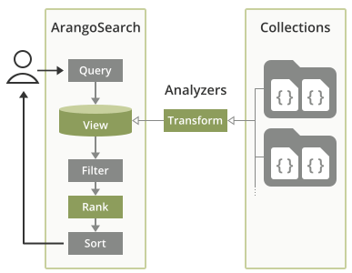

# Information Retrieval with ArangoSearch

{{ page.description }}
{:class="lead"}

ArangoSearch provides information retrieval features, natively integrated
into ArangoDB's query language and with support for all data models. It is
primarily a full-text search engine, a much more powerful alternative to the
[full-text index](indexing-fulltext.html) type. It can index nested fields
from multiple collections, optionally with transformations such as text
normalization and tokenization applied, rank query results by relevance and
more.

## Example Use Cases

- Perform federated full-text searches over product descriptions for a
  web shop, with the product documents stored in various collections.
- Find information in a research database using stemmed phrases, case and
  accent insensitive, with irrelevant terms removed from the search index
  (stop word filtering), ranked by relevance based on term frequency (TFIDF).
- Query a movie dataset for titles with words in a particular order
  (optionally with wildcards), and sort the results by best matching (BM25)
  but favor movies with a longer duration.

## Getting Started with ArangoSearch

ArangoSearch introduces the concept of **Views**, which can be seen as
virtual collections. There are two types of Views:

- **`arangosearch` Views**:
  Each View of the `arangosearch` type represents an inverted index to provide fast
  full-text searching over one or multiple linked collections and holds the
  configuration for the search capabilities, such as the attributes to index.
  It can cover multiple or even all attributes of the documents in the linked
  collections.

  See [`arangosearch` Views Reference](arangosearch-views.html) for details.

- **`search-alias` Views**:
  Views of the `search-alias` type reference one or more
  [Inverted indexes](indexing-inverted.html). Inverted indexes are defined on
  the collection level and can be used stand-alone for filtering, but adding
  them to a `search-alias` View enables you to search over multiple collections at
  once, called "federated search", and offers you the same capabilities for
  ranking search results by relevance and search highlighting like with
  `arangosearch` Views. Each inverted index can index multiple or even all
  attribute of the documents of the collection it is defined for.

  See [`search-alias` Views Reference](arangosearch-views-search-alias.html) for details.


Views are not updated synchronously as the source collections
change in order to minimize the performance impact. They are
**eventually consistent**, with a configurable consolidation policy.


The input values can be processed by so called [**Analyzers**](analyzers.html)
which can normalize strings, tokenize text into words and more, enabling
different possibilities to search for values later on.

Search results can be sorted by their similarity ranking to return the best
matches first using popular scoring algorithms (Okapi BM25, TF-IDF),
user-defined relevance boosting and dynamic score calculation.



Views can be managed in the web interface, via an [HTTP API](http/views.html) and
through a [JavaScript API](data-modeling-views-database-methods.html).

Views can be queried with AQL using the [`SEARCH` operation](aql/operations-search.html).
It takes a search expression composed of the fields to search, the search terms,
logical and comparison operators, as well as
[ArangoSearch functions](aql/functions-arangosearch.html).

### Create your first `arangosearch` View

1. Create a test collection (e.g. `food`) and insert a few documents so
   that you have something to index and search for:
   - `{ "name": "avocado", "type": "fruit" }` (yes, it is a fruit)
   - `{ "name": "carrot", "type": "vegetable" }`
   - `{ "name": "chili pepper", "type": "vegetable" }`
   - `{ "name": "tomato", "type": ["fruit", "vegetable"] }`
2. In the **VIEWS** section of the web interface, click the **Add View** button.
3. Enter a name (e.g. `food_view`) for the View, click **Create**, and click
   the card of the newly created View.
4. Enter the name of the collection in the **Links** fields, then click the
   underlined name to access the link properties and tick the
   **Include All Fields** checkbox. In the editor on the right-hand side, you
   can see the View definition in JSON format, including the following setting:
   ```js
   "links": {
     "food": {
       "includeAllFields": true
     }
   },
   ```
5. Click **Save view**. The View indexes all attributes (fields) of the documents
   in the `food` collection from now on (with some delay). The attribute values
   get processed by the default `identity` Analyzer, which means that they
   get indexed unaltered.
6. In the **QUERIES** section, try the following query:
   ```aql
   FOR doc IN food_view
     RETURN doc
   ```
   The View is used like a collection and simply iterated over to return all
   (indexed) documents. You should see the documents stored in `food` as result.
7. Now add a search expression. Unlike with regular collections where you would
   use `FILTER`, a `SEARCH` operation is needed to utilize the View index:
   ```aql
   FOR doc IN food_view
     SEARCH doc.name == "avocado"
     RETURN doc
   ```
   In this basic example, the ArangoSearch expression looks identical to a
   `FILTER` expression, but this is not always the case. You can also combine
   both, with `FILTER`s after `SEARCH`, in which case the filter criteria are
   applied to the search results as a post-processing step.

### Create your first `search-alias` View

1. Create a test collection (e.g. `food`) and insert a few documents so
   that you have something to index and search for. You may use the web interface
   for this:
   - `{ "name": "avocado", "type": ["fruit"] }` (yes, it is a fruit)
   - `{ "name": "carrot", "type": ["vegetable"] }`
   - `{ "name": "chili pepper", "type": ["vegetable"] }`
   - `{ "name": "tomato", "type": ["fruit", "vegetable"] }`
2. In the **COLLECTIONS** section of the web interface, click the test collection.
3. Go to the **Indexes** tab and click **Add Index**.
4. Select **Inverted index** as the **Type**.
5. Enter `name` into **Fields** and confirm. Then also add `type[*]` as a field.
   The `[*]` is needed to index the individual elements of the `type` array.
6. In the **VIEWS** section, click the _Add View_ button, enter a name (e.g. `food_view`), confirm and
   click on the newly created View.
4. You can toggle the mode of the View definition editor from _Tree_ to _Code_
   to edit the JSON object as text.
5. Replace `"links": {},` with below configuration, then save the changes:
   ```js
   "links": {
     "food": {
       "includeAllFields": true
     }
   },
   ```
6. After a few seconds of processing, the editor will show you the updated link
   definition with default settings added:
   ```js
   "links": {
     "food": {
       "analyzers": [
         "identity"
       ],
       "fields": {},
       "includeAllFields": true,
       "storeValues": "none",
       "trackListPositions": false
     }
   },
   ```
   The View will index all attributes (fields) of the documents in the
   `food` collection from now on (with some delay). The attribute values
   get processed by the default `identity` Analyzer, which means that they
   get indexed unaltered.
7. Click on _QUERIES_ in the main navigation and try the following query:
   ```aql
   FOR doc IN food_view
     RETURN doc
   ```
   The View is used like a collection and simply iterated over to return all
   (indexed) documents. You should see the documents stored in `food` as result.
8. Now add a search expression. Unlike with regular collections where you would
   use `FILTER`, a `SEARCH` operation is needed to utilize the View index:
   ```aql
   FOR doc IN food_view
     SEARCH doc.name == "avocado"
     RETURN doc
   ```
   In this basic example, the ArangoSearch expression looks identical to a
   `FILTER` expression, but this is not always the case. You can also combine
   both, with `FILTER`s after `SEARCH`, in which case the filter criteria will
   be applied to the search results as a post-processing step.

### Understanding the Analyzer context

`arangosearch` Views allow you to index the same field with multiple Analyzers.
This makes it necessary to select the right one in your query by setting the
Analyzer context with the `ANALYZER()` function.


If you use `search-alias` Views, the Analyzers are inferred from the definitions
of the inverted indexes. This is possible because every field can only be
indexed with a single Analyzer. Don't specify the Analyzer context with the
`ANALYZER()` function in `search-alias` queries to avoid errors.


We did not specify an Analyzer explicitly in above example, but it worked
regardless. That is because the `identity` Analyzer is used by default in both
View definitions and AQL queries. The Analyzer chosen in a query needs to match
with one of the Analyzers that a field was indexed with as per the `arangosearch` View
definition - and this happened to be the case. We can rewrite the query to be
more explicit about the Analyzer context:

```aql
FOR doc IN food_view
  SEARCH ANALYZER(doc.name == "avocado", "identity")
  RETURN doc
```

`ANALYZER(… , "identity")` matches the Analyzer defined in the View
`"analyzers": [ "identity" ]`. The latter defines how fields are transformed at
index time, whereas the former selects which index to use at query time.

To use a different Analyzer, such as the built-in `text_en` Analyzer, you would
change the View definition to `"analyzers": [ "text_en", "identity" ]` (or just
`"analyzers": [ "text_en" ]` if you don't need the `identity` Analyzer at all)
as well as adjust the query to use `ANALYZER(… , "text_en")`.

If a field is not indexed with the Analyzer requested in the query, then you
will get an **empty result** back. Make sure that the fields are indexed
correctly and that you set the Analyzer context.

You can test if a field is indexed with particular Analyzer with one of the
variants of the [`EXISTS()` function](aql/functions-arangosearch.html#exists),
for example, as shown below:

```aql
RETURN LENGTH(
  FOR doc IN food_view
    SEARCH EXISTS(doc.name, "analyzer", "identity")
    LIMIT 1
    RETURN true) > 0
```

If you use an `arangosearch` View, you need to change the `"storeValues"`
property in the View definition from `"none"` to `"id"` for the function to work.
For `search-alias` Views, this feature is always enabled.

### Basic search expressions

ArangoSearch supports a variety of logical operators and comparison operators
to filter Views. A basic one is the **equality** comparison operator:

`doc.name == "avocado"`

The inversion (inequality) is also allowed:

`doc.name != "avocado"`

You can also test against multiple values with the **IN** operator:

`doc.name IN ["avocado", "carrot"]`

The same can be expressed with a logical **OR** for multiple conditions:

`doc.name == "avocado" OR doc.name == "carrot"`

Similarly, **AND** can be used to require that multiple conditions must be true:

`doc.name == "avocado" AND doc.type == "fruit"`

An interesting case is the tomato document with its two array elements as type:
`["fruit", "vegetable"]`. The View definition defaulted to
`"trackListPositions": false`, which means that the array elements get indexed
individually as if the attribute both string values at the same time, matching
the following conditions:

`doc.type == "fruit" AND doc.type == "vegetable"`

The same can be expressed with `ALL ==` and `ALL IN`. Note that the attribute
reference and the search conditions are swapped for this:

`["fruit", "vegetable"] ALL == doc.type`

To find fruits which are not vegetables at the same time, the latter can be
excluded with `NOT`:

`doc.type == "fruit" AND NOT doc.type == "vegetable"`

For a complete list of operators supported in ArangoSearch expressions see
[AQL `SEARCH` operation](aql/operations-search.html).

### Searching for tokens from full-text

<!-- TODO: Update for web interface changes + search-alias -->

So far we searched for full matches of name and/or type. Strings could contain
more than just a single term however. It could be multiple words, sentences, or
paragraphs. For such text, we need a way to search for individual tokens,
usually the words that it is comprised of. This is where Text Analyzers come
in. A Text Analyzer tokenizes an entire string into individual tokens that are
then stored in an inverted index.

There are a few pre-configured text Analyzers, but you can also add your own as
needed. For now, let us use the built-in `text_en` Analyzer for tokenizing
English text.

1. Replace `"fields": {},` in the `food_view` View definition with below code:
  ```js
  "fields": {
    "name": {
      "analyzers": ["text_en", "identity"]
    }
  },
  ```
2. Save the change. After a few seconds, the `name` attribute will be indexed
   with the `text_en` Analyzer in addition to the `identity` Analyzer.
3. Run below query that sets `text_en` as context Analyzer and searches for
   the word `pepper`:
   ```aql
   FOR doc IN food_view
     SEARCH ANALYZER(doc.name == "pepper", "text_en")
     RETURN doc.name
   ```
4. It matches `chili pepper` because the Analyzer tokenized it into `chili` and
   `pepper` and the latter matches the search criterion. Compare that to the
   `identity` Analyzer:
   ```aql
   FOR doc IN food_view
     SEARCH ANALYZER(doc.name == "pepper", "identity")
     RETURN doc.name
   ```
   It does not match because `chili pepper` is indexed as a single token that
   does not match the search criterion.
5. Switch back to the `text_en` Analyzer but with a different search term:
   ```aql
   FOR doc IN food_view
     SEARCH ANALYZER(doc.name == "PéPPêR", "text_en")
     RETURN doc.name
   ```
   This will not match anything, even though this particular Analyzer converts
   characters to lowercase and accented characters to their base characters.
   The problem is that this transformation is applied to the document attribute
   when it gets indexed, but we haven't applied it to the search term.
6. If we apply the same transformation then we get a match:
   ```aql
   FOR doc IN food_view
     SEARCH ANALYZER(doc.name == TOKENS("PéPPêR", "text_en")[0], "text_en")
     RETURN doc.name
   ```
   Note that the [`TOKENS()` functions](aql/functions-string.html#tokens)
   returns an array. We pick the first element with `[0]`, which is the
   normalized search term `"pepper"`.

### Search expressions with ArangoSearch functions

Basic operators are not enough for complex query needs. Additional search
functionality is provided via [ArangoSearch functions](aql/functions-arangosearch.html)
that can be composed with basic operators and other functions to form search
expressions.

ArangoSearch AQL functions take either an expression or a reference of an
attribute path as first argument.

```aql
ANALYZER(<expression>, …)
STARTS_WITH(doc.attribute, …)
```

If an expression is expected, it means that search conditions can expressed in
AQL syntax. They are typically function calls to ArangoSearch search functions,
possibly nested and/or using logical operators for multiple conditions.

```aql
ANALYZER(STARTS_WITH(doc.name, "chi") OR STARTS_WITH(doc.name, "tom"), "identity")
```

The default Analyzer that will be used for searching is `"identity"`.
While some ArangoSearch functions accept an Analyzer argument, it is sometimes
necessary to wrap search (sub-)expressions with an `ANALYZER()` call to set the
correct Analyzer in the query so that it matches one of the Analyzers with
which the field was indexed.

It can be easier and cleaner to use `ANALYZER()` even if you exclusively
use functions that take an Analyzer argument and leave that argument out:

```aql
// Analyzer specified in each function call
PHRASE(doc.name, "chili pepper", "text_en") OR PHRASE(doc.name, "tomato", "text_en")

// Analyzer specified using ANALYZER()
ANALYZER(PHRASE(doc.name, "chili pepper") OR PHRASE(doc.name, "tomato"), "text_en")
```


The [`PHRASE()` function](aql/functions-arangosearch.html#phrase) applies the
`text_en` Analyzer to the search terms in both cases. `chili pepper` gets
tokenized into `chili` and `pepper` and these tokens are then searched in this
order. Searching for `pepper chili` would not match.


Certain expressions do not require any ArangoSearch functions, such as basic
comparisons. However, the Analyzer used for searching will be `"identity"`
unless `ANALYZER()` is used to set a different one.

```aql
// The "identity" Analyzer will be used by default
SEARCH doc.name == "avocado"

// Same as before but being explicit
SEARCH ANALYZER(doc.name == "avocado", "identity")

// Use the "text_en" Analyzer for searching instead
SEARCH ANALYZER(doc.name == "avocado", "text_en")
```

If an attribute path expressions is needed, then you have to reference a
document object emitted by a View like `FOR doc IN viewName` and then specify
which attribute you want to test for as an unquoted string literal. For example
`doc.attr` or `doc.deeply.nested.attr` but not `"doc.attr"`. You can also use
the bracket notation `doc["attr"]`.

```aql
FOR doc IN viewName
  SEARCH STARTS_WITH(doc.deeply.nested["attr"], "avoca")
  RETURN doc
```

### Ranking results by relevance

Finding matches is one thing, but especially if there are a lot of results then
the most relevant documents should be listed first. ArangoSearch implements
[scoring functions](aql/functions-arangosearch.html#scoring-functions) that
can be used to rank documents by relevance. The popular ranking schemes
[Okapi BM25](https://en.wikipedia.org/wiki/Okapi_BM25){:target="_blank"} and
[TF-IDF](https://en.wikipedia.org/wiki/Tf%E2%80%93idf){:target="_blank"} are
available.

Here is an example that sorts results from high to low BM25 score and also
returns the score:

```aql
FOR doc IN food_view
  SEARCH ANALYZER(doc.type == "vegetable", "identity")
  SORT BM25(doc) DESC
  RETURN { name: doc.name, type: doc.type, score: BM25(doc) }
```

As you can see, the variable emitted by the View in the `FOR … IN` loop is
passed to the [`BM25()` function](aql/functions-arangosearch.html#bm25).

| name         | type                  | score               |
|:-------------|:----------------------|:--------------------|
| tomato       | ["fruit","vegetable"] | 0.43373921513557434 |
| carrot       | vegetable             | 0.38845786452293396 |
| chili pepper | vegetable             | 0.38845786452293396 |

The [`TFIDF()` function](aql/functions-arangosearch.html#tfidf) works the same:

```aql
FOR doc IN food_view
  SEARCH ANALYZER(doc.type == "vegetable", "identity")
  SORT TFIDF(doc) DESC
  RETURN { name: doc.name, type: doc.type, score: TFIDF(doc) }
```

It returns different scores:

| name         | type                  | score               |
|:-------------|:----------------------|:--------------------|
| tomato       | ["fruit","vegetable"] | 1.2231435775756836  |
| carrot       | vegetable             | 1.2231435775756836  |
| chili pepper | vegetable             | 1.2231435775756836  |

The scores will change whenever you insert, modify or remove documents, because
the ranking takes factors like how often a term occurs overall and within a
single document into account. For example, if you insert a hundred more fruit
documents (`INSERT { type: "fruit" } INTO food`) then the TF-IDF score for
vegetables will become 1.4054651260375977.

You can adjust the ranking in two different ways:
- Boost sub-expressions to favor a condition over another with the
  [`BOOST()` function](aql/functions-arangosearch.html#boost)
- Calculate a custom score with an expression, optionally taking `BM25()` and
  `TFIDF()` into account
Have a look at the [Ranking Examples](arangosearch-ranking.html) for that.

## Indexing complex JSON documents

### Working with nested fields

<!-- TODO:
- rename to sub-fields or sub-attributes to avoid confusion with nested search feature?
- update for web interface changes + search-alias Views
-->

As with regular indexes, there is no limitation to top-level attributes.
Any document attribute at any depth can be indexed. However, with ArangoSearch
it is possible to index all documents attributes or particular attributes
including their nested attributes with having to modifying the View definition
as new (nested) attribute are added.

We already used this feature to index all document attributes above when we
modified the View definition to this:

```js
{
  "links": {
    "food": {
      "includeAllFields": true
    }
  },
  ...
}
```

No matter what attributes you add to your documents, they will automatically
get indexed. To do this for certain attribute paths only, you can specify it
like shown below and include a list of Analyzers to process the values with:

```js
{
  "links": {
    "food": {
      "fields": {
        "value": {
          "includeAllFields": true,
          "analyzers": ["identity", "text_en"]
        }
      }
    }
  }
}
```

This will index the attribute `value` and its nested attributes. Consider the
following example document:

```json
{
  "value": {
    "nested": {
      "deep": "apple pie"
    }
  }
}
```

The View will automatically index `apple pie`, processed with the `identity` and
`text_en` Analyzers, and it can then be queried like this:

```aql
FOR doc IN food_view
  SEARCH ANALYZER(doc.value.nested.deep == "apple pie", "identity")
  RETURN doc
```

```aql
FOR doc IN food_view
  SEARCH ANALYZER(doc.value.nested.deep IN TOKENS("pie", "text_en"), "text_en")
  RETURN doc
```


Using `includeAllFields` for a lot of attributes in combination with complex
Analyzers may significantly slow down the indexing process.


### Indexing and querying arrays

The elements of arrays are indexed individually by default, as if the source
attribute had each element as value at the same time (like a
_disjunctive superposition_ of their values). This is controlled by the
View setting [`trackListPositions`](arangosearch-views.html#link-properties)
that defaults to `false`.

Consider the following document:

```json
{
  "value": {
    "nested": {
      "deep": [ 1, 2, 3 ]
    }
  }
}
```

A View that is configured to index the field `value` including sub-fields
will index the individual numbers under the path `value.nested.deep`, which
you can query for like:

```aql
FOR doc IN viewName
  SEARCH doc.value.nested.deep == 2
  RETURN doc
```

This is different to `FILTER` operations, where you would use an
[array comparison operator](aql/operators.html#array-comparison-operators)
to find an element in the array:

```aql
FOR doc IN collection
  FILTER doc.value.nested.deep ANY == 2
  RETURN doc
```

You can set `trackListPositions` to `true` if you want to query for a value
at a specific array index:

```aql
SEARCH doc.value.nested.deep[1] == 2
```

With `trackListPositions` enabled there will be **no match** for the document
anymore if the specification of an array index is left out in the expression:

```aql
SEARCH doc.value.nested.deep == 2
```

Conversely, there will be no match if an array index is specified but
`trackListPositions` is disabled.

String tokens are also indexed individually, but only some Analyzer types
return multiple tokens.
If the Analyzer does, then comparison tests are done per token/word.
For example, given the field `text` is analyzed with `"text_en"` and contains
the string `"a quick brown fox jumps over the lazy dog"`, the following
expression will be true:

```aql
ANALYZER(doc.text == 'fox', "text_en")
```

Note that the `"text_en"` Analyzer stems the words, so this is also true:

```aql
ANALYZER(doc.text == 'jump', "text_en")
```

So a comparison will actually test if a word is contained in the text. With
`trackListPositions: false`, this means for arrays if the word is contained in
any element of the array. For example, given:

```json
{"text": [ "a quick", "brown fox", "jumps over the", "lazy dog" ] }
```

… the following will be true:

```aql
ANALYZER(doc.text == 'jump', "text_en")
```

With `trackListPositions: true` you would need to specify the index of the
array element `"jumps over the"` to be true:

```aql
ANALYZER(doc.text[2] == 'jump', "text_en")
```

Arrays of strings are handled similarly. Each array element is treated like a
token (or possibly multiple tokens if a tokenizing Analyzer is used and
therefore applied to each element).

## Dealing with eventual consistency

Regular indexes are immediately consistent. If you have a collection with a
`persistent` index on an attribute `text` and update the value of the attribute
for instance, then this modification is reflected in the index immediately.
View indexes (and inverted indexes) on the other hand are eventual
consistent. Document changes are not reflected instantly, but only near-realtime.
This mainly has performance reasons.

If you run a search query shortly after a CRUD operation, then the results may
be slightly stale, e.g. not include a newly inserted document:

```js
db._query(`INSERT { text: "cheese cake" } INTO collection`);
db._query(`FOR doc IN viewName SEARCH doc.text == "cheese cake" RETURN doc`);
// May not find the new document
```

Re-running the search query a bit later will include the new document, however.

There is an internal option to wait for the View to update and thus include
changes just made to documents:

```js
db._query(`INSERT { text: "pop tart" } INTO collection`);
db._query(`FOR doc IN viewName SEARCH doc.text == "pop tart" OPTIONS { waitForSync: true } RETURN doc`);
```

This is not necessary if you use a single server deployment and populate a
collection with documents before creating a View.


`SEARCH … OPTIONS { waitForSync: true }` is intended to be used in unit tests
to block search queries until the View caught up with the underlying
collections. It is designed to make this use case easier. It should not be used
for other purposes and especially not in production, as it can stall queries.



Do not use`SEARCH … OPTIONS { waitForSync: true }` in transactions. View index
changes cannot be rolled back if transactions get aborted. It will lead to
permanent inconsistencies between the linked collections and the View.


## How to go from here

To learn more, check out the different search examples:

- [**Exact value matching**](arangosearch-exact-value-matching.html):
  Search for values as stored in documents (full strings, numbers, booleans).
- [**Range queries**](arangosearch-range-queries.html):
  Match values that are above, below or between a minimum and a maximum value.
  This is primarily for numeric values.
- [**Prefix matching**](arangosearch-prefix-matching.html):
  Search for strings that start with certain strings. A common use case for
  this is to implement auto-complete kind of functionality.
- [**Case-sensitivity and diacritics**](arangosearch-case-sensitivity-and-diacritics.html):
  Strings can be normalized so that it does not matter whether characters are
  upper or lower case, and character accents can be ignored for a better search
  experience. This can be combined with other types of search.
- [**Wildcard search**](arangosearch-wildcard-search.html):
  Search for partial matches in strings (ends with, contains and more).
- [**Full-text token search**](arangosearch-fulltext-token-search.html):
  Full-text can be tokenized into words that can then be searched individually,
  regardless of their original order, also in combination with prefix
  search. Array values are also indexed as separate tokens.
- [**Phrase and proximity search**](arangosearch-phrase-and-proximity-search.html):
  Search tokenized full-text with the tokens in a certain order, such as
  partial or full sentences, optionally with wildcard tokens for a proximity
  search.
- [**Faceted search**](arangosearch-faceted-search.html):
  Combine aggregation with search queries to retrieve how often values occur
  overall.
- [**Fuzzy search**](arangosearch-fuzzy-search.html):
  Match strings even if they are not exactly the same as the search terms.
  By allowing some fuzziness you can compensate for typos and match similar
  tokens that could be relevant too.
- [**Geospatial search**](arangosearch-geospatial-search.html):
  You can use ArangoSearch for geographic search queries to find nearby
  locations, places within a certain area and more. It can be combined with
  other types of search queries unlike with the regular geo index.
- [**Search highlighting**](arangosearch-search-highlighting.html):
  Retrieve the positions of matches within strings, to highlight what was found
  in search results (Enterprise Edition only).
- [**Nested search**](arangosearch-nested-search.html):
  Match arrays of objects with all the conditions met by a single sub-object,
  and define for how many of the elements this must be true (Enterprise Edition only).

For relevance and performance tuning, as well as the reference documentation, see:

- [**Ranking**](arangosearch-ranking.html):
  Sort search results by relevance, fine-tune the importance of certain search
  conditions, and calculate a custom relevance score.
- [**Performance**](arangosearch-performance.html):
  Give the View index a primary sort order to benefit common search queries
  that you will run and store often used attributes directly in the View index
  for fast access.
- **Views Reference**
  You can find all View properties and options that are available for the
  respective type in the [`arangosearch` Views Reference](arangosearch-views.html)
  and [`search-alias` Views Reference](arangosearch-views-search-alias.html)
  documentation.

If you are interested in more technical details, have a look at:

- [**ArangoSearch Tutorial**](https://www.arangodb.com/learn/search/tutorial/#:~:text=Ranking%20in%20ArangoSearch){:target="_blank"}:
  The tutorial includes sections about the View concept, Analysis, and the
  ranking model.
- [**ArangoSearch architecture overview**](https://www.arangodb.com/2018/04/arangosearch-architecture-overview/){:target="_blank"}:
  A description of ArangoSearch's design, its inverted index and some
  implementation details.
