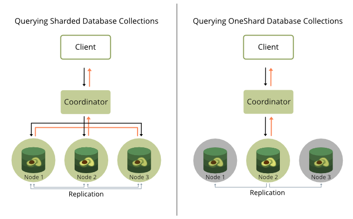

# OneShard

{{ page.description }}
{:class="lead"}



The OneShard option for ArangoDB clusters restricts all collections of a
database to a single shard and places them on one DB-Server node. This way,
whole queries can be pushed to and executed on that server, massively reducing
cluster-internal communication. The Coordinator only gets back the final result.

Queries are always limited to a single database, and with the data of a whole
database on a single node, the OneShard option allows running transactions with
ACID guarantees on shard leaders.

A OneShard setup is highly recommended for most graph use cases and join-heavy
queries.


For graphs larger than what fits on a single DB-Server node, you can use the
[**SmartGraphs**](graphs-smart-graphs.html) feature to efficiently limit the
network hops between Coordinator and DB-Servers.


Without the OneShard feature query processing works as follows in a cluster:

- The Coordinator accepts and analyzes the query.
- If collections are accessed then the Coordinator distributes the accesses
  to collections to different DB-Servers that hold parts (shards) of the
  collections in question.
- This distributed access requires network-traffic from Coordinator to
  DB-Servers and back from DB-Servers to Coordinators and is therefore
  expensive.

Another cost factor is the memory and CPU time required on the Coordinator
when it has to process several concurrent complex queries. In such
situations Coordinators may become a bottleneck in query processing,
because they need to send and receive data on several connections, build up
results for collection accesses from the received parts followed by further
processing.



If the database involved in a query is a OneShard database,
then the OneShard optimization can be applied to run the query on the 
responsible DB-Server node like on a single server. However, it still being
a cluster setup means collections can be replicated synchronously to ensure
resilience etc.

### How to use the OneShard feature

The OneShard feature is enabled by default if you use the ArangoDB
Enterprise Edition and if the database is sharded as `"single"`. In this case the
optimizer rule `cluster-one-shard` is applied automatically. 
There are two ways to achieve this:

- If you want your entire cluster to be a OneShard deployment, use the
  [startup option](programs-arangod-options.html#cluster)
  `--cluster.force-one-shard`. It sets the immutable `sharding` database
  property to `"single"` for all newly created databases, which in turn
  enforces the OneShard conditions for collections that are created in it.
  The `_graphs` system collection is used for `distributeShardsLike`.

- For individual OneShard databases, set the `sharding` database property to `"single"`
  to enforce the OneShard condition. The `_graphs` system collection is used for
  `distributeShardsLike`. It is not possible to change the `sharding` database
  property afterwards or overwrite this setting for individual collections.
  For non-OneShard databases the value of the `sharding` database property is
  either `""` or `"flexible"`.


The prototype collection does not only control the sharding, but also the
replication factor for all collections which follow its example. If the
`_graphs` system collection is used for `distributeShardsLike`, then the
replication factor can be adjusted by changing the `replicationFactor`
property of the `_graphs` collection (affecting this and all following
collections) or via the startup option `--cluster.system-replication-factor`
(affecting all system collections and all following collections).


**Example**

The easiest way to make use of the OneShard feature is to create a database
with the extra option `{ sharding: "single" }`. As done in the following
example:

```js
arangosh> db._createDatabase("oneShardDB", { sharding: "single" } )

arangosh> db._useDatabase("oneShardDB")

arangosh@oneShardDB> db._properties()
{
  "id" : "6010005",
  "name" : "oneShardDB",
  "isSystem" : false,
  "sharding" : "single",
  "replicationFactor" : 1,
  "writeConcern" : 1,
  "path" : ""
}
```

Now you can go ahead and create a collection as usual:

```js
arangosh@oneShardDB> db._create("example1")

arangosh@oneShardDB> db.example1.properties()
{
  "isSmart" : false,
  "isSystem" : false,
  "waitForSync" : false,
  "shardKeys" : [
    "_key"
  ],
  "numberOfShards" : 1,
  "keyOptions" : {
    "allowUserKeys" : true,
    "type" : "traditional"
  },
  "replicationFactor" : 2,
  "minReplicationFactor" : 1,
  "writeConcern" : 1,
  "distributeShardsLike" : "_graphs",
  "shardingStrategy" : "hash",
  "cacheEnabled" : false
}
```

As you can see, the `numberOfShards` is set to `1` and `distributeShardsLike`
is set to `_graphs`. These attributes have automatically been set
because the `{ "sharding": "single" }` options object was 
specified when creating the database.

To do this manually for individual collections, use `{ "sharding": "flexible" }`
on the database level and then create a collection in the following way:

```js
db._create("example2", { "numberOfShards": 1 , "distributeShardsLike": "_graphs" })
```

Here, the `_graphs` collection is used again, but any other existing
collection that has not been created with the `distributeShardsLike`
option itself can be used as well in a flexibly sharded database.

### Running Queries

For this arangosh example, first insert a few documents into a collection,
then create a query and explain it to inspect the execution plan.

```js
arangosh@oneShardDB> for (let i = 0; i < 10000; i++) { db.example.insert({ "value" : i }); }

arangosh@oneShardDB> q = "FOR doc IN @@collection FILTER doc.value % 2 == 0 SORT doc.value ASC LIMIT 10 RETURN doc";

arangosh@oneShardDB> db._explain(q, { "@collection" : "example" })

Query String (88 chars, cacheable: true):
 FOR doc IN @@collection FILTER doc.value % 2 == 0 SORT doc.value ASC LIMIT 10 RETURN doc

Execution plan:
 Id   NodeType                  Site   Est.   Comment
  1   SingletonNode             DBS       1   * ROOT
  2   EnumerateCollectionNode   DBS   10000     - FOR doc IN example   /* full collection scan, 1 shard(s) */   FILTER ((doc.`value` % 2) == 0)   /* early pruning */
  5   CalculationNode           DBS   10000       - LET #3 = doc.`value`   /* attribute expression */   /* collections used: doc : example */
  6   SortNode                  DBS   10000       - SORT #3 ASC   /* sorting strategy: constrained heap */
  7   LimitNode                 DBS      10       - LIMIT 0, 10
  9   RemoteNode                COOR     10       - REMOTE
 10   GatherNode                COOR     10       - GATHER
  8   ReturnNode                COOR     10       - RETURN doc

Indexes used:
 none

Optimization rules applied:
 Id   RuleName
  1   move-calculations-up
  2   move-filters-up
  3   move-calculations-up-2
  4   move-filters-up-2
  5   cluster-one-shard
  6   sort-limit
  7   move-filters-into-enumerate

```

As it can be seen in the explain output, almost the complete query is
executed on the DB-Server (`DBS` for nodes 1-7) and only 10 documents are
transferred to the Coordinator. In case you do the same with a collection
that consists of several shards, you get a different result:

```js
arangosh> db._createDatabase("shardedDB")

arangosh> db._useDatabase("shardedDB")

arangosh@shardedDB> db._properties()
{
  "id" : "6010017",
  "name" : "shardedDB",
  "isSystem" : false,
  "sharding" : "flexible",
  "replicationFactor" : 1,
  "writeConcern" : 1,
  "path" : ""
}

arangosh@shardedDB> db._create("example", { numberOfShards : 5})

arangosh@shardedDB> for (let i = 0; i < 10000; i++) { db.example.insert({ "value" : i }); }

arangosh@shardedDB> db._explain(q, { "@collection" : "example" })

Query String (88 chars, cacheable: true):
 FOR doc IN @@collection FILTER doc.value % 2 == 0 SORT doc.value ASC LIMIT 10 RETURN doc

Execution plan:
 Id   NodeType                  Site   Est.   Comment
  1   SingletonNode             DBS       1   * ROOT
  2   EnumerateCollectionNode   DBS   10000     - FOR doc IN example   /* full collection scan, 5 shard(s) */   FILTER ((doc.`value` % 2) == 0)   /* early pruning */
  5   CalculationNode           DBS   10000       - LET #3 = doc.`value`   /* attribute expression */   /* collections used: doc : example */
  6   SortNode                  DBS   10000       - SORT #3 ASC   /* sorting strategy: constrained heap */
 11   RemoteNode                COOR  10000       - REMOTE
 12   GatherNode                COOR  10000       - GATHER #3 ASC  /* parallel, sort mode: heap */
  7   LimitNode                 COOR     10       - LIMIT 0, 10
  8   ReturnNode                COOR     10       - RETURN doc

Indexes used:
 none

Optimization rules applied:
 Id   RuleName
  1   move-calculations-up
  2   move-filters-up
  3   move-calculations-up-2
  4   move-filters-up-2
  5   scatter-in-cluster
  6   distribute-filtercalc-to-cluster
  7   distribute-sort-to-cluster
  8   remove-unnecessary-remote-scatter
  9   sort-limit
 10   move-filters-into-enumerate
 11   parallelize-gather
```


It can be checked whether the OneShard feature is active or not by
inspecting the explain output. If the list of rules contains
`cluster-one-shard`, then the feature is active for the given query.


Without the OneShard feature all documents potentially have to be sent to
the Coordinator for further processing. With this simple query this is actually
not true, because some other optimizations are performed that reduce the number
of documents. But still, a considerable amount of documents has to be
transferred from DB-Server to Coordinator only to apply a `LIMIT` of 10
documents there. The estimate for the *RemoteNode* is 10,000 in this example,
whereas it is 10 in the OneShard case.

### ACID Transactions on Leader Shards

ArangoDB's transactional guarantees are tunable. For transactions to be ACID
on the leader shards in a cluster, a few things need to be considered:

- The AQL query or [Stream Transaction](http/transaction-stream-transaction.html)
  must be eligible for the OneShard optimization, so that it is executed on a
  single DB-Server node.
- To ensure durability, enable `waitForSync` on query level to wait until data
  modifications have been written to disk.
- The collection option `writeConcern: 2` makes sure that a transaction is only
  successful if at least one follower shard is in sync with the leader shard,
  for a total of two shard replicas.
- The RocksDB engine supports intermediate commits for larger document
  operations, potentially breaking the atomicity of transactions. To prevent
  this for individual queries you can increase `intermediateCommitSize`
  (default 512 MB) and `intermediateCommitCount` accordingly as query option.

### Limitations

The OneShard optimization is used automatically for all eligible AQL queries
and Stream Transactions.

For AQL queries, any of the following factors currently makes a query
unsuitable for the OneShard optimization:

- The query accesses collections with more than a single shard, different leader
  DB-Servers, or different `distributeShardsLike` prototype collections
- The query writes into a SatelliteCollection
- The query accesses an edge collection of a SmartGraph
- Usage of AQL functions that can only execute on Coordinators.
  These functions are:
  - `APPLY`
  - `CALL`
  - `COLLECTION_COUNT`
  - `COLLECTIONS`
  - `CURRENT_DATABASE`
  - `CURRENT_USER`
  - `FULLTEXT`
  - `NEAR`
  - `SCHEMA_GET`
  - `SCHEMA_VALIDATE`
  - `V8`
  - `VERSION`
  - `WITHIN`
  - `WITHIN_RECTANGLE`
  - User-defined AQL functions (UDFs)