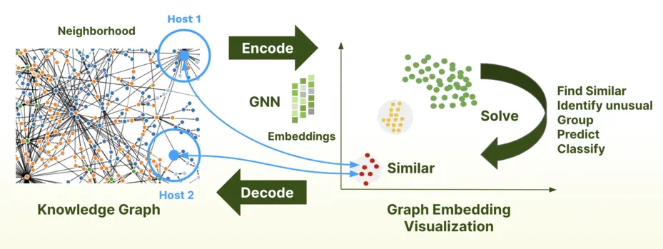
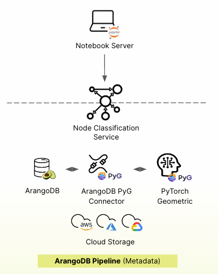

# GraphML

{{ page.description }}
{:class="lead"}

Traditional machine learning overlooks the connections and relationships
between data points, which is where graph machine learning excels. However, accessibility to GraphML has been limited to sizable enterprises equipped with specialized teams of data scientists. ArangoGraphML, on the other hand, simplifies the utilization of GraphML, enabling a broader range of personas to extract profound insights from their data.

## How GraphML works

GraphML focuses on the utilization of neural networks specifically for
graph-related tasks. It is well-suited for addressing vague or fuzzy problems and facilitating their resolution. The process involves incorporating a graph's topology (node and edge structure) and the node and edge characteristics and features to create a numerical representation known as an embedding.

Graph Neural Networks (GNNs) are explicitly designed to learn meaningful numerical representations, or embeddings, for nodes and edges in a graph.

By applying a series of steps, GNNs effectively create graph embeddings,
which are numerical representations that encode the essential information
about the nodes and edges in the graph. These embeddings can then be used for various tasks, such as node classification, link prediction, and graph-level classification, where the model can make predictions based on the learned patterns and relationships within the graph.

It is no longer necessary to understand the complexities involved with graph machine learning, thanks to the accessibility of the ArangoGraphML platform. Solutions with the ArangoGraphML platform only require input from a user about their data, and our managed services handle the rest.

The platform comes preloaded with all the tools needed to prepare your graph for machine learning, high-accuracy training, and persisting predictions back to the database for application use. 

## ArangoGraphML

ArangoGraphML provides enterprise-ready graph-powered machine learning as a cloud service via Jupyter Notebooks that runs on the ArangoGraph Insights Platform.

ArangoGraphML uses GraphML techniques that focus on solving different problems and, at the same time, provides actionable insights leveraging ArangoDB's graph data model.

### Classification
Node classification is a natural fit for graph databases as it can leverage existing graph analytics insights during model training. For instance, if you have performed some community detection, potentially using ArangoDB's built-in Pregel support, you can use these insights as inputs for graph machine learning. 

**What is Node Classification**

The goal of node classification is to categorize the nodes in a graph based on their neighborhood connections and characteristics in the graph. Based on the behaviors or patterns in the graph, the Graph Neural Network (GNN) will be able to learn what makes a node belong to a category. 

Node classification can be used to solve complex problems such as:
- Entity Categorization 
  - Email
  - Books
  - WebPage
  - Transaction
- Social Networks
  - Events
  - Friends
  - Interests
- BioPharmaceutical
  - Protein-protein interaction
  - Drug Categorization
  - Sequence grouping
- Behavior
  - Fraud 
  - Purchase/decision making
  - Anamoly 

Many use cases can be solved with node classification. With many challenges, there are multiple ways to attempt to solve them, and that's why the ArangoGraphML node classification is only the first of many techniques to be introduced. You can sign up to get immediate access to our latest stable features and let us know if you would like to try out what we have in the pipeline, such as embedding similarity, link prediction, or let us know what you'd like to see added next. 

## Metrics and Compliance

### Training Performance

Before using a model to provide predictions to your application, there needs to be a way to determine its level of accuracy. Additionally, a mechanism must be in place to ensure the experiments comply with auditor requirements. ArangoGraphML supports these objectives by storing all relevant training data and metrics in a metadata graph, which is only available to you and is never viewable by ArangoDB. This metagraph contains valuable training metrics such as average accuracy (the general metric for determining model performance), F1, Recall, Precision, and confusion matrix data. This graph links all experiments to the source data, feature generation activities, training runs, and prediction jobs. Having everything linked across the entire pipeline ensures that anytime anything is done that could be considered associated with sensitive user data, it is logged and easily accessible.

## Security

Each deployment that uses ArangoGraphML has an `arangopipe` database created, which houses all of this information. Since the data lives with the deployment, it benefits from the ArangoGraph SOC 2 compliance and Enterprise security features. All ArangoGraphML services live alongside the ArangoGraph deployment and are only accessible within that organization.

- **Accessible at all levels**
  - Low code UI
  - Notebooks
  - APIs
- **Full usability**
  - MLOps lifecycle
  - Metrics
  - Metadata capture
  - Model management

# Getting Started with ArangoGraphML Services and Packages
AranogGraphML is a suite of services and packages driven by what we call 'specifications'. These specifications are standard Python dictionaries and empower users to define tasks concisely and repeatable. 

Notebooks that have the ArangoGraphML services enabled come preloaded with valuable data science and ML packages, and most notably, the server includes the `arangoml` package, which provides access to all of the ArangoGraphML-specific features.

The package allows for managing all of the necessary ArangoGaphML components, including:
Project Management: Projects are at the top level, and all activities must link to a project.
Feature Generation: Data must be featurized to work with Graph Neural Networks, and the featurization package handles this.
Training: Start training data with a simple description of the problem and the data used to solve it. Jobs can started, tracked, or cancelled using the `arangoml` package.
Predictions: Once a trained model exists, it is time to persist it. The prediction service generates predictions and persists them to the source graph in a new collection or within the source document.

