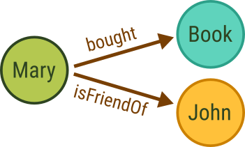

# Graphs

{{ page.description }}
{:class="lead"}

Graphs are information networks comprised of **nodes** and **relations**. Nodes
can represent objects, entities, abstract concepts, or ideas. Relations between
nodes can represent physical and social connections, temporal and causal
relationships, flows of information, energy, and material, interactions and
transactions, dependency and hierarchy, as well as similarity and relatedness of
any kind.

For example, you can represent people by nodes and their friendships by
relations. This lets you form a graph that is a social networks in this case.

The specific terms to refer to nodes and relations in a graph vary depending
on the field or context, but they are conceptually the same. In computer science
and mathematics, the terms **vertices** (singular: vertex) and **edges** are
commonly used to refer to nodes and relations, respectively. In information
science and data analysis, they are referred to as _entities_ and _connection_.
In social sciences, they are often called _actors_ and _ties_ or _links_.
They may also be called _points_ and _arcs_.

Using graphs with vertices to represent things and edges to define how they
relate to one another is a very expressive data model. It lets you represent
a wide variety of information in a compact and intuitive way. It lets you model
complex relationships and interactions of basically everything.

Graphs are commonly directed (_digraphs_), which means that each edge goes from
one vertex to another vertex in a specific direction. This lets you model
directional relationships, such as cause and effect or the flow of material,
energy, or information. In undirected graphs, edges don't have a direction and
the relationship between two vertices is considered to be the same in both
directions. These two types of graphs have different properties and different
algorithms exist to analyze the data.

<!--
Graphs can have different structures, called **topologies**. The topology
describes how the vertices and edges are arranged by classifying the pattern of
connections. Some relevant classes are:

- Cyclic: a graph that contains at least one path that starts and ends at the
  same node
- Acyclic: a graph that contains no cycles
- Dense: a graph with edges between most pairs of vertices
- Sparse: a graph where only few pairs of vertices are connected by edges
-->

information extraction (high-level)

## Graph features in ArangoDB

Graph database systems like ArangoDB can store graphs and provide means to query
the connected data.

labeled property graph?
comparison with RDBMS
properties on vertices and edges
native graph that can be combined
graph algorithms

## Graph use cases

many problem domains and solve them with semantic queries and graph analytics.
use cases with rough data model

## Model data with graphs

embedded vs. joins vs. graphs
multiple edge colls or FILTER on type
example graphs?

acl/rbac
dependencies
product hierarchies
...

## Query graphs

traversal, pattern matching, shortest paths, pregel
direction, depth, order, conditions, weights?
combine with geo, search, ...

## Manage graphs

types (anonymous, managed)
APIs

## Scale and operate graphs ?

EE features
backup and restore
