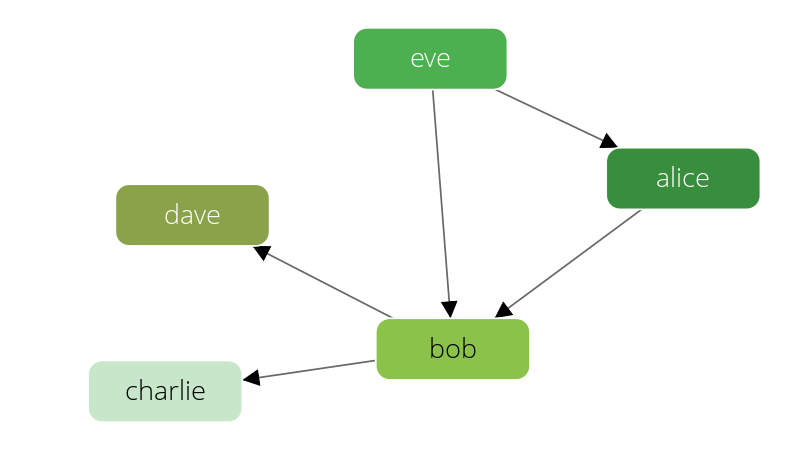

Handling Edges
==============

Examples will explain the REST API for [manipulating edges](../graphs-general-graphs-functions.html)
of the [graph module](../graphs.html)
on the [knows graph](../graphs.html#the-knows_graph):




Examples will explain the API on the [social graph](../graphs.html#the-social-graph):




