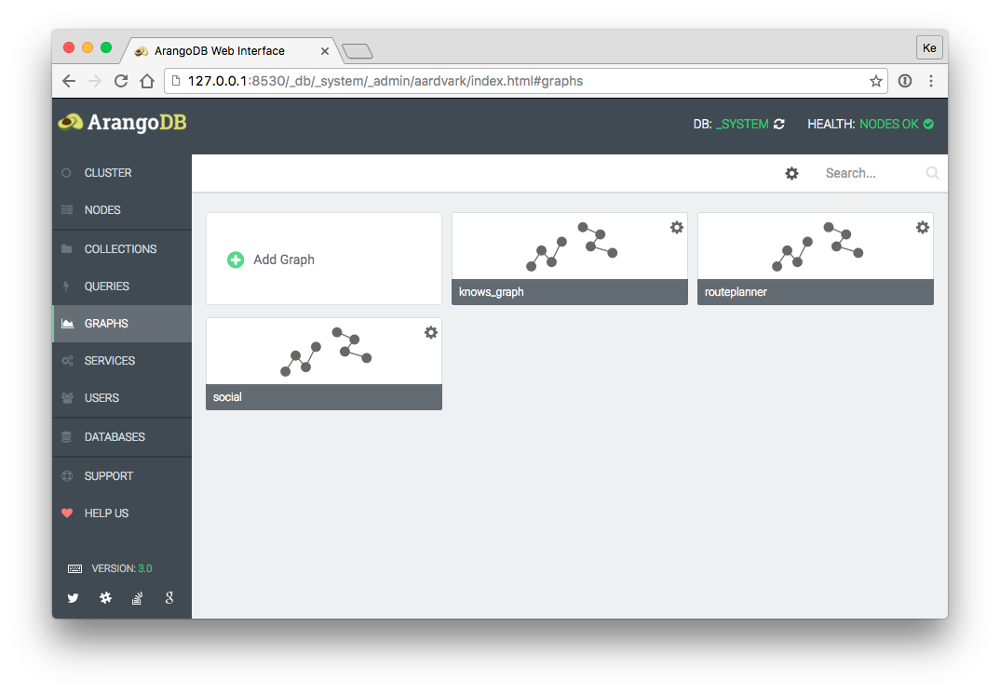
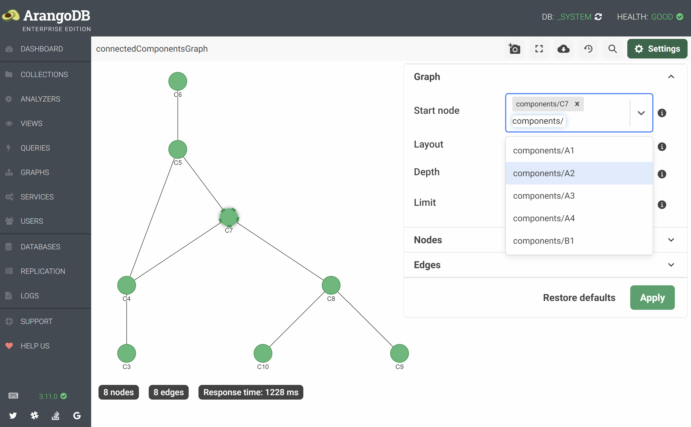
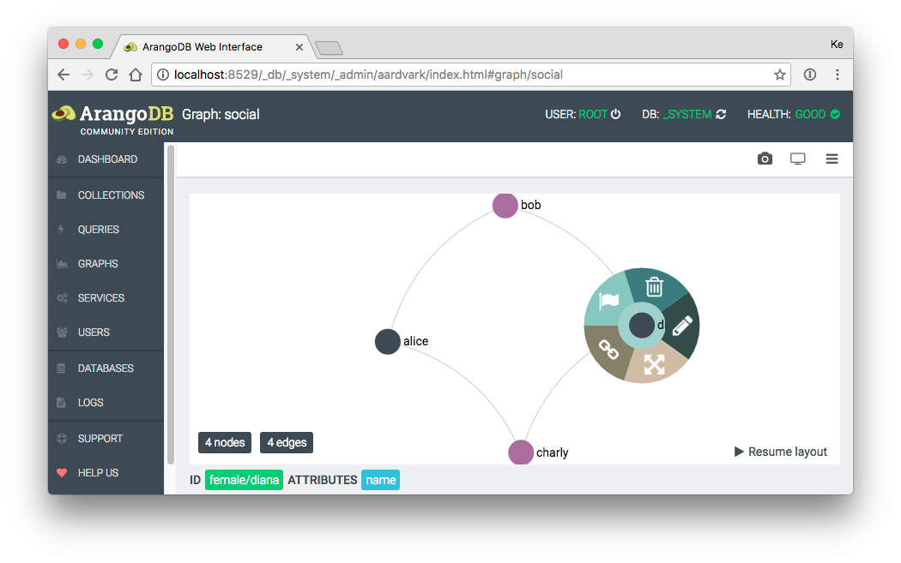

# Graphs

{{ page.description }}
{:class="lead"}

The **GRAPHS** section of the web interface lists the _named graphs_ stored in
ArangoDB (EnterpriseGraphs, SmartGraphs, SatelliteGraphs, General Graphs) and
lets you create new named graphs as well as view and edit the settings of
existing named graphs. It also provides a viewer facility for visualizing
subsets of a graph or an entire graph.

## Create a named graph

1. In the **GRAPHS** section, click the first card with the label **Add Graph**.
2. Select a tab depending on which type of named graph you want to create.
   The **SatelliteGraph**, **SmartGraph**, and **EnterpriseGraph** tabs are
   only available for cluster deployments using the Enterprise Edition.
   For non-cluster deployments and in the Community Edition, only the
   **Examples** and **GeneralGraph** tabs are available.
3. Fill in the fields of the dialog. Required fields have an asterisk (`*`)
   in their label. Hover over the gray circle with a white `i` in it next to
   a field to show the tooltip with an explanation.
4. Click the **Create** button to create the named graph.

For more information about the different types of named graphs, see
[Graphs](graphs.html).

## View and edit the settings of a named graph

1. In the **GRAPHS** section, click the _gear_ icon in the top right corner
   of a graph's card.
2. The setting dialog opens. You can only edit certain fields. Fields that 
   cannot be modified are grayed out.
3. Click the **Cancel** button or outside of the dialog to close it without
   saving any changes. Click **Save** to save changes.
   
## Delete a named graph

1. In the **GRAPHS** section, click the _gear_ icon in the top right corner
   of a graph's card.
2. Click the **Delete** button.
3. Optional: Tick the **also drop collections?** checkbox if you want to
   delete the vertex and edge collections of the graph as well and not the
   graph definition only. This deletes the collections with all the documents
   they contain and is irreversible!
4. Confirm the deletion by clicking the **Yes** button.

## Graph viewer

The graph viewer opens if you click a graph's card in the **GRAPHS** section.
The viewer randomly selects a start node and displays its neighborhood.
By default, up to 250 nodes that are directly connected to the start node and
their direct neighbors are selected. You can select one or more start nodes
and change the depth and the limit in the settings panel. You can also load
the entire graph via the toolbar, but only use this with small graphs.

### Toolbar

The toolbar at the top offers the following actions and a toggle for the
settings panel:

- Take a screenshot (_camera_ icon)
- Enter fullscreen (_rectangle corners_ icon)
- Load full graph (_cloud download_ icon)
- Switch to the old graph viewer (_clock with an arrow_ icon)
- Search nodes (_magnifier_ icon)
- Settings (_gear_ icon)

### Settings

The settings panel is divided into three collapsible sections and lets you
configure what to show of the graph and how.

**General**

- **Start node** (1+)
- **Layout**: forceAtlas2, hierarchical
- **Depth**: 2
- **Limit**: 250 nodes

**Nodes**

- **Node label**: 
- **Default node color**: 
- **Color nodes by collection**: 
- **Node color attribute**: 
- **Show collection name**: 
- **Size by connections**: 
- **Sizing attribute**: 

**Edges**

- **Edge label**: 
- **Default edge color**: 
- **Color edges by collection**: 
- **Edge color attribute**: 
- **Show collection name**: 
- **Show edge direction**: 
- **Type**: solid, dashed, dotted

Restore defaults
Apply

Top Toolbar Functions:

- Load full graph (Also nodes without connections will be drawn. Useful during graph modeling setup)
- Take a graph screenshot
- Start full screen mode
- Open graph options menu

Default Context Menu (mouse-click background):

- Add a new node
- Close visible context menu(s)

Node Context Menu (mouse-click node):

- Delete node
- Edit node
- Expand node (Show all bound edges)
- Draw edge (Connect with another node)
- Set as startnode (The Graph will rerender starting the selected node and given options (graph options menu))

Edge Context Menu (mouse-click edge):

- Edit edge
- Delete edge

Edge Highlighting (right-mouse-click node):

- Highlight all edges connected to the node (right-click at the background will remove highlighting)

### Graph Viewer Options

Graph Options Menu: 

- Startnode (string - valid node id or space separated list of id's): Heart of your graph. Rendering and traversing will start from here. Empty value means: a random starting point will be used.
- Layout: Different graph layouting algorithms. No overlap (optimal: big graph), Force layout (optimal: medium graph), Fruchtermann (optimal: little to medium graph).
- Renderer: Canvas mode allows editing. WebGL currently offers only display mode (a lot faster with much nodes/edges).
- Search depth (number): Search depth which is starting from your start node. 
- Limit (number): Limit nodes count. If empty or zero, no limit is set.

Nodes Options Menu:

- Label (string): Nodes will be labeled by this attribute. If node attribute is not found, no label will be displayed.
- Add Collection Name: This appends the collection name to the label, if it exists.
- Color By Collections: Should nodes be colorized by their collection? If enabled, node color and node color attribute will be ignored.
- Color: Default node color.
- Color Attribute (string): If an attribute is given, nodes will then be colorized by the attribute. This setting ignores default node color if set.
- Size By Connections: Should nodes be sized by their edges count? If enabled, node sizing attribute will be ignored.
- Sizing Attribute (number): Default node size. Numeric value > 0.

Edges Options Menu:

- Label (string): Edges will be labeled by this attribute. If edge attribute is not found, no label will be displayed.
- Add Collection Name: This appends the collection name to the label, if it exists.
- Color By Collections: Should edges be colorized by their collection? If enabled, edge color and edge color attribute will be ignored.
- Color: Default edge color.
- Color Attribute (string): If an attribute is given, edges will then be colorized by the attribute. This setting ignores default node color if set.
- Type: The renderer offers multiple types of rendering. They only differ in their display style, except for the type 'curved'. The curved type
allows to display more than one edges between two nodes.
