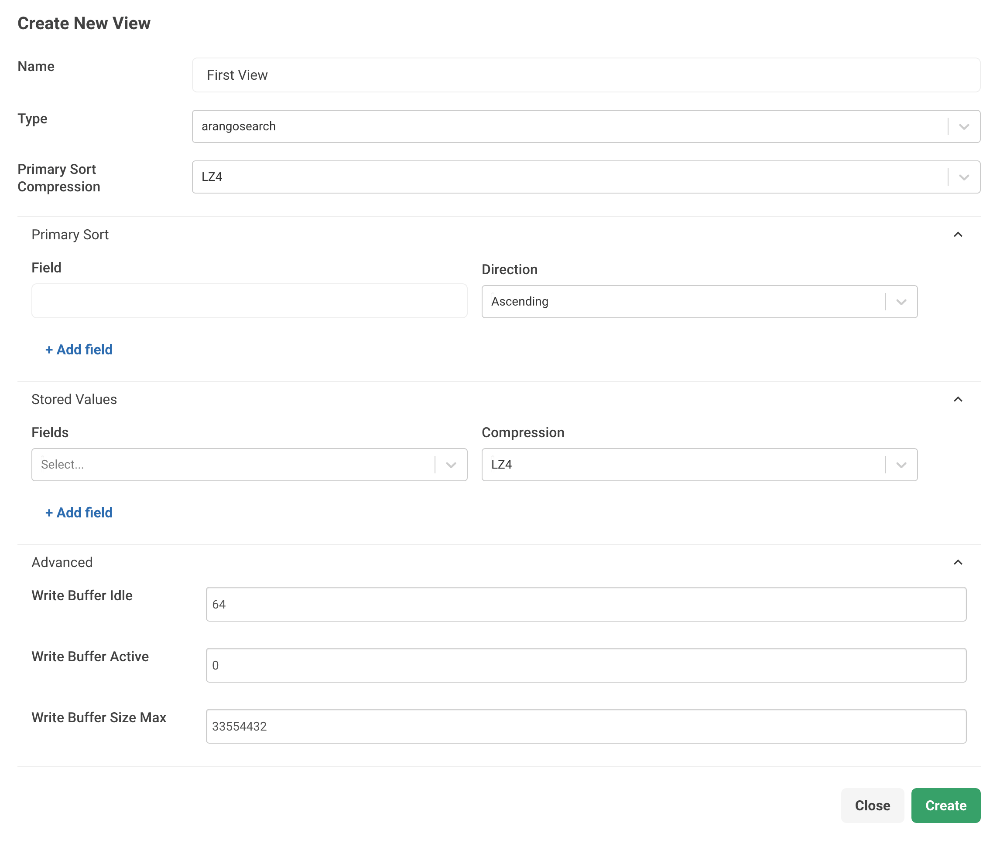

`arangosearch` Views Reference
==============================

`arangosearch` Views enable sophisticated information retrieval queries such as
full-text search for unstructured or semi-structured data over documents from
different collections, filtering on multiple document attributes and sorting
the documents that satisfy the search criteria by relevance.

Views guarantee the best execution plan (merge join) when querying multiple
attributes, unlike collections with user-defined indexes.

Views can be managed as follows:
- in the web interface, in the **VIEWS** section
- via the [Views HTTP API](http/views.html)
- through the [JavaScript API](data-modeling-views-database-methods.html)

Once you set up a View, you can query it via AQL with the
[`SEARCH` operation](aql/operations-search.html).

See [Information Retrieval with ArangoSearch](arangosearch.html) for an
introduction to Views and how to search them.

## Create `arangosearch` Views using the web interface

You can create and manage an `arangosearch` View through the Web Interface.
To get started, follow the steps outlined below.

1. In the web interface, go to the left sidebar menu and select
   the **VIEWS** entry.
2. To add a new View, click **Add View**.
3. Fill in the required fields:
   - For **Name**, enter a name for the View.
   - For **Type**, select `arangosearch` from the dropdown menu.
4. To set the **Primary Sort Compression**, select `LZ4` to use a fast compression
     or `none` to disable compression and trade space for speed.
5. To set a **Primary Sort** order, define the following options:
   - For **Field**, enter an array of attribute values. 
   - For **Direction**, select **Ascending** or **Descending** to sort the attributes by.      
6. To set **Stored Values**, define the following options:
   - For **Fields**, enter an array of objects to define which document attributes
     to store in the View index.
   - The **Compression** attribute defines the compression type used for the internal
     column-store. Select `LZ4` for fast compression or `none` for no compression.  
7. In the **Advanced** section, you can define the **Write Buffer** properties of a
   View. ArangoSearch uses multiple writer objects that are mapped to processed
   segments for carrying out operations on its index. You can control the memory
   consumed by these writers by utilizing the following properties:
   - For **Write Buffer Idle**, enter a value for the maximum number of writers
     (segments) cached in the pool. To disable, use `0`.
   - For **Write Buffer Active**, enter a value for the maximum number of
     concurrent active writers (segments) that perform a transaction. To disable,
     use `0`.
   - For **Write Buffer Size Max**, enter a value for the maximum memory byte size
     per writer (segment) before a writer (segment) flush is triggered. Use `0` to
     turn off this limit for any writer.
8. Click **Create**.



## Create `arangosearch` Views using the JavaScript API

The following example shows how you can create an `arangosearch` View in _arangosh_:

    
    @startDocuBlockInline viewArangoSearchCreate
    @EXAMPLE_ARANGOSH_OUTPUT{viewArangoSearchCreate}
      var coll = db._create("books");
      db._createView("products", "arangosearch", { links: { books: { fields: { title: { analyzers: ["text_en"] } } } } });
    ~ db._dropView("products");
    ~ db._drop(coll.name());
    @END_EXAMPLE_ARANGOSH_OUTPUT
    @endDocuBlock viewArangoSearchCreate
    
    

View Definition/Modification
----------------------------

An `arangosearch` View is configured via an object containing a set of
View-specific configuration directives and a map of link-specific configuration
directives.

During View creation the following directives apply:

- **name** (string, _immutable_): the View name
- **type** (string, _immutable_): the value `"arangosearch"`
- any of the directives from the section [View Properties](#view-properties)

You may want to create the View without links and add them later. The View
creation with links is not an atomic operation. If errors related to the links
occur, for example, because of incorrect collection or Analyzers names,
inaccessible collections, or similar, then the View is still created without
these links.

During view modification the following directives apply:

- **links** (object, _optional_):
  a mapping of `collection-name` / `collection-identifier` to one of:
  - link creation - link definition as per the section [Link properties](#link-properties)
  - link removal - JSON keyword `null` (i.e. nullify a link if present)
- any of the directives from the section [View Properties](#view-properties)

### Link Properties

- **analyzers** (_optional_; type: `array`; subtype: `string`; default: `[
  "identity" ]`)

  A list of Analyzers, by name as defined via the [Analyzers](analyzers.html),
  that should be applied to values of processed document attributes.

- **fields** (_optional_; type: `object`; default: `{}`)

  An object `{ attribute-name: [Link properties], … }` of fields that should be
  processed at each level of the document. Each key specifies the document
  attribute to be processed. Note that the value of `includeAllFields` is also
  consulted when selecting fields to be processed.
  
  The `fields` property is a recursive data structure. This means that `fields`
  can be part of the Link properties again. This lets you index nested attributes.
  For example, you might have documents like the following in a collection named
  `coll`:

  ```json
  { "attr": { "nested": "foo" } }
  ```

  If you want to index the `nested` attribute with the `text_en` Analyzer without
  using `includeAllFields`, you can do so with the following View definition:

  ```json
  {
    "links": {
      "coll": {
        "fields": {
          "attr": {
            "fields": {
              "nested": {
                "analyzers": ["text_en"]
              }
            }
          }
        }
      }
    }
  }
  ```

  Each value specifies the [Link properties](#link-properties) directives to be
  used when processing the specified field. A Link properties value of `{}`
  denotes inheritance of all (except `fields`) directives from the current level.

- **includeAllFields** (_optional_; type: `boolean`; default: `false`)

  If set to `true`, then process all document attributes. Otherwise, only
  consider attributes mentioned in `fields`. Attributes not explicitly
  specified in `fields` are processed with default link properties, i.e.
  `{}`.

  
  Using `includeAllFields` for a lot of attributes in combination with complex
  Analyzers may significantly slow down the indexing process.
  

- **nested** (_optional_; type: `object`; default: `{}`)

  An object `{ attribute-name: [Link properties], … }` to index the specified
  sub-objects that are stored in an array. Other than with the `fields`
  property, the values get indexed in a way that lets you query for co-occurring
  values. For example, you can search the sub-objects and all the conditions
  need to be met by a single sub-object instead of across all of them.

  This property is available in the Enterprise Edition only.

  
  You cannot use the `nested` property at the top-level of the link properties.
  It needs to have a parent field, e.g.
  `"fields": { "<fieldName>": { "nested": { ... } } }`.
  However, You can nest `nested` properties to index objects in arrays in
  objects in arrays etc.
  

  See [Nested search with ArangoSearch](arangosearch-nested-search.html)
  for details.

- **trackListPositions** (_optional_; type: `boolean`; default: `false`)

  If set to `true`, then for array values track the value position in arrays.
  E.g., when querying for the input `{ attr: [ "valueX", "valueY", "valueZ" ] }`,
  the user must specify: `doc.attr[1] == "valueY"`. Otherwise, all values in
  an array are treated as equal alternatives. E.g., when querying for the input
  `{ attr: [ "valueX", "valueY", "valueZ" ] }`, the user must specify:
  `doc.attr == "valueY"`.

- **storeValues** (_optional_; type: `string`; default: `"none"`)

  This property controls how the view should keep track of the attribute values.
  Valid values are:

  - **none**: Do not store value meta data in the View.
  - **id**: Store information about value presence so that you can use the
    `EXISTS()` function.

  The `storeValues` option is not to be confused with the `storedValues` option,
  which stores attribute values in the View index.

- **inBackground** (_optional_; type: `boolean`; default: `false`)

  If set to `true`, then no exclusive lock is used on the source collection
  during View index creation, so that it remains basically available.
  `inBackground` is an option that can be set when adding links. It does not get
  persisted as it is not a View property, but only a one-off option. Also see:
  [Creating Indexes in Background](indexing-index-basics.html#creating-indexes-in-background)
  
- **cache** (_optional_; type: `boolean`; default: `false`)

  <small>Introduced in: v3.9.5, v3.10.2</small>

  If you enable this option, then field normalization values are always cached
  in memory. This can improve the performance of scoring and ranking queries.
  Otherwise, these values are memory-mapped and it is up to the operating system
  to load them from disk into memory and to evict them from memory.

  Normalization values are computed for fields which are processed with Analyzers
  that have the `"norm"` feature enabled. These values are used to score fairer
  if the same tokens occur repeatedly, to emphasize these documents less.

  You can also enable this option to always cache auxiliary data used for querying
  fields that are indexed with Geo Analyzers in memory.
  This can improve the performance of geo-spatial queries.

  See the [`--arangosearch.columns-cache-limit` startup option](programs-arangod-options.html#--arangosearchcolumns-cache-limit)
  to control the memory consumption of this cache. You can reduce the memory
  usage of the column cache in cluster deployments by only using the cache for
  leader shards, see the
  [`--arangosearch.columns-cache-only-leader` startup option](programs-arangod-options.html#--arangosearchcolumns-cache-only-leader)
  (introduced in v3.10.6).

  

### View Properties

- **primarySort** (_optional_; type: `array`; default: `[]`; _immutable_)

  A primary sort order can be defined to enable an AQL optimization. If a query
  iterates over all documents of a View, wants to sort them by attribute values
  and the (left-most) fields to sort by as well as their sorting direction match
  with the *primarySort* definition, then the `SORT` operation is optimized away.
  Also see [Primary Sort Order](arangosearch-performance.html#primary-sort-order)

- **primarySortCompression** (_optional_; type: `string`; default: `lz4`; _immutable_)

  Defines how to compress the primary sort data.
  
  - `"lz4"` (default): use LZ4 fast compression.
  - `"none"`: disable compression to trade space for speed.
  
- **primarySortCache** (_optional_; type: `boolean`; default: `false`; _immutable_)

  <small>Introduced in: v3.9.6, v3.10.2</small>

  If you enable this option, then the primary sort columns are always cached in
  memory. This can improve the performance of queries that utilize the
  [primary sort order](arangosearch-performance.html#primary-sort-order).
  Otherwise, these values are memory-mapped and it is up to the operating system
  to load them from disk into memory and to evict them from memory.

  See the [`--arangosearch.columns-cache-limit` startup option](programs-arangod-options.html#--arangosearchcolumns-cache-limit)
  to control the memory consumption of this cache. You can reduce the memory
  usage of the column cache in cluster deployments by only using the cache for
  leader shards, see the
  [`--arangosearch.columns-cache-only-leader` startup option](programs-arangod-options.html#--arangosearchcolumns-cache-only-leader)
  (introduced in v3.10.6).

  
  
- **primaryKeyCache** (_optional_; type: `boolean`; default: `false`; _immutable_)

  <small>Introduced in: v3.9.6, v3.10.2</small>

  If you enable this option, then the primary key columns are always cached in
  memory. This can improve the performance of queries that return many documents.
  Otherwise, these values are memory-mapped and it is up to the operating system
  to load them from disk into memory and to evict them from memory.

  See the [`--arangosearch.columns-cache-limit` startup option](programs-arangod-options.html#--arangosearchcolumns-cache-limit)
  to control the memory consumption of this cache. You can reduce the memory
  usage of the column cache in cluster deployments by only using the cache for
  leader shards, see the
  [`--arangosearch.columns-cache-only-leader` startup option](programs-arangod-options.html#--arangosearchcolumns-cache-only-leader)
  (introduced in v3.10.6).

  

- **storedValues** (_optional_; type: `array`; default: `[]`; _immutable_)

  An array of objects to describe which document attributes to store in the
  View index. It can then cover search queries, which means the data can be
  taken from the index directly and accessing the storage engine can be
  avoided.

  Each object is expected in the following form:

  `{ "fields": [ "attr1", "attr2", ... "attrN" ], "compression": "none", "cache": false }`
  
  - The required `fields` attribute is an array of strings with one or more
    document attribute paths. The specified attributes are placed into a single
    column of the index. A column with all fields that are involved in common
    search queries is ideal for performance. The column should not include too
    many unneeded fields, however.
  
  - The optional `compression` attribute defines the compression type used for
    the internal column-store, which can be `"lz4"` (LZ4 fast compression, default)
    or `"none"` (no compression).

  - The optional `cache` attribute allows you to always cache stored values in
    memory (introduced in v3.9.5 and v3.10.2, Enterprise Edition only).
    This can improve the query performance if stored values are involved. See the
    [`--arangosearch.columns-cache-limit` startup option](programs-arangod-options.html#--arangosearchcolumns-cache-limit)
    to control the memory consumption of this cache. You can reduce the memory
    usage of the column cache in cluster deployments by only using the cache for
    leader shards, see the
    [`--arangosearch.columns-cache-only-leader` startup option](programs-arangod-options.html#--arangosearchcolumns-cache-only-leader)
    (introduced in v3.10.6).

  You may use the following shorthand notations on View creation instead of
  an array of objects as described above. The default compression and cache
  settings are used in this case:

  - An array of strings, like `["attr1", "attr2"]`, to place each attribute into
    a separate column of the index (introduced in v3.10.3).

  - An array of arrays of strings, like `[["attr1", "attr2"]]`, to place the
    attributes into a single column of the index, or `[["attr1"], ["attr2"]]`
    to place each attribute into a separate column.

  The `storedValues` option is not to be confused with the `storeValues` option,
  which allows to store meta data about attribute values in the View index.
  
- **optimizeTopK** (_optional_; type: `array`; default: `[]`; _immutable_)

  <small>Introduced in: v3.11.0 </small>
  
  An array of strings defining sort expressions that you want to optimize.
  This is also known as [_WAND optimization_](arangosearch-performance.html#wand-optimization).

  If you query a View with the `SEARCH` operation in combination with a
  `SORT` and `LIMIT` operation, search results can be retrieved faster if the
  `SORT` expression matches one of the optimized expressions.

  Only sorting by highest rank is supported, that is, sorting by the result
  of a [scoring function](aql/functions-arangosearch.html#scoring-functions)
  in descending order (`DESC`). Use `@doc` in the expression where you would
  normally pass the document variable emitted by the `SEARCH` operation to the
  scoring function.

  You can define up tp 64 expressions per View.

  Example: `["BM25(@doc) DESC", "TFIDF(@doc, true) DESC"]`

  

An inverted index is the heart of `arangosearch` Views.
The index consists of several independent segments and the index **segment**
itself is meant to be treated as a standalone index. **Commit** is meant to be
treated as the procedure of accumulating processed data creating new index
segments. **Consolidation** is meant to be treated as the procedure of joining
multiple index segments into a bigger one and removing garbage documents (e.g.
deleted from a collection). **Cleanup** is meant to be treated as the procedure
of removing unused segments after release of internal resources.

- **cleanupIntervalStep** (_optional_; type: `integer`; default: `2`; to
  disable use: `0`)

  ArangoSearch waits at least this many commits between removing unused files in
  its data directory for the case where the consolidation policies merge
  segments often (i.e. a lot of commit+consolidate). A lower value causes a
  lot of disk space to be wasted for the case where the consolidation policies
  rarely merge segments (i.e. few inserts/deletes). A higher value impacts
  performance without any added benefits.

  > With every **commit** or **consolidate** operation a new state of the view
  > internal data-structures is created on disk. Old states/snapshots are
  > released once there are no longer any users remaining. However, the files
  > for the released states/snapshots are left on disk, and only removed by
  > "cleanup" operation.

- **commitIntervalMsec** (_optional_; type: `integer`; default: `1000`;
  to disable use: `0`)

  Wait at least this many milliseconds between committing View data store
  changes and making documents visible to queries.

  For the case where there are a lot of inserts/updates, a lower value, until
  commit, causes the index not to account for them and memory usage continues
  to grow.
  For the case where there are a few inserts/updates, a higher value impacts
  performance and wastes disk space for each commit call without any added
  benefits.

  > For data retrieval `arangosearch` Views follow the concept of
  > "eventually-consistent", i.e. eventually all the data in ArangoDB is
  > matched by corresponding query expressions.
  > The concept of `arangosearch` View "commit" operation is introduced to
  > control the upper-bound on the time until document addition/removals are
  > actually reflected by corresponding query expressions.
  > Once a "commit" operation is complete, all documents added/removed prior to
  > the start of the "commit" operation are reflected by queries invoked in
  > subsequent ArangoDB transactions. In-progress ArangoDB transactions
  > still continue to return a repeatable-read state.

- **consolidationIntervalMsec** (_optional_; type: `integer`; default: `1000`;
  to disable use: `0`)

  Wait at least this many milliseconds between applying `consolidationPolicy` to
  consolidate View data store and possibly release space on the filesystem.

  For the case where there are a lot of data modification operations, a higher
  value could potentially have the data store consume more space and file handles.
  For the case where there are a few data modification operations, a lower value
  impacts performance due to no segment candidates available for
  consolidation.

  > For data modification `arangosearch` Views follow the concept of a
  > "versioned data store". Thus old versions of data may be removed once there
  > are no longer any users of the old data. The frequency of the cleanup and
  > compaction operations are governed by `consolidationIntervalMsec` and the
  > candidates for compaction are selected via `consolidationPolicy`.

ArangoSearch performs operations in its index based on numerous writer
objects that are mapped to processed segments. In order to control memory that
is used by these writers (in terms of "writers pool") one can use
`writebuffer*` properties of a view.

- **writebufferIdle** (_optional_; type: `integer`; default: `64`;
  to disable use: `0`; _immutable_)

  Maximum number of writers (segments) cached in the pool.

- **writebufferActive** (_optional_; type: `integer`; default: `0`;
  to disable use: `0`; _immutable_)

  Maximum number of concurrent active writers (segments) that perform a transaction.
  Other writers (segments) wait till current active writers (segments) finish.

- **writebufferSizeMax** (_optional_; type: `integer`; default: `33554432`;
  to disable use: `0`; _immutable_)

  Maximum memory byte size per writer (segment) before a writer (segment) flush is
  triggered. `0` value turns off this limit for any writer (buffer) and data will
  be flushed periodically. `0` value should be used carefully due to high
  potential memory consumption.

- **consolidationPolicy** (_optional_; type: `object`; default: `{}`)

  The consolidation policy to apply for selecting data store segment merge
  candidates.

  > With each ArangoDB transaction that inserts documents, one or more
  > ArangoSearch internal segments gets created. Similarly, for removed
  > documents the segments containing such documents have these documents
  > marked as "deleted". Over time, this approach causes a lot of small and
  > sparse segments to be created. A **consolidation** operation selects one or
  > more segments and copies all of their valid documents into a single new
  > segment, thereby allowing the search algorithm to perform more optimally and
  > for extra file handles to be released once old segments are no longer used.

  - **type** (_optional_; type: `string`; default: `"tier"`)

    The segment candidates for the "consolidation" operation are selected based
    upon several possible configurable formulas as defined by their types.
    The currently supported types are:

    - `"bytes_accum"`: Consolidation is performed based on current memory
      consumption of segments and `threshold` property value.
    - `"tier"`: Consolidate based on segment byte size and live document count
      as dictated by the customization attributes.

    
    The "bytes_accum" policy type is deprecated and remains in ArangoSearch for backwards
    compatibility with the older versions. Please make sure to always use the `tier` policy
    instead.
    

  `consolidationPolicy` properties for `"bytes_accum"` type:

  - **threshold** (_optional_; type: `float`; default: `0.1`)

    Defines threshold value of `[0.0, 1.0]` possible range. Consolidation is
    performed on segments which accumulated size in bytes is less than all
    segments' byte size multiplied by the `threshold`; i.e. the following formula
    is applied for each segment:
    `{threshold} > (segment_bytes + sum_of_merge_candidate_segment_bytes) / all_segment_bytes`.

  `consolidationPolicy` properties for `"tier"` type:

  - **segmentsMin** (_optional_; type: `integer`; default: `1`)

    The minimum number of segments that are evaluated as candidates for consolidation.

  - **segmentsMax** (_optional_; type: `integer`; default: `10`)

    The maximum number of segments that are evaluated as candidates for consolidation.

  - **segmentsBytesMax** (_optional_; type: `integer`; default: `5368709120`)

    Maximum allowed size of all consolidated segments in bytes.

  - **segmentsBytesFloor** (_optional_; type: `integer`; default: `2097152`)

    Defines the value (in bytes) to treat all smaller segments as equal for consolidation
    selection.

  - **minScore** (_optional_; type: `integer`; default: `0`)

    Filter out consolidation candidates with a score less than this.
