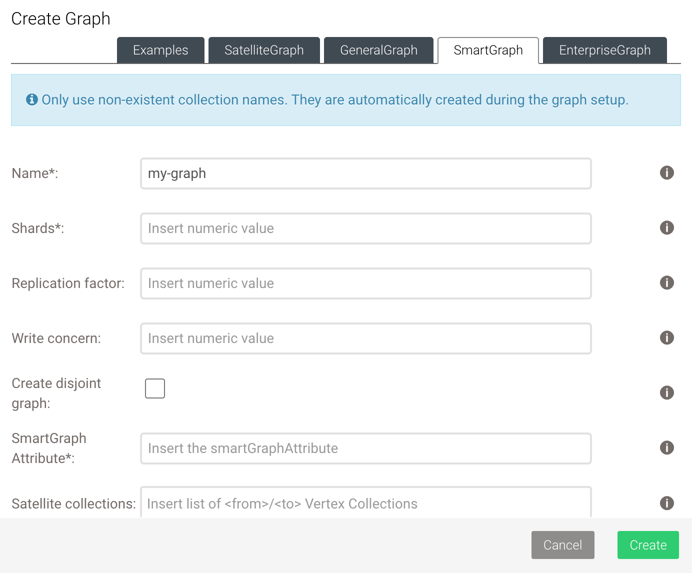

# Getting started with SmartGraphs

SmartGraphs **cannot use existing collections**. When switching to SmartGraph
from an existing dataset you have to import the data into a fresh SmartGraph.

All collections that are being used in SmartGraphs need to be part of the same
`distributeShardslike` group. The `smartGraphAttribute` and the number of
shards are immutable.
The `smartGraphAttribute` attribute is used to inform the database how to shard
data and, as a consequence, all vertices must have this attribute. The `_from`
and `_to` attributes that point _from_ one document _to_ another document
stored in vertex collections are set by default, following the same smart
sharding pattern.

## Create a SmartGraph using the web interface

The web interface (also called Web UI) allows you to easily create and manage
SmartGraphs. To get started, follow the steps outlined below.

1. In the web interface, navigate to the **GRAPHS** section.
2. To add a new graph, click **Add Graph**.
3. In the **Create Graph** dialog that appears, select the
   **SmartGraph** tab.
4. Fill in all the following fields:
   - For **Name**, enter a name for the SmartGraph.
   - For **Shards**, enter the number of parts to split the graph into.
   - Optional: For **Replication factor**, enter the total number of
     desired copies of the data in the cluster.
   - Optional: For **Write concern**, enter the total number of copies
     of the data in the cluster required for each write operation.
   - For **SmartGraph Attribute**, insert the attribute that is used to
     smartly shard the vertices of the graph. Every vertex in your graph
     needs to have this attribute. Note that it cannot be modified later.
   - Optional: For **SatelliteCollections**, insert vertex collections
     that are used in your edge definitions. These collections are
     then created as satellites, and thus replicated to all DB-Servers.
5. Define the relations on the graph:       
   - For **Edge definition**, insert a single non-existent name to define
     the relation of the graph. This automatically creates a new edge
     collection, which is displayed in the **COLLECTIONS** section of the
     left sidebar menu.
     
     To define multiple relations, press the **Add relation** button.
     To remove a relation, press the **Remove relation** button.
     
   - For **fromCollections**, insert a list of vertex collections
     that contain the start vertices of the relation.
   - For **toCollections**, insert a list of vertex collections that
     contain the end vertices of the relation.
   
   Insert only non-existent collection names. Collections are automatically
   created during the graph setup and are displayed in the
   **Collections** tab of the left sidebar menu.
   
   - For **Orphan collections**, insert a list of vertex collections
     that are part of the graph but not used in any edge definition.
6. Click **Create**. 
7. Click the card of the newly created graph and use the functions of the Graph
   Viewer to visually interact with the graph and manage the graph data.

   

## Create a SmartGraph using _arangosh_

In contrast to General Graphs we have to add more options when creating the
SmartGraph. The two options `smartGraphAttribute` and `numberOfShards` are
required and cannot be modified later. 


    @startDocuBlockInline smartGraphCreateGraphHowTo1_cluster
    @EXAMPLE_ARANGOSH_OUTPUT{smartGraphCreateGraphHowTo1_cluster}
      var graph_module = require("@arangodb/smart-graph");
      var graph = graph_module._create("myGraph", [], [], {smartGraphAttribute: "region", numberOfShards: 9});
      graph;
     ~graph_module._drop("myGraph");
    @END_EXAMPLE_ARANGOSH_OUTPUT
    @endDocuBlock smartGraphCreateGraphHowTo1_cluster



## Create a Disjoint SmartGraph using _arangosh_

In contrast to regular SmartGraphs we have to add one option when creating the
graph. The boolean option `isDisjoint` is required, needs to be set to `true`
and cannot be modified later. 


    @startDocuBlockInline smartGraphCreateGraphHowToDisjoint1_cluster
    @EXAMPLE_ARANGOSH_OUTPUT{smartGraphCreateGraphHowToDisjoint1_cluster}
      var graph_module = require("@arangodb/smart-graph");
      var graph = graph_module._create("myGraph", [], [], {smartGraphAttribute: "region", numberOfShards: 9, isDisjoint: true});
      graph;
     ~graph_module._drop("myGraph");
    @END_EXAMPLE_ARANGOSH_OUTPUT
    @endDocuBlock smartGraphCreateGraphHowToDisjoint1_cluster



## Add vertex collections

This is analogous to General Graphs. Unlike with General Graphs, the
**collections must not exist** when creating the SmartGraph. The SmartGraph
module will create them for you automatically to set up the sharding for all
these collections correctly. If you create collections via the SmartGraph
module and remove them from the graph definition, then you may re-add them
without trouble however, as they will have the correct sharding.


    @startDocuBlockInline smartGraphCreateGraphHowTo2_cluster
    @EXAMPLE_ARANGOSH_OUTPUT{smartGraphCreateGraphHowTo2_cluster}
     ~var graph_module = require("@arangodb/smart-graph");
     ~var graph = graph_module._create("myGraph", [], [], {smartGraphAttribute: "region", numberOfShards: 9});
      graph._addVertexCollection("shop");
      graph._addVertexCollection("customer");
      graph._addVertexCollection("pet");
      graph = graph_module._graph("myGraph");
     ~graph_module._drop("myGraph", true);
    @END_EXAMPLE_ARANGOSH_OUTPUT
    @endDocuBlock smartGraphCreateGraphHowTo2_cluster



## Define relations on the Graph

Adding edge collections works the same as with General Graphs, but again, the
collections are created by the SmartGraph module to set up sharding correctly
so they must not exist when creating the SmartGraph (unless they have the
correct sharding already).


    @startDocuBlockInline smartGraphCreateGraphHowTo3_cluster
    @EXAMPLE_ARANGOSH_OUTPUT{smartGraphCreateGraphHowTo3_cluster}
     ~var graph_module = require("@arangodb/smart-graph");
     ~var graph = graph_module._create("myGraph", [], [], {smartGraphAttribute: "region", numberOfShards: 9});
     ~graph._addVertexCollection("shop");
     ~graph._addVertexCollection("customer");
     ~graph._addVertexCollection("pet");
      var rel = graph_module._relation("isCustomer", ["shop"], ["customer"]);
      graph._extendEdgeDefinitions(rel);
      graph = graph_module._graph("myGraph");
     ~graph_module._drop("myGraph", true);
    @END_EXAMPLE_ARANGOSH_OUTPUT
    @endDocuBlock smartGraphCreateGraphHowTo3_cluster



## Using SatelliteCollections in SmartGraphs

When creating a collection, you can decide whether it's a SatelliteCollection
or not. For example, a vertex collection can be satellite as well. 
SatelliteCollections don't require sharding as the data will be distributed
globally on all DB-Servers. The `smartGraphAttribute` is also not required.

### Create a SmartGraph using SatelliteCollections

In addition to the attributes you would set to create a SmartGraph, there is an
additional attribute `satellites` you can optionally set. It needs to be an array of
one or more collection names. These names can be used in edge definitions
(relations) and these collections will be created as SatelliteCollections.
However, all vertex collections on one side of the relation have to be of
the same type - either all satellite or all smart. This is because `_from`
and `_to` can have different types based on the sharding pattern.

In this example, both vertex collections are created as SatelliteCollections.


When providing a satellite collection that is not used in a relation,
it will not be created. If you create the collection in a following
request, only then the option will count.



    @startDocuBlockInline hybridSmartGraphCreateGraphHowTo1_cluster
    @EXAMPLE_ARANGOSH_OUTPUT{hybridSmartGraphCreateGraphHowTo1_cluster}
      var graph_module = require("@arangodb/smart-graph");
      var rel = graph_module._relation("isCustomer", "shop", "customer")
      var graph = graph_module._create("myGraph", [rel], [], {satellites: ["shop", "customer"], smartGraphAttribute: "region", numberOfShards: 9});
      graph;
     ~graph_module._drop("myGraph", true);
    @END_EXAMPLE_ARANGOSH_OUTPUT
    @endDocuBlock hybridSmartGraphCreateGraphHowTo1_cluster



### Create a Disjoint SmartGraph using SatelliteCollections

The option `isDisjoint` needs to be set to `true` in addition to the other
options for a SmartGraph using SatelliteCollections. Only the `shop` vertex collection is created
as a SatelliteCollection in this example:


    @startDocuBlockInline hybridSmartGraphCreateGraphHowTo2_cluster
    @EXAMPLE_ARANGOSH_OUTPUT{hybridSmartGraphCreateGraphHowTo2_cluster}
      var graph_module = require("@arangodb/smart-graph");
      var rel = graph_module._relation("isCustomer", "shop", "customer")
      var graph = graph_module._create("myGraph", [rel], [], {satellites: ["shop"], smartGraphAttribute: "region", isDisjoint: true, numberOfShards: 9});
      graph;
     ~graph_module._drop("myGraph", true);
    @END_EXAMPLE_ARANGOSH_OUTPUT
    @endDocuBlock hybridSmartGraphCreateGraphHowTo2_cluster


