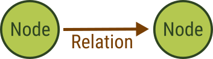

# First steps with graphs

{{ page.description }}
{:class="lead"}

Graphs are information networks comprised of **nodes** and **relations**. Nodes
can represent objects, entities, abstract concepts, or ideas. Relations between
nodes can represent physical and social connections, temporal and causal
relationships, flows of information, energy, and material, interactions and
transactions, dependency and hierarchy, as well as similarity and relatedness of
any kind.

For example, you can represent people by nodes and their friendships by
relations. This lets you form a graph that is a social network in this case.

The specific terms to refer to nodes and relations in a graph vary depending
on the field or context, but they are conceptually the same. In computer science
and mathematics, the terms **vertices** (singular: vertex) and **edges** are
commonly used to refer to nodes and relations, respectively. In information
science and data analysis, they are referred to as _entities_ and _connection_.
In social sciences, they are often called _actors_ and _ties_ or _links_.
They may also be called _points_ and _arcs_.

Using graphs with vertices to represent things and edges to define how they
relate to one another is a very expressive data model. It lets you represent
a wide variety of information in a compact and intuitive way. It lets you model
complex relationships and interactions of basically everything.

Graphs are commonly directed (_digraphs_), which means that each edge goes from
one vertex to another vertex in a specific direction. This lets you model
directional relationships, such as cause and effect or the flow of material,
energy, or information. In undirected graphs, edges don't have a direction and
the relationship between two vertices is considered to be the same in both
directions. For example, a friendship is a symmetrical relationships. If _Mary_
is a friend of _John_, then _John_ is equally a friend of _Mary_. On the other
hand, _Mary_ may subscribe to what _John_ posts online, but this does not
automatically make _John_ a subscriber of _Mary_'s posts. It is an asymmetrical
relationship in graph terms. These two types of graphs have different properties
and different algorithms exist to analyze the data.


New to graphs? [**Take our free graph course for freshers**](https://www.arangodb.com/arangodb-graph-course/){:target="_blank"}
and get from zero knowledge to advanced query techniques.


## Graph model

Graph database systems like ArangoDB can store graphs and provide means to query
the connected data.

ArangoDB's graph model is that of a **property graph**. Every record, whether
vertex or edge, can have an arbitrary number of properties. Each document is a
fully-fledged JSON object and has a unique identifier.
This is different to the RDF graph model, where information is broken down into
triples of a subject, a predicate, and an object and where each triple is stored
separately, without an identifier for each statement.

Furthermore, ArangoDB's graph model can be classified as a **labeled** property
graph because you can group related edges using edge collections, with the
collection name being the label, but you can also use a property to assign one
or more types to an edge. You can also organize vertices in different
collections based on the types of entities.

Edges can only be stored in **edge collections**. Vertices are stored in
**document collections** which are also referred to as **vertex collections**
in the context of graphs. You can technically also use edges as vertices but
the usefulness is limited.

Edges in ArangoDB are always directed. Every edge document has special `_from`
and `_to` attributes to reference one other document in each of the two
attributes.

Vertices are referenced by their document identifiers. For example,
a friendship edge that connects _Mary_ with _John_ could look like
`{"_from": "Person/Mary", "_to": "Person/John", "_id": "isFriendOf/1234"}`.
Using this directed graph model means that relations you create with edges are
not reciprocal but you may create edges for the reverse direction (another edge
from _John_ to _Mary_), or you can utilize ArangoDB's ability to follow edges
in the opposite direction (**inbound** instead of **outbound**) or ignore the
direction and follow them in both directions (**any**) as if it were an
undirected graph.

You can query graphs with ArangoDB's query language, see
[Graphs in AQL](aql/graphs.html).

## Comparison to relational database systems

In relational database management systems (RDBMS), you have the construct of
a relation table to store *m:n* relations between two data tables.
An edge collection is somewhat similar to these relation tables.
Vertex collections resemble the data tables with the objects to connect.

While simple graph queries with a fixed number of hops via the relation table
may be doable in RDBMSes with SQL using several nested joins, graph databases
can handle an arbitrary and variable number of these hops over edge collections
which is called **traversal**.

Moreover, edges in one edge collection may point to vertices in different
vertex collections. It is common to have attributes attached to edges, like a
*label* naming the type of connection.

Edges have a direction, with their relations stored in the special `_from` and
`_to` attributes pointing *from* one document *to* another document.
In queries, you can define in which directions the edge relations may be followed
(`OUTBOUND`: `_from` → `_to`, `INBOUND`: `_from` ← `_to`, `ANY`: `_from` ↔ `_to`).

## Supported graph algorithms

- [Traversal](aql/graphs-traversals.html)
  - following edges in outbound, inbound, or any direction
  - variable traversal depth between a defined minimum and maximum 
  - breadth-first, depth-first, and weighted traversals
  - optionally with prune conditions
- [Shortest Path](aql/graphs-shortest-path.html)
- [All Shortest Paths](aql/graphs-all-shortest-paths.html)
- [k Shortest Paths](aql/graphs-kshortest-paths.html)
- [k Paths](aql/graphs-k-paths.html)
- [Distributed Iterative Graph Processing (Pregel)](graphs-pregel.html)
  - Page Rank
  - Seeded Page Rank
  - Single-Source Shortest Path (SSSP)
  - Connected Components
  - Weakly Connected Components (WCC)
  - Strongly Connected Components (SCC)
  - Hyperlink-Induced Topic Search (HITS)
  - Effective Closeness Vertex Centrality
  - LineRank Vertex Centrality
  - Label Propagation Community Detection
  - Speaker-Listener Label Propagation (SLPA) Community Detection

## Managed and unmanaged graphs

You can use vertex and edge collections directly, using them as an unmanaged
**anonymous graph**. In queries, you need to specify the involved collections
for graph operations like traversals.

You can also create a managed **named graph** to define a set of vertex and
edge collections along with the allowed relations. In queries, you only need to
specify the graph instead of the individual vertex and edge collections. There
are additional integrity checks when using the named graph interfaces.

Named graphs ensure graph integrity, both when inserting or removing edges or
vertices. You won't encounter dangling edges, even if you use the same vertex
collection in several named graphs. This involves more operations inside the
database system, which come at a cost. Therefore, anonymous graphs may be faster
in many operations. You can choose between no integrity guarantees, additional
effort to implement consistency checks in your application code, and server-side
integrity checks at a performance cost.

### Named Graphs

Named graphs are completely managed by ArangoDB, ensuring data consistency if the
named graph interfaces and not the raw document manipulation interfaces are used.

The following types of named graphs exist:
- [General Graphs](graphs-general-graphs.html)
- [SmartGraphs](graphs-smart-graphs.html)
- [EnterpriseGraphs](graphs-enterprise-graphs.html)
- [SatelliteGraphs](graphs-satellite-graphs.html)

Which collections are used within a named graph is defined via 
**edge definitions**. They describe which edge collections connect which
vertex collections. This is defined separately for the *from* and the *to*
per edge collection. A named graph can have one or more edge definitions.

The underlying collections of named graphs are still accessible using the
standard collection and document APIs. However, the graph modules add an
additional layer on top of these collections to provide integrity guarantees by
doing the following:

- Execute all modifications transactionally
- Check that vertices references by edges in the `_from` and `_to` attributes
  actually exist
- Only allow to reference vertices from collections as specified by the
  definition of the graph
- Delete edges when a connected vertex is deleted to avoid dangling edges
- Prohibit to use an edge collections in an edge definition with a different
  set of *from* and *to* vertex collections than an existing edge definition
  of any graph
- Depending on the named graph type, there can be additional restrictions to
  ensure a well-formed graph

Your edge collections will only contain valid edges and you will never have
loose ends. These guarantees are lost if you access the collections in any other
way than the graph modules. For example, if you delete documents from your
vertex collections directly, the edges pointing to them remain in place.
Note that existing inconsistencies in your data are not corrected when you create
a named graph. Therefore, make sure you start with sound data as otherwise there
could be dangling edges after all. The graph modules guarantee to not introduce
new inconsistencies only.

You can create and manage named graphs in the following ways:
- With the [web interface](programs-web-interface-graphs.html)
  in the **GRAPHS** section
- In _arangosh_ using the respective graph-related modules of the
  JavaScript API (see the above links of the named graph types)
- Using the [Gharial HTTP API](http/gharial.html)

### Anonymous graphs

An anonymous graph is the graph that your data implicitly defines by edges that
reference vertices and that you directly use by defining the vertex and edge
collections for graph operations such as traversals and path finding algorithms
in queries. You can also work with [edges](graphs-edges.html) directly.

Anonymous graphs don't have edge definitions describing which vertex collection
is connected by which edge collection. The graph model has to be maintained by
the client-side code. This gives you more freedom than the strict named graphs
such as the ability to let an edge reference documents from any collections in
the current database.


## Graph use cases

many problem domains and solve them with semantic queries and graph analytics.
use cases with rough data model

information extraction (high-level)


## Model data with graphs

Graphs can have different structures, called **topologies**. The topology
describes how the vertices and edges are arranged by classifying the pattern of
connections. Some relevant classes are:

- Cyclic: a graph that contains at least one path that starts and ends at the
  same node. An edge can also originate from and point to the same vertex.
- Acyclic: a graph that contains no cycles
- Tree: a directed acyclic graph (DAG) without cycles and exactly one path
  between any two vertices in the graph
- Dense: a graph with edges between most pairs of vertices
- Sparse: a graph where only few pairs of vertices are connected by edges

The topology for your graphs will vary depending on your data and requirements
but you always have a degree of freedom when modeling the data.

### What information should be stored in edges and what in vertices

The main objects in your data model, such as users, groups, or articles, are
usually considered to be vertices. For each type of object, a document collection
should store the individual entities. Entities can be connected by edges to
express and classify relations between vertices. It often makes sense to have
an edge collection per relation type.

ArangoDB does not require you to store your data in graph structures with edges
and vertices. You can also decide to embed attributes such as which groups a
user is part of or store `_id`s of documents in another document instead of
connecting the documents with edges. It can be a meaningful performance
optimization for *1:n* relationships if your data is not focused on relations
and you don't need graph traversal with varying depth. It usually means
to introduce some redundancy and possibly inconsistencies if you embed data, but
it can be an acceptable tradeoff.

**Vertices**:
Assume you have two vertex collections, `Users` and `Groups`. Documents in the
`Groups` collection contain the attributes of the group, i.e. when it was founded,
its subject, and so on. Documents in the `Users` collection contain the data
specific to a user, like name, birthday, hobbies, et cetera.

**Edges**:
You can use an edge collection to store relations between users and groups.
Since multiple users may be in an arbitrary number of groups, this is an **m:n**
relation. The edge collection can be called `UsersInGroups` to store edges like
with `_from` pointing to `Users/John` and `_to` pointing to
`Groups/BowlingGroupHappyPin`. This makes the user **John** a member of the group
**Bowling Group Happy Pin**. You can store additional properties in document
attributes to qualify the relation further, like the permissions of **John** in
this group, the date when John joined the group, and so on.

As a rule of thumb, if you use documents and their attributes in a sentence,
nouns would typically be vertices, and the verbs the edges.
You can see this in the [Knows Graph](graphs-traversals-example-data.html#knows-graph):

    Alice knows Bob, who in term knows Charlie.

The advantages of using graphs is that you are not limited to a fixed number of
**m:n** relations for a document, but you can have an arbitrary number of
relations. Edges can be traversed in both directions, so it is easy to determine
all groups a user is in, but also to find out which members a certain group has.
You can also interconnect users to create a social network.

Using the graph data model, dealing with data that has lots of relations stays
manageable and can be queried in very flexible ways, whereas it would hard to
handle it in a relational database system.

### Multiple edge collections vs. `FILTER`s on edge document attributes

If you want to only traverse edges of a specific type, there are two ways to
achieve this.

The first is to use an attribute in the edge document, e.g. `type`, where you
specify a differentiator for the edge, like `"friends"`, `"family"`, `"married"`,
or `"workmates"`, so that you can later use `FILTER e.type = "friends"` in
queries if you only want to follow the friend edges.

Another way, which may be more efficient in some cases, is to use different
edge collections for different types of edges. You could have `friend_edges`,
`family_edges`, `married_edges`, and `workmate_edges` as edge collections.
You can then limit the query to a subset of the edge and vertex collections.
To only follow friend edges, you would specify `friend_edges` as sole edge collection.

Both approaches have advantages and disadvantages. `FILTER` operations on edge
attributes are more costly at query time because a condition needs to be checked
for every traversed edge, which may become a bottleneck. If the set of edges is
restricted by only using a certain edge collection, then other types of edges
are not traversed in the first place and there is no need to check for a `type`
attribute with `FILTER`. On the other hand, using a `type` attribute allows you
to update edges more easily and you can even assign multiple types to a single
edge.

The multiple edge collections approach is limited by the number of collections
that can be used in one query, see [Known limitations for AQL queries](aql/fundamentals-limitations.html).
Every collection used in a query requires some resources inside of ArangoDB and
the number is therefore limited to cap the resource requirements. You may also
have constraints on other edge attributes, such as a persistent index with a
unique constraint, which requires the documents to be in a single collection for
the uniqueness guarantee, and it may thus not be possible to store the different
types of edges in multiple edge collections.

In conclusion, if your edges have about a dozen different types, you can choose
the approach with multiple edge collections. Otherwise, the `FILTER` approach is
preferred. You can still use `FILTER` operations on edges as needed if you choose
the former approach. It merely removes the need of a `FILTER` on the `type`,
everything else can stay the same.


embedded vs. joins vs. graphs

acl/rbac
dependencies
product hierarchies
...


### Example graphs

For example data that you can use for learning graphs, see
[Example graphs](graphs-traversals-example-data.html).


## Query graphs

Explain traversal, pattern matching, shortest paths, pregel
direction, depth, order, conditions, weights?
combine with geo, search, ...


## Back up and restore graph

For backups of your graph data, you can use [_arangodump_](programs-arangodump.html)
to create the backup, and [_arangorestore_](programs-arangorestore.html) to
restore a backup. However, note the following:

- You need to include the `_graphs` system collection if you want to back up
  named graphs as the graph definitions are stored in this collection.
- You need to back up all vertex and edge collections your graph consists of.
  A partial dump/restore may not work.
