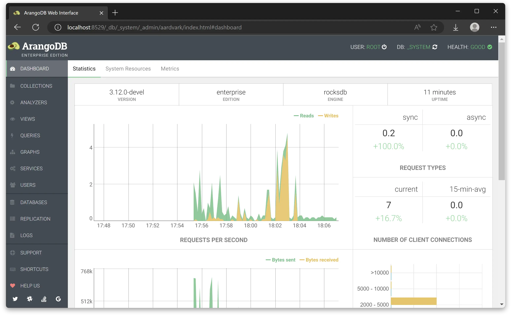

Dashboard
=========

The **DASHBOARD** section provides statistics which are polled regularly from the
ArangoDB server.

There is a different interface for [Cluster](programs-web-interface-cluster.html) deployments.

Statistics:

 - Requests per second
 - Request types
 - Number of client connections
 - Transfer size
 - Transfer size (distribution)
 - Average request time
 - Average request time (distribution)

System Resources:

- Number of threads
- Memory
- Virtual size
- Major page faults
- Used CPU time

Metrics:

- Various server metrics, see [Monitoring](http/monitoring.html#metrics)
