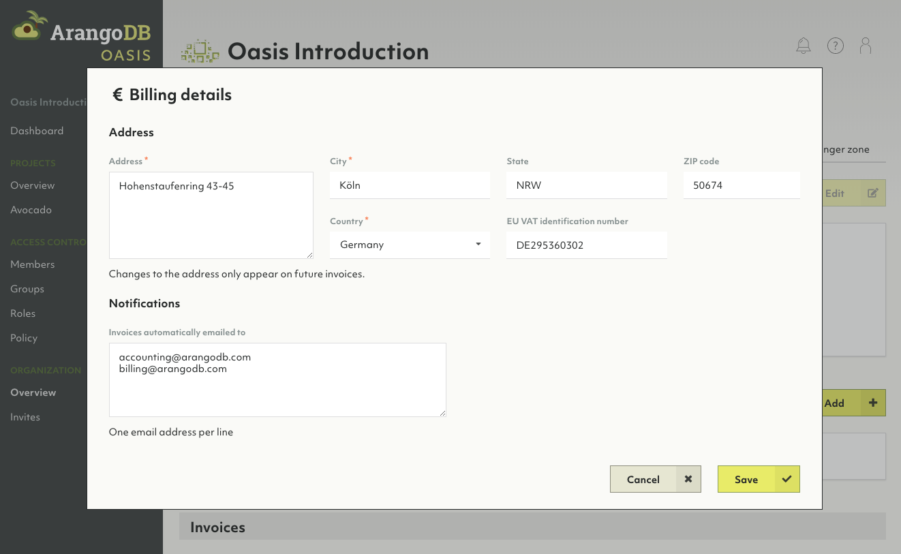
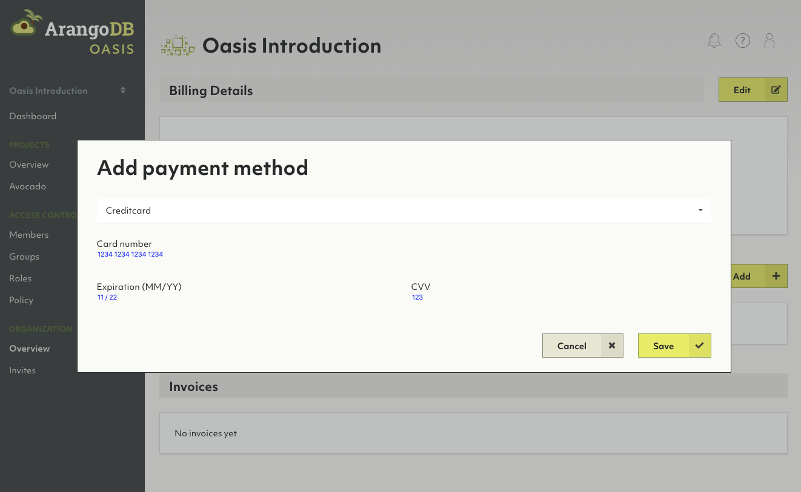
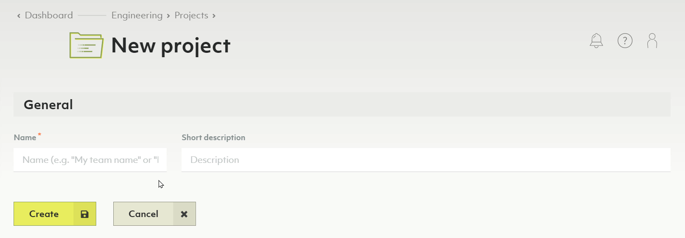
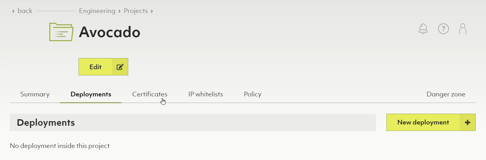
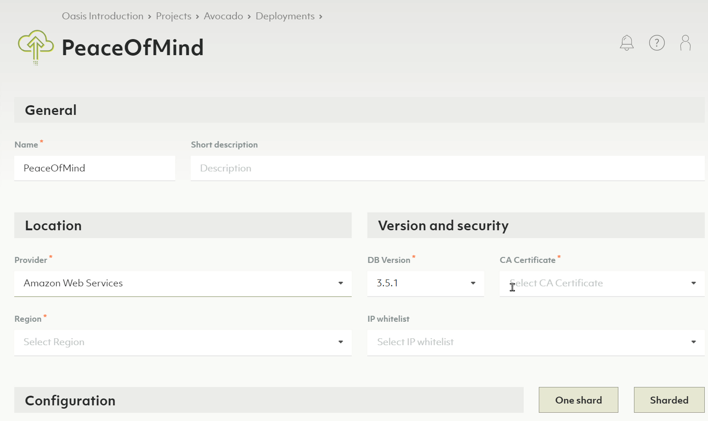
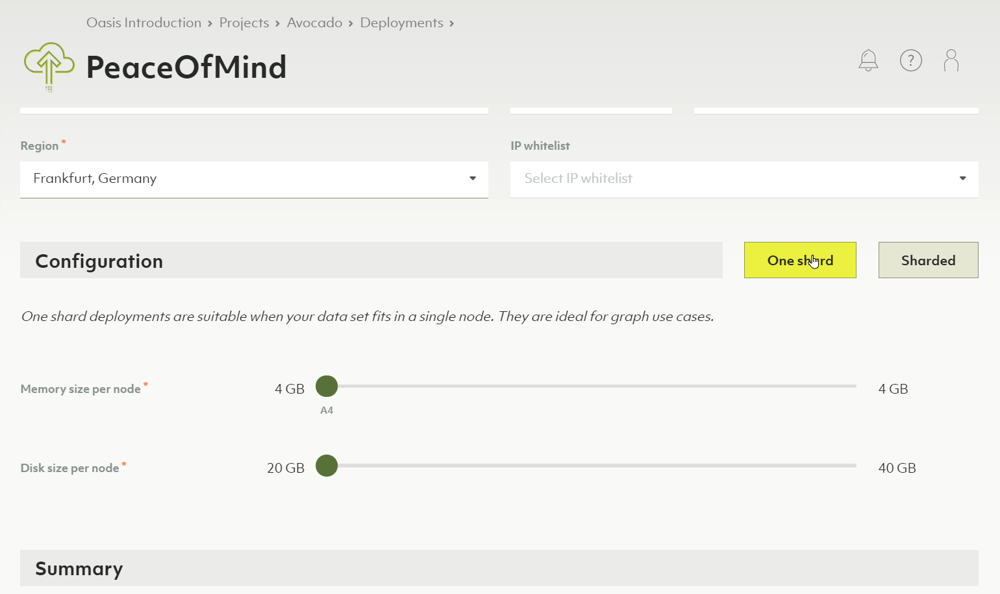
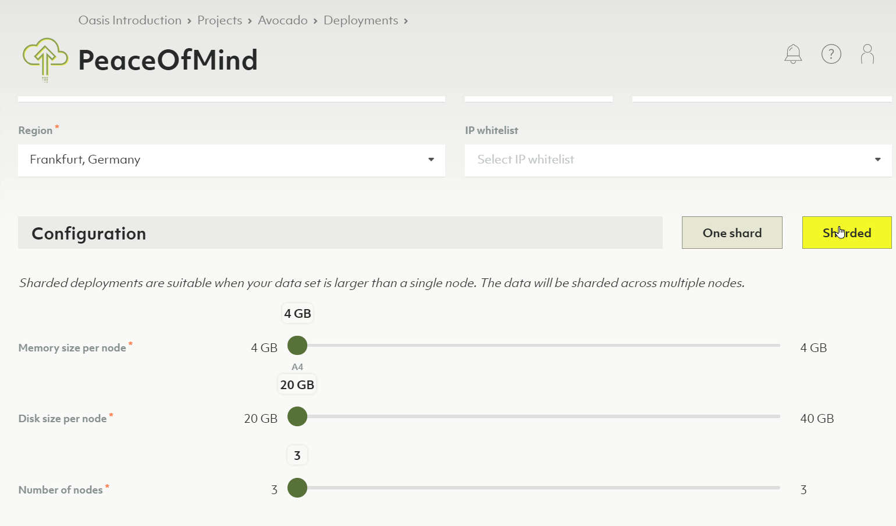
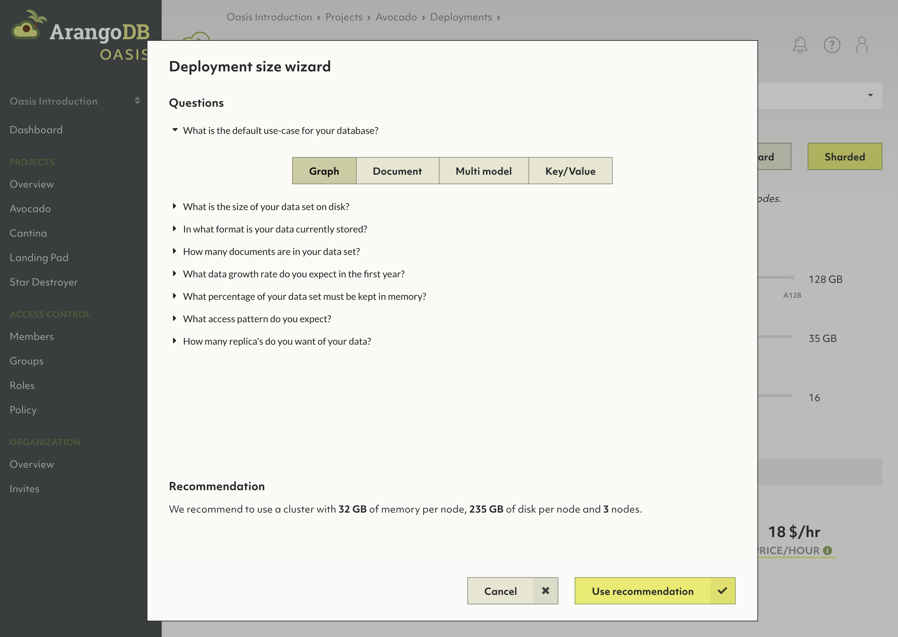
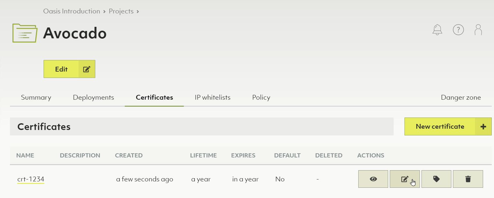

# Getting Started with ArangoDB Oasis

The instructions below are a quick start guide on how to set up your first
ArangoDB deployment in Oasis. It covers everything from creating an account
to using the Oasis web interface to set up a test organization, project and
deployment, as well as accessing and deleting the deployment.

For general information about ArangoDB Oasis, see
[arangodb.com/managed-service/](https://www.arangodb.com/managed-service/){:target="_blank"}.

A video series on how to get started with Oasis is also available:



## Prerequisites

Please have following information at hand for registration:

- An **email address**, required for email verification.
- A **mobile phone number**, required for SMS verification.


One mobile phone number will be associated with one account and cannot be
used for multiple accounts.


## Creating a new account

1. Go to [cloud.arangodb.com](https://cloud.arangodb.com){:target="_blank"}.
2. To reach the sign up, press the _Sign up for free_ button or click the
   _Sign Up_ link in the header navigation of the start page.
3. Once on the sign up page, select the _Sign up_ tab.
4. Select the type of sign up you would like to use (GitHub, Google, or
   email address).
    - For Github or Google please follow on-screen instructions.
    - For the email address option, type your desired email address in the
      email field and type a strong password in the password field.
    - Press the _Sign up_ button

   You will receive a verification email. In that mail, press the
   _Verify my email address_ link or button.
5. In case the ArangoDB Oasis start page opens, press the _Log in_ button or
   click the _Log in_ link in the header navigation.
6. A form appears asking for your mobile phone number. Enter the country code
   and the number of the mobile phone you want to use for this account.
7. A verification code will be sent via SMS to the mobile number you entered.
   Enter the verification code.
8. A form will appear asking for your name. Enter your first and last name, and
   then press the _Save_ button.
9. A form will appear asking for the name of your organization. Enter your
   organization name, and then press the _Create_ button. You can always change
   it later.
10. You're done and you should be redirected to the
   [ArangoDB Oasis dashboard](https://cloud.arangodb.com/dashboard){:target="_blank"}.

## Free-to-try vs. professional service

ArangoDB Oasis comes with a free-to-try plan that lets you test our managed
service for free for 14 days. After the trial period, your deployments will
automatically be deleted. You can convert to the professional service model
at any time by adding your billing details and at least one payment method.

### Adding billing details

1. In the main navigation, in the _Organization_ section, click the _Overview_ link.
2. Navigate to the _Billing_ tab.
3. In the _Billing details_ section, click the _Edit_ button.
4. Enter your billing address and EU VAT identification number, if applicable.
5. Optionally, enter the email address(es) to which invoices should be emailed
   automatically

### Adding a payment method

1. In the _Payment methods_ section, click the _Add_ button.
2. From the dropdown, select a payment type
   (currently, only credit card is supported).
3. Enter your credit card details in the form.
4. Click the _Save_ button.

## General hierarchy

**Organizations → Projects → Deployments**

- ArangoDB Oasis supports multi-tenant setups via organizations.
- You can create your own organization(s) and invite collaborators or join existing ones via invites.
- Your organization contains projects.
- Your projects hold your deployments.

Also see the [Project Guide](./project-guide.html).

## Creating a new project

1. In the main navigation, in the _Projects_ section, click the _Overview_ link.
2. Click the _New project_ button.
3. Enter a name and optional description for your new project.
4. Click the _Create_ button.
5. You will now be taken to the project summary page.

Also see the video
[Projects with ArangoDB Oasis](https://www.youtube.com/watch?v=b7q-PdLEpug&list=PL0tn-TSss6NWH3DNyF96Zbz8LQ0OaFmvS&index=4&t=0s){:target="_blank"}.

## Creating a new deployment

1. If you don't have a project, yet, [create one first](#creating-a-new-project).
2. In the main navigation, in the _Projects_ section, click on the project for which you want to create a new deployment.
3. Navigate to the _Deployments_ tab. You will see an empty list or a list with your project's deployments.
4. Press the _New deployment_ button.

Also see the video
[Create a Deployment on ArangoDB Oasis](https://www.youtube.com/watch?v=yg2FfcNsKFc&list=PL0tn-TSss6NWH3DNyF96Zbz8LQ0OaFmvS&index=9&t=0s){:target="_blank"}.

### In the _General_ section

- Enter the name and optional short description for the deployment.

### In the _Location_ section

1. Select the _Provider_ and _Region_ of the provider.
2. Select the _DB Version_.
   **Note**: If you don't know which DB version to select, leave the version
   selected by default.
3. In the _CA Certificate_ field
    - Either create a new certificate by typing the desired name for it and
      hitting enter or clicking on the name when done.
    - Or, if you already have certificates, select the desired one.
4. _Optional:_ In the _IP whitelist_ field, select the desired one in case you
   want to limit access to your deployment to certain IP ranges. To create a
   whitelist, navigate to your project and select the _IP whitelists_ tab
   (also see the video
   [IP Whitelists with ArangoDB Oasis](https://www.youtube.com/watch?v=Et6nlTHBI50&list=PL0tn-TSss6NWH3DNyF96Zbz8LQ0OaFmvS&index=6&t=0s){:target="_blank"}).

### In the _Configuration_ section

Choose between a **One shard** and **Sharded** deployment.

One shard deployments are suitable when your data set fits in a single node.
They are ideal for graph use cases.

Sharded deployments are suitable when your data set is larger than a single node.
The data will be sharded across multiple nodes.

#### One shard

1. Select the memory size of your node.
2. Select the disk size of your node. The available ranges for the disk size
   depend on the selected memory size.

#### Sharded

- In addition to memory and disk size as in the one shard configuration, select
  the number of nodes for your deployment. The more nodes you have, the higher
  the replication factor.

- If you're unsure about the sharded setup, you can go through our wizard.
  Click on _Help me decide_ to open the recommendation process.

- The wizard will guide you through a set of questions and display a
  recommendation.
- Click _Use recommendation_ to apply it to your sharded configuration.

### In the _Summary_ section

1. Review the configuration, and if you're ok with the setup press the
  _Create_ button.
2. You will be taken to the deployment overview page.
   **Note:** Your deployment is at that point being bootstrapped, this process
   will take a few minutes. Once it is ready, you will receive a confirmation email.

## Installing a new certificate

Each certificate you create in ArangoDB Oasis you will also need to install on your local machine. This operation will slightly vary between operating systems.

1. In the main navigation, in the _Projects_ section, click on the project for which you want to install a new certificate.
2. Navigate to the _Certificates_ tab.

   

3. From the list of certificates, click on the one you want to install.
4. Navigate to the tab of the operating system of your choice.
5. Under _Installation instructions_, copy the commands by pressing the _Copy to clipboard_ button.

   

6. Open a console on your local computer and run the commands that are provided.

Also see the video
[Certificates with ArangoDB Oasis](https://www.youtube.com/watch?v=TBU7TIvewV0&list=PL0tn-TSss6NWH3DNyF96Zbz8LQ0OaFmvS&index=5&t=0s){:target="_blank"}.

## Accessing your deployment

1. In the main navigation, in the _Projects_ section, click on the project for
   which you created a deployment earlier.
2. Navigate to the _Deployments_ tab.
3. For each deployment in your project, you see the status. While your new
   deployment is being set up, it will display the _bootstrapping_ status.
4. Press the _View_ button to show the deployment page.
5. When a deployment displays a status of _OK_, you can access it.
6. Click the copy icon next to the root password. This will copy the deployment
   root password to your clipboard. You can also click the view icon to unmask
   the root password to see it.
7. You will also receive an email that the deployment is available, with a URL
   to open it up.
8. Click on the _Open endpoint_ button or on the endpoint URL property to open
   the dashboard of your new ArangoDB deployment.
9. In the _username_ field type `root`, and in the _password_ field paste the
   password that you copied earlier.
10. Press the _Login_ button.
11. Press the _Select DB: \_system_ button

At this point your ArangoDB deployment is available for you to use — **Have fun!**

## Deleting your deployment


This operation cannot be undone and **all deployment data will be lost**,
please proceed with caution.


1. In the main navigation, in the _Projects_ section, click on the project that
   holds the deployment you wish to delete.
2. Navigate to the _Deployments_ tab.
3. Click on the deployment you wish to delete.
4. Navigate to the _Danger zone_ tab.
5. Press the _Delete deployment_ button.
6. In the modal dialog, confirm the deletion by entering `Delete!` into the
   designated text field.
7. Start the deletion by pressing the _Yes_ button.
8. You will be taken back to the deployments page of the project.
   The deployment being deleted will display the _Deleting_ status until it has
   been successfully removed.

## Free-to-try vs. professional service

ArangoDB Oasis comes with a free-to-try plan that lets you test our managed 
service for free for 14 days. After the trial period, your deployments will
automatically be deleted.

You can convert to the professional service model at any time by adding 
your billing details and at least one payment method.

### Adding billing details

1. In the main navigation, in the _Organization_ section, click the _Overview_ link.
1. Navigate to the _Billing_ tab.
1. In the _Billing details_ section, click the _Edit_ button.
1. Enter your billing address and EU VAT identification number, if applicable.
1. Optionally, enter the email adress(es) to which invoices should be emailed 
automatically

### Adding a payment method

1. In the _Payment methods_ section, click the _Add_ button.
1. From the dropdown, select a payment type (currently, only credit card
is supported).
1. Enter your credit card details in the form.
1. Click the _Save_ button.

