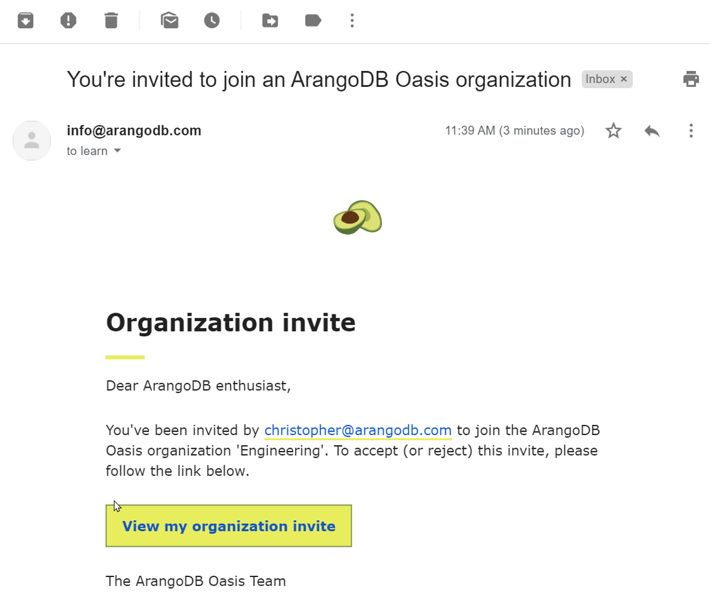

# Inviting persons to your ArangoDB Oasis organization.

This guide explains how you can invite another person to join your
ArangoDB Oasis organization.  It also describes how the recipient can accept
the invitation to your organization.

Also see the video
[Invite Members to an ArangoDB Oasis Organization](https://www.youtube.com/watch?v=lqGgmuNHRQQ&list=PL0tn-TSss6NWH3DNyF96Zbz8LQ0OaFmvS&index=8&t=0s){:target="_blank"}.

## Inviting persons to join your ArangoDB Oasis organization

1. Log into [ArangoDB Oasis](https://cloud.arangodb.com){:target="_blank"}.
2. Select the desired organization, if needed.
3. In the main navigation, in the _Organization_ section, click on _Invites_.
4. Press the _New organization invite_ button.
5. In the form that appears, enter the email address of the person you want
   to invite.
6. Press the _Create_ button.
7. An email with an organization invite will now be sent to the specified
   email address.
8. After accepting the invite the person will be added to the organization
   members.

On the _Invites_ page you can also see the status of all pending, accepted and
rejected invites that have been created.

## Responding to an organization invite

#### Person is already member of an organization

1. In the _User Toolbar_ located in the header, the notification icon will
   display a badge with the number of pending notifications.
2. When clicking the icon, the user is taken to the
   _My organization invites_ page.
3. On this page the user can accept or reject the pending invitation.

#### Person is no member of an organization, yet

1. Once invited, the person will receive an email with a link asking to join
   your ArangoDB Oasis organization.
2. After the confirmation link is clicked, the person will be asked to log in
   or to create a new account.
3. To sign up for a new account, the person should click the
   _Sign up for free_ button or click the _Sign up_ link in the header navigation.
4. After successfully signing up, the person receive a verification email.
5. Clicking the confirmation link takes the user back to the ArangoDB Oasis site.
6. After successfully logging in, the person can accept or reject the invite to
   join your organization.
7. After accepting the invite, the person becomes a member of your organization
   and will be granted access to the organization and its related projects and
   deployments.

