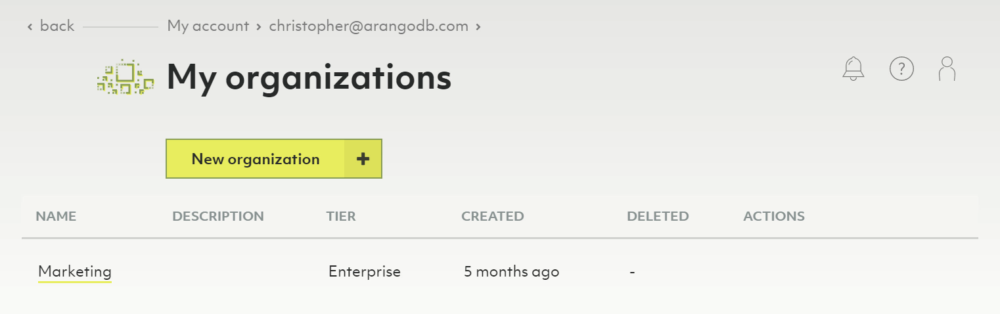
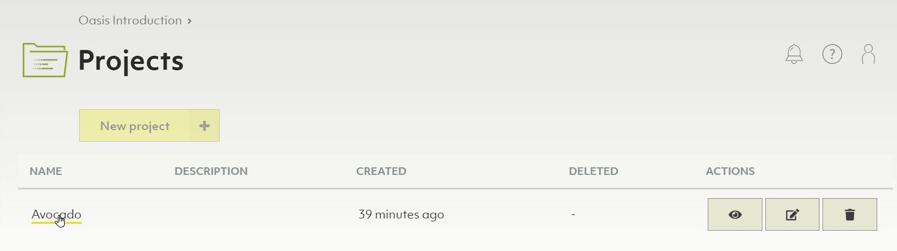
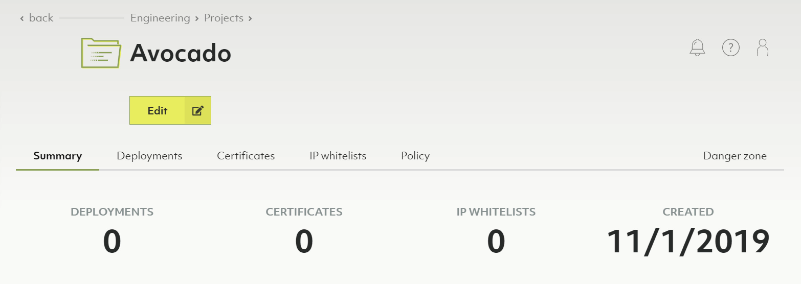
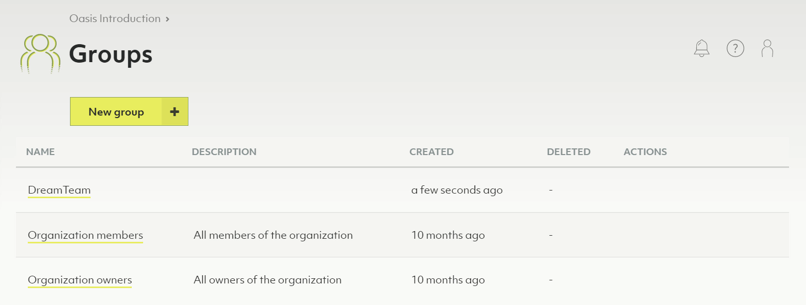
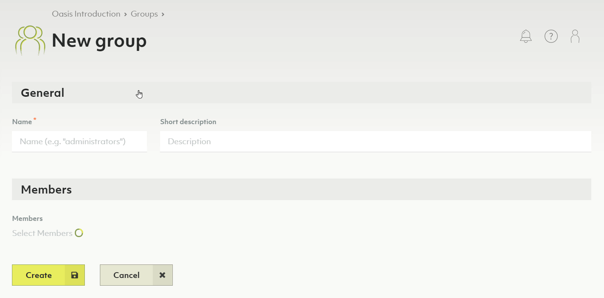
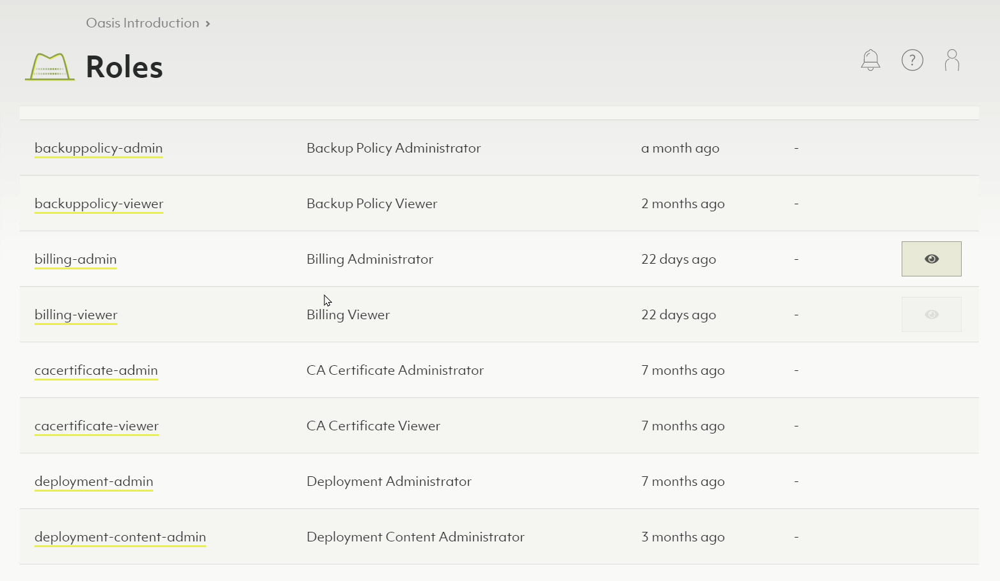
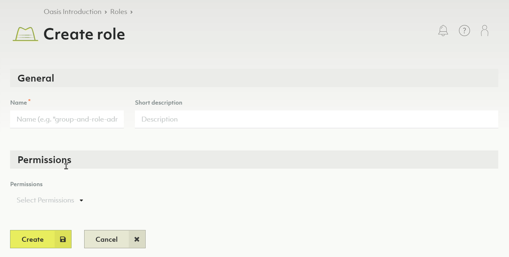
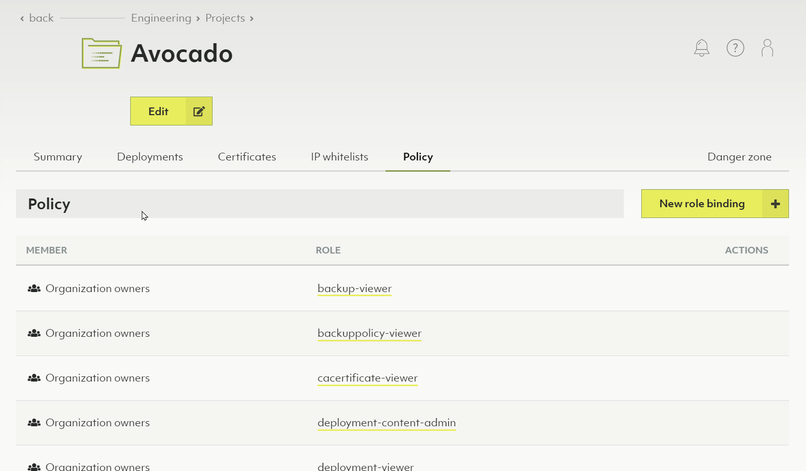
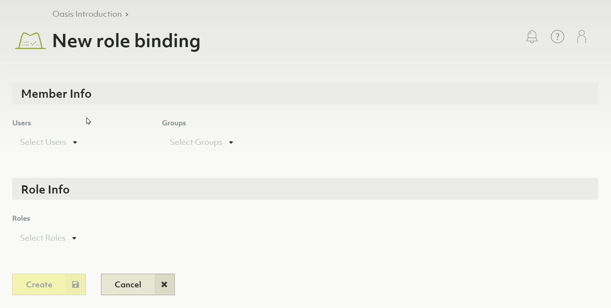

# Project Guide

This guide explains how to create projects in Oasis, and how they are used to
group deployments in your organization.

## Organizations

At the highest level of the Oasis deployment hierarchy are organizations.
An organization typically represents a (commercial) entity such as a company,
company division, institution or non-profit organization.

In the general hierarchy, organizations are a container for projects.

### Creating a new organization

1. In the upper right hand corner click the _User_ icon.
2. From the drop-down menu that appears, click the _My organizations_ link.
3. All the organizations you have access to will be listed here.
4. To create a new organization, press the _New organization_ button.
5. To edit the name or description of an existing organization, in the action
   column click the _Edit_ icon (the pad of paper with pencil).

Also see the video
[Organizations with ArangoDB Oasis](https://www.youtube.com/watch?v=raQPpCyrRtY&list=PL0tn-TSss6NWH3DNyF96Zbz8LQ0OaFmvS&index=3&t=0s){:target="_blank"}.

**Notes**

- You can only be a member of one _Free to try_ organization at a time.
- Organizations contain exactly **one policy**.
- Within that policy, you can define role bindings to regulate access control
  on an organization level.


Deleting an organization will delete all projects and deployments contained in
the organization. This operation is **irreversible**.


## Projects

Below organizations in the Oasis deployment hierarchy are projects. They can
represent organizational units such as teams, product groups, environments
(e.g. staging vs. production). You can have any number of projects under one
organization.

Projects are a container for related deployments, certificates & IP whitelists.
Projects also come with their own policy for access control. You can have any
number of deployment under one project.

In essence, you can create whatever structure fits you for a given organization,
its projects and deployments.

Also see the video
[Projects with ArangoDB Oasis](https://www.youtube.com/watch?v=b7q-PdLEpug&list=PL0tn-TSss6NWH3DNyF96Zbz8LQ0OaFmvS&index=4&t=0s){:target="_blank"}.

### Creating a new project

1. In the main navigation, in the _Projects_ section, click the _Overview_ link.
2. Click the _New project_ button.
3. Enter a name and optional description for your new project.

   

4. Click the _Create_ button.
5. You will now be taken to the project summary page.

   

**Notes**

- Projects contain exactly **one policy**.
- Within that policy, you can define role bindings to regulate access control
  on a project level.


Deleting a project will delete contained deployments, certificates & IP whitelists.
This operation is **irreversible**.


## Deployments

Below projects in the Oasis deployment hierarchy are deployments. A deployment
contains an ArangoDB, configured as you choose. You can have any number of
deployments under one project.

Each deployment can also be backed up manually or automatically by schedules
you can define.

In essence, you can create whatever structure fits you for a given organization,
its projects and deployments.

Also see the video
[Create a Deployment on ArangoDB Oasis](https://www.youtube.com/watch?v=yg2FfcNsKFc&list=PL0tn-TSss6NWH3DNyF96Zbz8LQ0OaFmvS&index=9&t=0s){:target="_blank"}.

### Creating a new deployment

1. If you don't have a project, yet, [create one first](#creating-a-new-project).
2. In the main navigation, in the _Projects_ section, click on the project for
   which you want to create a new deployment.
3. Navigate to the _Deployments_ tab. You will see an empty list or a list with
   your project's deployments.
4. Press the _New deployment_ button.
5. Set up your deployment (see [Getting Started](./getting-started.html#creating-a-new-deployment)).

**Notes**

- Deployments contain exactly **one policy**.
- Within that policy, you can define role bindings to regulate access control
  on a deployment level.


Deleting a deployment will delete all its data and backups.
This operation is **irreversible**.


## Members

Members are a list of users that can access an organization.

### Adding a new member to the organization

See [Organization invites](#organization-invites).

Also see the video
[Invite Members to an ArangoDB Oasis Organization](https://www.youtube.com/watch?v=lqGgmuNHRQQ&list=PL0tn-TSss6NWH3DNyF96Zbz8LQ0OaFmvS&index=8&t=0s){:target="_blank"}

### Viewing and managing organization members

- Click the _Members_ link in the main navigation.
- You can convert a member to a normal user by pressing the _User_ icon in the
  _Actions_ column.
- You can convert a member to an organization owner by pressing the _Key_ icon
  in the _Actions_ column.
- You can delete a member by pressing the _Trash_ icon in the _Actions_ column.

**Notes**

- You can't delete members who are organization owners.

## Groups

A group is a defined set of members. Groups can then be bound to roles. These
bindings contribute to the respective organization, project or deployment policy.

### Creating a new group

1. In the main navigation, in the _Access Control_ section, click on _Groups_.
2. Press the _New group_ button.
3. Enter a name and optional description for your new group.
4. Select the members you want to be part of the group.
5. Press the _Create_ button.

### Viewing and managing the members of an existing group

1. In the main navigation, in the _Access Control_ section, click on _Groups_.
2. Press the icons in the _Actions_ column to view, edit or delete a group.

## Roles

A role is a set of permissions. Roles can then be bound to groups (preferably)
or individual members. These bindings contribute to the respective organization,
project or deployment policy.

### Creating a new role

1. In the main navigation, in the _Access Control_ section, click on _Roles_.
2. Press the _New role_ button.
3. Enter a name and optional description for your new role.
4. Select the permissions you want to assign to your new role.
5. Press the _Create_ button.

### Viewing or managing an existing role

1. In the main navigation, in the _Access Control_ section, click on _Roles_.
2. Press the icons in the _Actions_ column to view, edit or delete a role.

**Notes**

- You cannot delete predefined system roles.
- Also see [Reference: predefined roles](#reference-predefined-roles)

## Organization invites

### Creating a new organization invite

1. In the main navigation, in the _Organization_ section, click on _Invites_.
2. Press the _New organization invite_ button.
3. In the form that appears, enter the email address of the person you want to
   invite.
4. Press the _Create_ button.
5. An email with an organization invite will now be sent to the specified
   email address.
6. After accepting the invite the person will be added to the organization
   [members](#members).

See [Organizational Invite](./organizational-invite.html) for details.

Also see the video
[Invite Members to an ArangoDB Oasis Organization](https://www.youtube.com/watch?v=lqGgmuNHRQQ&list=PL0tn-TSss6NWH3DNyF96Zbz8LQ0OaFmvS&index=8&t=0s){:target="_blank"}.

**Notes**

- On the _Invites_ page you can also see the status of all pending, accepted
  and rejected invites that have been created.

## Policy

A policy is a set of bindings that binds roles to groups or individual members.

Also see the video
[Access Control with ArangoDB Oasis](https://www.youtube.com/watch?v=nhg1Y39JZF8&list=PL0tn-TSss6NWH3DNyF96Zbz8LQ0OaFmvS&index=7&t=0s){:target="_blank"}.

### Oasis permission inheritance

- Permissions are inherited downwards from an organization to its projects and
  from a project to its deployments.
- For more inclusive permissions, add the highest permission for a member or
  group at the at the organization level.
- For more restrictive permissions, add the highest permission at the project
  or even deployment level, and least permission at the organization level.

**Inheritance example**

- Imagine you have a group _Deployers_.
- That group holds all persons that deal with deployments.
- Further imagine you have a role _Deployment Viewer_, containing permission
  `data.deployment.get` and `data.deployment.list`.
- You could now add a role binding of _Deployers_ to _Deployment Viewer_.
- If you add the binding to the organization policy, the members of this group
  will be granted the defined permissions for the organization, all its projects and all its deployments.
- If you add it project A's policy, the members of this group will be granted
  the defined permissions for project A only and its deployments, but not for
  other projects and its deployments.
- If you add it to deployment X's policy of project A, the members of this
  group will be granted the defined permissions for deployment X only, and not
  any other deployment of project A or any other project of the organization.

The role _Deployment viewer_ is effective on the following entities depending
on which policy the binding is added to:

Role binding added to → Role effective on ↓ | Organization policy | Project A's policy | Deployment X's policy of project A |
|:---:|:---:|:---:|:---:|
Organization, its projects and deployments | ✓ | — | —
Project A and its deployments              | ✓ | ✓ | —
Project B and its deployments              | ✓ | — | —
Deployment X of project A                  | ✓ | ✓ | ✓
Deployment Y of project A                  | ✓ | ✓ | —
Deployment Z of project B                  | ✓ | — | —

### Editing a policy

1. Decide whether you want to edit the policy of the organization or of a
   project or deployment.
    - For the organization policy, in the main navigation, in the
      _Access Control_ section, click on _Policy_.
    - For a project policy, in the main navigation, in the _Projects_ section,
      click on the desired project and then navigate to the _Policy_ tab.
    - For a deployment policy, find your deployment and navigate to the
      _Policy_ tab.
2. Press the _New role binding_ button.
3. Select the members or groups to bind to a role.
4. Select the roles that you want to bind to the specified members and groups.
5. Press the _Create_ button.

### Viewing or managing the role bindings of a policy

1. Decide whether you want to edit the policy of the organization or of a
   project or deployment.
    - For the organization policy, in the main navigation, in the
      _Access Control_ section, click on _Policy_.
    - For a project policy, in the main navigation, in the _Projects_ section,
      click on the desired project and then navigate to the _Policy_ tab.
    - For a deployment policy, find your deployment and navigate to the
      _Policy_ tab.
2. Press the _Trash_ icon in the 'Actions' column to delete a role binding.
   **Note**: currently, you cannot edit a role binding, you can only delete it.

## Reference: predefined roles

These are predefined roles that already provide a specific set of permissions
for performing specific functions or operations.

- CA Certificate Administrator `cacertificate-admin`
- CA Certificate Viewer `cacertificate-viewer`
- Deployment Administrator `deployment-admin`
- Deployment Viewer `deployment-viewer`
- Group Administrator `group-admin`
- Group Viewer `group-viewer`
- IP whitelist Administrator `ipwhitelist-admin`  
- IP whitelist Viewer `ipwhitelist-viewer`
- Organization Administrator `organization-admin`
- Organization Viewer `organization-viewer`
- Policy Administrator `policy-admin`
- Policy Viewer `policy-viewer`
- Project Administrator `project-admin`
- Project Viewer `project-viewer`
- Role Administrator `role-admin` 
- Role Viewer `role-viewer`

## Reference: ArangoDB Oasis Site Hierarchy

Your global account holds:

- Organizations (each has exactly 1 policy)
- Members (contains members of an organization)
- Groups (contains groups of related members)
- Roles (contains individual permissions that can be assigned to members or groups)
- Policy (binds roles to members or groups on an organization level)
- Projects (each has exactly 1 policy)
  - Deployments (contains ArangoDB instances, each has exactly 1 policy)
  - Certificate (utilized for encrypted remote administration)
  - Policy (binds roles to members or groups on a project level)
