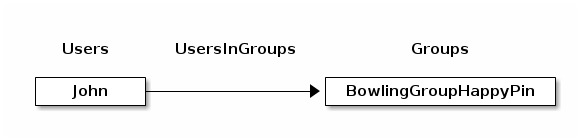

ArangoDB Graphs
===============

What is a Graph?
----------------

In discrete mathematics, a graph is defined as set of **vertices** and **edges**.
In computing it is considered an abstract data type which is really good to
represent **connections** or **relations** – unlike the tabular data structures of
relational database systems, which are ironically very limited in expressing
relations.

A good metaphor for graphs is to think of **nodes** as circles and edges as
**lines** or arcs. The terms _node_ and _vertex_ are used interchangeably here.

Vertices are usually connected to other vertices by edges, making up a **graph**.
Vertices don't have to be connected, they can be loose. But they may also be
connected with more than one other vertex via multiple edges. You may also
find vertices connected to themselves (self-referencing). A special case is
edges pointing to other edges, which is referred to as **hypergraph**.

Edges can have a notation of direction, like a one way connection. If they all
point one way then it is a **directed** graph, otherwise it is **undirected**.


New to graphs? [**Take our free graph course for freshers**](https://www.arangodb.com/arangodb-graph-course/){:target="_blank"}
and get from zero knowledge to advanced query techniques.


Graphs compared to relational database systems
----------------------------------------------

In RDBMS you commonly have the construct of a relation table to store **n:m**
relations between two data tables. An *edge collection* is somewhat similar to
these *relation tables*; *vertex collections* resemble the data tables with the
objects to connect.

While simple graph queries with fixed number of hops via the relation table may
be doable in SQL with several nested joins, graph databases can handle an
arbitrary number of these hops over edge collections (*traversal*). Also edges
in one edge collection may point to several different vertex collections.

It is common to have attributes attached to edges, i.e. a *label* naming this
interconnection. Edges have a direction, with their relations `_from` and `_to`
pointing *from* one document *to* another document stored in vertex collections.
In queries you can define in which directions the edge relations may be followed
(`OUTBOUND`: `_from` → `_to`, `INBOUND`: `_from` ← `_to`, `ANY`: `_from` ↔ `_to`).

Graphs in ArangoDB
------------------

Graphs are always directed in ArangoDB, which means edges point from one vertex
to another and this direction matters. However, in graph queries you can decide
whether you want to follow edges in the defined direction (`OUTBOUND`), against
that direction (`INBOUND`) or follow edges regardless of their orientation
(`ANY`). The process of following a graph's edges from a given starting vertex
to discover neighbor vertices is called **traversal**.

Edges are documents which are stored in **edge collections**. Each edge
collection has a special edge index which cannot be removed. It enables fast
graph traversals with the
[best possible theoretical complexity](https://www.arangodb.com/2016/04/index-free-adjacency-hybrid-indexes-graph-databases/){:target="_blank"}.
Edge documents have two special attributes: `_from` and `_to`. Otherwise they
are like regular documents stored in normal collections. They have `_key`,
`_id` and `_rev` system attributes and you can store whatever information makes
sense on the edge using any JSON data type, including arrays and nested objects.

The `_from` and `_to` attributes are both expected to be set to a document
identifier string (`_id` attribute) of an arbitrary document in the same
database. Both referenced documents are then considered as vertices, an the
collections they are stored in can be called vertex collections. It is allowed
to reference documents from regular document/vertex collections as well as from
edge collections, i.e. you may reference other edges. However, these edges will
not be followed in a traversal if they appear in a vertex context.

You may create edges that link the same vertices multiple times, in whatever
direction. This can be restricted to a single edge per direction by creating
an index over the `_from` and `_to` attributes with the _unique_ option
enabled.

<!-- TODO: graph algorithms (shortest, k shortest, Pregel?) -->

### Anonymous graphs

If you store edges in edge collections to reference other documents, then your
data defines a graph already. This is called an _anonymous_ graph in ArangoDB.
You can [traverse](graphs-traversals.html) anonymous graphs [with AQL](aql/graphs.html)
and use graph related APIs (see e.g. [Working with Edges](graphs-edges.html)).

It is a raw access, in the sense that there are very few checks regarding
consistency. It is not guaranteed that edges reference existing documents for
instance, and if you delete a vertex then connected edges will not be removed
automatically. You need maintain the graph appropriately in your queries and
via client-side code, but it gives you more freedom than the stricter
_named graphs_.

### Named Graphs

To ensure graph consistency, you may create a so called _named_ graph, e.g.
in the [web interface](programs-web-interface-graphs.html). You may work them
via several APIs:

- [AQL Graph Operations](aql/graphs.html) with several flavors:
  - [AQL Traversals](aql/graphs-traversals.html) on both named and anonymous graphs
  - [AQL Shortest Path](aql/graphs-shortest-path.html) on both named and anonymous graph
- [JavaScript General Graph implementation, as you may use it in Foxx Services](graphs-general-graphs.html)
  - [Graph Management](graphs-general-graphs-management.html); creating & manipulating graph definitions; inserting, updating and deleting vertices and edges into graphs
  - [Graph Functions](graphs-general-graphs-functions.html) for working with edges and vertices, to analyze them and their relations
- [JavaScript Smart Graph implementation, for scalable graphs](graphs-smart-graphs.html)
  - [Smart Graph Management](graphs-smart-graphs-management.html); creating & manipulating SmartGraph definitions; Differences to General Graph 
- [RESTful General Graph interface](http/gharial.html) used to implement graph management in client drivers

A named graph consists of one or multiple **edge definitions**. Each edge
definition consists of the name of an edge collection and two vertex
collections, to describe their relationship. The _from_ and _to_ attributes
may refer to the same vertex collection.
<!-- TODO: improve description, add limitations regarding multiple graphs using the same collections -->

Beware of manipulating collections of named graphs with regular document
functions! The underlying collections of the named graphs are still accessible
using the standard methods for working with collections/documents. However the
[named graph API]() (as used by the [graph module]())
adds an additional layer on top of these collections giving you the following
guarantees:

- All modifications are executed transactional
- If you delete a vertex, all edges referring to this vertex will be deleted too
- If you insert an edge it is checked if the edge matches the *edge definitions*

Your edge collections will only contain valid edges and you will never have
loose ends. These guarantees are lost if you modify the documents by any means
other than the graph API or graph module. For example, if you delete documents
from your vertex collections directly, then the edges pointing to them will
remain in place. Existing inconsistencies in your data will not be corrected
when you create a named graph. Therefore, make sure you start with sound data
as otherwise there could be dangling edges after all. The named graph APIs
guarantee to not introduce new inconsistencies only.

### When to choose anonymous or named graphs?

Sometimes you may not need all the powers of named graphs. As noted above,
named graphs ensure graph integrity, both when inserting or removing edges or
vertices. So you won't encounter dangling edges, even if you use the same
vertex collection in several named graphs. This involves more operations inside
the database system which come at a cost. Therefore anonymous graphs may be
faster in many operations.

So this question may be narrowed down to: 'Can I afford the additional effort
on my part or do I need the warranty for integrity?'.

### Multiple edge collections vs. `FILTER`s on edge document attributes

If you want to only traverse edges of a specific type, there are two ways to
achieve this. The first would be an attribute in the edge document - i.e.
`type`, where you specify a differentiator for the edge (`"friends"`,
`"family"`, `"married"` or `"workmates"`), so you can later
`FILTER e.type = "friends"` if you only want to follow the friend edges.

Another way, which may be more efficient in some cases, is to use different
edge collections for different types of edges. So you would have `friend_edges`,
`family_edges`, `married_edges` and `workmate_edges` as collection names.
You can then configure several named graphs including a subset of the available
edge and vertex collections - or you use anonymous graph queries, where you
specify a list of edge collections to take into account in that query. To only
follow friend edges, you would specify `friend_edges` as sole edge collection.

Both approaches have advantages and disadvantages. `FILTER` operations on edge
attributes will do comparisons on each traversed edge, which may become
CPU-intense. When not *finding* the edges in the first place because of the
collection containing them is not traversed at all, there will never be a
reason to actually check for their `type` attribute with `FILTER`.

The multiple edge collections approach is limited by the
[number of collections that can be used simultaneously in one query](aql/fundamentals-syntax.html#collection-names).
Every collection used in a query requires some resources inside of ArangoDB and
the number is therefore limited to cap the resource requirements. You may also
have constraints on other edge attributes, such as a hash index with a unique
constraint, which requires the documents to be in a single collection for the
uniqueness guarantee, and it may thus not be possible to store the different
types of edges in multiple edge collections.

So, if your edges have about a dozen different types, it is okay to choose the
collection approach, otherwise the `FILTER` approach is preferred. You can
still use `FILTER` operations on edges of course. You can get rid of a `FILTER`
on the `type` with the former approach, everything else can stay the same.

Which part of my data is an Edge and which a Vertex?
----------------------------------------------------

The main objects in your data model, such as users, groups or articles, are
usually considered to be vertices. For each type of object, a document
collection (also called vertex collection) should store the individual
entities. Entities can be connected by edges to express and classify relations
between vertices. It often makes sense to have an edge collection per relation
type.

ArangoDB does not require you to store your data in graph structures with edges
and vertices, you can also decide to embed attributes such as which groups a
user is part of, or `_id`s of documents in another document instead of
connecting the documents with edges. It can be a meaningful performance
optimization for **1:n** relationships, if your data is not focused on
relations and you don't need graph traversal with varying depth. It usually
means to introduce some redundancy and possibly inconsistencies if you embed
data, but it can be an acceptable tradeoff.

### Vertices

Let us say we have two vertex collections, `Users` and `Groups`. Documents in
the `Groups` collection contain the attributes of the Group, i.e. when it was
founded, its subject, an icon URL and so on. `Users` documents contain the
data specific to a user - like all names, birthdays, Avatar URLs, hobbies...

### Edges

We can use an edge collection to store relations between users and groups.
Since multiple users may be in an arbitrary number of groups, this is an
**m:n** relation. The edge collection can be called `UsersInGroups` with i.e.
one edge with `_from` pointing to `Users/John` and `_to` pointing to
`Groups/BowlingGroupHappyPin`. This makes the user **John** a member of the
group **Bowling Group Happy Pin**. Attributes of this relation may contain
qualifiers to this relation, like the permissions of **John** in this group,
the date when he joined the group etc.

So roughly put, if you use documents and their attributes in a sentence, nouns
would typically be vertices, verbs become the edges. You can see this in the
[knows graph](#the-knows_graph) below:

     Alice knows Bob, who in term knows Charlie.

### Advantages of this approach

Graphs give you the advantage of not just being able to have a fixed number of
**m:n** relations in a row, but an arbitrary number. Edges can be traversed in
both directions, so it's easy to determine all groups a user is in, but also to
find out which members a certain group has. Users could also be interconnected
to create a social network.

Using the graph data model, dealing with data that has lots of relations stays
manageable and can be queried in very flexible ways, whereas it would cause
headache to handle it in a relational database system.

Backup and restore
------------------

For sure you want to have backups of your graph data, you can use [Arangodump](programs-arangodump.html) to create the backup,
and [Arangorestore](programs-arangorestore.html) to restore a backup into a new ArangoDB. You should however note that:

- you need the system collection `_graphs` if you backup named graphs.
- you need to backup the complete set of all edge and vertex collections your graph consists of. Partial dump/restore may not work.

Managing graphs
---------------

By default you should use [the interface your driver provides to manage graphs](http/gharial-management.html).

This is i.e. documented [in Graphs-Section of the ArangoDB Java driver](https://github.com/arangodb/arangodb-java-driver#graphs){:target="_blank"}.

Example Graphs
--------------

ArangoDB comes with a set of easily graspable graphs that are used to demonstrate the APIs.
You can use the `add samples` tab in the `create graph` window in the web interface, or load the module `@arangodb/graph-examples/example-graph` in arangosh and use it to create instances of these graphs in your ArangoDB.
Once you've created them, you can [inspect them in the web interface](programs-web-interface-graphs.html) - which was used to create the pictures below.

You [can easily look into the innards of this script](https://github.com/arangodb/arangodb/blob/devel/js/common/modules/%40arangodb/graph-examples/example-graph.js){:target="_blank"} for reference about how to manage graphs programmatically.

### The Knows\_Graph

A set of persons knowing each other:

The *knows* graph consists of one *vertex collection* `persons` connected via one *edge collection* `knows`.
It will contain five persons *Alice*, *Bob*, *Charlie*, *Dave* and *Eve*.
We will have the following directed relations:

  - *Alice* knows *Bob*
  - *Bob* knows *Charlie*
  - *Bob* knows *Dave*
  - *Eve* knows *Alice*
  - *Eve* knows *Bob*

This is how we create it, inspect its *vertices* and *edges*, and drop it again:


    @startDocuBlockInline graph_create_knows_sample
    @EXAMPLE_ARANGOSH_OUTPUT{graph_create_knows_sample}
    var examples = require("@arangodb/graph-examples/example-graph.js");
    var g = examples.loadGraph("knows_graph");
    db.persons.toArray()
    db.knows.toArray();
    examples.dropGraph("knows_graph");
    @END_EXAMPLE_ARANGOSH_OUTPUT
    @endDocuBlock graph_create_knows_sample



**Note:** with the default "Search Depth" of 2 of the graph viewer you may not see all edges of this graph.

### The Social Graph

A set of persons and their relations:

This example has female and male persons as *vertices* in two *vertex collections* - `female` and `male`. The *edges* are their connections in the `relation` *edge collection*.
This is how we create it, inspect its *vertices* and *edges*, and drop it again:


    @startDocuBlockInline graph_create_social_sample
    @EXAMPLE_ARANGOSH_OUTPUT{graph_create_social_sample}
    var examples = require("@arangodb/graph-examples/example-graph.js");
    var graph = examples.loadGraph("social");
    db.female.toArray()
    db.male.toArray()
    db.relation.toArray()
    examples.dropGraph("social");
    @END_EXAMPLE_ARANGOSH_OUTPUT
    @endDocuBlock graph_create_social_sample



### The City Graph

A set of european cities, and their fictional traveling distances as connections:

The example has the cities as *vertices* in several *vertex collections* - `germanCity` and `frenchCity`. The *edges* are their interconnections in several *edge collections* `french / german / international Highway`. This is how we create it, inspect its *edges* and *vertices*, and drop it again:


    @startDocuBlockInline graph_create_cities_sample
    @EXAMPLE_ARANGOSH_OUTPUT{graph_create_cities_sample}
    var examples = require("@arangodb/graph-examples/example-graph.js");
    var g = examples.loadGraph("routeplanner");
    db.frenchCity.toArray();
    db.germanCity.toArray();
    db.germanHighway.toArray();
    db.frenchHighway.toArray();
    db.internationalHighway.toArray();
    examples.dropGraph("routeplanner");
    @END_EXAMPLE_ARANGOSH_RUN
    @endDocuBlock graph_create_cities_sample



### The Traversal Graph

This graph was designed to demonstrate filters in traversals. It has some labels to filter on it.

The example has all its vertices in the *circles* collection, and an *edges* edge collection to connect them.
Circles have unique numeric labels. Edges have two boolean attributes (*theFalse* always being false, *theTruth* always being true) and a label sorting *B* - *D* to the left side, *G* - *K* to the right side. Left and right side split into Paths - at *B* and *G* which are each direct neighbours of the root-node *A*. Starting from *A* the graph has a depth of 3 on all its paths.


    @startDocuBlockInline graph_create_traversal_sample
    @EXAMPLE_ARANGOSH_OUTPUT{graph_create_traversal_sample}
    var examples = require("@arangodb/graph-examples/example-graph.js");
    var g = examples.loadGraph("traversalGraph");
    db.circles.toArray();
    db.edges.toArray();
    examples.dropGraph("traversalGraph");
    @END_EXAMPLE_ARANGOSH_RUN
    @endDocuBlock graph_create_traversal_sample



**Note:** with the default "Search Depth" of 2 of the graph viewer you may not see all nodes of this graph.

### The k Shortest Paths Graph

The vertices in this graph are train stations of cities in Europe and
North America and the edges represent train connections between them,
with the travel time for both directions as edge weight.

See the [k Shortest Paths page](aql/graphs-kshortest-paths.html) for query examples.


    @startDocuBlockInline graph_create_kshortestpaths_sample
    @EXAMPLE_ARANGOSH_OUTPUT{graph_create_kshortestpaths_sample}
    var examples = require("@arangodb/graph-examples/example-graph.js");
    var g = examples.loadGraph("kShortestPathsGraph");
    db.places.toArray();
    db.connections.toArray();
    examples.dropGraph("kShortestPathsGraph");
    @END_EXAMPLE_ARANGOSH_RUN
    @endDocuBlock graph_create_kshortestpaths_sample



### The World Graph

The world country graph structures its nodes like that: world → continent → country → capital. In some cases edge directions aren't forward (therefore it will be displayed disjunct in the graph viewer). It has two ways of creating it. One using the named graph utilities (*worldCountry*), one without (*worldCountryUnManaged*). 
It is used to demonstrate raw traversal operations.


    @startDocuBlockInline graph_create_world_sample
    @EXAMPLE_ARANGOSH_OUTPUT{graph_create_world_sample}
    var examples = require("@arangodb/graph-examples/example-graph.js");
    var g = examples.loadGraph("worldCountry");
    db.worldVertices.toArray();
    db.worldEdges.toArray();
    examples.dropGraph("worldCountry");
    var g = examples.loadGraph("worldCountryUnManaged");
    examples.dropGraph("worldCountryUnManaged");
    @END_EXAMPLE_ARANGOSH_RUN
    @endDocuBlock graph_create_world_sample



### The Mps Graph

This graph was created to demonstrate a use case of the shortest path algorithm. Even though the algorithm can only determine one shortest path, it is possible to return multiple shortest paths with two separate queries. Therefore the graph is named after the [**m**ultiple **p**ath **s**earch](aql/examples-multiple-paths.html) use case.

The example graph consists of *vertices* in the `mps_verts` collection and *edges* in the `mps_edges` collection. It is a simple traversal graph with start node *A* and end node *C*.

This is how we create it, inspect its *vertices* and *edges*, and drop it again:


    @startDocuBlockInline graph_create_mps_sample
    @EXAMPLE_ARANGOSH_OUTPUT{graph_create_mps_sample}
    var examples = require("@arangodb/graph-examples/example-graph.js");
    var g = examples.loadGraph("mps_graph");
    db.mps_verts.toArray();
    db.mps_edges.toArray();
    examples.dropGraph("mps_graph");
    @END_EXAMPLE_ARANGOSH_OUTPUT
    @endDocuBlock graph_create_mps_sample



### Higher volume graph examples

All of the above examples are rather small so they are easier to comprehend and can demonstrate the way the functionality works.
There are however several datasets freely available on the web that are a lot bigger.
[We collected some of them with import scripts](https://github.com/arangodb/example-datasets){:target="_blank"} so you may play around with them.
Another huge graph is the [Pokec social network](https://snap.stanford.edu/data/soc-pokec.html){:target="_blank"}
from Slovakia that we [used for performance testing on several databases](https://www.arangodb.com/2015/06/multi-model-benchmark/){:target="_blank"};
You will find importing scripts etc. in this blogpost.

Cookbook examples
-----------------

The above referenced chapters describe the various APIs of ArangoDBs graph engine with small examples. Our cookbook has some more real life examples:

 - [Retrieving documents from ArangoDB without knowing the structure](drivers/java-examples-base-document.html)
 - [AQL Example Queries on an Actors and Movies Database](aql/examples-actors-and-movies.html)
