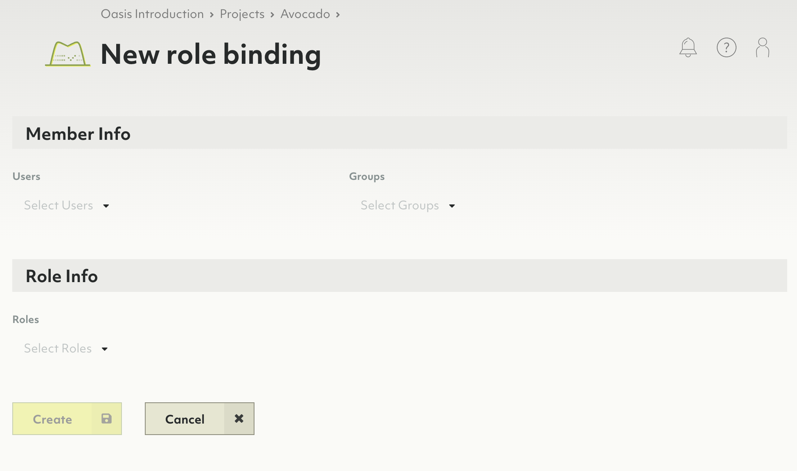

# Access control in ArangoDB Oasis

Oasis has a level structured set of resources that are subject to
access control:

- Organizations
- Projects
- Deployments

Each of these resources have a set of operations that can be invoked upon them.
For example, you can *create* a project in an organization. This requires the
respective **permission**, which can be granted to organization members via a
**role** such as the pre-defined *Project Administrator*.

The association of a member with a role is called a **role binding**.
All role bindings of a resource combined form the so called **policy**.

Roles can be bound on organization, project and deployment level. The lower
levels **inherit** permissions from their parent resources.

## Policy

To give a user (or a group of users) access to resources of Oasis, you assign
a role to that user (or group). This is done in a *policy*.

A policy is the set of a bindings of roles to users (or groups) for a specific
resource. This means that there is a unique policy per resource.

For example, the *Oasis Introduction* organization has exactly one policy,
which binds roles to members of the organization. These bindings are used to
give these users permissions to invoke operations on this organization.

### How to view, edit or remove role bindings of a policy

Decide whether you want to edit the policy of the organization or of a
project or deployment and navigate the resource's _Policy_ tab.
- **Organization**: Click on _Access Control_ in the main navigation, then
  click on the _Policy_ tab.
- **Project**: Click on the desired project in the main navigation, then click
  on the _Policy_ tab.
- **Deployment**: Click on the desired project in the main navigation, then
  on the title or _view_ button of the desired deployment and finally click
  on the _Policy_ tab.

To delete a role binding, click on the _Trash bin_ icon in the _Actions_ column.


Currently, you cannot edit a role binding, you can only delete it.


### How to add a role binding to a policy

1. Navigate to the _Policy_ tab of an organization, project or deployment.
2. Click on the _New role binding_ button.
3. Select one or more users and/or groups.
4. Select the roles that you want to bind to the specified members.
5. Click the _Create_ button.

## Roles

Operations on resources in Oasis require zero or more permissions. Since the
number of permissions is large and very detailed, it is not practical to assign
permissions directly to users. Instead Oasis has *roles*.

A role is a set of permissions. Roles can be bound to groups (preferably)
or individual members. These bindings contribute to the respective organization,
project or deployment policy.

There are predefined roles, but you can also create custom roles.

### Predefined roles

Predefined roles are created by Oasis and group permissions together in a
logical role. An example of a predefine role is `deployment-viewer`. That role
contains all permissions needed to view deployments in a project.

Predefined roles cannot be deleted.


Windows command to generate below list (cmd.exe):
oasisctl list roles --format json | jq -r ".[] | \"**\(.description)** (`\(.id)`):\n\(.permissions ^| split(\", \") ^| map(\"- `\(.)`\n\") ^| join(\"\"))""





Below roles are listed in this schema:

**Description** (`ID`):
- `Permission`


**Backup Administrator** (`backup-admin`):
- `backup.backup.create`
- `backup.backup.delete`
- `backup.backup.list`
- `backup.backup.get`
- `backup.backup.update`
- `backup.backup.download`
- `backup.backup.restore`
- `data.deployment.restore-backup`

**Backup Viewer** (`backup-viewer`):
- `backup.feature.get`
- `backup.backup.get`
- `backup.backup.list`

**Backup Policy Administrator** (`backuppolicy-admin`):
- `backup.backuppolicy.create`
- `backup.backuppolicy.delete`
- `backup.backuppolicy.list`
- `backup.backuppolicy.get`
- `backup.backuppolicy.update`

**Backup Policy Viewer** (`backuppolicy-viewer`):
- `backup.feature.get`
- `backup.backuppolicy.get`
- `backup.backuppolicy.list`

**Billing Administrator** (`billing-admin`):
- `billing.config.get`
- `billing.config.set`
- `billing.invoice.get`
- `billing.invoice.get-statistics`
- `billing.invoice.list`
- `billing.organization.get`
- `billing.paymentmethod.create`
- `billing.paymentmethod.delete`
- `billing.paymentmethod.get`
- `billing.paymentmethod.get-default`
- `billing.paymentmethod.list`
- `billing.paymentmethod.set-default`
- `billing.paymentmethod.update`
- `billing.paymentprovider.list`

**Billing Viewer** (`billing-viewer`):
- `billing.config.get`
- `billing.invoice.get`
- `billing.invoice.get-statistics`
- `billing.invoice.list`
- `billing.organization.get`
- `billing.paymentmethod.get`
- `billing.paymentmethod.get-default`
- `billing.paymentmethod.list`
- `billing.paymentprovider.list`

**CA Certificate Administrator** (`cacertificate-admin`):
- `crypto.cacertificate.create`
- `crypto.cacertificate.delete`
- `crypto.cacertificate.list`
- `crypto.cacertificate.get`
- `crypto.cacertificate.set-default`
- `crypto.cacertificate.update`

**CA Certificate Viewer** (`cacertificate-viewer`):
- `crypto.cacertificate.get`
- `crypto.cacertificate.list`

**Deployment Administrator** (`deployment-admin`):
- `data.cpusize.list`
- `data.deployment.create`
- `data.deployment.create-test-database`
- `data.deployment.delete`
- `data.deployment.resume`
- `data.deployment.get`
- `data.deployment.list`
- `data.deployment.update`
- `data.deploymentfeatures.get`
- `data.deploymentprice.calculate`
- `data.limits.get`
- `data.nodesize.list`
- `data.presets.list`
- `monitoring.logs.get`

**Deployment Content Administrator** (`deployment-content-admin`):
- `data.cpusize.list`
- `data.deployment.create-test-database`
- `data.deployment.get`
- `data.deployment.list`
- `data.deploymentcredentials.get`
- `data.deploymentfeatures.get`
- `data.limits.get`
- `data.nodesize.list`
- `data.presets.list`
- `monitoring.logs.get`

**Deployment Viewer** (`deployment-viewer`):
- `data.cpusize.list`
- `data.deployment.get`
- `data.deployment.list`
- `data.deploymentfeatures.get`
- `data.limits.get`
- `data.nodesize.list`
- `data.presets.list`

**Example Datasets Viewer** (`exampledataset-viewer`):
- `example.exampledataset.list`
- `example.exampledataset.get`

**Example Dataset Installation Administrator** (`exampledatasetinstallation-admin`):
- `example.exampledatasetinstallation.list`
- `example.exampledatasetinstallation.get`
- `example.exampledatasetinstallation.create`
- `example.exampledatasetinstallation.update`
- `example.exampledatasetinstallation.delete`

**Example Dataset Installation Viewer** (`exampledatasetinstallation-viewer`):
- `example.exampledatasetinstallation.list`
- `example.exampledatasetinstallation.get`

**Group Administrator** (`group-admin`):
- `iam.group.create`
- `iam.group.delete`
- `iam.group.list`
- `iam.group.get`
- `iam.group.update`

**Group Viewer** (`group-viewer`):
- `iam.group.get`
- `iam.group.list`

**IAM provider Administrator** (`iamprovider-admin`):
- `security.iamprovider.create`
- `security.iamprovider.delete`
- `security.iamprovider.get`
- `security.iamprovider.list`
- `security.iamprovider.set-default`
- `security.iamprovider.update`

**IAM provider Viewer** (`iamprovider-viewer`):
- `security.iamprovider.get`
- `security.iamprovider.list`

**IP allowlist Administrator** (`ipallowlist-admin`):
- `security.ipallowlist.create`
- `security.ipallowlist.delete`
- `security.ipallowlist.get`
- `security.ipallowlist.list`
- `security.ipallowlist.update`
- `security.ipallowlist.create`
- `security.ipallowlist.delete`
- `security.ipallowlist.get`
- `security.ipallowlist.list`
- `security.ipallowlist.update`

**IP allowlist Viewer** (`ipallowlist-viewer`):
- `security.ipallowlist.get`
- `security.ipallowlist.list`
- `security.ipallowlist.get`
- `security.ipallowlist.list`

**Organization Administrator** (`organization-admin`):
- `billing.organization.get`
- `resourcemanager.organization.delete`
- `resourcemanager.organization.get`
- `resourcemanager.organization.update`
- `resourcemanager.organization-invite.create`
- `resourcemanager.organization-invite.delete`
- `resourcemanager.organization-invite.get`
- `resourcemanager.organization-invite.list`
- `resourcemanager.organization-invite.update`

**Organization Viewer** (`organization-viewer`):
- `billing.organization.get`
- `resourcemanager.organization.get`
- `resourcemanager.organization-invite.get`
- `resourcemanager.organization-invite.list`

**Policy Administrator** (`policy-admin`):
- `iam.policy.get`
- `iam.policy.update`

**Policy Viewer** (`policy-viewer`):
- `iam.policy.get`

**Project Administrator** (`project-admin`):
- `resourcemanager.project.create`
- `resourcemanager.project.delete`
- `resourcemanager.project.get`
- `resourcemanager.project.list`
- `resourcemanager.project.update`

**Project Viewer** (`project-viewer`):
- `resourcemanager.project.get`
- `resourcemanager.project.list`

**Replication Administrator** (`replication-admin`):
- `replication.deployment.clone-from-backup`

**Role Administrator** (`role-admin`):
- `iam.role.create`
- `iam.role.delete`
- `iam.role.list`
- `iam.role.get`
- `iam.role.update`

**Role Viewer** (`role-viewer`):
- `iam.role.get`
- `iam.role.list`



### How to create a custom role

1. Click on _Access Control_ in the main navigation.
2. On the _Roles_ tab, click on the _New role_ button.
3. Enter a name and optionally a description for the new role.
4. Select the desired permissions.
5. Click the _Create_ button.

### How to view, edit or remove a custom role

1. Click on _Access Control_ in the main navigation.
2. On the _Roles_ tab, click on:
   - A role name or the _eye_ icon in the _Actions_ column to view the role.
   - The _pencil_ icon in the _Actions_ column to edit the role.
     You can also view a role and click the _Edit_ button in the detail view.
   - The _trash can_ icon to delete the role.
     You can also view a role and click the _Delete_ button in the detail view.

## Permissions

Each operation (invoked on a resource) requires zero or more *permissions*.
A permission is a constant string such as `resourcemanager.project.create`,
following the schema `<api>.<kind>.<verb>`.

Permissions are solely defined by the Oasis API.

| API               | Kind                         | Verbs
|:------------------|:-----------------------------|:-------------------------------------------
| `backup`          | `backuppolicy`               | `create`, `delete`, `get`, `list`, `update`
| `backup`          | `backup`                     | `create`, `delete`, `download`, `get`, `list`, `restore`, `update`
| `backup`          | `feature`                    | `get`
| `billing`         | `config`                     | `get`, `set`
| `billing`         | `invoice`                    | `get`, `get-statistics`, `list`
| `billing`         | `organization`               | `get`
| `billing`         | `paymentmethod`              | `create`, `delete`, `get`, `get-default`, `list`, `set-default`, `update`
| `billing`         | `paymentprovider`            | `list`
| `crypto`          | `cacertificate`              | `create`, `delete`, `get`, `list`, `set-default`, `update`
| `data`            | `cpusize`                    | `list`
| `data`            | `deploymentcredentials`      | `get`
| `data`            | `deploymentfeatures`         | `get`
| `data`            | `deploymentprice`            | `calculate`
| `data`            | `deployment`                 | `create`, `create-test-database`, `delete`, `get`, `list`, `restore-backup`, `resume`, `update`
| `data`            | `limits`                     | `get`
| `data`            | `nodesize`                   | `list`
| `data`            | `presets`                    | `list`
| `example`         | `exampledatasetinstallation` | `create`, `delete`, `get`, `list`, `update`
| `example`         | `exampledataset`             | `get`, `list`
| `iam`             | `group`                      | `create`, `delete`, `get`, `list`, `update`
| `iam`             | `policy`                     | `get`, `update`
| `iam`             | `role`                       | `create`, `delete`, `get`, `list`, `update`
| `monitoring`      | `logs`                       | `get`
| `replication`     | `deployment`                 | `clone-from-backup`
| `resourcemanager` | `organization-invite`        | `create`, `delete`, `get`, `list`, `update`
| `resourcemanager` | `organization`               | `delete`, `get`, `update`
| `resourcemanager` | `project`                    | `create`, `delete`, `get`, `list`, `update`
| `security`        | `iamprovider`                | `create`, `delete`, `get`, `list`, `set-default`, `update`
| `security`        | `ipallowlist`                | `create`, `delete`, `get`, `list`, `update`

## Permission inheritance

Each resource has its own policy, but this does not mean that you have to
repeat access control bindings on all these policies.

Once you assign a role to a user (or group of users) in a policy at one level,
all the permissions of that role are inherited in lower levels. That is,
permissions are inherited downwards from an organization to its projects and
from a project to its deployments.

For more inclusive permissions, add the highest permission for a member or
group at the at the organization level.
For example, if you bind the role `deployment-viewer` to user `John` in the
policy of an organization, `John` will have all the permissions contained in
that role in all projects of that organization and all deployments in those
projects as well.

For more restrictive permissions, add the highest permission at the project
or even deployment level, and least permission at the organization level.
For example, if you bind the role `deployment-viewer` to user `John`
in a project, `John` will have all the permissions contained in that role in
that project as well as in all deployments contained in that project, but not
in other projects of the containing organization.

**Inheritance example**

- Imagine you have a group _Deployers_.
- That group holds all persons that deal with deployments.
- Further imagine you have a role _Deployment Viewer_, containing permission
  `data.deployment.get` and `data.deployment.list`.
- You could now add a role binding of _Deployers_ to _Deployment Viewer_.
- If you add the binding to the organization policy, the members of this group
  will be granted the defined permissions for the organization, all its projects and all its deployments.
- If you add it project A's policy, the members of this group will be granted
  the defined permissions for project A only and its deployments, but not for
  other projects and its deployments.
- If you add it to deployment X's policy of project A, the members of this
  group will be granted the defined permissions for deployment X only, and not
  any other deployment of project A or any other project of the organization.

The role _Deployment viewer_ is effective on the following entities depending
on which policy the binding is added to:

Role binding added to → Role effective on ↓ | Organization policy | Project A's policy | Deployment X's policy of project A |
|:---:|:---:|:---:|:---:|
Organization, its projects and deployments | ✓ | — | —
Project A and its deployments              | ✓ | ✓ | —
Project B and its deployments              | ✓ | — | —
Deployment X of project A                  | ✓ | ✓ | ✓
Deployment Y of project A                  | ✓ | ✓ | —
Deployment Z of project B                  | ✓ | — | —
