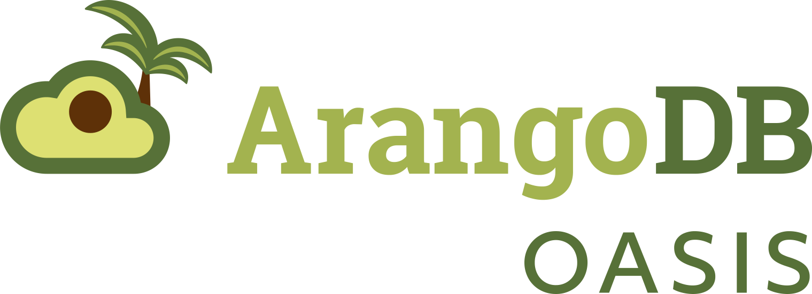

{: .center-image style="width: 66%; margin-bottom: 80px;"}

<<<<<<< HEAD
[ArangoDB Oasis](https://cloud.arangodb.com/){:target="_blank"},
the ArangoDB Cloud comes with its own API.
This API enables you to control all resources inside 
Oasis in a scriptable manor.
Typical use cases are spinning up Oasis deployments during continous integration and infrastructure as code.

The ArangoDB Oasis API...

- is a well specified API that uses protocol buffers as interface definition and GRPC as underlying protocol.

- clients can be generated automatically for a large list of languages. A Go client is available out of the box.

- uses API keys for authentication. API keys impersonate a user and inherit the permissions of that user.

- is also available as a commandline tool called [oasisctl](https://github.com/arangodb-managed/oasisctl/){:target="_blank"}. This tool makes integration of Oasis in all kinds of (bash) scripts easy. Oasisctl is available for Linux, Windows & Mac. Oasisctl is also a good example on how to use the API.

- is also available as a [Terraform plugin](https://github.com/arangodb-managed/terraform-provider-oasis/){:target="_blank"}. This plugin makes integration of Oasis in infrastructure as code projects very simple. Note that the terraform plugin is still in **prerelease**, so its interface can still change.

For more information see
[github.com/arangodb-managed/apis](https://github.com/arangodb-managed/apis/){:target="_blank"}
and
[API definitions](https://arangodb-managed.github.io/apis/index.html){:target="_blank"}
=======
[ArangoDB Oasis](https://cloud.arangodb.com/){:target="_blank"}, the
ArangoDB Cloud, comes with its own API. This API enables you to control all
resources inside Oasis in a scriptable manor. Typical use cases are spinning
up Oasis deployments during continuous integration and infrastructure as code.

The ArangoDB Oasis API…

- is a well specified API that uses
  [Protocol Buffers](https://developers.google.com/protocol-buffers/){:target="_blank"}
  as interface definition and [gRPC](https://grpc.io/){:target="_blank"} as
  underlying protocol.

- allows for automatic generation of clients for a large list of languages.
  A Go client is available out of the box.

- uses API keys for authentication. API keys impersonate a user and inherit
  the permissions of that user.

- is also available as a commandline tool called [oasisctl](oasisctl.html).

- is also available as a
  [Terraform plugin](https://github.com/arangodb-managed/terraform-provider-oasis/){:target="_blank"}.
  This plugin makes integration of Oasis in infrastructure as code projects
  very simple. Note that the terraform plugin is still in **prerelease**, so
  its interface can still change.

Also see:
- [github.com/arangodb-managed/apis](https://github.com/arangodb-managed/apis/){:target="_blank"}
- [API definitions](https://arangodb-managed.github.io/apis/index.html){:target="_blank"}
>>>>>>> ac35acaa4e45cbcbde40da35a89977f0960e5c01
