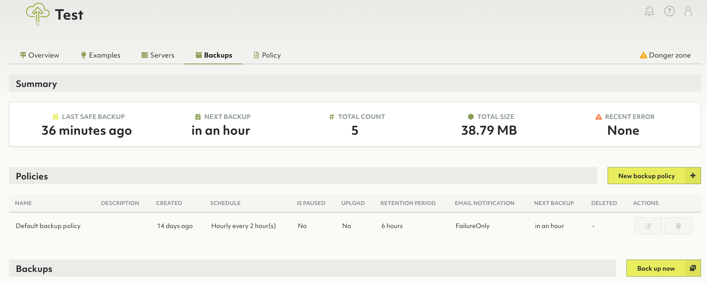
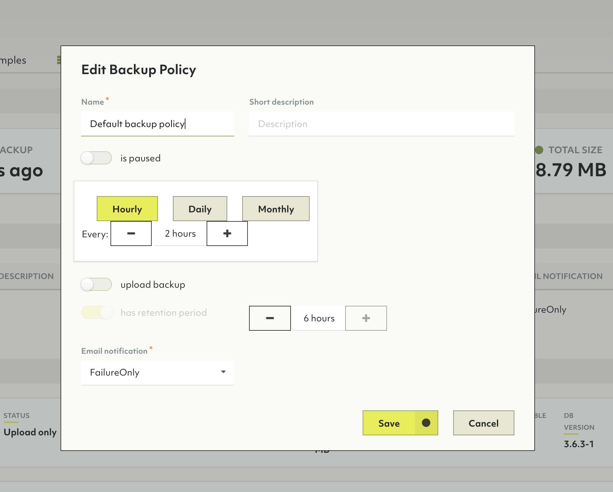
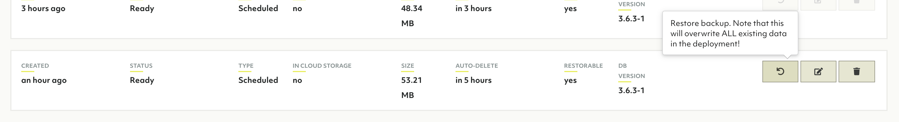
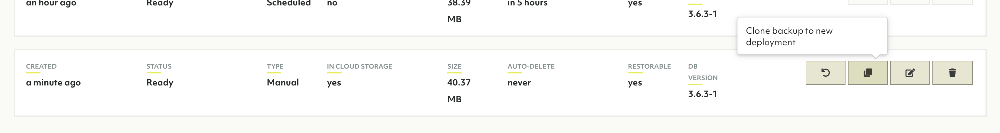

# How to create backups

The backup data in Oasis for an ArangoDB installation, navigate to the backup section of your deployment created previously.

There are two types of backups. Periodic backups taken through backup policies and manual backups taken by hand.

## Periodic backups

Periodic backups are taken on a given timeframe via a Backup Policy. To see when the new backup is due, observe the schedule section.

Upon creating a deployment, by default, a new policy is created which will take backups of a deployment hourly every two hours. To edit this policy (or any policy), highlight it in the row above and hit the pencil icon.

These backups are not automatically uploaded.

## Manual backups

It's also possible to create a backup on demand. To do this, click **Back up now**.

## Uploading backups

By default a backup is not uploaded to the cloud, meaning it's ephemeral. It will go away and not persist (by default in 6 hours). To keep a backup for a longer period of time, upload it to the cloud storage. Uploaded backups are required for [cloning](#how-to-clone-a-deployment-using-a-backup).

# Restoring from backup

To restore a database from a backup, highlight the desired backup and click on the restore icon.

# How to clone a deployment using a backup

1. Highlight the backup you wish to clone from and hit **Clone backup to new deployment**

1. The view should navigate to the new deployment being bootstrapped

## Details about the cloned deployment

This deployment will have the exact same features as the previous deployment
including server specs, mode, provider, project and organization. The data
contained in the backup will be restored to this new deployment.

The *password* for this deployment, however, will be generated anew.

This feature is also available through Oasisctl, including an optional parameter to specify a new region. The provider stays the same.
