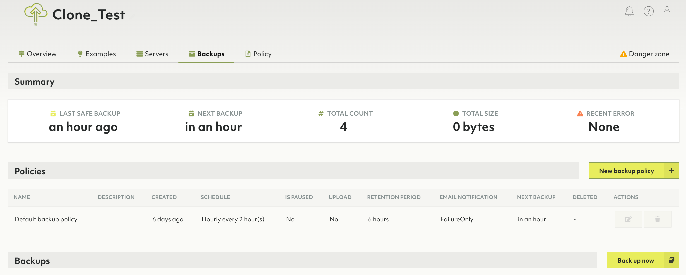
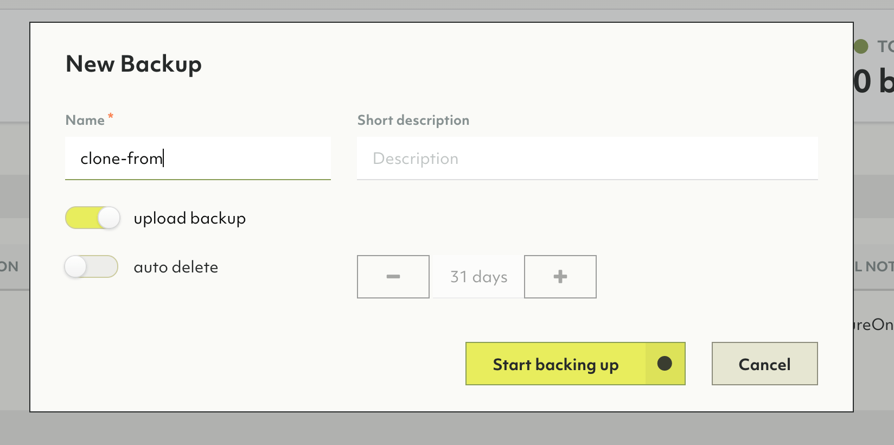
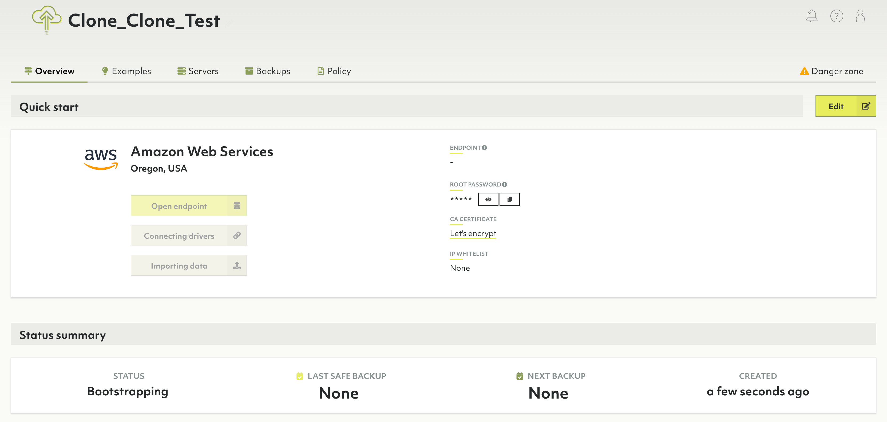

# Clone a deployment from backup

These instructions contain steps to clone a deployment using an uploaded Oasis Backup.

## Prerequisites

Make sure that you already have a running deployment. Please follow the [Getting Started](getting-started.md)
page to create one.

## Creating a backup

First, you will need a backup to clone from.
1. Select an organization
1. Select a project
1. Select a deployment to create a backup from
1. Navigate to backup screen

1. Create a New Manual backup (or use an automated one which is uploaded)

1. Wait for the backup to be uploaded
1. Highlight the backup and hit **Clone backup to new deployment**

1. The view should navigate to the new deployment being bootstrapped

# Details about the cloned deployment

This deployment will have the exact same features as the previous deployment
including server specs, mode, provider, project and organization. The data
contained in the backup will be restored to this new deployment.

The *password* for this deployment, however, will be generated anew.

This feature is also available through Oasisctl, including an optional parameter to specify a new region. The provider stays the same.
