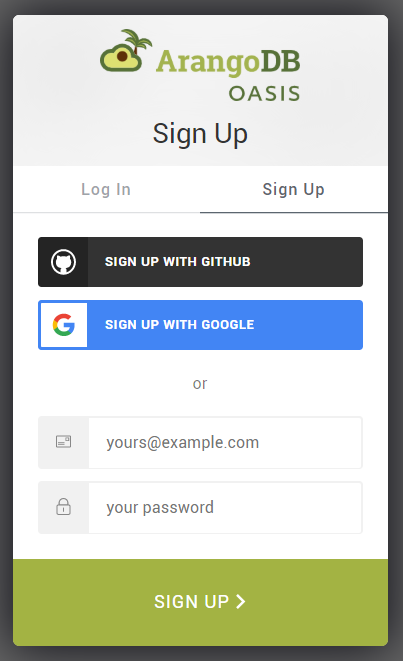

# Getting Started with ArangoDB Oasis

The instructions below are a quick start guide on how to set up your first
ArangoDB deployment in Oasis. It covers everything from creating an account
to using the Oasis web interface to set up a test organization, project and
deployment, as well as accessing and deleting the deployment.

For general information about ArangoDB Oasis, see
[cloud.arangodb.com](https://cloud.arangodb.com/home?utm_source=docs&utm_medium=cluster_pages&utm_campaign=docs_traffic){:target="_blank"}.

A video series on how to get started with Oasis is also available:



## Prerequisites

Please have following information at hand for registration:

- An **email address**, required for email verification.

If you use a public email service provider (e.g. Hotmail), make sure to have
the following information at hand as well:

- A **mobile phone number**, required for SMS verification


One mobile phone number will be associated with one account and cannot be
used for multiple accounts.


## How to create a new account

1. Go to [cloud.arangodb.com](https://cloud.arangodb.com/home?utm_source=docs&utm_medium=cluster_pages&utm_campaign=docs_traffic){:target="_blank"}.
2. Click the _Start Free_ button or click the _Sign Up_ link in the top
   right corner.
3. Review the terms & conditions and privacy policy and click _I accept_.
4. Select the type of sign up you would like to use (GitHub, Google, or
   email address).
    - For GitHub or Google please follow on-screen instructions.
    - For the email address option, type your desired email address in the
      email field and type a strong password in the password field.
    - Click the _Sign up_ button

   You will receive a verification email. In that mail, click the
   _Verify my email address_ link or button.
   It will open a page in ArangoDB Oasis that says _Welcome back!_
5. Click the _Log in_ button to continue and login.
6. If you signed up with an email address of a public email service provider (e.g. Hotmail),
   a form appears asking for your mobile phone number. Enter the country code
   and the number of the mobile phone you want to use for this account.
   For company email addresses, this step is skipped.
7. If you had to enter your phone number in the previous step, a verification
   code will be sent via SMS to the mobile number you entered. Enter the
   verification code.
8. A form will appear asking for your name. Enter your first, last and company
   name, and then press the _Save_ button.
9. An organization with a default project will now be prepared for you.
   Once that is completed, you will be redirected to the
   [ArangoDB Oasis dashboard](https://cloud.arangodb.com/dashboard){:target="_blank"}.

## General hierarchy

ArangoDB Oasis supports multi-tenant setups via organizations.
You can create your own organization(s) and invite collaborators or join
existing ones via invites. Your organization contains projects.
Your projects hold your deployments.

- [**Organizations**](organizations.html)
  represent (commercial) entities such as companies.
  You can be part of multiple organizations with a single user account.
  - [**Projects**](projects.html)
    represent organizational units such as teams or applications.
    - [**Deployments**](deployments.html)
      are the actual instances of ArangoDB clusters.

## Creating a new project


A default project is automatically created for you.
You can skip this paragraph unless you want to add additional projects.


See [Projects: How to create a new project](projects.html#how-to-create-a-new-project)

Also see the video
[Projects with ArangoDB Oasis](https://www.youtube.com/watch?v=b7q-PdLEpug&list=PL0tn-TSss6NWH3DNyF96Zbz8LQ0OaFmvS&index=4&t=0s){:target="_blank"}.

## Creating a new deployment

See [Deployments: How to create a new deployment](deployments.html#how-to-create-a-new-deployment)

Also see the video
[Create a Deployment on ArangoDB Oasis](https://www.youtube.com/watch?v=yg2FfcNsKFc&list=PL0tn-TSss6NWH3DNyF96Zbz8LQ0OaFmvS&index=9&t=0s){:target="_blank"}.

## Free-to-try vs. professional service

ArangoDB Oasis comes with a free-to-try plan that lets you test our ArangoDB
Cloud for free for 14 days. After the trial period, your deployments will
automatically be deleted.

You can convert to the professional service model at any time by adding 
your billing details and at least one payment method.

See:
- [Organizations: How to add billing details](organizations.html#how-to-add-billing-details)
- [Organizations: How to add a payment method](organizations.html#how-to-add-a-payment-method)

## Limitations of ArangoDB Oasis

ArangoDB Oasis aims to make all features of the ArangoDB Enterprise Edition
available to you, but there are a few limitations:

1. Encryption (both at rest & network traffic) is always on and cannot be
   disabled for security reasons.
2. Foxx services are not allowed to call out to the internet for security
   reasons. Incoming calls to Foxx services are fully supported.
3. LDAP authentication & Audit trails are currently unavailable, but will be
   supported in the near future.
