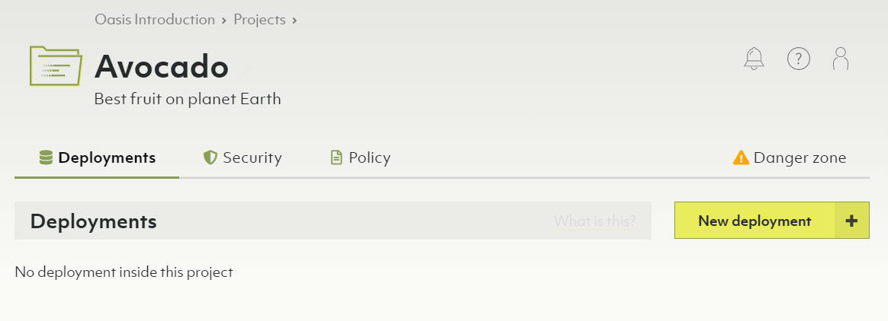
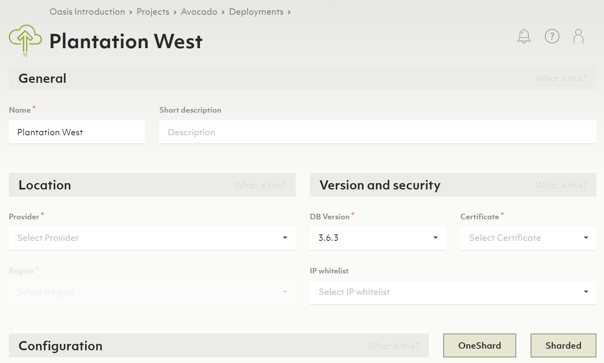
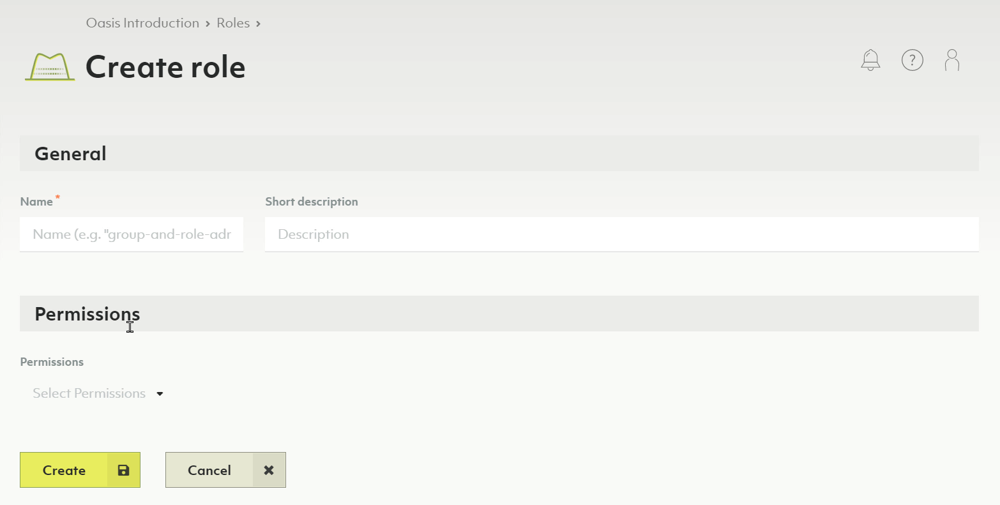

# Project Guide

This guide explains how to create projects in Oasis, and how they are used to
group deployments in your organization.

### Creating a new project

1. In the main navigation, in the _Projects_ section, click the _Overview_ link.
2. Click the _New project_ button.
3. Enter a name and optional description for your new project.

   

4. Click the _Create_ button.
5. You will now be taken to the project summary page.

   

**Notes**

- Projects contain exactly **one policy**.
- Within that policy, you can define role bindings to regulate access control
  on a project level.


Deleting a project will delete contained deployments, certificates & IP allowlists.
This operation is **irreversible**.


## Deployments

Below projects in the Oasis deployment hierarchy are deployments. A deployment
contains an ArangoDB, configured as you choose. You can have any number of
deployments under one project.

Each deployment can also be backed up manually or automatically by schedules
you can define.

In essence, you can create whatever structure fits you for a given organization,
its projects and deployments.

Also see the video
[Create a Deployment on ArangoDB Oasis](https://www.youtube.com/watch?v=yg2FfcNsKFc&list=PL0tn-TSss6NWH3DNyF96Zbz8LQ0OaFmvS&index=9&t=0s){:target="_blank"}.

### Creating a new deployment

1. If you don't have a project, yet, [create one first](#creating-a-new-project).
2. In the main navigation, in the _Projects_ section, click on the project for
   which you want to create a new deployment.
3. Navigate to the _Deployments_ tab. You will see an empty list or a list with
   your project's deployments.
4. Press the _New deployment_ button.
5. Set up your deployment (see [Getting Started](./getting-started.html#creating-a-new-deployment)).

**Notes**

- Deployments contain exactly **one policy**.
- Within that policy, you can define role bindings to regulate access control
  on a deployment level.


Deleting a deployment will delete all its data and backups.
This operation is **irreversible**.


## Roles

A role is a set of permissions. Roles can then be bound to groups (preferably)
or individual members. These bindings contribute to the respective organization,
project or deployment policy.

### Creating a new role

1. In the main navigation, in the _Access Control_ section, click on _Roles_.
2. Press the _New role_ button.
3. Enter a name and optional description for your new role.
4. Select the permissions you want to assign to your new role.
5. Press the _Create_ button.

### Viewing or managing an existing role

1. In the main navigation, in the _Access Control_ section, click on _Roles_.
2. Press the icons in the _Actions_ column to view, edit or delete a role.

**Notes**

- You cannot delete predefined system roles.
- Also see [Reference: predefined roles](#reference-predefined-roles)

## Reference: ArangoDB Oasis Site Hierarchy

Your global account holds:

- Organizations (each has exactly 1 policy)
- Members (contains members of an organization)
- Groups (contains groups of related members)
- Roles (contains individual permissions that can be assigned to members or groups)
- Policy (binds roles to members or groups on an organization level)
- Projects (each has exactly 1 policy)
  - Deployments (contains ArangoDB instances, each has exactly 1 policy)
  - Certificate (utilized for encrypted remote administration)
  - Policy (binds roles to members or groups on a project level)
