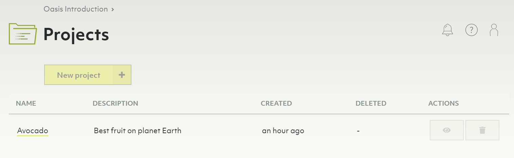
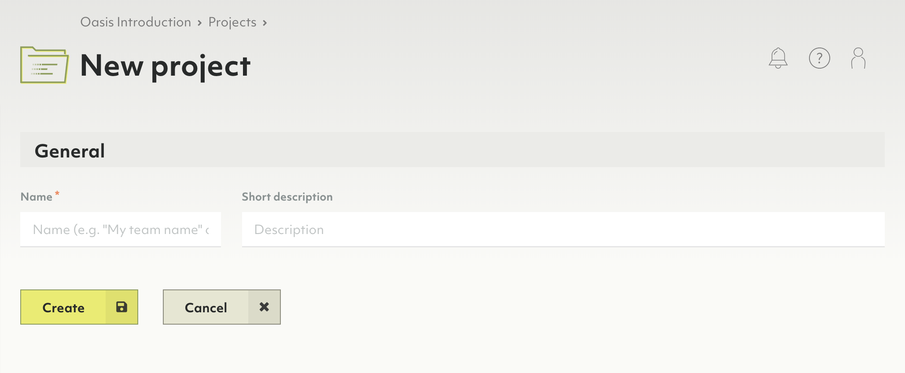
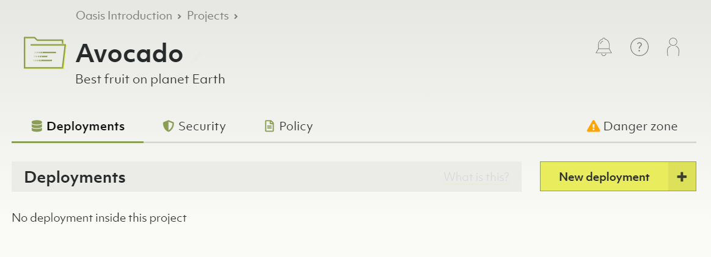

# Projects

Below organizations in the Oasis deployment hierarchy are projects. They can
represent organizational units such as teams, product groups, environments
(e.g. staging vs. production). You can have any number of projects under one
organization.

Projects are a container for related deployments, certificates & IP whitelists.
Projects also come with their own policy for access control. You can have any
number of deployment under one project.

In essence, you can create whatever structure fits you for a given organization,
its projects and deployments.

## How to create a new project

1. Click on _Overview_ in the _Projects_ section of the main navigation.
2. Click the _New project_ button.
3. Enter a name and optionally a description for your new project.
4. Click the _Create_ button.
5. You will be taken to the project page.
6. To change the name or description, click on either at the top of the page.

**Notes**

- Projects contain exactly **one policy**.
- Within that policy, you can define role bindings to regulate access control
  on a project level.

## How to delete a project


Deleting a project will delete contained deployments, certificates & IP whitelists.
This operation is **irreversible**.


1. Click on _Overview_ in the _Projects_ section of the main navigation.
2. Click on a trash can icon in the _Actions_ column.
3. Enter `Delete!` to confirm and click _Yes_.

Alternatively, you can also delete a project via the project page:

1. Click on a project name in the _Projects_ section of the main navigation.
2. Click on the _Danger zone_ tab.
3. Click the _Delete project..._ button.
4. Enter `Delete!` to confirm and click _Yes_.

## How to manage IP whitelists

## How to manage certificates

## How to manage role bindings
