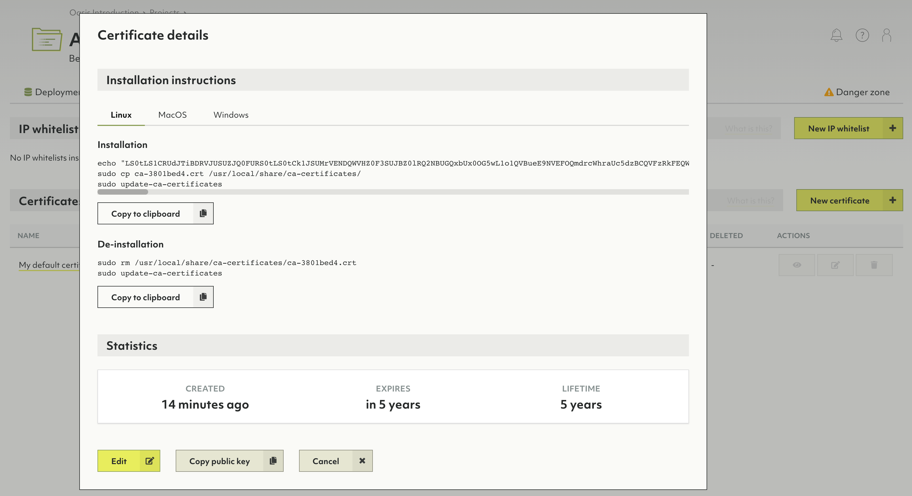

# Projects

Below organizations in the Oasis deployment hierarchy are projects. They can
represent organizational units such as teams, product groups, environments
(e.g. staging vs. production). You can have any number of projects under one
organization.

Projects are a container for related deployments, certificates & IP allowlists.
Projects also come with their own policy for access control. You can have any
number of deployment under one project.

In essence, you can create whatever structure fits you for a given organization,
its projects and deployments.

## How to create a new project

1. Click on _Overview_ in the _Projects_ section of the main navigation.
2. Click the _New project_ button.
3. Enter a name and optionally a description for your new project.
4. Click the _Create_ button.
5. You will be taken to the project page.
6. To change the name or description, click on either at the top of the page.


Projects contain exactly **one policy**. Within that policy, you can define
role bindings to regulate access control on a project level.


## How to create a new deployment

See [Deployments: How to create a new deployment](deployments.html#how-to-create-a-new-deployment)

## How to delete a project


Deleting a project will delete contained deployments, certificates & IP allowlists.
This operation is **irreversible**.


1. Click on _Overview_ in the _Projects_ section of the main navigation.
2. Click on a trash can icon in the _Actions_ column.
3. Enter `Delete!` to confirm and click _Yes_.

Alternatively, you can also delete a project via the project page:

1. Click on a project name in the _Projects_ section of the main navigation.
2. Click on the _Danger zone_ tab.
3. Click the _Delete project..._ button.
4. Enter `Delete!` to confirm and click _Yes_.

## How to manage IP allowlists

IP allowlists let you limit access to your deployment to certain IP ranges.
It is optional, but strongly recommended to do so.

You can create an allowlist as part of 

1. Click on a project name in the _Projects_ section of the main navigation.
2. Click on the _Security_ tab.
3. In the _IP allowlists_ section, click on:
   - The _New IP allowlist_ button to create a new allowlist.
   - A name or the _eye_ icon in the _Actions_ column to view the allowlist.
   - The _pencil_ icon to edit the allowlist.
     You can also view the allowlist and click the _Edit_ button.
   - The _trash can_ icon to delete the allowlist.

## How to manage certificates

Certificates are utilized for encrypted remote administration.

Certificates that do have the _Use well known certificate_ option enabled do
not need any installation and will be supported by almost all web-browsers
automatically.

Each certificate you create in ArangoDB Oasis that has the
_Use well known certificate_ option disabled, you will also need to install on
your local machine. This operation will slightly vary between operating systems.

1. Click on a project name in the _Projects_ section of the main navigation.
2. Click on the _Security_ tab.
3. In the _Certificates_ section, click on:
   - The _New certificate_ button to create a new certificate.
   - A name or the _eye_ icon in the _Actions_ column to view a certificate.
     The dialog that opens provides instructions on how to install and uninstall
     the certificate.
   - The _pencil_ icon to edit a certificate.
     You can also view a certificate and click on the _Edit_ button.
   - The _tag_ icon to make the certificate the new default.
   - The _trash can_ icon to delete a certificate.

 


TODO
## Installing a new certificate

Certificates that do have the _Use well known certificate_ option enabled do
not need any installation and will be supported by almost all web-browsers
automatically.

Each certificate you create in ArangoDB Oasis that has the
_Use well known certificate_ option disabled, you will also need to install on
your local machine. This operation will slightly vary between operating systems.

1. In the main navigation, in the _Projects_ section, click on the project for
   which you want to install a new certificate.
2. Navigate to the _Certificates_ tab.

   

3. From the list of certificates, click on the one you want to install.
4. Navigate to the tab of the operating system of your choice.
5. Under _Installation instructions_, copy the commands by pressing the
   _Copy to clipboard_ button.

   

6. Open a console on your local computer and run the commands that are provided.

Also see the video
[Certificates with ArangoDB Oasis](https://www.youtube.com/watch?v=TBU7TIvewV0&list=PL0tn-TSss6NWH3DNyF96Zbz8LQ0OaFmvS&index=5&t=0s){:target="_blank"}.


## How to manage role bindings

See:
- [Access Control: How to view, edit or remove role bindings of a policy](access-control.html#how-to-view-edit-or-remove-role-bindings-of-a-policy)
- [Access Control: How to add a role binding to a policy](access-control.html#how-to-add-a-role-binding-to-a-policy)
