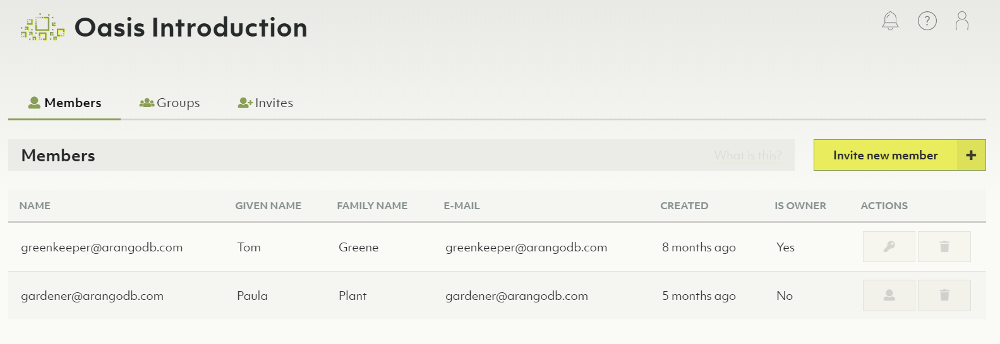
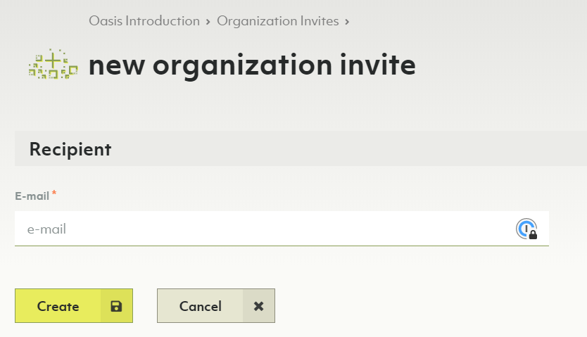
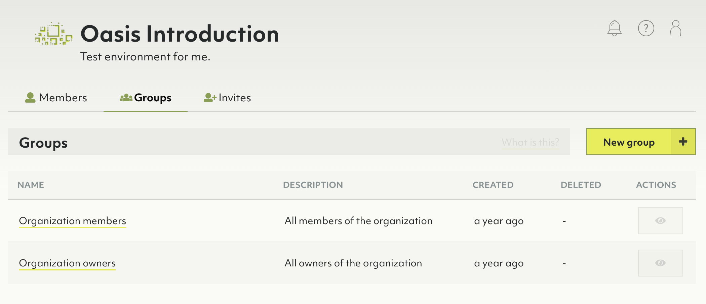
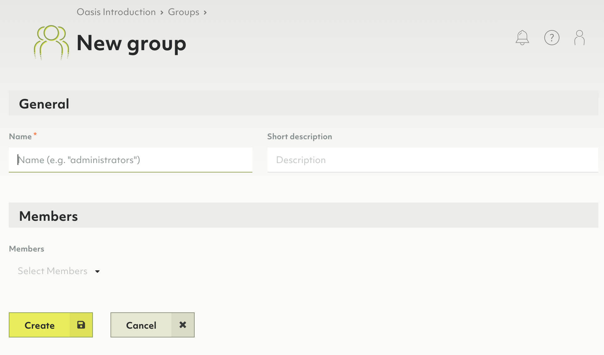
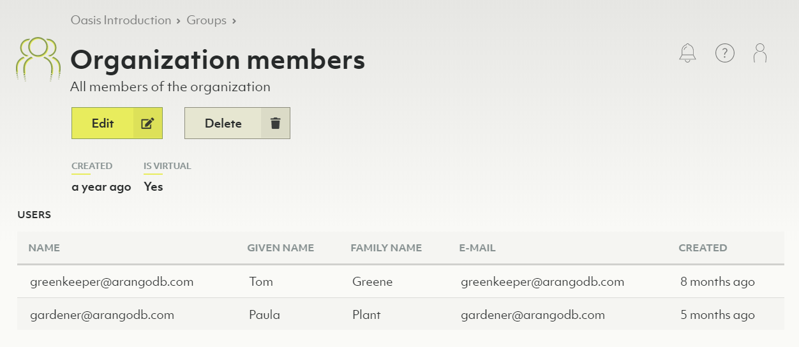
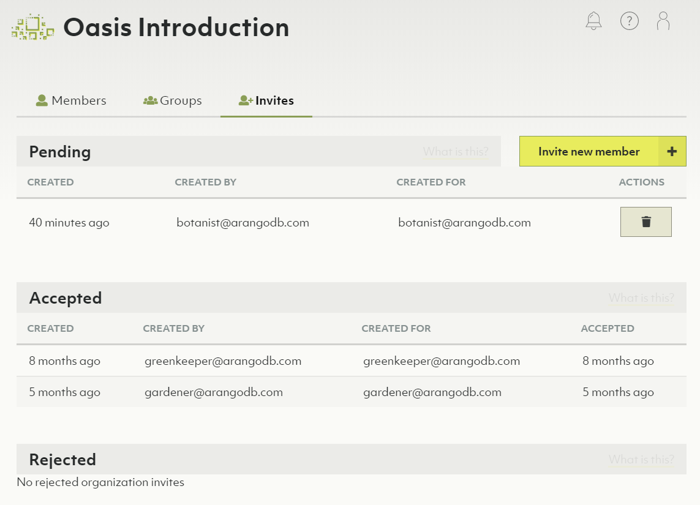

# Users and Groups

## Users, groups & members

When you use Oasis, you are logged in as a user.
A user has properties such as name & email address.
Most important of the user is that it serves as an identity of a person.

A user is member of one or more organizations in Oasis.
You can become a member of an organization in the following ways:

- Create a new organization. You will become the first member and owner of that
  organization.
- Be invited to join an organization. Once accepted (by the invited user), this
  user becomes a member of the organization.

If the number of members of an organization becomes large, it helps to group
users. In Oasis a group is part of an organization and a group contains
a list of users. All users of the group must be member of the owning organization.

In the **People** section of the dashboard you can manage users, groups and
invites for the organization.

To edit permissions of members see [Access Control](access-control.html).

## Members

Members are a list of users that can access an organization.

### How to add a new member to the organization

1. In the main navigation, click on _People_ in the _Organization_ section.
2. Optionally click on the _Invites_ tab.
3. Click the _Invite new member_ button.
4. In the form that appears, enter the email address of the person you want to
   invite.
5. Press the _Create_ button.
6. An email with an organization invite will now be sent to the specified
   email address.
7. After accepting the invite the person will be added to the organization
   [members](#members).

### How to respond to an organization invite

See [My Account: How to respond to my invites](my-account.html#how-to-respond-to-my-invites)

### How to remove a member from the organization

1. Click the _People_ link in the main navigation.
2. Delete a member by pressing the _Trash_ icon in the _Actions_ column.
3. Confirm the deletion in the dialog that pops up


You cannot delete members who are organization owners.


### How to make a member an organization owner

1. Click the _People_ link in the main navigation.
2. You can convert a member to an organization owner by pressing the _Key_ icon
   in the _Actions_ column.
3. You can convert a member back to a normal user by pressing the _User_ icon
   in the _Actions_ column.

## Groups

A group is a defined set of members. Groups can then be bound to roles. These
bindings contribute to the respective organization, project or deployment policy.

### How to create a new group

1. Click on _People_ in the main navigation, then on the _Groups_ tab.
2. Press the _New group_ button.
3. Enter a name and optionally a description for your new group.
4. Select the members you want to be part of the group.
5. Press the _Create_ button.

### How to view, edit or remove a group

1. Click on _People_ in the main navigation, then on the _Groups_ tab.
2. Click on an icon in the _Actions_ column:
   - _Eye_: View group
   - _Pencil_: Edit group
   - _Trash bin_: Delete group

You can also click on a group name to view it. There are buttons to _Edit_ and
_Delete_ the currently viewed group.


The groups _Organization members_ and _Organization owners_ are virtual groups
and cannot be changed. They always reflect the current set of organization
members and owners.


## Invites

### How to create a new organization invite

See [How to add a new member to the organization](#how-to-add-a-new-member-to-the-organization)

### How to view the status of invitations

1. In the main navigation, click on _People_ in the _Organization_ section.
2. Click on the _Invites_ tab.
3. The created invites are displayed, grouped by status _Pending_,
   _Accepted_ and _Rejected_.
4. You may delete pending invites by clicking on the trash can icon in the
   _Actions_ column.

