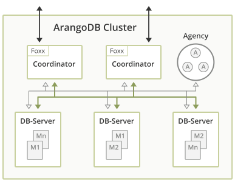
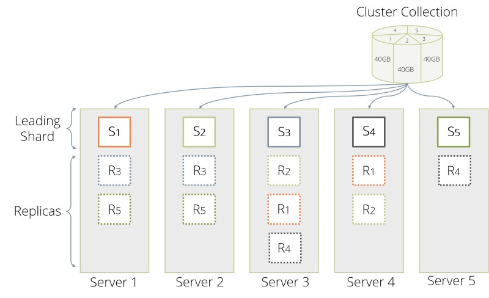

Cluster Architecture
====================

The Cluster architecture of ArangoDB is a _CP_ master/master model with no
single point of failure. 

With "CP" in terms of the [CAP theorem](https://en.wikipedia.org/wiki/CAP_theorem){:target="_blank"}
we mean that in the presence of a
network partition, the database prefers internal consistency over
availability. With "master/master" we mean that clients can send their
requests to an arbitrary node, and experience the same view on the
database regardless. "No single point of failure" means that the cluster
can continue to serve requests, even if one machine fails completely.

In this way, ArangoDB has been designed as a distributed multi-model
database. This section gives a short outline on the Cluster architecture and
how the above features and capabilities are achieved.

Structure of an ArangoDB Cluster
--------------------------------

An ArangoDB Cluster consists of a number of ArangoDB instances
which talk to each other over the network. They play different roles,
which will be explained in detail below. 

The current configuration
of the Cluster is held in the _Agency_, which is a highly-available
resilient key/value store based on an odd number of ArangoDB instances
running [Raft Consensus Protocol](https://raft.github.io/){:target="_blank"}.

For the various instances in an ArangoDB Cluster there are three distinct
roles:

- _Agents_
- _Coordinators_
- _DB-Servers_.

In the following sections we will shed light on each of them.



### Agents

One or multiple _Agents_ form the _Agency_ in an ArangoDB Cluster. The
_Agency_ is the central place to store the configuration in a Cluster. It
performs leader elections and provides other synchronization services for
the whole Cluster. Without the _Agency_ none of the other components can
operate.

While generally invisible to the outside the _Agency_ is the heart of the
Cluster. As such, fault tolerance is of course a must have for the
_Agency_. To achieve that the _Agents_ are using the
[Raft Consensus Algorithm](https://raft.github.io/){:target="_blank"}.
The algorithm formally guarantees
conflict free configuration management within the ArangoDB Cluster.

At its core the _Agency_ manages a big configuration tree. It supports
transactional read and write operations on this tree, and other servers
can subscribe to HTTP callbacks for all changes to the tree.

### Coordinators

_Coordinators_ should be accessible from the outside. These are the ones
the clients talk to. They will coordinate cluster tasks like
executing queries and running Foxx services. They know where the
data is stored and will optimize where to run user supplied queries or
parts thereof. _Coordinators_ are stateless and can thus easily be shut down
and restarted as needed.

### DB-Servers

_DB-Servers_ are the ones where the data is actually hosted. They
host shards of data and using synchronous replication a _DB-Server_ may
either be _leader_ or _follower_ for a shard. Document operations are first
applied on the _leader_ and then synchronously replicated to 
all followers.

Shards must not be accessed from the outside but indirectly through the
_Coordinators_. They may also execute queries in part or as a whole when
asked by a _Coordinator_.

See [Sharding](#sharding) below for more information.

Many sensible configurations
----------------------------

This architecture is very flexible and thus allows many configurations,
which are suitable for different usage scenarios:

 1. The default configuration is to run exactly one _Coordinator_ and
    one _DB-Server_ on each machine. This achieves the classical
    master/master setup, since there is a perfect symmetry between the
    different nodes, clients can equally well talk to any one of the
    _Coordinators_ and all expose the same view to the data store. _Agents_
    can run on separate, less powerful machines.
 2. One can deploy more _Coordinators_ than _DB-Servers_. This is a sensible
    approach if one needs a lot of CPU power for the Foxx services,
    because they run on the _Coordinators_.
 3. One can deploy more _DB-Servers_ than _Coordinators_ if more data capacity
    is needed and the query performance is the lesser bottleneck
 4. One can deploy a _Coordinator_ on each machine where an application
    server (e.g. a node.js server) runs, and the _Agents_ and _DB-Servers_
    on a separate set of machines elsewhere. This avoids a network hop
    between the application server and the database and thus decreases
    latency. Essentially, this moves some of the database distribution
    logic to the machine where the client runs.

As you can see, the _Coordinator_ layer can be scaled and deployed independently
from the _DB-Server_ layer.


It is a best practice and a recommended approach to run _Agent_ instances
on different machines than _DB-Server_ instances.

When deploying using the tool [_Starter_](deployment-arango-dbstarter.html)
this can be achieved by using the options `--cluster.start-dbserver=false` and
`--cluster.start-coordinator=false` on the first three machines where the _Starter_
is started, if the desired _Agency_ _size_ is 3, or on the first 5 machines
if the desired _Agency_ _size_ is 5.



The different instances that form a Cluster are supposed to be run in the same
_Data Center_ (DC), with reliable and high-speed network connection between
all the machines participating to the Cluster.

Multi-datacenter Clusters, where the entire structure and content of a Cluster located
in a specific DC is replicated to others Clusters located in different DCs, are
possible as well. See [Datacenter to datacenter replication](architecture-deployment-modes-dc2-dc.html)
(DC2DC) for further details.



Sharding
--------

Using the roles outlined above an ArangoDB Cluster is able to distribute
data in so called _shards_ across multiple _DB-Servers_. Sharding
allows to use multiple machines to run a cluster of ArangoDB
instances that together constitute a single database. This enables
you to store much more data, since ArangoDB distributes the data
automatically to the different servers. In many situations one can
also reap a benefit in data throughput, again because the load can
be distributed to multiple machines.



From the outside this process is fully transparent:
An application may talk to any _Coordinator_  and
it will automatically figure out where the data is currently stored (read-case) 
or is to be stored (write-case). The information about the _shards_ 
is shared across all _Coordinators_ using the _Agency_.

_Shards_ are configured per _collection_ so multiple _shards_ of data form
the _collection_ as a whole. To determine in which _shard_ the data is to
be stored ArangoDB performs a hash across the values. By default this
hash is being created from the document __key_.

For further information, please refer to the
[_Cluster Sharding_](architecture-deployment-modes-cluster-sharding.html) section.

OneShard
--------



A OneShard deployment offers a practicable solution that enables significant
performance improvements by massively reducing cluster-internal communication
and allows running transactions with ACID guarantees on shard leaders.

By restricting collections to a single shard and placing them on one DB-Server
node, whole queries can be pushed to and executed on that server. The
Coordinator will only get back the final result. This setup is highly
recommended for most graph use cases and join-heavy queries.


For graphs larger than what fits on a single DB-Server node, you can use the
[**SmartGraphs**](graphs-smart-graphs.html) feature to efficiently limit the
network hops between Coordinator and DB-Servers.


Without the OneShard feature query processing works as follows in a cluster:

- The Coordinator accepts and analyzes the query.
- If collections are accessed then the Coordinator distributes the accesses
  to collections to different DB-Servers that hold parts (shards) of the
  collections in question.
- This distributed access requires network-traffic from Coordinator to
  DB-Servers and back from DB-Servers to Coordinators and is therefore
  expensive.

Another cost factor is the memory and CPU time required on the Coordinator
when it has to process several concurrent complex queries. In such
situations Coordinators may become a bottleneck in query processing,
because they need to send and receive data on several connections, build up
results for collection accesses from the received parts followed by further
processing.


If the database involved in a query is a OneShard database,
then the OneShard optimization is applied to run the
query on the responsible node like on a single server. However, it still being
a cluster setup means collections can be replicated synchronously to ensure
resilience etc.

### How to use the OneShard feature?

The OneShard feature is enabled by default if you use the ArangoDB
Enterprise Edition and if the database is sharded as `"single"`. In this case the
optimizer rule `cluster-one-shard` is applied automatically. 
There are two ways to achieve this:

- If you want your entire cluster to be a OneShard deployment, use the
  [startup option](programs-arangod-options.html#cluster)
  `--cluster.force-one-shard`. It sets the immutable `sharding` database
  property to `"single"` for all newly created databases, which in turn
  enforces the OneShard conditions for collections that will be created in it.
  The `_graphs` system collection will be used for `distributeShardsLike`.

- For individual OneShard databases, set the `sharding` database property to `"single"`
  to enforce the OneShard condition. The `_graphs` system collection will be used for
  `distributeShardsLike`. It is not possible to change the `sharding` database
  property afterwards or overwrite this setting for individual collections.
  For non-OneShard databases the value of the `sharding` database property is
  either `""` or `"flexible"`.


The prototype collection does not only control the sharding, but also the
replication factor for all collections which follow its example. If the
`_graphs` system collection is used for `distributeShardsLike`, then the
replication factor can be adjusted by changing the `replicationFactor`
property of the `_graphs` collection (affecting this and all following
collections) or via the startup option `--cluster.system-replication-factor`
(affecting all system collections and all following collections).


**Example**

The easiest way to make use of the OneShard feature is to create a database
with the extra option `{ sharding: "single" }`. As done in the following
example:

```js
arangosh> db._createDatabase("oneShardDB", { sharding: "single" } )

arangosh> db._useDatabase("oneShardDB")

arangosh@oneShardDB> db._properties()
{
  "id" : "6010005",
  "name" : "oneShardDB",
  "isSystem" : false,
  "sharding" : "single",
  "replicationFactor" : 1,
  "writeConcern" : 1,
  "path" : ""
}
```

Now we can go ahead and create a collection as usual:

```js
arangosh@oneShardDB> db._create("example1")

arangosh@oneShardDB> db.example1.properties()
{
  "isSmart" : false,
  "isSystem" : false,
  "waitForSync" : false,
  "shardKeys" : [
    "_key"
  ],
  "numberOfShards" : 1,
  "keyOptions" : {
    "allowUserKeys" : true,
    "type" : "traditional"
  },
  "replicationFactor" : 2,
  "minReplicationFactor" : 1,
  "writeConcern" : 1,
  "distributeShardsLike" : "_graphs",
  "shardingStrategy" : "hash",
  "cacheEnabled" : false
}
```

As you can see the `numberOfShards` is set to `1` and `distributeShardsLike`
is set to `_graphs`. These attributes have been automatically been set
because we specified the `{ "sharding": "single" }` options object when
creating the database.

To do this manually for individual collections, use `{ "sharding": "flexible" }`
on the database level and then create a collection in the following way:

```js
db._create("example2", { "numberOfShards": 1 , "distributeShardsLike": "_graphs" })
```

Here we used the `_graphs` collection again, but any other existing
collection that has not been created with the `distributeShardsLike`
option itself can be used as well in a flexibly sharded database.

### Running Queries

For this arangosh example, we first insert a few documents into a collection,
then create a query and explain it to inspect the execution plan.

```js
arangosh@oneShardDB> for (let i = 0; i < 10000; i++) { db.example.insert({ "value" : i }); }

arangosh@oneShardDB> q = "FOR doc IN @@collection FILTER doc.value % 2 == 0 SORT doc.value ASC LIMIT 10 RETURN doc";

arangosh@oneShardDB> db._explain(q, { "@collection" : "example" })

Query String (88 chars, cacheable: true):
 FOR doc IN @@collection FILTER doc.value % 2 == 0 SORT doc.value ASC LIMIT 10 RETURN doc

Execution plan:
 Id   NodeType                  Site   Est.   Comment
  1   SingletonNode             DBS       1   * ROOT
  2   EnumerateCollectionNode   DBS   10000     - FOR doc IN example   /* full collection scan, 1 shard(s) */   FILTER ((doc.`value` % 2) == 0)   /* early pruning */
  5   CalculationNode           DBS   10000       - LET #3 = doc.`value`   /* attribute expression */   /* collections used: doc : example */
  6   SortNode                  DBS   10000       - SORT #3 ASC   /* sorting strategy: constrained heap */
  7   LimitNode                 DBS      10       - LIMIT 0, 10
  9   RemoteNode                COOR     10       - REMOTE
 10   GatherNode                COOR     10       - GATHER
  8   ReturnNode                COOR     10       - RETURN doc

Indexes used:
 none

Optimization rules applied:
 Id   RuleName
  1   move-calculations-up
  2   move-filters-up
  3   move-calculations-up-2
  4   move-filters-up-2
  5   cluster-one-shard
  6   sort-limit
  7   move-filters-into-enumerate

```

As it can be seen in the explain output almost the complete query is
executed on the DB-Server (`DBS` for nodes 1-7) and only 10 documents are
transferred to the Coordinator. In case we do the same with a collection
that consists of several shards we get a different result:

```js
arangosh> db._createDatabase("shardedDB")

arangosh> db._useDatabase("shardedDB")

arangosh@shardedDB> db._properties()
{
  "id" : "6010017",
  "name" : "shardedDB",
  "isSystem" : false,
  "sharding" : "flexible",
  "replicationFactor" : 1,
  "writeConcern" : 1,
  "path" : ""
}

arangosh@shardedDB> db._create("example", { numberOfShards : 5})

arangosh@shardedDB> for (let i = 0; i < 10000; i++) { db.example.insert({ "value" : i }); }

arangosh@shardedDB> db._explain(q, { "@collection" : "example" })

Query String (88 chars, cacheable: true):
 FOR doc IN @@collection FILTER doc.value % 2 == 0 SORT doc.value ASC LIMIT 10 RETURN doc

Execution plan:
 Id   NodeType                  Site   Est.   Comment
  1   SingletonNode             DBS       1   * ROOT
  2   EnumerateCollectionNode   DBS   10000     - FOR doc IN example   /* full collection scan, 5 shard(s) */   FILTER ((doc.`value` % 2) == 0)   /* early pruning */
  5   CalculationNode           DBS   10000       - LET #3 = doc.`value`   /* attribute expression */   /* collections used: doc : example */
  6   SortNode                  DBS   10000       - SORT #3 ASC   /* sorting strategy: constrained heap */
 11   RemoteNode                COOR  10000       - REMOTE
 12   GatherNode                COOR  10000       - GATHER #3 ASC  /* parallel, sort mode: heap */
  7   LimitNode                 COOR     10       - LIMIT 0, 10
  8   ReturnNode                COOR     10       - RETURN doc

Indexes used:
 none

Optimization rules applied:
 Id   RuleName
  1   move-calculations-up
  2   move-filters-up
  3   move-calculations-up-2
  4   move-filters-up-2
  5   scatter-in-cluster
  6   distribute-filtercalc-to-cluster
  7   distribute-sort-to-cluster
  8   remove-unnecessary-remote-scatter
  9   sort-limit
 10   move-filters-into-enumerate
 11   parallelize-gather
```


It can be checked whether the OneShard feature is active or not by
inspecting the explain output. If the list of rules contains
`cluster-one-shard` then the feature is active for the given query.


Without the OneShard feature all documents have potentially to be sent to
the Coordinator for further processing. With this simple query this is actually
not true, because some other optimizations are performed that reduce the number
of documents. But still, a considerable amount of documents has to be
transferred from DB-Server to Coordinator only to apply a `LIMIT` of 10
documents there. The estimate for the *RemoteNode* is 10,000 in this example,
whereas it is 10 in the OneShard case.

### ACID Transactions on Leader Shards

ArangoDB's transactional guarantees are tunable. For transactions to be ACID
on the leader shards in a cluster, a few things need to be considered:

- The AQL query or [Stream Transaction](http/transaction-stream-transaction.html)
  must be eligible for the OneShard optimization, so that it is executed on a
  single DB-Server node.
- To ensure durability, enable `waitForSync` on query level to wait until data
  modifications have been written to disk.
- The collection option `writeConcern: 2` makes sure that a transaction is only
  successful if at least one replica is in sync.
- The RocksDB engine supports intermediate commits for larger document
  operations, potentially breaking the atomicity of transactions. To prevent
  this for individual queries you can increase `intermediateCommitSize`
  (default 512 MB) and `intermediateCommitCount` accordingly as query option.

### Limitations

The OneShard optimization will be used automatically for all eligible AQL queries
and streaming transactions.

For AQL queries, any of the following factors currently makes a query
unsuitable for the OneShard optimization:

- The query accesses collections with more than a single shard, different leader
  DB-Servers, or different `distributeShardsLike` prototype collections
- The query writes into a SatelliteCollection
- the query accesses an edge collection of a SmartGraph
- Usage of AQL user-defined functions
- Usage of AQL functions that can only execute on Coordinators.
  These functions are:
  - `COLLECTION_COUNT()`
  - `CURRENT_DATABASE()`
  - `CURRENT_USER()`
  - `COLLECTIONS()`
  - `DOCUMENT()` (only in versions before 3.7.5)
  - `VERSION()`
  - `SCHEMA_GET()`
  - `SCHEMA_VALIDATE()`
  - `V8()`

Synchronous replication
-----------------------

In an ArangoDB Cluster, the replication among the data stored by the _DB-Servers_
is synchronous.

Synchronous replication works on a per-shard basis. Using the option _replicationFactor_,
one configures for each _collection_ how many copies of each _shard_ are kept in the Cluster.


If a collection has a _replication factor_ of 1, its data is **not**
replicated to other _DB-Servers_. This exposes you to a risk of data loss, if
the machine running the _DB-Server_ with the only copy of the data fails permanently.

The _replication factor_ has to be set to a value equals or higher than 2
to achieve minimal data redundancy via the synchronous replication.

An equal-or-higher-than 2 _replication factor_ has to be set **explicitly**
when the collection is created, or can be set later at run time if you forgot
to set it at creation time.

When using a Cluster, please make sure all the collections that are important
(and should not be lost in any case) have a _replication factor_ equal or higher
than 2.


At any given time, one of the copies is declared to be the _leader_ and
all other replicas are _followers_. Internally, write operations for this _shard_
are always sent to the _DB-Server_ which happens to hold the _leader_ copy,
which in turn replicates the changes to all _followers_ before the operation
is considered to be done and reported back to the _Coordinator_.
Internally, read operations are all served by the _DB-Server_ holding the _leader_ copy,
this allows to provide snapshot semantics for complex transactions.

Using synchronous replication alone will guarantee consistency and high availability
at the cost of reduced performance: write requests will have a higher latency
(due to every write-request having to be executed on the _followers_) and
read requests will not scale out as only the _leader_ is being asked.

In a Cluster, synchronous replication will be managed by the _Coordinators_ for the client. 
The data will always be stored on the _DB-Servers_.

The following example will give you an idea of how synchronous operation
has been implemented in ArangoDB Cluster:

1. Connect to a _Coordinator_ via [_arangosh_](programs-arangosh.html)
2. Create a collection

    127.0.0.1:8530@_system> db._create("test", {"replicationFactor": 2})

3. The _Coordinator_ will figure out a *leader* and one *follower* and create
   one *shard* (as this is the default)
4. Insert data

    127.0.0.1:8530@_system> db.test.insert({"foo": "bar"})

5. The _Coordinator_ will write the data to the _leader_, which in turn will
replicate it to the _follower_.
6. Only when both were successful the result is reported to be successful:

   ```json
   {
       "_id" : "test/7987",
       "_key" : "7987",
       "_rev" : "7987"
   }
   ```

Obviously, synchronous replication comes at the cost of an increased latency for
write operations, simply because there is one more network hop within the
Cluster for every request. Therefore the user can set the _replicationFactor_
to 1, which means that only one copy of each shard is kept, thereby
switching off synchronous replication. This is a suitable setting for
less important or easily recoverable data for which low latency write
operations matter.

Automatic failover
------------------

### Failure of a follower

If a _DB-Server_ that holds a _follower_ copy of a _shard_ fails, then the _leader_
can no longer synchronize its changes to that _follower_. After a short timeout
(3 seconds), the _leader_ gives up on the _follower_ and declares it to be
out of sync.

One of the following two cases can happen:

**a)** If another _DB-Server_ (that does not hold a _replica_ for this _shard_ already)
       is available in the Cluster, a new _follower_ will automatically
       be created on this other _DB-Server_ (so the _replication factor_ constraint is
       satisfied again).

**b)** If no other _DB-Server_ (that does not hold a _replica_ for this _shard_ already)
       is available, the service continues with one _follower_ less than the number
       prescribed by the _replication factor_.

If the old _DB-Server_ with the _follower_ copy comes back, one of the following
two cases can happen:

**a)** If previously we were in case a), the _DB-Server_ recognizes that there is a new
      _follower_ that was elected in the meantime, so it will no longer be a _follower_
       for that _shard_.

**b)** If previously we were in case b), the _DB-Server_ automatically resynchronizes its
       data with the _leader_. The _replication factor_ constraint is now satisfied again
       and order is restored.

### Failure of a leader

If a _DB-Server_ that holds a _leader_ copy of a shard fails, then the _leader_
can no longer serve any requests. It will no longer send a heartbeat to
the _Agency_. Therefore, a _supervision_ process running in the _Raft_ _leader_
of the Agency, can take the necessary action (after 15 seconds of missing
heartbeats), namely to promote one of the _DB-Servers_ that hold in-sync
replicas of the _shard_ to _leader_ for that _shard_. This involves a
reconfiguration in the _Agency_ and leads to the fact that _Coordinators_
now contact a different _DB-Server_ for requests to this _shard_. Service
resumes. The other surviving _replicas_ automatically resynchronize their
data with the new _leader_. 

In addition to the above, one of the following two cases cases can happen:

a) If another _DB-Server_ (that does not hold a _replica_ for this _shard_ already)
   is available in the Cluster, a new _follower_ will automatically
   be created on this other _DB-Server_ (so the _replication factor_ constraint is
   satisfied again).
b) If no other _DB-Server_ (that does not hold a _replica_ for this _shard_ already)
   is available the service continues with one _follower_ less than the number
   prescribed by the _replication factor_.

When the _DB-Server_ with the original _leader_ copy comes back, it recognizes
that a new _leader_ was elected in the meantime, and one of the following
two cases can happen:

a) If previously we were in case a), since also a new _follower_ was created and
   the _replication factor_ constraint is satisfied, the _DB-Server_ will no
   longer be a _follower_ for that _shard_.
b) If previously we were in case b), the _DB-Server_ notices that it now holds
   a _follower_ _replica_ of that _shard_ and it resynchronizes its data with the
   new _leader_. The _replication factor_ constraint is now satisfied again, 
   and order is restored.

The following example will give you an idea of how _failover_
has been implemented in ArangoDB Cluster:

1. The _leader_ of a _shard_ (let's name it _DBServer001_) is going down.
2. A _Coordinator_ is asked to return a document:

    127.0.0.1:8530@_system> db.test.document("100069")

3. The _Coordinator_ determines which server is responsible for this document
   and finds _DBServer001_
4. The _Coordinator_ tries to contact _DBServer001_ and timeouts because it is
   not reachable.
5. After a short while the _supervision_ (running in parallel on the _Agency_)
   will see that _heartbeats_ from _DBServer001_ are not coming in
6. The _supervision_ promotes one of the _followers_ (say _DBServer002_), that
   is in sync, to be _leader_ and makes _DBServer001_ a _follower_.
7. As the _Coordinator_ continues trying to fetch the document it will see that
   the _leader_ changed to _DBServer002_
8. The _Coordinator_ tries to contact the new _leader_ (_DBServer002_) and returns
   the result:

    ```json
    {
        "_key" : "100069",
        "_id" : "test/100069",
        "_rev" : "513",
        "foo" : "bar"
    }
    ```
9. After a while the _supervision_ declares _DBServer001_ to be completely dead.
10. A new _follower_ is determined from the pool of _DB-Servers_.
11. The new _follower_ syncs its data from the _leader_ and order is restored.

Please note that there may still be timeouts. Depending on when exactly
the request has been done (in regard to the _supervision_) and depending
on the time needed to reconfigure the Cluster the _Coordinator_ might fail
with a timeout error.

Shard movement and resynchronization
------------------------------------

All _shard_ data synchronizations are done in an incremental way, such that
resynchronizations are quick. This technology allows to move shards
(_follower_ and _leader_ ones) between _DB-Servers_ without service interruptions.
Therefore, an ArangoDB Cluster can move all the data on a specific _DB-Server_
to other _DB-Servers_ and then shut down that server in a controlled way.
This allows to scale down an ArangoDB Cluster without service interruption,
loss of fault tolerance or data loss. Furthermore, one can re-balance the
distribution of the _shards_, either manually or automatically.

All these operations can be triggered via a REST/JSON API or via the
graphical web UI. All fail-over operations are completely handled within
the ArangoDB Cluster.

Microservices and zero administation
------------------------------------

The design and capabilities of ArangoDB are geared towards usage in
modern microservice architectures of applications. With the
[Foxx services](foxx.html) it is very easy to deploy a data
centric microservice within an ArangoDB Cluster.

In addition, one can deploy multiple instances of ArangoDB within the
same project. One part of the project might need a scalable document
store, another might need a graph database, and yet another might need
the full power of a multi-model database actually mixing the various
data models. There are enormous efficiency benefits to be reaped by
being able to use a single technology for various roles in a project.

To simplify life of the _devops_ in such a scenario we try as much as
possible to use a _zero administration_ approach for ArangoDB. A running
ArangoDB Cluster is resilient against failures and essentially repairs
itself in case of temporary failures. 

Deployment
----------

An ArangoDB Cluster can be deployed in several ways, e.g. by manually
starting all the needed instances, by using the tool
[_Starter_](programs-starter.html), in Docker and in Kubernetes.

See the [Cluster Deployment](deployment-cluster.html)
chapter for instructions.

ArangoDB is also available as
[cloud service - **ArangoDB Oasis**](https://cloud.arangodb.com/home?utm_source=docs&utm_medium=cluster_pages&utm_campaign=docs_traffic){:target="_blank"}.

Cluster ID
----------

Every ArangoDB instance in a Cluster is assigned a unique
ID during its startup. Using its ID a node is identifiable
throughout the Cluster. All cluster operations will communicate
via this ID.
