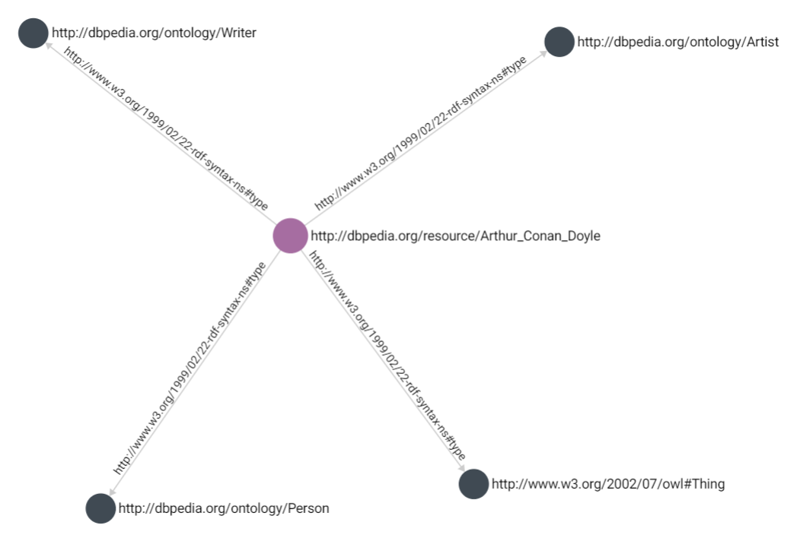

Mapping RDF data to ArangoDB Graphs
====================================

This document serves as a guide to getting started with 
[RDF](https://www.w3.org/TR/rdf11-concepts/){:target="_blank"} and ArangoDB. In it 
we highlight some potential approaches for working with RDF graphs and then some 
of the considerations when attempting to bring RDF data into ArangoDB. The 
concept of working with RDF graphs in ArangoDB is not fully supported, but we 
would like to start introducing solutions for mapping and start the conversation 
with the community. We welcome any feedback from the community on ways to
improve the ingestion of RDF graphs as we work on an official implementation for
ArangoDB. You can accomplish a lot with ArangoDB and RDF with a few workarounds,
depending on your needs but be sure to see the caveats section for some
considerations.

Getting Started
---------------

RDF graphs are purely directed graphs with no properties on vertices or edges. In
RDF, everything is referenced by edges; these edges are known as statements.
Statements are in the form `[subject, predicate, object, [graph]].` Statements pose 
an interesting challenge when trying to interpolate an RDF graph as a property 
graph. ArangoDB is uniquely suited to handle this due to having edges which 
have a similar structure to vertices and thus can be used to resemble an 
RDF graph or to instead represent RDF statements as properties associated 
with a `subject.` For this discussion, it is helpful to have an example; the
following is a simple RDF graph for Sir Arthur Conan Doyle.

```XML
<?xml version="1.0" encoding="UTF-8"?>
<rdf:RDF
   xmlns:rdf="http://www.w3.org/1999/02/22-rdf-syntax-ns#"
>
  <rdf:Description rdf:about="http://dbpedia.org/resource/Arthur_Conan_Doyle">
    <rdf:type rdf:resource="http://dbpedia.org/ontology/Person"/>
    <rdf:type rdf:resource="http://dbpedia.org/ontology/Writer"/>
    <rdf:type rdf:resource="http://www.w3.org/2002/07/owl#Thing"/>
    <rdf:type rdf:resource="http://dbpedia.org/ontology/Artist"/>
  </rdf:Description>
</rdf:RDF>
```

The above code is RDF in
[RDF/XML](https://www.w3.org/TR/rdf-syntax-grammar/){:target="_blank"} format.
This syntax can be considered the original/standard RDF syntax. However, many
different serializations exist, and thanks to their readability and ease of
parsing, has grown in popularity. 

```Turtle
<http://dbpedia.org/resource/Arthur_Conan_Doyle> <http://www.w3.org/1999/02/22-rdf-syntax-ns#type> <http://www.w3.org/2002/07/owl#Thing> .
<http://dbpedia.org/resource/Arthur_Conan_Doyle> <http://www.w3.org/1999/02/22-rdf-syntax-ns#type> <http://dbpedia.org/ontology/Person> .
<http://dbpedia.org/resource/Arthur_Conan_Doyle> <http://www.w3.org/1999/02/22-rdf-syntax-ns#type> <http://dbpedia.org/ontology/Artist> .
<http://dbpedia.org/resource/Arthur_Conan_Doyle> <http://www.w3.org/1999/02/22-rdf-syntax-ns#type> <http://dbpedia.org/ontology/Writer> .
```

This is the same RDF graph but serialized to
[N-Triples](https://www.w3.org/TR/n-triples/){:target="_blank"} format. This
format represents the same data from the same source. While the exploration of
RDF, its syntax, and various serializations are beyond the scope of this guide,
it is important to consider that the data ingestion isn't always in the same
format when dealing with RDF and is one of the few challenges we encounter when
dealing with RDF graphs.

The following is an example of how this RDF graph could be modeled in ArangoDB.
This approach: 
* Maps the `subject` and `object` as vertices
* Maps the `predicate` as the connecting edge
* [Hashes](https://www.arangodb.com/docs/stable/aql/functions-miscellaneous.html#hash-functions){:target="_blank"} the [referent](https://www.w3.org/TR/rdf11-concepts/#referents){:target="_blank"} to the `_key` value
* Preserves the full referent as a text property 

There can be issues that arise with this simple approach, and we discuss them throughout the guide, but this is a good place to start as it shows the 
potential for mapping the data. 


 Generate this graph for yourself by running the [notebook](https://colab.research.google.com/github/arangodb/interactive_tutorials/blob/master/notebooks/RDF_Import_Example.ipynb){:target="_blank"}.

Considerations
--------------

### Literals

In RDF even literal values are referenced by edge.  Literals may not have
exident edges (i.e., may not be the subject of a statement). RDF uses the XSD
type system for literals, so the string "Fred" is represented as `"Fred"^^xsd:String` 
or fully expanded as `"Fred" ^^http://…"`. Literals can also contain language 
and locale tags, for example, `"cat@en" ^^xsd:String` and `"chat@fr"^^xsd:String`. 
These language tags can be useful and would ideally be preserved. 

Literals could be added as a property instead of creating a separate vertex; this 
takes better advantage of using a property graph. If you are coming from a triple 
store or downloading your data using a [SPARQL](https://www.w3.org/TR/rdf-sparql-query/){:target="_blank"} 
query you could handle these properties when 
exporting. 

### IRI’s

#### Prefixes

In RDF, it is common to use [namespace prefixes](https://www.w3.org/TR/rdf-concepts/#section-URIspaces){:target="_blank"} 
with referrents for ease of parsing. This 
can be easily handled with a property graph in a few ways. The easiest approach 
is to add the statement prefixes to the document. This keeps the prefixes close 
to the data but results in a lot of duplicated fields. Another approach would be 
to append the prefix and form the full URI as a property.

#### Identifiers

IRI's (ex: `http://dbpedia.org/resource/`) are used as universal identifiers in 
RDF but contain contain special characaters, namely `:` and `/`, which make them not 
suitable for use as an ArangoDB `_key` attribute.  This is the reason the previous 
example hashes the IRI value. This has a downside of relying on the hashing 
algorithm and in our case MD5 is one way so it becomes required to store the full 
IRI string.

### Blank Nodes

Blank nodes are identifiers that have local scope and cannot (must not) be
referenced externally. Blank nodes are usually used in structures like lists and 
other situations where it is inconvenient to create IRI's.  They will cause problems
when reconciling differences between graphs. Hasing these values as well is a way 
to work around them but as they are considered temporary identifiers in the RDF 
world they could pose consistency issues in your RDF graph.

### Serializations

There are numerous RDF serializations, including XML and JSON based
serializations and gzipped serializations. Third party libraries will likely handle 
all of the serializations but it is a step that may effect how data is imported. 

### Ontology, Taxonomy, Class Inheritance, and RDFS

The final consideration is something that for many is the core of RDF and 
semantic data: *[Ontologies](https://www.w3.org/standards/semanticweb/ontology){:target="_blank"}*.
Not just ontologies but also class inheritance, and schema validation. One method 
would be add the ontology in a similar way to what has been suggested for the 
RDF graphs as ontologies are usually structured in the same way (or can be). 
However, how do you verify your data is always referencing the classes in your 
ontology? How can this data be used to make inferences if it cannot be validated?
ArangoDB has schema validation but this is limited to JSON schema and does not 
complex class checking. 

One approach to this would be to use a Foxx microservice to serve multiple 
knowledge graph functions.

#### DIY with Foxx

A [Foxx](https://www.arangodb.com/docs/stable/foxx.html){:target="_blank"} 
service could be used to perform lookups against a document collection
containing schema-like requirements. The data scientist could use this Foxx
service as the ingestion entry point, meaning the data import would need to be
validated before entry (resulting in slow imports). 

Additionally, the Foxx service could instead be used as an eventual consistency
checker that evaluates the data after import and either produces errors or take
some other action. This could be extended to offer inference and rule generation
based on the data inserted. Most of this functionality would rely on the Foxx
queues feature or require manual intervention. 

Using Foxx has its own drawbacks as it requires development efforts, consumes
resources on the database servers and coordinators, and uses node which isn't an
option for all organizations. 

The benefits of Foxx are the flexibility to program the precise needs of an
organization and with the potential for high performance. The service would be
located close to the data and has c++ access as a first class citizen. This has
the potential to reduce any negative performance impact that might normally come
with abstracting away this functionality.

### RDF-star

While there is still work to be done when trying to bring RDF graphs into property 
graphs, there is one approach that aims to make it more worthwhile. The 
[RDF-star](https://w3c.github.io/rdf-star/){:target="_blank"} implementation aims 
to bring the gap between RDF graph and property graph. Our initial internal approach
to bring RDF data into ArangoDB will be to take advantage of the RDF-star 
specification. The RDF-star specification allows for nesting attributes in RDF
statements to more closely mirror the benefits of a property graph. It is still
in draft form but multiple vendors and libraries have already added suport for it.
If you haven't already give the specification a look and let us know if you would 
like to see it in ArangoDB.
