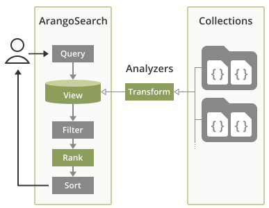

# Information Retrieval with ArangoSearch

{{ page.description}}
{:class="lead"}

ArangoSearch provides information retrieval features, natively integrated
into ArangoDB's query language and with support for all data models. It is
primarily a full-text search engine, a much more powerful alternative to the
[full-text index](indexing-fulltext.html) type. It can index nested fields
from multiple collections, optionally with transformations such as text
normalization and tokenization applied, rank query results by relevance and
more.

## Example Use Cases

- Perform federated full-text searches over product descriptions for a
  web shop, with the product documents stored in various collections.
- Find information in a research database using stemmed phrases, case and
  accent insensitive, with irrelevant terms removed from the search index
  (stop word filtering), ranked by relevance based on term frequency (TFIDF).
- Query a movie dataset for titles with words in a particular order
  (optionally with wildcards), and sort the results by best matching (BM25)
  but favor movies with a longer duration.

## Getting Started with ArangoSearch

ArangoSearch introduces the concept of **Views** which can be seen as
virtual collections. Each View represents an inverted index to provide fast
full-text searching over one or multiple linked collections and holds the
configuration for the search capabilities, such as the attributes to index.
It can cover multiple or even all attributes of the documents in the linked
collections.


ArangoSearch Views are not updated synchronously as the source collections
change in order to minimize the performance impact. They are
**eventually consistent**, with a configurable consolidation policy.


The input values can be processed by so called [**Analyzers**](analyzers.html)
which can normalize strings, tokenize text into words and more, enabling
different possibilities to search for values later on.

Search results can be sorted by their similarity ranking to return the best
matches first using popular scoring algorithms.



Views can be managed in the Web UI, via an [HTTP API](http/views.html) and
through a [JavaScript API](data-modeling-views-database-methods.html).

Views can be queried with AQL using the [`SEARCH` operation](aql/operations-search.html).
It takes a search expression composed of the fields to search, the search terms,
logical and comparison operators, as well as
[ArangoSearch functions](aql/functions-arangosearch.html).

### Create your first ArangoSearch View

1. Create a test collection (e.g. `food`) and insert a few documents so
   that you have something to index and search for:
   - `{ "name": "avocado", "type": "fruit" }` (yes, it is a fruit)
   - `{ "name": "carrot", "type": "vegetable" }`
   - `{ "name": "chili pepper", "type": "vegetable" }`
   - `{ "name": "tomato", "type": ["fruit", "vegetable"] }`
2. In the Web UI, click on _VIEWS_ in the main navigation.
3. Click on the _Add View_ button, enter a name (e.g. `food_view`), confirm and
   click on the newly created View.
4. You can toggle the mode of the View definition editor from _Tree_ to _Code_
   to edit the JSON object as text.
5. Replace `"links": {},` with below configuration, then save the changes:
   ```js
   "links": {
     "food": {
       "includeAllFields": true
     }
   },
   ```
6. After a few seconds of processing, the editor will show you the updated link
   definition with default settings added:
   ```js
   "links": {
     "food": {
       "analyzers": [
         "identity"
       ],
       "fields": {},
       "includeAllFields": true,
       "storeValues": "none",
       "trackListPositions": false
     }
   },
   ```
   The View will index all attributes (fields) of the documents in the
   `food` collection from now on (with some delay). The attribute values
   get processed by the default `identity` Analyzer, which means that they
   get indexed unaltered.
7. Click on _QUERIES_ in the main navigation and try the following query:
   ```js
   FOR doc IN food_view
     RETURN doc
   ```
   The View is used like a collection and simply iterated over to return all
   (indexed) documents. You should see the documents stored in `food` as result.
8. Now add a search expression. Unlike with regular collections where you would
   use `FILTER`, a `SEARCH` operation is needed to utilize the View index:
   ```js
   FOR doc IN food_view
     SEARCH doc.name == "avocado"
     RETURN doc
   ```
   In this basic example, the ArangoSearch expression looks identical to a
   `FILTER` expression, but this is not always the case. You can also combine
   both, with `FILTER`s after `SEARCH`, in which case the filter criteria will
   be applied to the search results as a post-processing step.

### Understanding the Analyzer context

ArangoSearch allows you to index the same field with multiple Analyzers.
This makes it necessary to select the right one in your query by setting the
Analyzer context with the `ANALYZER()` function.

We did not specify an Analyzer explicitly in above example, but it worked
regardless. That is because the `identity` Analyzer is used by default in both
View definitions and AQL queries. The Analyzer chosen in a query needs to match
with one of the Analyzers that a field was indexed with as per the View
definition - and this happened to be the case. We can rewrite the query to be
more explicit about the Analyzer context:

```js
FOR doc IN food_view
  SEARCH ANALYZER(doc.name == "avocado", "identity")
  RETURN doc
```

`ANALYZER(… , "identity")` matches the Analyzer defined in the View
`"analyzers": [ "identity" ]`. The latter defines how fields are transformed at
index time, whereas the former selects which index to use at query time.

To use a different Analyzer, such as the built-in `text_en` Analyzer, you would
change the View definition to `"analyzers": [ "text_en", "identity" ]` (or just
`"analyzers": [ "text_en" ]` if you don't need the `identity` Analyzer at all)
as well as adjust the query to use `ANALYZER(… , "text_en")`.

If a field is not indexed with the Analyzer requested in the query, then you
will get an **empty result** back. Make sure that the fields are indexed
correctly and that you set the Analyzer context.

You can test if a field is indexed with particular Analyzer with one of the
variants of the [`EXISTS()` function](aql/functions-arangosearch.html#exists).
The prerequisite for this is that you change `"storeValues"` in the View
definition from `"none"` to `"id"`. You can then run a query as shown below:

```js
RETURN LENGTH(
  FOR doc IN food_view
    SEARCH EXISTS(doc.name, "analyzer", "identity")
    LIMIT 1
    RETURN true) > 0
```

### Basic search expressions

ArangoSearch supports a variety of logical operators and comparison operators
to filter Views. A basic one is the **equality** comparison operator:

`doc.name == "avocado"`

The inversion (inequality) is also allowed:

`doc.name != "avocado"`

You can also test against multiple values with the **IN** operator:

`doc.name IN ["avocado", "carrot"]`

The same can be expressed with a logical **OR** for multiple conditions:

`doc.name == "avocado" OR doc.name == "carrot"`

Similarly, **AND** can be used to require that multiple conditions must be true:

`doc.name == "avocado" AND doc.type == "fruit"`

An interesting case is the tomato document with its two array elements as type:
`["fruit", "vegetable"]`. The View definition defaulted to
`"trackListPositions": false`, which means that the array elements get indexed
individually as if the attribute both string values at the same time, matching
the following conditions:

`doc.type == "fruit" AND doc.type == "vegetable"`

To find fruits which are not vegetables at the same time, the latter can be
excluded with `NOT`:

`doc.type == "fruit" AND NOT doc.type == "vegetable"`

The same can be expressed with `ALL ==` and `ALL IN`. Note that the attribute
reference and the search conditions are swapped for this:

`["fruit", "vegetable"] ALL == doc.type`

### Search expressions with ArangoSearch functions

Basic operators are not enough for complex query needs. Additional search
functionality is provided via [ArangoSearch functions](aql/functions-arangosearch.html)
that can be composed with basic operators and other functions to form search
expressions.

ArangoSearch AQL functions take either an expression or a reference of an
attribute path as first argument.

```js
ANALYZER(<expression>, …)
STARTS_WITH(doc.attribute, …)
```

If an expression is expected, it means that search conditions can expressed in
AQL syntax. They are typically function calls to ArangoSearch search functions,
possibly nested and/or using logical operators for multiple conditions.

```js
STARTS_WITH(doc.name, "chi") OR STARTS_WITH(doc.name, "tom")
```

The default Analyzer that will be used for searching is `"identity"`.
While some ArangoSearch functions accept an Analyzer argument, it is often
necessary to wrap search (sub-)expressions with an `ANALYZER()` call to set the
correct Analyzer in the query so that it matches one of the Analyzers with
which the field was indexed.

It can be easier and cleaner to use `ANALYZER()` even if you exclusively
use functions that take an Analyzer argument and leave that argument out:

```js
// Analyzer specified in each function call
PHRASE(doc.name, "chili pepper", "text_en") OR PHRASE(doc.name, "tomato", "text_en")

// Analyzer specified using ANALYZER()
ANALYZER(PHRASE(doc.name, "chili pepper") OR PHRASE(doc.name, "tomato"), "text_en")
```

Certain expressions do not require any ArangoSearch functions, such as basic
comparisons. However, the Analyzer used for searching will be `"identity"`
unless `ANALYZER()` is used to set a different one.

```js
// The "identity" Analyzer will be used by default
SEARCH doc.name == "avocado"

// Same as before but being explicit
SEARCH ANALYZER(doc.name == "avocado", "idenity")

// Use the "text_en" Analyzer for searching instead
SEARCH ANALYZER(doc.name == "avocado", "text_en")
```

If an attribute path expressions is needed, then you have to reference a
document object emitted by a View like `FOR doc IN viewName` and then specify
which attribute you want to test for as an unquoted string literal. For example
`doc.attr` or `doc.deeply.nested.attr` but not `"doc.attr"`. You can also use
the bracket notation `doc["attr"]`.

```js
FOR doc IN viewName
  SEARCH STARTS_WITH(doc.deeply.nested["attr"], "avoca")
  RETURN doc
```

## Indexing complex JSON documents

### Working with nested fields

It is possible to index all attributes of documents or particular attributes
(optionally including nested attributes). Any document attribute at any depth
can be indexed. A list of Analyzers to process the values with can be defined
for each such field.

### Indexing and querying arrays

The elements of arrays are indexed individually by default, as if the source
attribute had each element as value at the same time. Strings may get 
transformed by Analyzers into multiple tokens, which are handled similarly to
an array of strings.

Primitive values other than strings (`null`, `true`, `false`, numbers) are
indexed unchanged. The values of nested object are optionally indexed under the
respective attribute path, including objects in arrays.

## Optimizing Search Performance

### Primary Sort Order

The index behind an ArangoSearch View can have a primary sort order.
A direction can be specified upon View creation for each uniquely named
attribute (ascending or descending), to enable an optimization for AQL
queries which iterate over a View and sort by one or multiple of the
attributes. If the field(s) and the sorting direction(s) match then the
the data can be read directly from the index without actual sort operation.



View definition example:

```json
{
  "links": {
    "coll1": {
      "fields": {
        "text": {
        }
      }
    },
    "coll2": {
      "fields": {
        "text": {
      }
    }
  },
  "primarySort": [
    {
      "field": "text",
      "direction": "asc"
    }
  ]
}
```

AQL query example:

```js
FOR doc IN viewName
  SORT doc.name
  RETURN doc
```

Execution plan **without** a sorted index being used:

```
Execution plan:
 Id   NodeType            Est.   Comment
  1   SingletonNode          1   * ROOT
  2   EnumerateViewNode      1     - FOR doc IN viewName   /* view query */
  3   CalculationNode        1       - LET #1 = doc.`val`   /* attribute expression */
  4   SortNode               1       - SORT #1 ASC   /* sorting strategy: standard */
  5   ReturnNode             1       - RETURN doc
```

Execution plan with a the primary sort order of the index being utilized:

```
Execution plan:
 Id   NodeType            Est.   Comment
  1   SingletonNode          1   * ROOT
  2   EnumerateViewNode      1     - FOR doc IN viewName SORT doc.`val` ASC   /* view query */
  5   ReturnNode             1       - RETURN doc
```

To define more than one attribute to sort by, simply add more sub-objects to
the `primarySort` array:

```json
  "primarySort": [
    {
      "field": "date",
      "direction": "desc"
    },
    {
      "field": "text",
      "direction": "asc"
    }
  ]
```

The optimization can be applied to View queries which sort by both fields as
defined (`SORT doc.date DESC, doc.name`), but also if they sort in descending
order by the `date` attribute only (`SORT doc.date DESC`). Queries which sort
by `text` alone (`SORT doc.name`) are not eligible, because the View is sorted
by `date` first. This is similar to skiplist indexes, but inverted sorting
directions are not covered by the View index
(e.g. `SORT doc.date, doc.name DESC`).

Note that the `primarySort` option is immutable: it can not be changed after
View creation. It is therefore not possible to configure it through the Web UI.
The View needs to be created via the HTTP or JavaScript API (arangosh) to set it.

The primary sort data is LZ4 compressed by default (`primarySortCompression` is
`"lz4"`). Set it to `"none"` on View creation to trade space for speed.
