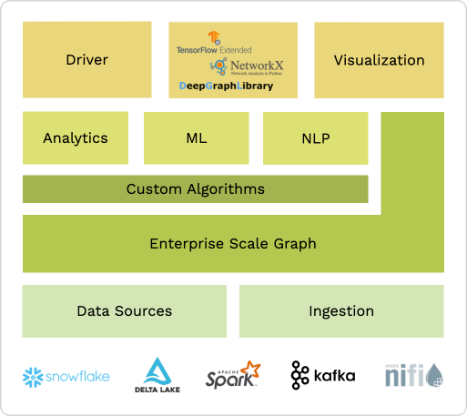
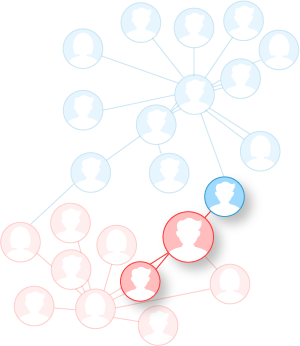

ArangoDB Data Science
===============

# Graph Data Science

ArangoDB's Graph Analytics and GraphML capabilities provide various solutions
in data science and data analytics. Multiple data science personas within the
engineering space can make use of ArangoDB's set of tools and technologies that
enable analytics and machine learning on graph data. 

| ArangoDB as the foundation for Graph ML | Key Features |
|-----------------------------------------|--------------|
| |   - **Scalable**: Designed to support true scalability with high performance for Enterprise use cases   - **Simple Ingestion**: Easy integration in existing data infrastructure + connectors to all leading data processing and data ecosystems   - **Open Source**: Extensibility and Community   - **NLP Support**: Built-In Text Processing, Search, and Similarity Ranking |

# Graph Analytics vs. GraphML

In a graph machine learning you can take advantage of more data so you can get better answers.

## Graph Query

When running a query with AQL on a graph, the query goes from a vertex to an edge,
then the edge indicates what the next connected vertex will be.

Graph queries can answer questions like _**Who can introduce me to person X**_?

## Graph Analytics

Graph algorithms is what you run on a graph if you want to know aggregate information 
about the graph, analyzing the entire graph.

Graph analytics can answer questions like _**Who are the most connected persons**_?

## Graph ML

If you use machine learning on a graph, you can predict connections, get product
recommendations, and classify vertices, edges, and graphs.

Graph ML can answer questions like 
- _**Is there a connection between person X and person Y?**_
- _**Will a customer churn?**_ 
- _**Is this particular transaction Anomalous?**_

# Use Cases