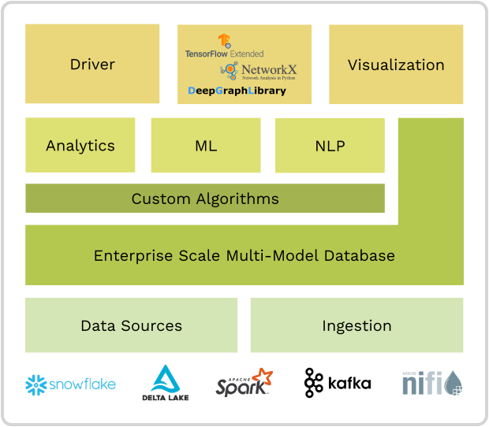
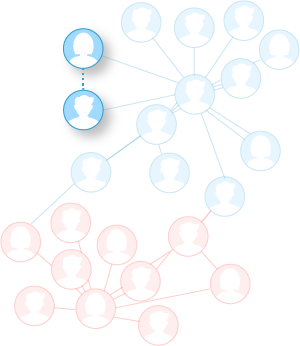
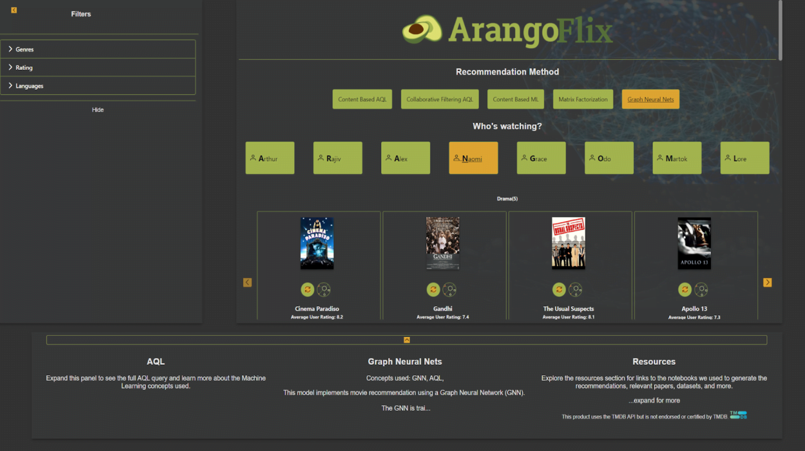

# Data Science

{{ page.description }}
{:class="lead"}

ArangoDB's Graph Analytics and GraphML capabilities provide various solutions
in data science and data analytics. Multiple data science personas within the
engineering space can make use of ArangoDB's set of tools and technologies that
enable analytics and machine learning on graph data. 

ArangoDB, as the foundation for GraphML, comes with the following key features:

- **Scalable**: designed to support true scalability with high performance for
 enterprise use cases.
- **Simple Ingestion**: easy integration in existing data infrastructure with
 connectors to all leading data processing and data ecosystems.
- **Open Source**: extensibility and community.
- **NLP Support**: built-in text processing, search, and similarity ranking.

## Graph Analytics vs. GraphML

This section classifies the complexity of the queries we can answer - 
like running a simple query that shows what is the path that goes from one node
to another, or more complex tasks like node classification,
link prediction, and graph classification.

### Graph Query

When running a query with AQL on a graph, the query goes from a vertex to an edge,
and then the edge indicates what the next connected vertex will be.

Graph queries can answer questions like _**Who can introduce me to person X**_?

### Graph Analytics

Graph analytics or graph algorithms is what you run on a graph if you want to 
know aggregate information about your graph, while analyzing the entire graph.

Graph analytics can answer questions like _**Who are the most connected persons**_?

### GraphML

When applying machine learning on a graph, you can predict connections, get 
better product recommendations, and also classify vertices, edges, and graphs.

GraphML can answer questions like:
- _**Is there a connection between person X and person Y?**_
- _**Will a customer churn?**_ 
- _**Is this particular transaction Anomalous?**_

## Use Cases

This section contains an overview of different use cases where Graph Analytics
and GraphML can be applied.

### Graph Analytics

Graph Analytics is applicable in various fields such as marketing, fraud detection, supply chain,
product recommendations, drug development, law enforcement, and cybersecurity.

Graph Analytics uses an unsupervised
learning method based on algorithms that perform analytical processing
directly on graphs stored in ArangoDB. The 
[Distributed Iterative Graph Processing (Pregel)](graphs-pregel.html)
is intended to help you gain analytical insights in
your data, without having to use external processing systems.

ArangoDB includes the following graph algorithms:
- [Page Rank](graphs-pregel-algorithms.html#pagerank): used for ranking documents in a graph
search/traversal.
- [Single-Source Shortest Path](graphs-pregel-algorithms.html#single-source-shortest-path): calculates
 the shortest path length between the source and all other vertices.
 For example, _How to get from a to b_?
- [Hyperlink-Induced Topic Search (HITS)](graphs-pregel-algorithms.html#hyperlink-induced-topic-search-hits): 
 a link analysis algorithm that rates web pages.
- [Vertex Centrality](graphs-pregel-algorithms.html#vertex-centrality): identifies the most important
 nodes in a graph. For example, _Who are the influencers in a social network?_
- [Community Detection](graphs-pregel-algorithms.html#community-detection): identifies distinct subgroups
 within a community structure.

### GraphML

GraphML capabilities of using more data outperform conventional deep learning
methods and **solve high-computational complexity graph problems**, such as: 
- Drug discovery, repurposing, and predicting adverse effects.
- Personalized product/service recommendation.
- Supply chain and logistics.

With GraphML, you can also **predict relationships and structures**, such as:
- Predict molecules for treating diseases (precision medicine).
- Predict fraudulent behavior, credit risk, purchase of product or services.
- Predict relationships among customers, accounts.

ArangoDB uses well-known GraphML frameworks like
[Deep Graph Library](https://www.dgl.ai){:target="_blank"}
and [PyTorch Geometric](https://pytorch-geometric.readthedocs.io/en/latest/){:target="_blank"} 
and connects to these external machine learning libraries. When coupled to
ArangoDB, you are essentially integrating them with your graph dataset.

## Example: ArangoFlix

ArangoFlix is a complete movie recommendation application that predicts missing
links between a user and the movies they have not watched yet.

This [interactive tutorial](https://colab.research.google.com/github/arangodb/interactive_tutorials/blob/master/notebooks/Integrate_ArangoDB_with_PyG.ipynb){:target="_blank"} 
demonstrates how to integrate ArangoDB with PyTorch Geometric to
build recommendation systems using Graph Neural Networks (GNNs).

The full ArangoFlix demo website is accessible from the ArangoGraph Insights Platform,
the managed cloud for ArangoDB. You can open the demo website that connects to
your running database from the **Examples** tab of your deployment.


You can try out the ArangoGraph Insights Platform free of charge for 14 days.
Sign up at [cloud.arangodb.com](https://cloud.arangodb.com/){:target="_blank"}. 


The ArangoFlix demo uses five different recommendation methods:
- Content-Based using AQL
- Collaborative Filtering using AQL
- Content-Based using ML
- Matrix Factorization
- Graph Neural Networks 

The ArangoFlix website not only offers an example of how the user recommendations might
look like in real life, but it also provides information on a recommendation method, an
AQL query, a custom graph visualization for each movie, and more.