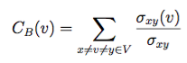

# Pregel Algorithms

{{ page.description }}
{:class="lead"}

Pregel algorithms are used in scenarios where you need to do an
analysis of a graph stored in ArangoDB to get insights about its
nature and structure - without having to use external processing systems.

Pregel can solve numerous graph problems and offers solutions that are
essential building blocks in the cycle of a real world application.
For example, in a network system, detecting the weaknesses of the network
design and determining the times when the network is vulnerable may
significantly reduce any downtime.

In the section below you can find more details about all available 
Pregel algorithms in ArangoDB.

## Available Algorithms

### PageRank

PageRank is a well known algorithm to rank documents in a graph. The algorithm
runs until the execution converges. Specify a custom threshold with the
parameter `threshold`, to run for a fixed number of iterations use the
`maxGSS` parameter.
PageRank is a well-known algorithm to rank vertices in a graph: the more important a vertex, the higher rank it gets. It goes back to L. Page and S. Brin's [paper](http://infolab.stanford.edu/pub/papers/google.pdf) and is used to rank pages in in search engines (hence the name). 

The rank of a vertex is a positive real number. The algorithm starts with every vertex having the same rank (one divided by the number of vertices) and sends its rank to its out-neighbors. The computation proceeds in iterations. In each iteration, the new rank is computed according to the formula "(0.15/total number of vertices) + (0.85 * the sum of all incoming ranks)". The value sent to each of the out-neighbors is the new rank divided by the number of those neighbors, thus every out-neighbor gets the same part of the new rank.

The algorithm stops when at least one of the two conditions is satisfied:
- The maximum number of iterations is reached. This is the same parameter `maxGSS` as for the other algorithms.
- Every vertex changes its rank in the last iteration by less than a certain threshold. The default threshold is  0.00001, a custom value can be set with the parameter `threshold`.
```js
var pregel = require("@arangodb/pregel");
pregel.start("pagerank", "graphname", {maxGSS: 100, threshold: 0.00000001, resultField: "rank"})
```

#### Seeded PageRank

It is possible to specify an initial distribution for the vertex documents in
your graph. To define these seed ranks / centralities you can specify a
`sourceField` in the properties for this algorithm. If the specified field is
set on a document _and_ the value is numeric, then it will be used instead of
the default initial rank of `1 / numVertices`.

```js
var pregel = require("@arangodb/pregel");
pregel.start("pagerank", "graphname", {maxGSS: 20, threshold: 0.00000001, sourceField: "seed", resultField: "rank"})
```

### Single-Source Shortest Path

Calculates the shortest path length between the given source and all other vertices, called _targets_. The result is written to the specified property of the respective target.
The distance to the source vertex itself is returned as `0` and a length above
`9007199254740991` (max safe integer) means that there is no path from the source to the vertex in the graph.
a pair of vertices.

The algorithm runs until all distances are computed. The number of iterations is bounded by the
diameter (the longest shortest path) of your graph.

An call of the algorithm requires the `source` parameter whose value is the  document ID of the source vertex. The result field needs to be
specified in `_resultField` (note the underscore).

```js
var pregel = require("@arangodb/pregel");
pregel.start("sssp", "graphname", {source: "vertices/1337", _resultField: "distance"});
```

### Connected Components

There are three algorithms to find connected components in a graph:

1. If your graph is effectively undirected (for every edge from vertex A to vertex B there is also an edge from B to A)
   , then the simple **connected components** algorithm named
   `"connectedcomponents"` is suitable.

   It is a very simple and fast algorithm, but it only works correctly on
   undirected graphs. Your results on directed graphs may vary, depending on
   how connected your components are.
In an undirected graph, a _connected component_ is a subgraph
- where there is a path between every pair of vertices from this component and
- which is maximal with this property: adding any other vertex would destroy it. In other words, there is no path between any vertex from the component and any vertex not in the component.
2. To find **weakly connected components** (WCC) you can use the algorithm
   named `"wcc"`. Weakly connected means that there exists a path from every
   A _weakly connected component_ in a directed graph is a maximal subgraph such that there is a path between each pair of vertices where _we can walk also against the direction of edges._ More formally, it is a connected component (see the definition above) in the _underlying undirected graph_, i.e., in the undirected graph obtained by adding an edge from vertex B to vertex A (if it does not already exist), if there is an edge from vertex A to vertex B.

   This algorithm works on directed graphs but, in general, requires a greater amount of
   traffic between your DB-Servers.

3. To find **strongly connected components** (SCC) you can use the algorithm
   named `"scc"`. A _strongly connected component_ is a maximal subgraph where, for every two vertices, there is a path from one of them to the other. It is thus defined as a weakly connected component, but one is not allowed to run against the edge directions.

    The algorithm is more complex than the WCC algorithm and, in general, requires more
   memory.

All above algorithms will assign to each vertex a component ID, a number which will be written into the specified `resultField`. All vertices from the same component obtain the same component ID, every two vertices from different components obtain different IDs.

```js
var pregel = require("@arangodb/pregel");

// connected components
pregel.start("connectedcomponents", "graphname", {resultField: "component"});

// weakly connected components
pregel.start("wcc", "graphname", {resultField: "component_weak"});

// strongly connected components
pregel.start("scc", "graphname", {resultField: "component_strong"});
```

### Hyperlink-Induced Topic Search (HITS)

HITS is a link analysis algorithm that rates Web pages, developed by
Jon Kleinberg. The algorithm is also known as _Hubs and Authorities_.

The idea behind Hubs and Authorities comes from the typical structure of the web:
Certain websites known as hubs, serve as large directories that are not actually
authoritative on the information that they hold. These hubs are used as
compilations of a broad catalog of information that leads users direct to other
authoritative webpages.

The algorithm assigns each vertex two scores: The authority score and the
hub score. The authority score rates how many good hubs point to a particular
vertex (or webpage), the hub score rates how good (authoritative) the vertices
pointed to are. Also see
[en.wikipedia.org/wiki/HITS_algorithm](https://en.wikipedia.org/wiki/HITS_algorithm){:target="_blank"}

ArangoDB's version of the algorithm converges after a certain amount of time.
The parameter *threshold* can be used to set a limit for the convergence
(measured as maximum absolute difference of the hub and authority scores
between the current and last iteration).

When you specify the result field name, the hub score will be stored in
`<resultField>_hub` and the authority score in `<resultField>_auth`.

The algorithm can be executed like this:

```js
var pregel = require("@arangodb/pregel");
var handle = pregel.start("hits", "yourgraph", {threshold:0.00001, resultField: "score"});
```

### Vertex Centrality

Centrality measures help identify the most important vertices in a graph.
They can be used in a wide range of applications: For example they can be used
to identify *influencers* in social networks, or *middle-men* in terrorist
networks.

There are various definitions for centrality, the simplest one being the
vertex degree. These definitions were not designed with scalability in mind.
It is probably impossible to discover an efficient algorithm which computes
them in a distributed way. Fortunately there are scalable substitutions
available, which should be equally usable for most use cases.


#### Effective Closeness

A common definitions of centrality is the **closeness centrality**
(or closeness). The closeness of a vertex in a graph is the inverse average
length of the shortest path between the vertex and all other vertices.
For vertices *x*, *y* and shortest distance `d(y, x)` it is defined as:


Effective Closeness approximates the closeness measure. The algorithm works by
iteratively estimating the number of shortest paths passing through each vertex.
The score will approximates the real closeness score, since it is not possible
to actually count all shortest paths due to the horrendous `O(n^2 * d)` memory
requirements. The algorithm is from the paper
*Centralities in Large Networks: Algorithms and Observations (U Kang et.al. 2011)*.

ArangoDBs implementation approximates the number of shortest path in each
iteration by using a HyperLogLog counter with 64 buckets. This should work well
on large graphs and on smaller ones as well. The memory requirements should be
**O(n * d)** where *n* is the number of vertices and *d* the diameter of your
graph. Each vertex will store a counter for each iteration of the algorithm.

The algorithm can be used like this:

```js
const pregel = require("@arangodb/pregel");
const handle = pregel.start("effectivecloseness", "yourgraph", {resultField: "closeness"});
```

#### LineRank

Another common measure is the [betweenness* centrality](https://en.wikipedia.org/wiki/Betweenness_centrality){:target="_blank"}:
It measures the number of times a vertex is part of shortest paths between any
pairs of vertices. For a vertex *v* betweenness is defined as:



Where the &sigma; represents the number of shortest paths between *x* and *y*,
and &sigma;(v) represents the number of paths also passing through a vertex *v*.
By intuition a vertex with higher betweenness centrality will have more
information passing through it.

**LineRank** approximates the random walk betweenness of every vertex in a
graph. This is the probability that someone starting on an arbitrary vertex,
will visit this node when he randomly chooses edges to visit.

The algorithm essentially builds a line graph out of your graph
(switches the vertices and edges), and then computes a score similar to PageRank.
This can be considered a scalable equivalent to vertex betweenness, which can
be executed distributedly in ArangoDB. The algorithm is from the paper
*Centralities in Large Networks: Algorithms and Observations (U Kang et.al. 2011)*.

```js
const pregel = require("@arangodb/pregel");
const handle = pregel.start("linerank", "yourgraph", {resultField: "linerank"});
```

### Community Detection

Graphs based on real world networks often have a community structure.
This means it is possible to find groups of vertices such that each vertex
group is internally more densely connected than outside the group.
This has many applications when you want to analyze your networks, for example
Social networks include community groups (the origin of the term, in fact)
based on common location, interests, occupation, etc.

#### Label Propagation

*Label Propagation* can be used to implement community detection on large
graphs. The algorithm assigns a community, more precisely, a Community ID 
(a natural number), to every vertex in the graph. 
The idea is that each vertex should be in the community that most of
its neighbors are in. 

At first, the algorithm assigns unique initial Community IDs to the vertices. 
There is no guarantee that a vertex obtains the same initial 
ID in two different runs of the algorithm, even if the graph does not change
(although, it may often happen). Moreover, there is no guarantee on a particular
distribution of the initial IDs over the vertices.

Then, in each iteration, a vertex sends its current Community
ID to all its neighbor vertices. After that each vertex adopts the Community ID it
received most frequently in the last step. 

The details are somewhat subtle. If a vertex obtains only one ID and the ID of the vertex from the previous step, its old ID, is less than the obtained ID, the old ID is kept. (IDs are numbers and thus comparable to each other.) If a vertex obtains more than one ID, its new ID is the lowest ID among the most frequently obtained IDs. (For example, if the obtained IDs are 1, 2, 2, 3, 3, then 2 is the new ID. ) If, however, no ID arrives more than once, the new ID is the minimum of the lowest obtained IDs and the old ID. (For example, if the old ID is 5 and the obtained IDs are 3, 4, 6, then the new ID is 3. If the old ID is 2, it is kept.) 

If a vertex keeps its ID 20 times or more in a row, it does not send its ID. Vertices that did not obtain any IDs do not update their ID and do not send it.

The algorithm runs until it converges, which likely never really happens on
large graphs. Therefore you need to specify a maximum iteration bound.
The default bound is 500 iterations, which is too large for
common applications. 

The algorithm should work best on undirected graphs. On directed
graphs, the resulting partition into communities might change, if the number 
of performed steps changes. How strong the dependence is
may be influenced by the density of the graph.

```js
const pregel = require("@arangodb/pregel");
const handle = pregel.start("labelpropagation", "yourgraph", {maxGSS: 100, resultField: "community"});
```

#### Speaker-Listener Label Propagation

The [Speaker-listener Label Propagation](https://arxiv.org/pdf/1109.5720.pdf){:target="_blank"}
(SLPA) can be used to implement community detection. It works similar to the
label propagation algorithm, but now every node additionally accumulates a
memory of observed labels (instead of forgetting all but one label).

Before the algorithm run, every vertex is initialized with an unique ID
(the initial community label).
During the run three steps are executed for each vertex:

1. Current vertex is the listener all other vertices are speakers
2. Each speaker sends out a label from memory, we send out a random label with a
   probability proportional to the number of times the vertex observed the label
3. The listener remembers one of the labels, we always choose the most
   frequently observed label

```js
const pregel = require("@arangodb/pregel");
const handle = pregel.start("slpa", "yourgraph", {maxGSS:100, resultField: "community"});
```

You can also execute SLPA with the `maxCommunities` parameter to limit the
number of output communities. Internally the algorithm will still keep the
memory of all labels, but the output is reduced to just he `n` most frequently
observed labels.

```js
const pregel = require("@arangodb/pregel");
const handle = pregel.start("slpa", "yourgraph", {maxGSS: 100, resultField: "community", maxCommunities: 1});
// check the status periodically for completion
pregel.status(handle);
```
