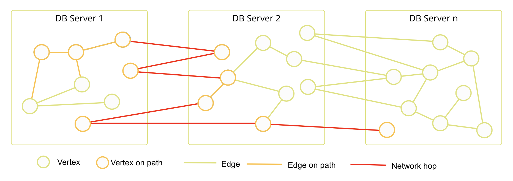
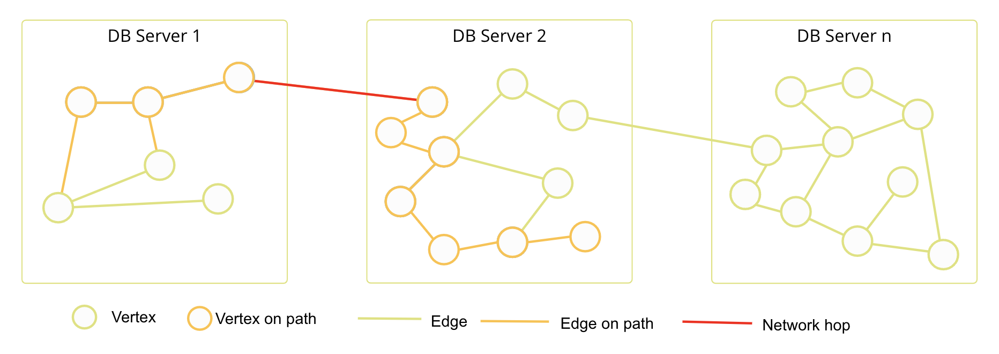
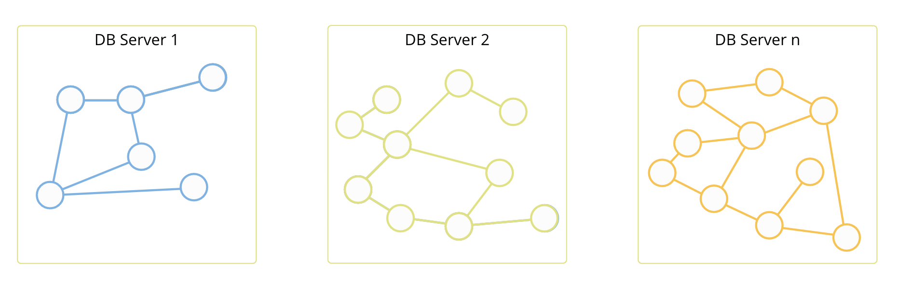

SmartGraphs
===========



SmartGraphs are specifically targeted at graphs that need scalability and high performance. The way SmartGraphs use the ArangoDB cluster sharding makes it extremely useful for distributing data across multiple servers with no network latency.

In addition to this, SmartGraphs are advantageous to use in a variety of domains and activities such as social networking, transport systems, e-commerce, finance, healthcare, and many more.

In terms of querying there is no difference between SmartGraphs and
General Graphs.
For graph querying please refer to [AQL Graph Operations](aql/graphs.html)
and [General Graph Functions](graphs-general-graphs-functions.html) sections.
The optimizer is clever enough to identify whether it is a SmartGraph or not.

Do the hands-on
[ArangoDB SmartGraphs Tutorial](https://www.arangodb.com/using-smartgraphs-arangodb/){:target="_blank"}
to learn more.

## How SmartGraphs work?

Typically, when you shard your data with ArangoDB the goal is to have an even distribution of data across multiple servers. This approach allows you to scale out your data at a rather high speed in most cases. However, since one of the best features of ArangoDB is fast graph traversals, this sort of distribution can start causing problems if your data grows exponentially.

Instead of traveling across every server before returning data, SmartGraphs use a clever and optimized way of moving data through the cluster so that you retain the scalability as well as the performance of graph traversals in ArangoDB. 

The examples below illustrate the difference in how data is sharded in the cluster for both scenarios. Let's take a closer look at it.

### Random data distribution

The natural distribution of data for graphs that handle large datasets involves a series of highly interconnected nodes with many edges running between them.

_The orange line indicates an example graph traversal. Notice how it touches nodes on every server._

Once you start connecting the nodes to each other, it becomes clear that the graph traversal might need to travel across every server before returning results. This sort of distribution results in many network hops between servers, coordinators, and you.

### Smart data distribution

By optimizing the distribution of data, SmartGraphs reduce the number of network hops traversals require. 

SmartGraphs come with a concept of a `smartGraphAttribute` that is used to inform the database how exactly to shard data. When defining this attribute, think of it as a value that is stored in every vertex. For instance, in social network datasets, this attribute can be the ID or the region/country of the users. 
Sharding with this attribute means that the relevant data is now co-located on servers, whenever possible.

_The outcome of moving the data like this is that you retain the scalability as well as the performance of graph traversals in ArangoDB._

## Hybrid SmartGraphs

Hybrid SmartGraphs are capable of using [SatelliteCollections](satellites.html) within their graph
definition. Therefore, edge definitions defined between SmartCollections and
SatelliteCollections can be created. As SatelliteCollections (and the edge
collections between SmartGraph collections and SatelliteCollection) are globally
replicated to each participating DB-Server, (weighted) graph traversals and
(k-)shortest path(s) queries can partially be executed locally on each
DB-Server. This means a larger part of the query can be executed fully local
whenever data from the SatelliteCollections is required.

## Disjoint SmartGraphs

Disjoint SmartGraphs are useful for use cases which have to deal with large hierarchical graphs, when you have clearly separated branches in your graph dataset. Disjoint SmartGraphs enables the automatic sharding of these branches and prohibits edges connecting them.

_This ensures that graph traversals, shortest path, and k-shortest-paths queries
can be executed locally on a DB-Server, achieving improved performance for
these type of queries._

## Hybrid Disjoint SmartGraphs

Hybrid Disjoint SmartGraphs are like Hybrid SmartGraphs but also prohibit
edges between vertices with different `smartGraphAttribute` values. This
restriction makes it unnecessary to replicate the edge collections between
SmartGraph collections and SatelliteCollections to all DB-Servers for local
execution. They are sharded like the SmartGraph collections instead
(`distributeShardsLike`).