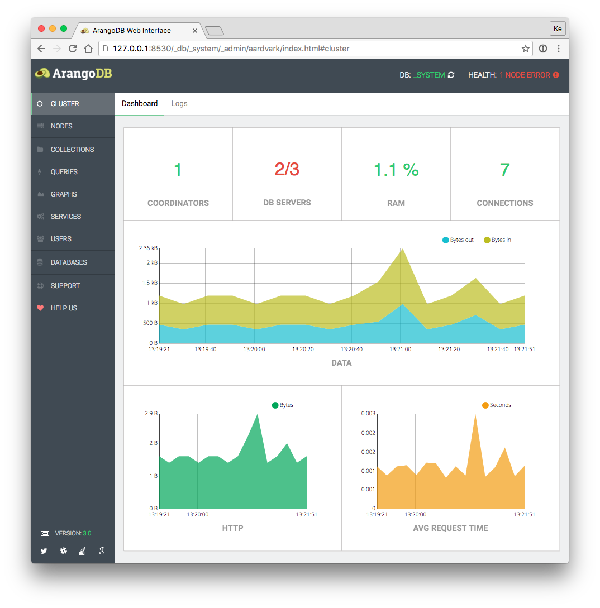
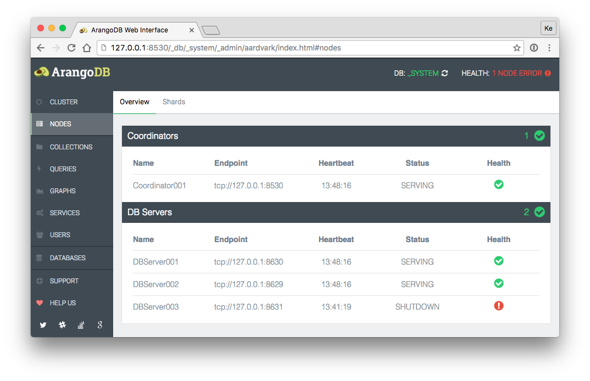
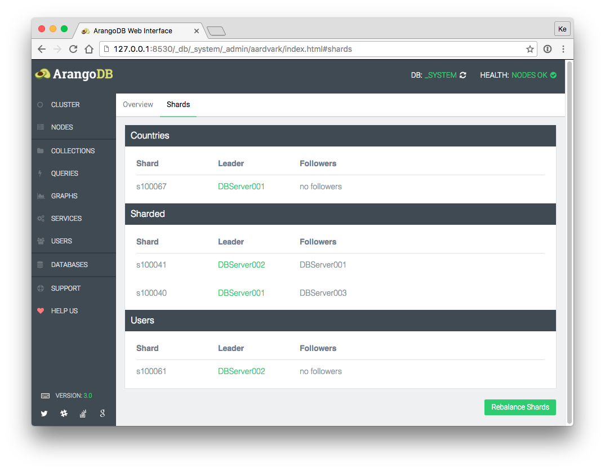

Cluster
=======

The cluster section displays statistics about the general cluster performance.

Statistics:

 - Available and missing Coordinators
 - Available and missing DB-Servers
 - Memory usage (percent)
 - Current connections
 - Data (bytes)
 - HTTP (bytes)
 - Average request time (seconds)

Nodes
-----
 
### Overview

The overview shows available and missing Coordinators and DB-Servers.

Functions:

- Coordinator Dashboard: Click on a Coordinator will open a statistics dashboard.

Information (Coordinator / DB-Servers):

- Name
- Endpoint
- Last Heartbeat
- Status
- Health

### Shards

The shard section displays all available sharded collections.

Functions:

- Move Shard Leader: Click on a leader database of a shard server will open a move shard dialog. Shards can be
  transferred to all available database servers, except the leading DB-Server or an available follower.
- Move Shard Follower: Click on a follower database of a shard will open a move shard dialog. Shards can be
  transferred to all available database servers, except the leading DB-Server or an available follower.

Information (collection):

- Shard
- Leader (green state: sync is complete)
- Followers

### Rebalance Shards

The rebalance shards section displays a button for rebalancing shards.
A new DB-Server will not have any shards. With the rebalance functionality,
the cluster will start to rebalance shards including empty DB-Servers.
You can specify the maximum number of shards that can be moved in each
operation by using the `--cluster.max-number-of-move-shards` startup option
of _arangod_ (the default value is `10`).
When the button is clicked, the number of scheduled move shards operations is
shown, or it is displayed that no move operations have been scheduled if they
are not necessary.

