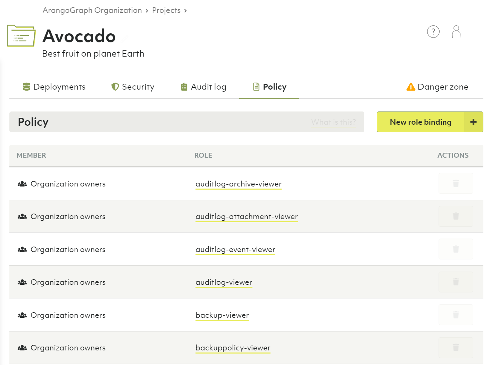
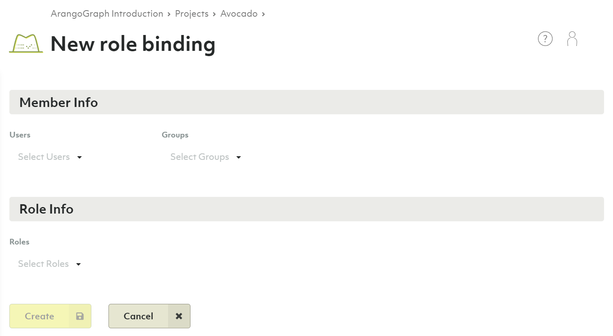
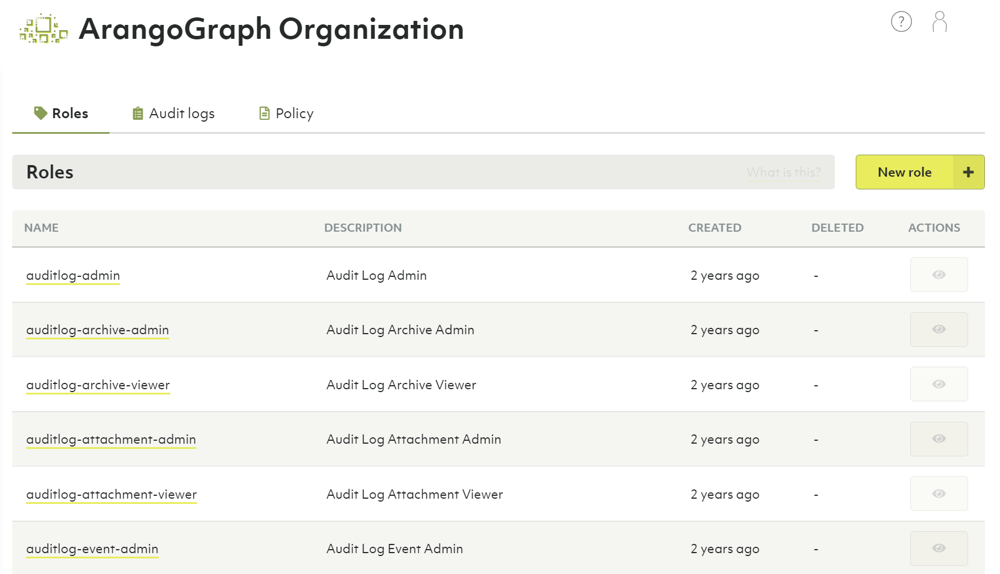
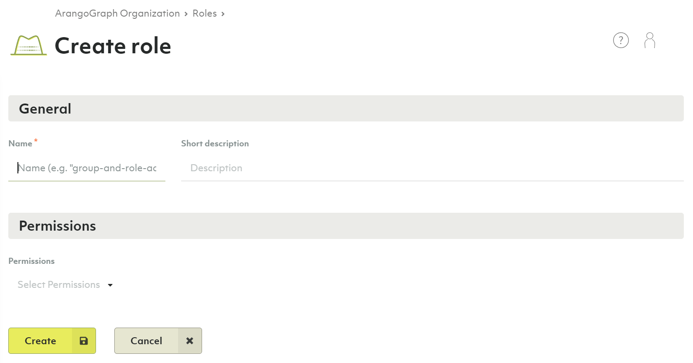
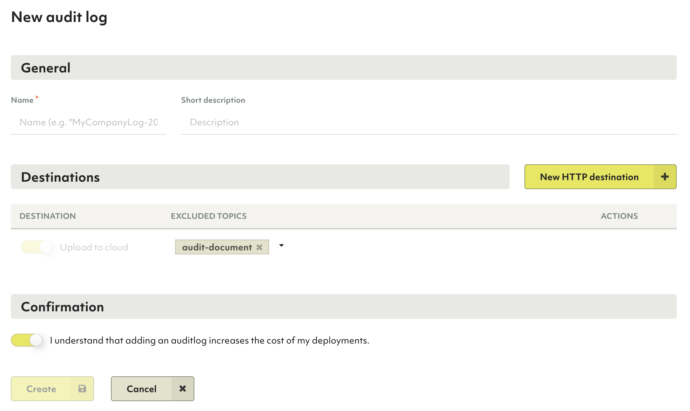

# Security and access control in the ArangoGraph Insights Platform

The ArangoGraph Insights Platform has a structured set of resources that are subject to security and
access control:

- Organizations
- Projects
- Deployments

For each of these resources you can perform various operations.
For example, you can create a project in an organization and create a deployment inside a project.

## Locked resources

In ArangoGraph, you can lock the resources to prevent accidental deletion. When a resource is locked,
it cannot be deleted and must be unlocked first.

The hierarchial structure of the resources (organization-project-deployment) is used in the locking functionality: if a child resource is locked
(for example, a deployment), you cannot delete the parent project without unlocking that deployment first.


If you lock a backup policy of a deployment or an IP allowlist, CA certificate, and IAM provider of a project, it is still possible to delete
the corresponding parent resource without unlocking those properties first.


 
## Policy

Various actions in ArangoGraph require different permissions, which can be granted to users via
**roles**.

The association of a member with a role is called a **role binding**.
All role bindings of a resource comprise a **policy**.

Roles can be bound on an organization, project and deployment level (listed in the high to low level order, with lower
levels inheriting permissions from their parents). This means that there is a unique policy per resource (an organization, a project or a deployment).

For example, an organization has exactly one policy,
which binds roles to members of the organization. These bindings are used to
give the users permissions to perform operations in this organization.

### How to view, edit or remove role bindings of a policy

Decide whether you want to edit the policy for an organization, a project or a deployment:

- **Organization**: In the main navigation menu, click **Access Control**, then
  open the **Policy** tab.
- **Project**: In the main navigation menu, click the name of the required project, then
  open the **Policy** tab.
- **Deployment**: In the main navigation menu, click the name of the required project, then click either 
  the deployment name or the **View** button, and finally open the **Policy** tab.

To delete a role binding, click the **Recycle Bin** icon in the **Actions** column.


Currently, you cannot edit a role binding, you can only delete it.


### How to add a role binding to a policy

1. Navigate to the **Policy** tab of an organization, a project or a deployment.
2. Click the **New role binding** button.
3. Select one or more users and/or groups.
4. Select one or more roles you want to assign to the specified members.
5. Click **Create**.

## Roles

Operations on resources in ArangoGraph require zero (just an authentication) or more permissions. Since the
number of permissions is large and very detailed, it is not practical to assign
permissions directly to users. Instead, ArangoGraph uses **roles**.

A role is a set of permissions. Roles can be bound to groups (preferably)
or individual users. You can create such bindings for the respective organization,
project or deployment policy.

There are predefined roles, but you can also create custom ones.

### Predefined roles

Predefined roles are created by ArangoGraph and group related permissions together.
An example of a predefine role is `deployment-viewer`. This role
contains all permissions needed to view deployments in a project.

Predefined roles cannot be deleted.


Windows command to generate below list (cmd.exe):
oasisctl list roles --format json | jq -r ".[] | \"**\(.description)** (`\(.id)`):\n\(.permissions ^| split(\", \") ^| map(\"- `\(.)`\n\") ^| join(\"\"))""





The roles below are described following this pattern:

**Role description** (`role ID`):
- `Permission`


**Audit Log Admin** (`auditlog-admin`):
- `audit.auditlog.list`
- `audit.auditlog.get`
- `audit.auditlog.create`
- `audit.auditlog.delete`
- `audit.auditlog.set-default`
- `audit.auditlog.test-https-post-destination`
- `audit.auditlog.update`

**Audit Log Archive Admin** (`auditlog-archive-admin`):
- `audit.auditlogarchive.list`
- `audit.auditlogarchive.get`
- `audit.auditlogarchive.delete`

**Audit Log Archive Viewer** (`auditlog-archive-viewer`):
- `audit.auditlogarchive.list`
- `audit.auditlogarchive.get`

**Audit Log Attachment Admin** (`auditlog-attachment-admin`):
- `audit.auditlogattachment.get`
- `audit.auditlogattachment.create`
- `audit.auditlogattachment.delete`

**Audit Log Attachment Viewer** (`auditlog-attachment-viewer`):
- `audit.auditlogattachment.get`

**Audit Log Event Admin** (`auditlog-event-admin`):
- `audit.auditlogevents.get`
- `audit.auditlogevent.delete`

**Audit Log Event Viewer** (`auditlog-event-viewer`):
- `audit.auditlogevents.get`

**Audit Log Viewer** (`auditlog-viewer`):
- `audit.auditlog.list`
- `audit.auditlog.get`

**Backup Administrator** (`backup-admin`):
- `backup.backup.create`
- `backup.backup.delete`
- `backup.backup.list`
- `backup.backup.get`
- `backup.backup.update`
- `backup.backup.download`
- `backup.backup.restore`
- `data.deployment.restore-backup`

**Backup Viewer** (`backup-viewer`):
- `backup.feature.get`
- `backup.backup.get`
- `backup.backup.list`

**Backup Policy Administrator** (`backuppolicy-admin`):
- `backup.backuppolicy.create`
- `backup.backuppolicy.delete`
- `backup.backuppolicy.list`
- `backup.backuppolicy.get`
- `backup.backuppolicy.update`

**Backup Policy Viewer** (`backuppolicy-viewer`):
- `backup.feature.get`
- `backup.backuppolicy.get`
- `backup.backuppolicy.list`

**Billing Administrator** (`billing-admin`):
- `billing.config.get`
- `billing.config.set`
- `billing.invoice.get`
- `billing.invoice.get-preliminary`
- `billing.invoice.get-statistics`
- `billing.invoice.list`
- `billing.organization.get`
- `billing.paymentmethod.create`
- `billing.paymentmethod.delete`
- `billing.paymentmethod.get`
- `billing.paymentmethod.get-default`
- `billing.paymentmethod.list`
- `billing.paymentmethod.set-default`
- `billing.paymentmethod.update`
- `billing.paymentprovider.list`

**Billing Viewer** (`billing-viewer`):
- `billing.config.get`
- `billing.invoice.get`
- `billing.invoice.get-preliminary`
- `billing.invoice.get-statistics`
- `billing.invoice.list`
- `billing.organization.get`
- `billing.paymentmethod.get`
- `billing.paymentmethod.get-default`
- `billing.paymentmethod.list`
- `billing.paymentprovider.list`

**CA Certificate Administrator** (`cacertificate-admin`):
- `crypto.cacertificate.create`
- `crypto.cacertificate.delete`
- `crypto.cacertificate.list`
- `crypto.cacertificate.get`
- `crypto.cacertificate.set-default`
- `crypto.cacertificate.update`

**CA Certificate Viewer** (`cacertificate-viewer`):
- `crypto.cacertificate.get`
- `crypto.cacertificate.list`

**Deployment Administrator** (`deployment-admin`):
- `data.cpusize.list`
- `data.deployment.create`
- `data.deployment.create-test-database`
- `data.deployment.delete`
- `data.deployment.get`
- `data.deployment.list`
- `data.deployment.resume`
- `data.deployment.rebalance-shards`
- `data.deployment.rotate-server`
- `data.deployment.update`
- `data.deploymentfeatures.get`
- `data.deploymentprice.calculate`
- `data.limits.get`
- `data.nodesize.list`
- `data.presets.list`
- `monitoring.logs.get`
- `notification.deployment-notification.list`
- `notification.deployment-notification.mark-as-read`
- `notification.deployment-notification.mark-as-unread`

**Deployment Content Administrator** (`deployment-content-admin`):
- `data.cpusize.list`
- `data.deployment.create-test-database`
- `data.deployment.get`
- `data.deployment.list`
- `data.deploymentcredentials.get`
- `data.deploymentfeatures.get`
- `data.deploymentprice.calculate`
- `data.limits.get`
- `data.nodesize.list`
- `data.presets.list`
- `monitoring.logs.get`

**Deployment Content Viewer** (`deployment-content-viewer`):
- `data.deployment.get`
- `data.deployment.list`
- `data.deploymentcredentials.get`
- `data.limits.get`
- `data.presets.list`

**Deployment Viewer** (`deployment-viewer`):
- `data.cpusize.list`
- `data.deployment.get`
- `data.deployment.list`
- `data.deploymentfeatures.get`
- `data.deploymentprice.calculate`
- `data.diskperformance.list`
- `data.limits.get`
- `data.nodesize.list`
- `data.presets.list`
- `notification.deployment-notification.list`
- `notification.deployment-notification.mark-as-read`
- `notification.deployment-notification.mark-as-unread`

**Example Datasets Viewer** (`exampledataset-viewer`):
- `example.exampledataset.list`
- `example.exampledataset.get`

**Example Dataset Installation Administrator** (`exampledatasetinstallation-admin`):
- `example.exampledatasetinstallation.list`
- `example.exampledatasetinstallation.get`
- `example.exampledatasetinstallation.create`
- `example.exampledatasetinstallation.update`
- `example.exampledatasetinstallation.delete`

**Example Dataset Installation Viewer** (`exampledatasetinstallation-viewer`):
- `example.exampledatasetinstallation.list`
- `example.exampledatasetinstallation.get`

**Group Administrator** (`group-admin`):
- `iam.group.create`
- `iam.group.delete`
- `iam.group.list`
- `iam.group.get`
- `iam.group.update`

**Group Viewer** (`group-viewer`):
- `iam.group.get`
- `iam.group.list`

**IAM provider Administrator** (`iamprovider-admin`):
- `security.iamprovider.create`
- `security.iamprovider.delete`
- `security.iamprovider.get`
- `security.iamprovider.list`
- `security.iamprovider.set-default`
- `security.iamprovider.update`

**IAM provider Viewer** (`iamprovider-viewer`):
- `security.iamprovider.get`
- `security.iamprovider.list`

**IP allowlist Administrator** (`ipwhitelist-admin`):
- `security.ipallowlist.create`
- `security.ipallowlist.delete`
- `security.ipallowlist.get`
- `security.ipallowlist.list`
- `security.ipallowlist.update`

**IP allowlist Viewer** (`ipwhitelist-viewer`):
- `security.ipallowlist.get`
- `security.ipallowlist.list`

**Metrics Administrator** (`metrics-admin`):
- `metrics.endpoint.get`
- `metrics.token.create`
- `metrics.token.delete`
- `metrics.token.get`
- `metrics.token.list`
- `metrics.token.revoke`
- `metrics.token.update`

**Organization Administrator** (`organization-admin`):
- `billing.organization.get`
- `resourcemanager.organization.delete`
- `resourcemanager.organization.get`
- `resourcemanager.organization.update`
- `resourcemanager.organization-invite.create`
- `resourcemanager.organization-invite.delete`
- `resourcemanager.organization-invite.get`
- `resourcemanager.organization-invite.list`
- `resourcemanager.organization-invite.update`

**Organization Viewer** (`organization-viewer`):
- `billing.organization.get`
- `resourcemanager.organization.get`
- `resourcemanager.organization-invite.get`
- `resourcemanager.organization-invite.list`

**Policy Administrator** (`policy-admin`):
- `iam.policy.get`
- `iam.policy.update`

**Policy Viewer** (`policy-viewer`):
- `iam.policy.get`

**Prepaid Deployment Viewer** (`prepaid-deployment-viewer`):
- `prepaid.prepaiddeployment.get`
- `prepaid.prepaiddeployment.list`

**Private Endpoint Service Administrator** (`privateendpointservice-admin`):
- `network.privateendpointservice.create`
- `network.privateendpointservice.get`
- `network.privateendpointservice.get-feature`
- `network.privateendpointservice.get-by-deployment-id`
- `network.privateendpointservice.update`

**Private Endpoint Service Viewer** (`privateendpointservice-viewer`):
- `network.privateendpointservice.get`
- `network.privateendpointservice.get-feature`
- `network.privateendpointservice.get-by-deployment-id`

**Project Administrator** (`project-admin`):
- `resourcemanager.project.create`
- `resourcemanager.project.delete`
- `resourcemanager.project.get`
- `resourcemanager.project.list`
- `resourcemanager.project.update`

**Project Viewer** (`project-viewer`):
- `resourcemanager.project.get`
- `resourcemanager.project.list`

**Replication Administrator** (`replication-admin`):
- `replication.deployment.clone-from-backup`

**Role Administrator** (`role-admin`):
- `iam.role.create`
- `iam.role.delete`
- `iam.role.list`
- `iam.role.get`
- `iam.role.update`

**Role Viewer** (`role-viewer`):
- `iam.role.get`
- `iam.role.list`



### How to create a custom role

1. In the main navigation menu, click **Access Control**.
2. On the **Roles** tab, click **New role**.
3. Enter a name and optionally a description for the new role.
4. Select the required permissions.
5. Click **Create**.

### How to view, edit or remove a custom role

1. In the main navigation menu, click **Access Control**.
2. On the **Roles** tab, click:
   - A role name or the **eye** icon in the **Actions** column to view the role.
   - The **pencil** icon in the **Actions** column to edit the role.
     You can also view a role and click the **Edit** button in the detail view.
   - The **recycle bin** icon to delete the role.
     You can also view a role and click the **Delete** button in the detail view.

## Permissions

Each operation done on a resource requires zero (just authentication) or more **permissions**.
A permission is a constant string such as `resourcemanager.project.create`,
following this schema: `<api>.<kind>.<verb>`.

Permissions are solely defined by the ArangoGraph API.

| API               | Kind                         | Verbs
|:------------------|:-----------------------------|:-------------------------------------------
| `audit`           | `auditlogarchive`            | `delete`, `get`, `list`
| `audit`           | `auditlogattachment`         | `create`, `delete`, `get`
| `audit`           | `auditlogevents`             | `get`
| `audit`           | `auditlogevent`              | `delete`
| `audit`           | `auditlog`                   | `create`, `delete`, `get`, `list`, `set-default`, `test-https-post-destination`, `update`
| `backup`          | `backuppolicy`               | `create`, `delete`, `get`, `list`, `update`
| `backup`          | `backup`                     | `create`, `delete`, `download`, `get`, `list`, `restore`, `update`
| `backup`          | `feature`                    | `get`
| `billing`         | `config`                     | `get`, `set`
| `billing`         | `invoice`                    | `get`, `get-preliminary`, `get-statistics`, `list`
| `billing`         | `organization`               | `get`
| `billing`         | `paymentmethod`              | `create`, `delete`, `get`, `get-default`, `list`, `set-default`, `update`
| `billing`         | `paymentprovider`            | `list`
| `crypto`          | `cacertificate`              | `create`, `delete`, `get`, `list`, `set-default`, `update`
| `data`            | `cpusize`                    | `list`
| `data`            | `deploymentcredentials`      | `get`
| `data`            | `deploymentfeatures`         | `get`
| `data`            | `deploymentprice`            | `calculate`
| `data`            | `deployment`                 | `create`, `create-test-database`, `delete`, `get`, `list`, `rebalance-shards`, `restore-backup`, `resume`, `rotate-server`, `update`
| `data`            | `diskperformance`            | `list`
| `data`            | `limits`                     | `get`
| `data`            | `nodesize`                   | `list`
| `data`            | `presets`                    | `list`
| `example`         | `exampledatasetinstallation` | `create`, `delete`, `get`, `list`, `update`
| `example`         | `exampledataset`             | `get`, `list`
| `iam`             | `group`                      | `create`, `delete`, `get`, `list`, `update`
| `iam`             | `policy`                     | `get`, `update`
| `iam`             | `role`                       | `create`, `delete`, `get`, `list`, `update`
| `metrics`         | `endpoint`                   | `get`
| `metrics`         | `token`                      | `create`, `delete`, `get`, `list`, `revoke`, `update`
| `monitoring`      | `logs`                       | `get`
| `network`         | `privateendpointservice`     | `create`, `get`, `get-by-deployment-id`, `get-feature`, `update`
| `notification`    | `deployment-notification`    | `list`, `mark-as-read`, `mark-as-unread`
| `prepaid`         | `prepaiddeployment`          | `get`, `list`
| `replication`     | `deployment`                 | `clone-from-backup`
| `resourcemanager` | `organization-invite`        | `create`, `delete`, `get`, `list`, `update`
| `resourcemanager` | `organization`               | `delete`, `get`, `update`
| `resourcemanager` | `project`                    | `create`, `delete`, `get`, `list`, `update`
| `security`        | `iamprovider`                | `create`, `delete`, `get`, `list`, `set-default`, `update`
| `security`        | `ipallowlist`                | `create`, `delete`, `get`, `list`, `update`

### Permission inheritance

Each resource (organization, project, deployment) has its own policy, but this does not mean that you have to
repeat role bindings in all these policies.

Once you assign a role to a user (or group of users) in a policy at one level,
all the permissions of this role are inherited in lower levels - 
permissions are inherited downwards from an organization to its projects and
from a project to its deployments.

For more general permissions, which you want to be propagated to other levels, add a role for a user/group 
at the organization level.
For example, if you bind the `deployment-viewer` role to user `John` in the
organization policy, `John` will have the role permissions in all projects of that organization and all deployments of the projects.

For more restrictive permissions, which you don't necessarily want to be propagated to other levels, add a role at the project
or even deployment level.
For example, if you bind the `deployment-viewer` role to user `John`
in a project, `John` will have the role permissions in
this project as well as in all the deployments of it, but not
in other projects of the parent organization.

**Inheritance example**

- Let's assume you have a group called "Deployers" which includes users who deal with deployments.
- Then you create a role "Deployment Viewer", containing
  `data.deployment.get` and `data.deployment.list` permissions.
- You can now add a role binding of the "Deployers" group to the "Deployment Viewer" role.
- If you add the binding to an organization policy, members of this group
  will be granted the defined permissions for the organization, all its projects and all its deployments.
- If you add the role binding to a policy of project ABC, members of this group will be granted
  the defined permissions for project ABC only and its deployments, but not for
  other projects and their deployments.
- If you add the role binding to a policy of deployment X, members of this
  group will be granted the defined permissions for deployment X only, and not
  any other deployment of the parent project or any other project of the organization.

The "Deployment Viewer" role is effective for the following entities depending
on which policy the binding is added to:

Role binding added to → Role effective on ↓ | Organization policy | Project ABC's policy | Deployment X's policy of project ABC |
|:---:|:---:|:---:|:---:|
Organization, its projects and deployments | ✓ | — | —
Project ABC and its deployments              | ✓ | ✓ | —
Project DEF and its deployments              | ✓ | — | —
Deployment X of project ABC                 | ✓ | ✓ | ✓
Deployment Y of project ABC                  | ✓ | ✓ | —
Deployment Z of project DEF                  | ✓ | — | —

## Restricting access to organizations

To enhance security, you can implement the following restrictions via [Oasisctl](oasisctl.html):

1. Limit allowed authentication providers.
2. Specify an allowed domain list.


Note that users who do not meet the restrictions will not be granted permissions for any resource in
the organization. These users can still be members of the organization.


Using the first option, you can limit which **authentication providers** are accepted for users trying to access an organization in ArangoGraph. The following commands are available to configure this option:

- `oasisctl get organization authentication providers` - allows you to see which authentication providers are enabled for accessing a specific organization
- `oasisctl update organization authentication providers` - allows you to update a list of authentication providers for an organization to which the authenticated user has access
  - `--enable-github` - if set, allow access from user accounts authenticated via Github
  - `--enable-google` - if set, allow access from user accounts authenticated via Google
  - `--enable-username-password` - if set, allow access from user accounts authenticated via a username/password

Using the second option, you can configure a **list of domains**, and only users with email addresses from the specified domains will be able to access an organization. The following commands are available to configure this option:

- `oasisctl get organization email domain restrictions -o <your_organization_id>` - allows you to see which domains are in the allowed list for a specific organization
- `oasisctl update organization email domain restrictions -o <your_organization_id> --allowed-domain=<domain_name1> --allowed-domain=<domain_name2>` - allows you to update a list of the allowed domains for a specific organization
- `oasisctl update organization email domain restrictions -o <your_organization_id> --allowed-domain=` - allows you to reset a list and accept any domains for accessing a specific organization

## Using an audit log

To have a better overview of the events happening in your ArangoGraph organization,
you can set up an audit log, which will track and log auditing information for you.
The audit log is created on the organization level, then you can use the log for
projects belonging to that organization.

***To create an audit log***

1. In the main navigation menu, click **Access Control** in the **Organization** section.
2. Open the **Audit logs** tab and click the **New audit log** button.
3. In the dialog, fill out the following settings:
   
   - **Name** - enter a name for your audit log.
   - **Description** - enter an optional description for your audit log.
   - **Destinations** - specify one or several destinations to which you want to upload the audit log. If you choose **Upload to cloud**, the log will be available on the **Audit logs** tab of your organization. To send the log entries to your custom destination, specify a destination URL with authentication parameters (the **HTTP destination** option).

    
    The **Upload to cloud** option is not available for the free-to-try tier.
    

   - **Excluded topics** - select topics that will not be included in the log. Please note, that some are excluded by default (for example, `audit-document`).

    
    Enabling the audit log for all events will have a negative impact on performance.
    

   - **Confirmation** - confirm that logging auditing events increases the price of your deployments.

   

4. Click **Create** to add the audit log. You can now use it in the projects belonging to your organization.
