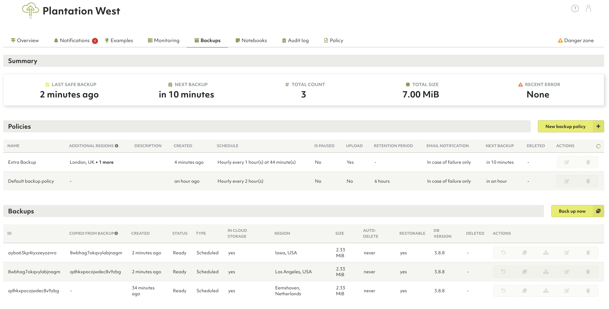
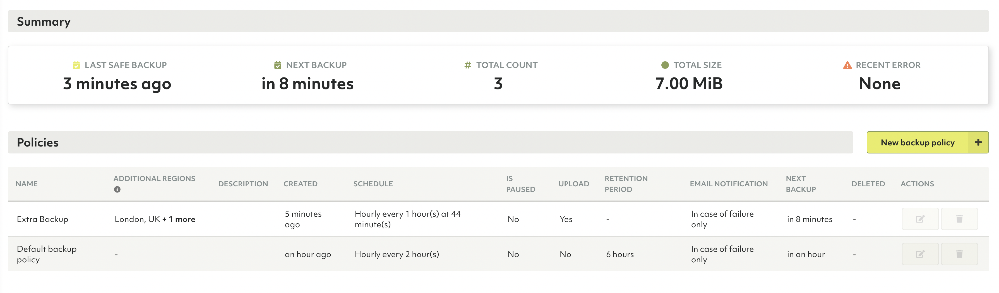
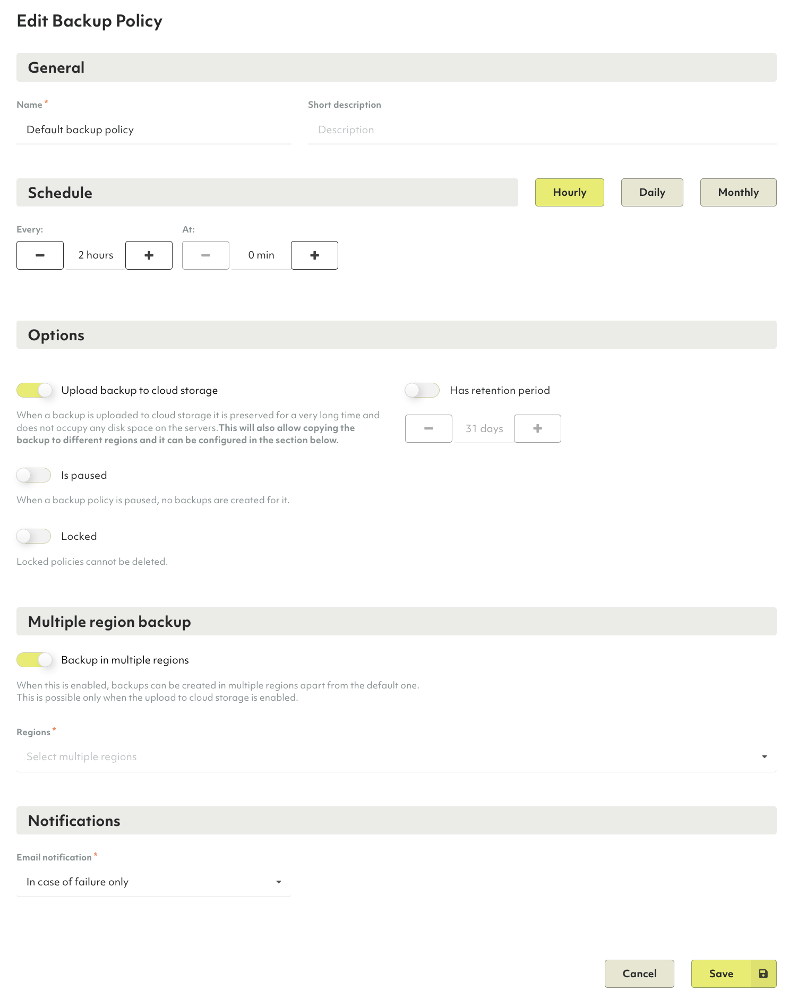
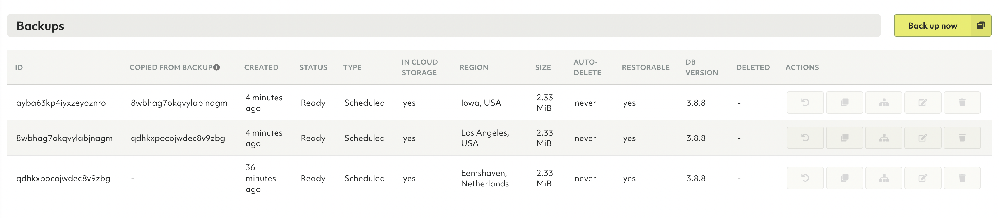
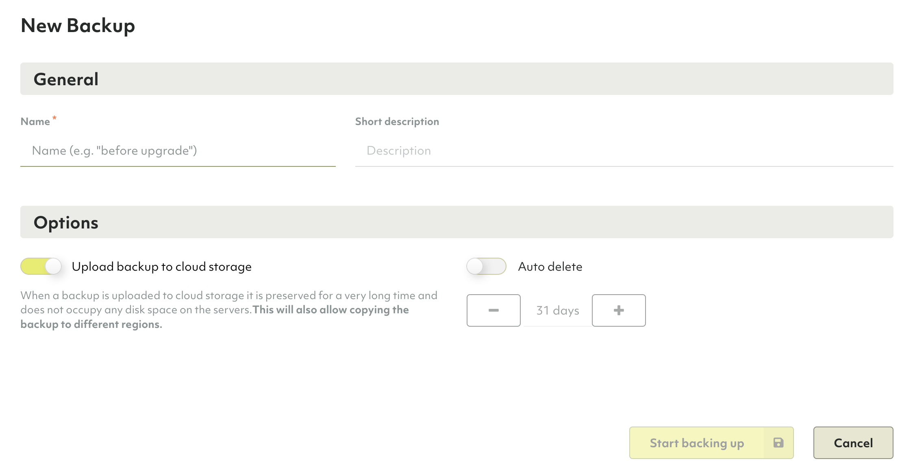
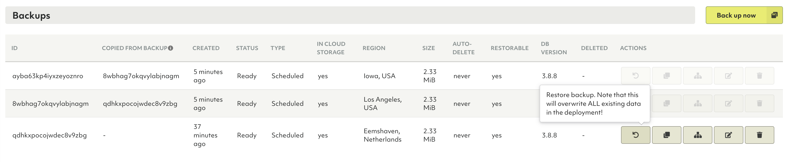
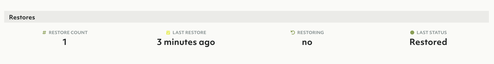

# Backups in the ArangoGraph Insights Platform

## How to create backups

To backup data in ArangoGraph for an ArangoDB installation, navigate to the
**Backups** section of your deployment created previously.

There are two ways to create backups. Create periodic backups using a
**Backup policy**, or create a backup manually.
Both ways allow you to create [backups in multiple regions](#multi-region-backups)
as well, if your organization belongs to the Enteprise tier.

### Periodic backups

Periodic backups are created at a given schedule. To see when the new backup is
due, observe the schedule section.

When a new deployment is created, a default **Backup policy** is created for it
as well. This policy creates backups every two hours. To edit this policy
(or any policy), highlight it in the row above and hit the pencil icon.

These backups are not automatically uploaded. To enable this, use the
**Upload backup to storage** option and choose a retention period that
specifies how long backups are retained after creation. 

If your organization belongs to the Enterprise tier and the
**Upload backup to storage** option is enabled for a backup policy,
you can then create backups in different regions than the default one.
The regions where the default backup is copied are shown in the
**Additional regions** column in the **Policies** section.

### Manual backups

It's also possible to create a backup on demand. To do this, click **Back up now**.

If your organization belongs to the Enterprise tier and you want to manually
copy a backup to a different region than the default
one, first ensure that the **Upload backup to storage** option is enabled.
Then, highlight the backup row and use the
**Copy backup to a different region** button from the **Actions** column. 

The source backup ID from
which the copy is created is displayed in the **Copied from Backup** column.

### Uploading backups

By default, a backup is not uploaded to the cloud, instead it remains on the
servers of the deployment. To make a backup that is resilient against server
(disk) failures, upload the backup to cloud storage. 

When the **Upload backup to cloud storage option** is enabled, the backup is
preserved for a long time and does not occupy any disk space on the servers.
This also allows copying the backup to different regions and it can be
configured in the **Multiple region backup** section.

Uploaded backups are
required for [cloning](#how-to-clone-deployments-using-backups).

## Multi-region backups


The multi-region backup feature is only available for the ArangoGraph
Enterprise tier. To upgrade to the Enterprise tier,
[get in touch](https://www.arangodb.com/contact/){:target="_blank"}
with the ArangoDB team.


Using the multi-region backup feature, you can store backups in multiple regions
simultaneously either manually or automatically as part of a **Backup policy**.
If a backup created in one region goes down, it is still available in other
regions, significantly improving reliability. 

Multiple region backup is only available when the
**Upload backup to cloud storage** option is enabled.

## How to restore backups

To restore a database from a backup, highlight the desired backup and click the restore icon.


All current data will be lost when restoring. To make sure that new data that
has been inserted after the backup creation is also restored, create a new 
backup before using the **Restore Backup** feature. 

During restore, the deployment is temporarily not available.


## How to clone deployments using backups


The cloned deployment will have the exact same features as the previous
deployment including node size, model, and cloud provider. The region
can stay the same or you can select a different one if your organization belongs
to the Enterprise tier.
For restoring a deployment as quick as possible, it is recommended to create a
deployment in the same region as where the backup resides to avoid cross-region
data transfer.
The data contained in the backup will be restored to this new deployment.

The *root password* for this deployment will be different.


1. Highlight the backup you wish to clone from and hit **Clone backup to new deployment**.

   

2. Choose whether the clone should be created in the same region as the backup or in a
   different region.

    

3. The view should navigate to the new deployment being bootstrapped.

   

This feature is also available through [oasisctl](oasisctl.html).
