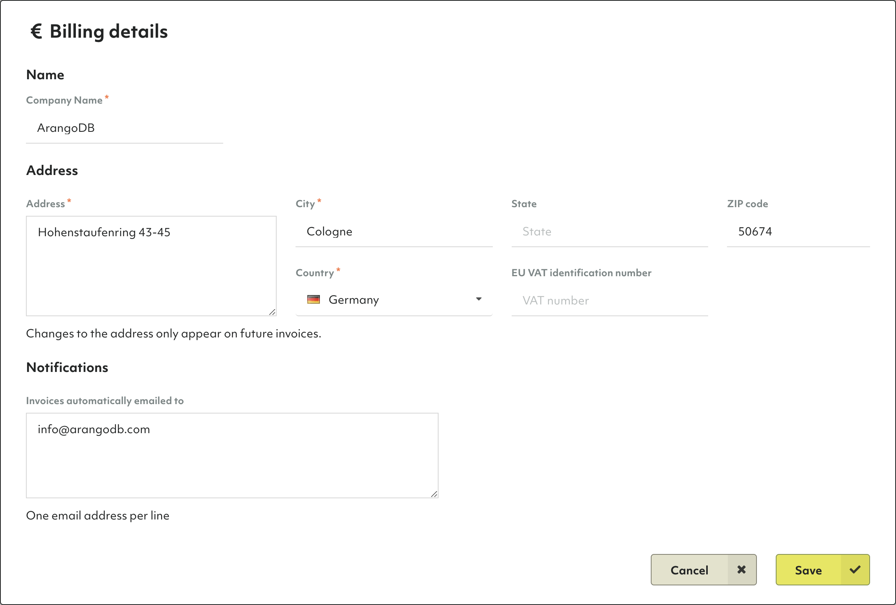
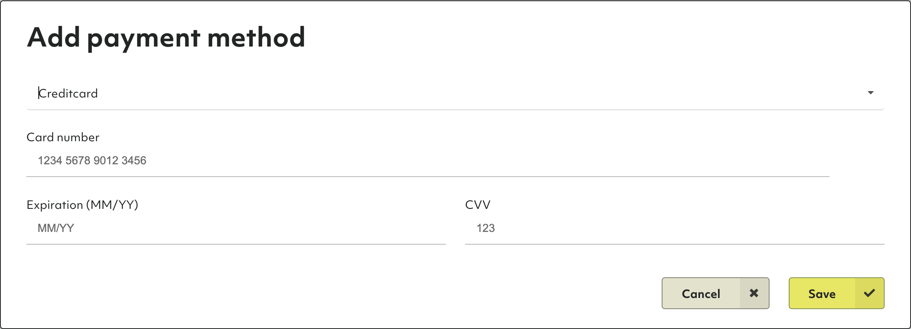

# Billing in ArangoGraph

## How to add billing details

1. In the main navigation menu, click **Overview** in the **Organization** section.
2. Open the **Billing** tab.
3. In the **Billing Details** section, click **Edit**.
4. Enter your company name, billing address, and EU VAT identification number (if applicable).
5. Optionally, enter the email address(es) to which invoices should be emailed
   to automatically.
6. Click **Save**.

## How to add a payment method

1. In the main navigation menu, click **Overview** in the **Organization** section.
2. Open the **Billing** tab.
3. In the **Payment methods** section, click **Add**.
4. Fill out the form with your credit card details. Currently, a credit card is the only available payment method.
5. Click **Save**.


TODO: Need screenshot with invoice

### How to view invoices


