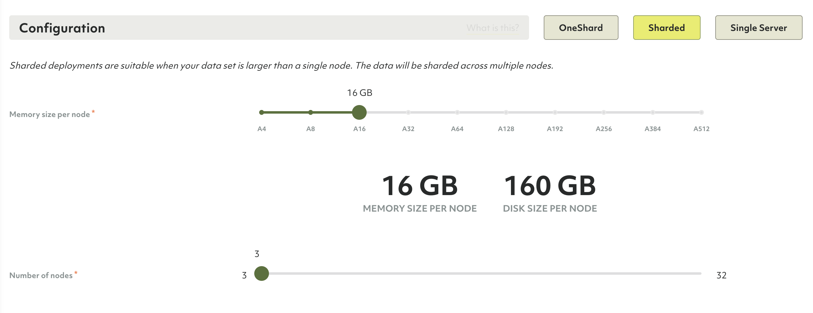
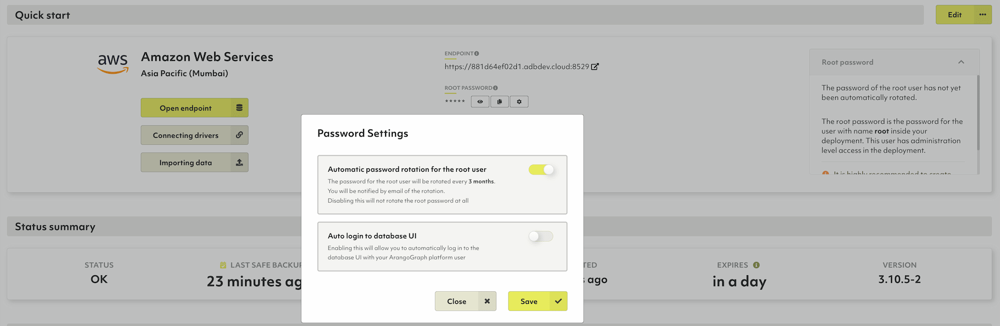

# Deployments

Below projects in the ArangoGraph deployment hierarchy are deployments. A deployment
contains an ArangoDB, configured as you choose. You can have any number of
deployments under one project.

**Organizations → Projects → <u>Deployments</u>**

Each deployment can also be backed up manually or automatically by schedules
you can define.

In essence, you can create whatever structure fits you for a given organization,
its projects and deployments.

## How to create a new deployment

1. If you do not have a project yet,
   [create a project](projects.html#how-to-create-a-new-project) first.
2. In the main navigation, in the __Projects__ section, click the project for
   which you want to create a new deployment.
3. In the __Deployments__ tab, you will see an empty list or a list with
   your project's existing deployments.
4. Click the __New deployment__ button.
5. Set up your deployment. The configuration options are described below.


Deployments contain exactly **one policy**. Within that policy, you can define
role bindings to regulate access control on a deployment level.


### In the __General__ section

- Enter the name and optionally a short description for the deployment.

### In the __Location__ section

1. Select the __Provider__ and __Region__ of the provider.
   
   Once a deployment has been created, it is not possible to change the
   provider and region anymore.
   
2. Select the __DB Version__.
   **Note**: If you don't know which DB version to select, leave the version
   selected by default.
3. In the __CA Certificate__ field
    - The default certificate created for your project will automatically be selected.
    - If you have no default certificate, or want to use a new certificate
      create a new certificate by typing the desired name for it and hitting
      enter or clicking the name when done.
    - Or, if you already have multiple certificates, select the desired one.
4. _Optional but strongly recommended:_ In the __IP allowlist__ field, select the
   desired one in case you want to limit access to your deployment to certain
   IP ranges. To create a allowlist, navigate to your project and select the
   __IP allowlists__ tab.


For any kind of production deployment we strongly advise to use an IP allowlist.


### In the __Configuration__ section

Choose between a **OneShard**, **Sharded** or **Single Server** deployment.

- OneShard deployments are suitable when your data set fits in a single node.
  They are ideal for graph use cases.

- Sharded deployments are suitable when your data set is larger than a single
  node. The data will be sharded across multiple nodes.

- Single Server deployments are suitable when you want to try out ArangoDB without
  the need for high availability or scalability. The deployment will contain a
  single server only. Your data will not be replicated and your deployment can
  be restarted at any time.


Before you begin configuring your deployment, you first need to select the
provider and region in the Location section.


#### OneShard

- Select the memory size of your node. The disk size is automatically set for you
  based on the selected memory size.


A deployment's node disk size is automatically increased by 25% when the maximal
disk usage of a node exceeds 75% of its capacity, up to the configured limit.
You will be notified via email when the disk size is increased, as well as when
your deployment runs out of disk space but cannot be resized because it reached
the upper disk size limit already.


#### Sharded

- In addition to the memory size as in the OneShard configuration, select
  the number of nodes for your deployment. The more nodes you have, the higher
  the replication factor can be. Same as in OneShard, the disk size is automatically
  set for you.

#### Single Server

- Like with OneShard and Sharded deployments, you can choose the memory size.
  Note, however, that the size you choose is for the entire deployment.
  For OneShard and Sharded deployments the chosen sizes are per node.

### In the __Summary__ section

1. Review the configuration, and if you're ok with the setup press the
  __Create__ button.
2. You will be taken to the deployment overview page.
   **Note:** Your deployment is at that point being bootstrapped, this process
   will take a few minutes. Once it is ready, you will receive a confirmation email.

## How to access your deployment

1. In the main navigation, in the __Projects__ section, click the project for
   which you created a deployment earlier.
2. Navigate to the __Deployments__ tab.
3. For each deployment in your project, you see the status. While your new
   deployment is being set up, it will display the __bootstrapping__ status.
4. Press the __View__ button to show the deployment page.
5. When a deployment displays a status of __OK__, you can access it.
6. Click the __Open endpoint__ button or on the endpoint URL property to open
   the dashboard of your new ArangoDB deployment.

At this point your ArangoDB deployment is available for you to use — **Have fun!**

If you have disabled the [auto-login option](#auto-login-to-database-ui) to the
database web interface, you need to follow the additional steps outlined below
to access your deployment:

1. Click the copy icon next to the root password. This will copy the deployment
   root password to your clipboard. You can also click the view icon to unmask
   the root password to see it.

   
   Do not use the root username/password for everyday operations. It is recommended
   to use them only to create other user accounts with appropriate permissions.
   

2. Click the __Open endpoint__ button or on the endpoint URL property to open
   the dashboard of your new ArangoDB deployment.
3. In the __username__ field type `root`, and in the __password__ field paste the
   password that you copied earlier.
4. Press the __Login__ button.
5. Press the __Select DB: \_system__ button.


Each deployment is accessible on two ports:

- Port `8529` is the standard port recommended for use by web-browsers.
- Port `18529` is the alternate port that is recommended for use by automated services.

The difference between these ports is the certificate used. If you enable
__Use well-known certificate__, the certificates used on port `8529` is well-known
and automatically accepted by most web browsers. The certificate used on port
`18529` is a self-signed certificate. For securing automated services, the use of
a self-signed certificate is recommended. Read more on the
[Certificates](certificates.html) page.


## Password settings

### How to enable the automatic root user password rotation

Password rotation refers to changing passwords regularly - a security best
practice to reduce the vulnerability to password-based attacks and exploits
by limiting for how long passwords are valid. The ArangoGraph Insights Platform
can automatically change the `root` user password of an ArangoDB deployment
periodically to improve security.

1. Navigate to the __Deployment__ for which you want to enable an automatic
   password rotation for the root user.
2. On the __Overview__ tab, click the button with the __gear__ icon next to the
   __ROOT PASSWORD__.
3. In the __Password Settings__ dialog, turn the automatic password rotation on
   and click the __Confirm__ button.

   
4. You can expand the __Root password__ panel to see when the password was
   rotated last. The rotation takes place every three months.

### Auto login to database UI

ArangoGraph provides the ability to automatically login to your database using
your existing ArangoGraph credentials. This not only provides a seamless
experience, preventing you from having to manage multiple sets of credentials
but also improves the overall security of your database. As your credentials
are shared between ArangoGraph and your database, you can benefit from
end-to-end audit traceability for a given user, as well as integration with
ArangoGraph SSO.

You can enable this feature in the **Password Settings** dialog. Please note
that it may take a few minutes to get activated.
Once enabled, you no longer have to fill in the `root` user and password of
your ArangoDB deployment.

This feature can be disabled at any time. You may wish to consider explicitly
disabling this feature in the following situations:
- Your workflow requires you to access the database UI using different accounts
  with differing permission sets, as you cannot switch database users when
  automatic login is enabled.
- You need to give individuals access to a database's UI without giving them
  any access to ArangoGraph. Note, however, that it's possible to only give an
  ArangoGraph user database UI access, without other ArangoGraph permissions.
- For some reason, you require driver access via `8529` port and you are unable
  to use the designated `18529` driver port.

Before getting started, make sure you are signed into ArangoGraph as a user
with one of the following permissions in your project:
- `data.deployment.full-access`
- `data.deployment.read-only-access`

Organization owners have these permissions enabled by default.
The `deployment-full-access-user` and `deployment-read-only-user` roles which
contain these permissions can also be granted to other members of the
organization. See how to create a
[role binding](access-control.html#how-to-view-edit-or-remove-role-bindings-of-a-policy).


This feature is available on `8529` port only. Make sure your connecting drivers
are using the `18529` port to avoid breaking changes.


## How to edit a deployment

You can modify a deployment’s configuration, including the ArangoDB version
that is being used, change the memory size, or even switch from
a OneShard deployment to a Sharded one if your data set no longer fits in a
single node. 


To edit an existing deployment, you must have the necessary set of permissions
attached to your role. Read more about [roles and permissions](access-control.html#roles).


1. Go to the **Projects** section and select an existing deployment from the list. 
2. Open the deployment you want to change. 
3. On the **Overview** tab, click the **Edit** button. 
4. In the **Version and Security** section, you can do the following:
   - Upgrade the ArangoDB version that is currently being used. See also
     [Upgrades and Versioning](upgrades-versioning.html)
   - Select a different CA certificate.
   - Add or remove an IP allowlist.
5. In the **Configuration** section, you can do the following:
   - Upgrade the memory size per node. The disk size is automatically set for you.
   - Change **OneShard** deployments into **Sharded** deployments. To do so,
     click **Sharded**. In addition to the other configuration options, you can
     select the number of nodes for your deployment. This can also be modified later on.

   
   Notice that you cannot switch from **Sharded** back to **OneShard**.
   

   
   When upgrading the memory size in AWS deployments, the value gets locked and
   cannot be changed until the cloud provider rate limit is reset. 
   

6. All changes are reflected in the **Summary** section. Review the new
   configuration and click **Save**. 

## How to connect a driver to your deployment

[ArangoDB drivers](../drivers/index.html) allow you to use your ArangoGraph
deployment as a database system for your applications. Drivers act as interfaces
between different programming languages and ArangoDB, which enable you to
connect to and manipulate ArangoDB deployments from within compiled programs
or using scripting languages.

To get started, open a deployment and go to the **Overview** tab.
In the **Quick start** section, click on the **Connecting drivers** button and
select your programming language. The code snippets provide examples on how to
connect to your instance.


Note that ArangoGraph Insights Platform runs deployments in a cluster
configuration. To achieve the best possible availability, your client
application has to handle connection failures by retrying operations if needed.


## How to delete a deployment


Deleting a deployment will delete all its data and backups.
This operation is **irreversible**. Please proceed with caution.


1. In the main navigation, in the __Projects__ section, click the project that
   holds the deployment you wish to delete.
2. On the __Deployments__ tab, click the deployment you wish to delete.
3. Click the __Danger zone__ tab.
4. Click the __Delete deployment__ button.
5. In the modal dialog, confirm the deletion by entering `Delete!` into the
   designated text field.
6. Confirm the deletion by pressing the __Yes__ button.
7. You will be taken back to the deployments page of the project.
   The deployment being deleted will display the __Deleting__ status until it has
   been successfully removed.
