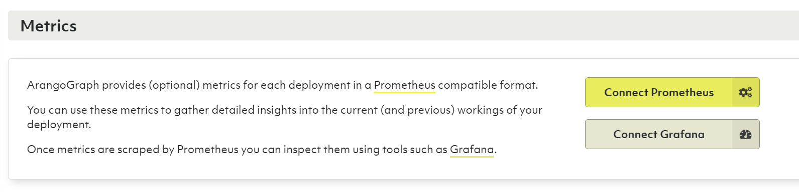

# Monitoring & Metrics

The ArangoGraph Insights Platform provides metrics for each deployment in a 
[Prometheus](https://prometheus.io/){:target="_blank"}
compatible format.
You can use these metrics to gather detailed insights into the current
and previous states of your deployment.
Once metrics are collected by Prometheus, you can inspect them using tools
such as [Grafana](https://grafana.com/oss/grafana/){:target="_blank"}.

To get started, select an existing deployment from within a project and
open the **Monitoring** tab. 




## Metrics tokens

The **Metrics tokens** section allows you to create a new metrics token,
which is required for connecting to Prometheus.

1. To create a metrics token, click **New metrics token**.
2. For **Name**, enter a name for the metrics token.
3. Optionally, you can also enter a **Short description**.
4. Select the **Lifetime** of the metrics token. 
5. Click **Create**.


## How to connect Prometheus

1. In the **Metrics** section, click **Connect Prometheus**.
2. Create the `prometheus.yml` file with the following content:
   ```yaml
   global:
   scrape_interval: 60s
   scrape_configs:
   - job_name: 'deployment'
       bearer_token: '<fill-your-metrics-token-here>'
       scheme: 'https'
       static_configs:
       - targets: ['6775e7d48152.arangodb.cloud:8829']
       tls_config:
       insecure_skip_verify: true
   ```
3. Start Prometheus with the following command:
   ```sh
   docker run -d \
   -p 9090:9090 -p 3000:3000 --name prometheus \
   -v $(pwd)/prometheus.yml:/etc/prometheus/prometheus.yml:ro \
   prom/prometheus
   ```
   
   This command also opens a port 3000 for Grafana. In a production environment,
   this is not needed and not recommended to have it open.
   

## How to connect Grafana

1. Start Grafana with the following command:
   ```sh
   docker run -d \
   --network container:prometheus \
   grafana/grafana
   ```  
2. Go to `localhost:3000` and log in with the following credentials:
   - For username, enter *admin*.
   - For password, enter *admin*. 

    
    After the initial login, make sure to change your password.
    

3. To add a data source, click **Add your first data source** and then do the following:
   - Select **Prometheus**.
   - For **HTTP URL**, enter `http://localhost:9090`.
   - Click **Save & Test**.      
4. To add a dashboard, open the menu and click **Create** and then **Import**.
5. Download the [Grafana dashboard for ArangoGraph](https://github.com/arangodb-managed/grafana-dashboards){:target="_blank"}.
6. Copy the contents of the `main.json` file into the **Import via panel json** field in Grafana.
7. Click **Load**.
