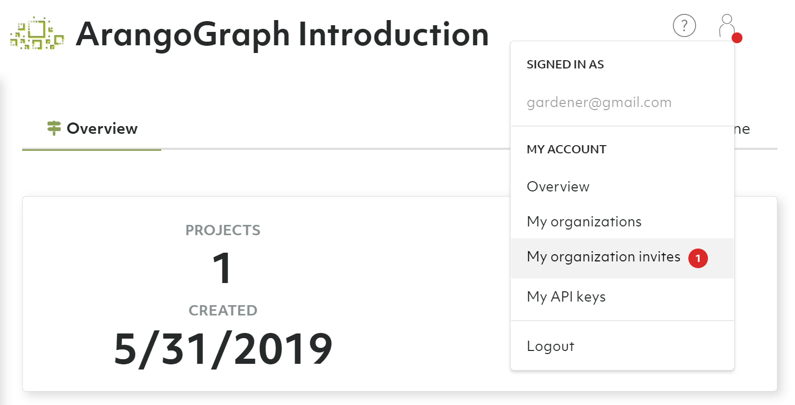
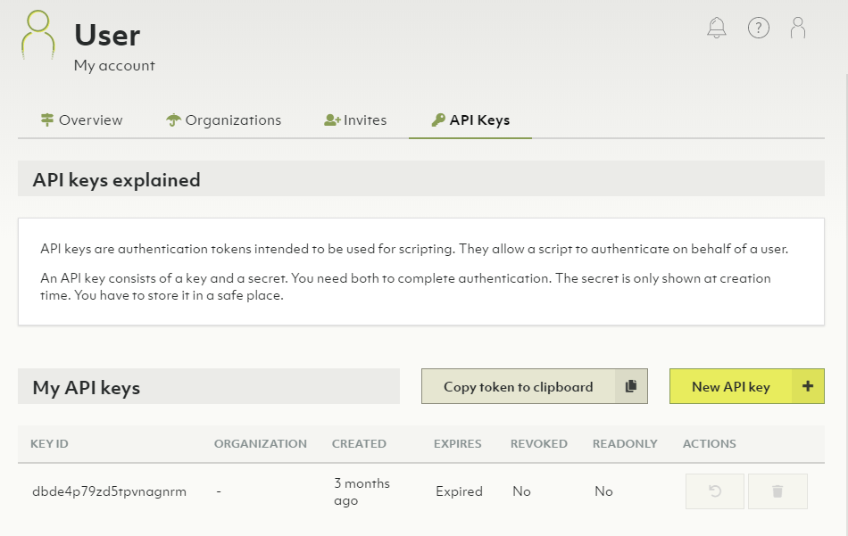
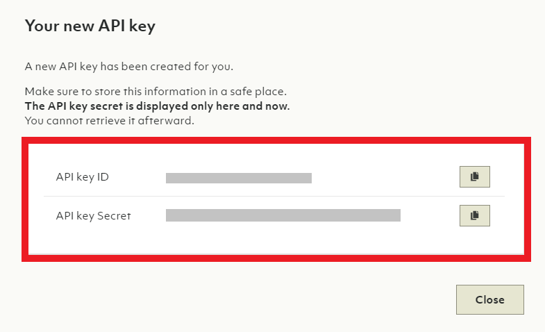

# My Account

You can access information related to your account via the __User Toolbar__.
The toolbar is in the top right corner in the ArangoGraph dashboard and
accessible from every view. There are two elements:

- __Question mark icon__: Help
- __User icon__: My Account

## Overview

### How to view my account

1. Hover over or click the user icon of the __User Toolbar__ in the top right corner.
2. Click __Overview__ in the __My account__ section.
3. The __Overview__ displays your name, email address, company and when the
   account was created.

### How to edit the profile of my account

1. Hover over or click the user icon in the __User Toolbar__ in the top right corner.
2. Click __Overview__ in the __My account__ section.
3. Click the __Edit__ button.
4. Change your personal information and __Save__.

## Organizations

### How to view my organizations

1. Hover over or click the user icon of the __User Toolbar__ in the top right corner.
2. Click __My organizations__ in the __My account__ section.
3. Your organizations are listed in a table.
   Click the organization name or the eye icon in the __Actions__ column to
   jump to the organization overview.

### How to create a new organization

1. Hover over or click the user icon of the __User Toolbar__ in the top right corner.
2. Click __My organizations__ in the __My account__ section.
3. Click the __New organization__ button.
4. Enter a name and and a description for the new organization and click the
   __Create__ button.


The free to try tier is limited to a single organization.


### How to delete an organization


Removing an organization implies the deletion of projects and deployments.
This operation cannot be undone and **all deployment data will be lost**.
Please proceed with caution.


1. Hover over or click the user icon of the __User Toolbar__ in the top right corner.
2. Click __My organizations__ in the __My account__ section.
3. Click the __recycle bin__ icon in the __Actions__ column.
4. Enter `Delete!` to confirm and click __Yes__.


If you are no longer a member of any organization, then a new organization is
created for you when you log in again.


## Invites

Invitations are requests to join organizations. You can accept or reject
pending invites.

### How to create invites

See [Users and Groups: How to add a new member to the organization](users.html#how-to-add-a-new-member-to-the-organization)

### How to respond to my invites

#### I am not a member of an organization yet

1. Once invited, you will receive an email asking to join your
   ArangoGraph organization.
   
2. Click the __View my organization invite__ link in the email. You will be
   asked to log in or to create a new account.
3. To sign up for a new account, click the __Start Free__ button or the
   __Sign up__ link in the header navigation.
   
4. After successfully signing up, you will receive a verification email.
5. Click the __Verify my email address__ link in the email. It takes you back
   to the ArangoGraph Insights Platform site.
   
6. After successfully logging in, you can accept or reject the invite to
   join your organization.
   
7. After accepting the invite, you become a member of your organization and
   will be granted access to the organization and its related projects and
   deployments.

#### I am already a member of an organization

1. Once invited, you will receive an email asking to join your
   ArangoGraph organization, as well as a notification in the ArangoGraph dashboard.
2. Click the __View my organization invites__ link in the email, or hover over the
   user icon in the top right corner of the dashboard and click
   __My organization invites__.
   
3. On the __Invites__ tab of the __My account__ view, you can accept or reject
   pending invitations, as well as see past invitations that you accepted or
   rejected. Click the button with a checkmark icon to join the organization.
   

## API Keys

API keys are authentication tokens intended to be used for scripting.
They allow a script to authenticate on behalf of a user.

An API key consists of a key and a secret. You need both to complete
authentication.

### How to view my API keys

1. Hover over or click the user icon of the __User Toolbar__ in the top right corner.
2. Click __My API keys__ in the __My account__ section.
3. Information about the API keys are listed in the __My API keys__ section.

### How to create a new API key

1. Hover over or click the user icon of the __User Toolbar__ in the top right corner.
2. Click __My API keys__ in the __My account__ section.
3. Click the __New API key__ button.
4. Optionally limit the API key to a specific organization.
5. Optionally specify after how many hours the API key should expire into the
   __Time to live__ field.
6. Optionally limit the API key to read-only APIs
7. Click the __Create__ button.
8. Copy the API key ID and Secret, then click the __Close__ button.


The secret is only shown once at creation time.
You have to store it in a safe place.


### How to revoke or delete an API key

1. Hover over or click the user icon of the __User Toolbar__ in the top right corner.
2. Click __My API keys__ in the __My account__ section.
3. Click an icon in the __Actions__ column:
   - __Counter-clockwise arrow__ icon: Revoke API key
   - __Recycle bin__ icon: Delete API key
4. Click the __Yes__ button to confirm.


TODO: Copy to clipboard button
Access token that should expire after 1 hour unless renewed, might get removed as it's confusing.

