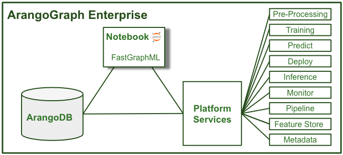
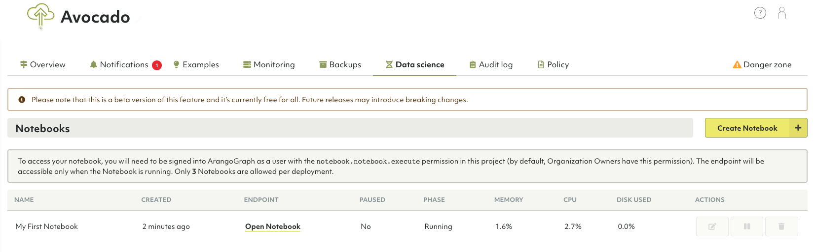

# ArangoGraph Notebooks

{{ page.description }}
{:class="lead"}


This documentation describes the beta version of the Notebooks feature and is
subject to change. The beta version is free for all.


The ArangoGraph Notebook is a JupyterLab notebook embedded in the ArangoGraph
Insights Platform. The notebook integrates seamlessly with platform,
automatically connecting to ArangoGraph services, including ArangoDB and the
ArangoML platform services. This makes it much easier to leverage these
resources without having to download any data locally or to remember user IDs,
passwords, and endpoint URLs.

The ArangoGraph Notebook has built-in [ArangoGraph Magic Commands](notebooks.html#arangograph-magic-commands)
that answer questions like:
- What ArangoDB database am I connected to at the moment?
- What data does the ArangoDB instance contain?
- How can I access certain documents?
- How do I create a graph?

The ArangoGraph Notebook also pre-installs [python-arango](https://docs.python-arango.com/en/main/){:target="_blank"}
and ArangoML connectors
to [PyG](https://github.com/arangoml/pyg-adapter){:target="_blank"},
[DGL](https://github.com/arangoml/dgl-adapter){:target="_blank"},
[CuGraph](https://github.com/arangoml/cugraph-adapter){:target="_blank"}, as well as the
[FastGraphML](https://github.com/arangoml/fastgraphml){:target="_blank"}
library, so you can get started
right away accessing data in ArangoDB to develop GraphML models using your
favorite GraphML libraries with GPUs.

## How to create a new notebook

1. Navigate to the **Deployments** tab.
2. Open the deployment in which you want to create the notebook.
3. Go to the **Data science** tab and click the **Create Notebook** button.
4. Enter a name and optionally a description for your new notebook. 
5. Select a configuration model from the dropdown menu. Click **Save**.
6. The notebook's phase is set to **Initializing**. Once the phase changes to
   **Running**, the notebook's endpoint is accessible.
7. Click the **Open notebook** button to access your notebook. 
8. To access your notebook, you need to be signed into ArangoGraph as a user with
   the `notebook.notebook.execute` permission in your project. Organization
   owners have this permission enabled by default. The `notebook-executor` role
   which contains the permission can also be granted to other members of the
   organization via roles. See how to create a
   [role binding](access-control.html#how-to-view-edit-or-remove-role-bindings-of-a-policy).


Depending on the tier your organization belongs to, different limitations apply:
- Professional and Enterprise tiers: you can create up to three notebooks per deployment.
- Free-to-try tier: you can only create one notebook per deployment.  



Notebooks in beta version have a fixed configuration of 10&nbsp;GB of disk size.


## How to edit a notebook

1. Select the notebook that you want to change from the **Notebooks** tab.
2. Click **Edit notebook**. You can modify its name and description.
3. To pause a notebook, click the **Pause notebook** button. You can resume it
at anytime. The notebook's phase is updated accordingly.

## How to delete a notebook

1. Select the notebook that you want to remove from the **Notebooks** tab.
2. Click the **Delete notebook** button.

## Getting Started notebook

To get a better understanding of how to interact with your ArangoDB database
cluster, use the ArangoGraph Getting Started template.
The ArangoGraph Notebook automatically connects to the ArangoDB service
endpoint, so you can immediately start interacting with it.

1. Log in to the notebook you have created by using your deployment's root password.
2. Select the `GettingStarted.ipynb` template from the file browser.

## ArangoGraph Magic Commands

A list of the available magic commands you can interact with.
Single line commands have `%` prefix and multi-line commands have `%%` prefix.

**Database Commands**

- `%listDatabases` - lists the databases on the database server.
- `%whichDatabase` - returns the database name you are connected to.
- `%createDatabase databaseName` - creates a database.
- `%selectDatabase databaseName` - selects a database as the current database.
- `%useDatabase databasename` - uses a database as the current database;
  alias for `%selectDatabase`.
- `%getDatabase databaseName` - gets a database. Used for assigning a database,
   e.g. `studentDB` = `getDatabase student_database`.
- `%deleteDatabase databaseName` - deletes the database.

**Graph Commands**

- `%listGraphs` - lists the graphs defined in the currently selected database.
- `%whichGraph` - returns the graph name that is currently selected.
- `%createGraph graphName` - creates a named graph.
- `%selectGraph graphName` - selects the graph as the current graph.
- `%useGraph graphName` - uses the graph as the current graph;
  alias for `%selectGraph`.
- `%getGraph graphName` - gets the graph for variable assignment, 
  e.g. `studentGraph` = `%getGraph student-graph`.
- `%deleteGraph graphName` - deletes a graph.

**Collection Commands**

- `%listCollections` - lists the collections on the selected current database.
- `%whichCollection` - returns the collection name that is currently selected.
- `%createCollection collectionName` - creates a collection.
- `%selectCollection collectionName` - selects a collection as the current collection.
- `%useCollection collectionName` - uses the collection as the current collection;
  alias for `%selectCollection`.
- `%getCollection collectionName` - gets a collection for variable assignment,
  e.g. `student` = `% getCollection Student`.
- `%createEdgeCollection` - creates an edge collection.
- `%createVertexCollection` - creates a vertex collection.
- `%createEdgeDefinition` - creates an edge definition.
- `%deleteCollection collectionName` - deletes the collection.
- `%truncateCollection collectionName` - truncates the collection.
- `%sampleCollection collectionName` - returns a random document from the collection.
  If no collection is specified, then it uses the selected collection.

**Document Commands**

- `%insertDocument jsonDocument` - inserts the document into the currently selected collection.
- `%replaceDocument jsonDocument` - replaces the document in the currently selected collection.
- `%updateDocument jsonDocument` - updates the document in the currently selected collection.
- `%deleteDocument jsonDocument` - deletes the document from the currently selected collection.
- `%%importBulk jsonDocumentArray` - imports an array of documents into the currently selected collection.

**AQL Commands**

- `%aql single-line_aql_query` - executes a single line AQL query.
- `%%aqlm multi-line_aql_query` - executes a multi-line AQL query.

**Variables**

- `_endpoint` - the endpoint (URL) of the ArangoDB Server.
- `_system` - the system database used for creating, listing, and deleting databases.
- `_db` - the selected (current) database. To select a different database, use `%selectDatabase`.
- `_graph` - the selected (current) graph. To select a different graph, use `%selectGraph`.
- `_collection` - the selected (current) collection. To select a different collection, use `%selectCollection`.
- `_user` - the current user.

You can use these variables directly, for example, `_db.collections()` to list
collections or `_system.databases` to list databases.

You can also create your own variable assignments, such as:

- `schoolDB` = `%getDatabase schoolDB`
- `school_graph` = `%getGraph school_graph`
- `student` = `%getCollection Student`

**Reset environment**

In the event that any of the above variables have been unintentionally changed,
you can revert all of them to the default state with `reset_environment()`.
