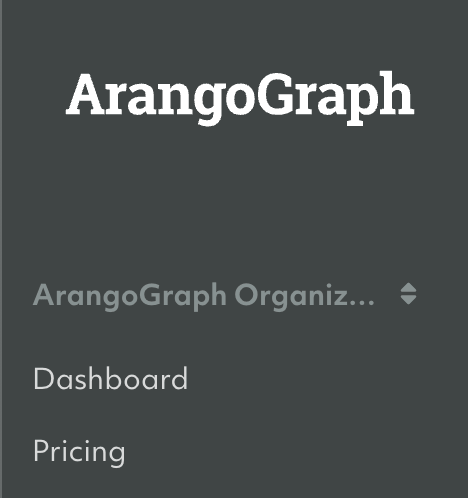
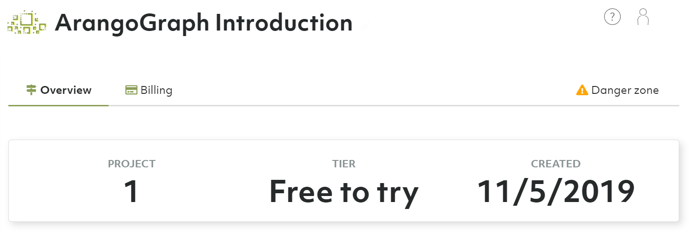
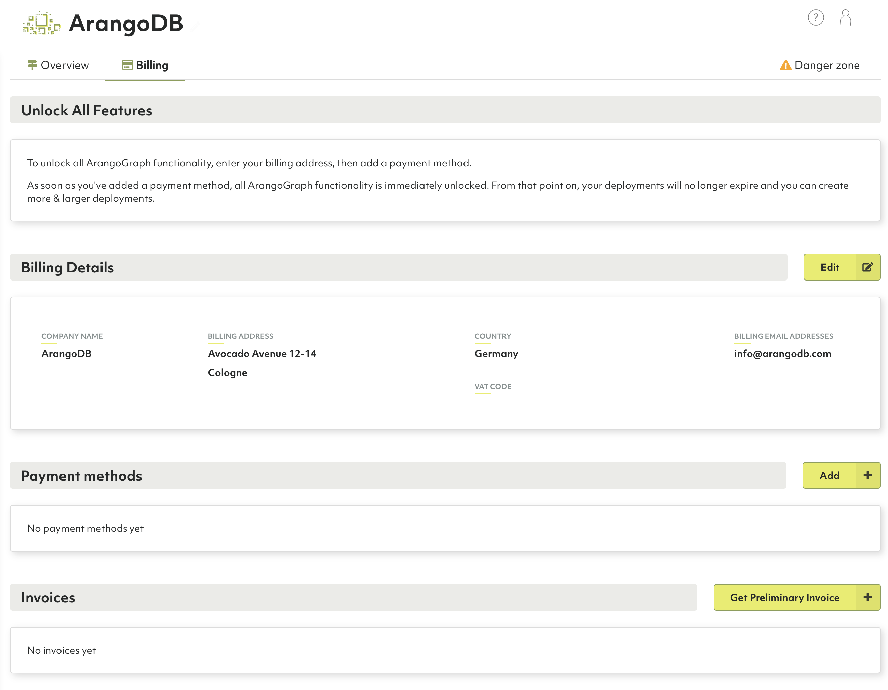

# Organizations

At the highest level of the ArangoGraph deployment hierarchy are organizations.
Organizations are a container for projects.

**<u>Organizations</u> → Projects → Deployments**

An organization typically represents a (commercial) entity such as a company,
a company division, an institution or a non-profit organization.

Users can be members of one or more organizations. However, you can only be a
member of one _Free-to-try_ tier organization at a time.

## How to switch between my organizations

1. The first entry in the main navigation (with a double arrow icon) indicates
   the current organization.
2. Click it to bring up a dropdown menu to select another organization of which you
   are a member.
3. The overview will open for the selected organization, showing the number of
   projects, the tier and when it was created.

## ArangoGraph Packages

With the ArangoGraph Insights Platform, your organization can choose one of the
following packages.

### Free Trial

ArangoGraph comes with a free-to-try tier that lets you test ArangoGraph for
free for 14 days. You can get started quickly, without needing to enter a
credit card.

The free trial gives you access to:
- One small deployment (4GB) in a region of your choice for 14 days
- Local backups
- One ArangoGraph Notebook for learning and data science

After the trial period, your deployment will be deleted automatically.

### On-Demand

Add a payment payment method to gain access to ArangoGraph's full feature set.
Pay monthly via a credit card for what you actually use.

This package unlocks all ArangoGraph functionality, including:
- Multiple and larger deployments
- Backups to cloud storage, with multi-region support
- Enhanced security features such as Private Endpoints

### Committed

Commit up-front for a year and pay via the Sales team. This package provides
the same flexibility of On-Demand, but at a lower price. 

In addition, you gain access to:
- 24/7 Premium Support
- ArangoDB Professional Services Engagements
- Ability to transact via the AWS and GCP marketplaces

To take advantage of this, you need to get in touch with the ArangoDB
team. [Contact us](https://www.arangodb.com/contact/){:target="_blank"} for more details.

## How to unlock all features

You can unlock all features in ArangoGraph at any time by adding your billing
details and a payment method. As soon as you have added a payment method, all
ArangoGraph functionalities are immediately unlocked. From that point on, your
deployments will no longer expire and you can create more and larger deployments.

See [Billing: How to add billing details / payment methods](billing.html)

## How to create a new organization

See [My Account: How to create a new organization](my-account.html#how-to-create-a-new-organization)

## How to restrict access to an organization

If you want to restrict access to an organization, you can do it by specifying which authentication providers are accepted for users trying to access the organization. For more information, refer to the [Access Control](access-control.html#restricting-access-to-organizations) section.

## How to delete the current organization


Removing an organization implies the deletion of projects and deployments.
This operation cannot be undone and **all deployment data will be lost**.
Please proceed with caution.


1. Click **Overview** in the **Organization** section of the main navigation.
2. Open the **Danger zone** tab.
3. Click the **Delete organization** button.
4. Enter `Delete!` to confirm and click **Yes**.


If you are no longer a member of any organization, then a new organization is
created for you when you log in again.



If the organization has a locked resource (a project or a deployment), you need to [unlock](access-control.html#locked-resources)
that resource first to be able to delete the organization.

