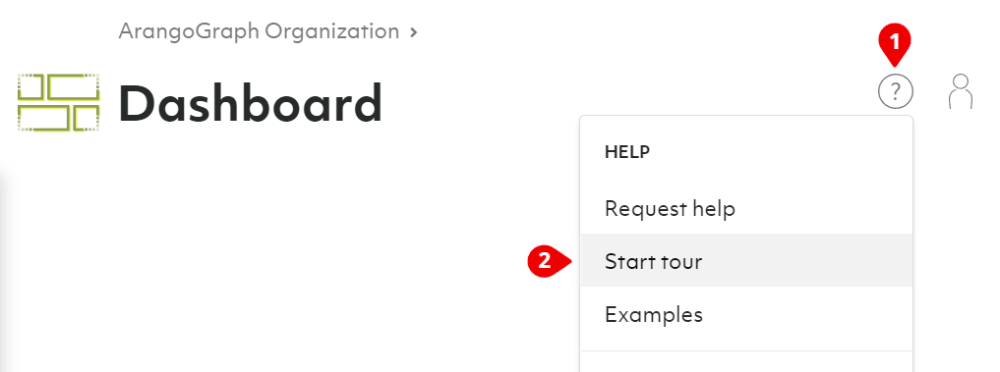

# Overview over the ArangoGraph Insights Platform

## General hierarchy

The ArangoGraph Insights Platform supports multi-tenant setups via organizations.
You can create your own organization(s) and invite collaborators or join
existing ones via invites. Your organization contains projects.
Your projects hold your deployments.

- [**Organizations**](organizations.html)
  represent (commercial) entities such as companies.
  You can be part of multiple organizations with a single user account.
  - [**Projects**](projects.html)
    represent organizational units such as teams or applications.
    - [**Deployments**](deployments.html)
      are the actual instances of ArangoDB clusters.

When you sign up for ArangoGraph, an organization and a default project are
automatically created for you. What is still missing is a deployment.

## Take the tour

In the top right corner you find the __User toolbar__. Click the icon with the
question mark to bring up the help menu and choose __Start tour__. This guided
tour walks you through the creation of a deployment and shows you how to load
example datasets and manage projects and deployments.

Alternatively, follow the steps of the linked guides:
- [Create a new project](projects.html#how-to-create-a-new-project) (optional)
- [Create a new deployment](deployments.html#how-to-create-a-new-deployment)
- [Install a new certificate](certificates.html) (optional)
- [Access your deployment](deployments.html#how-to-access-your-deployment)
- [Delete your deployment](deployments.html#how-to-delete-a-deployment)
